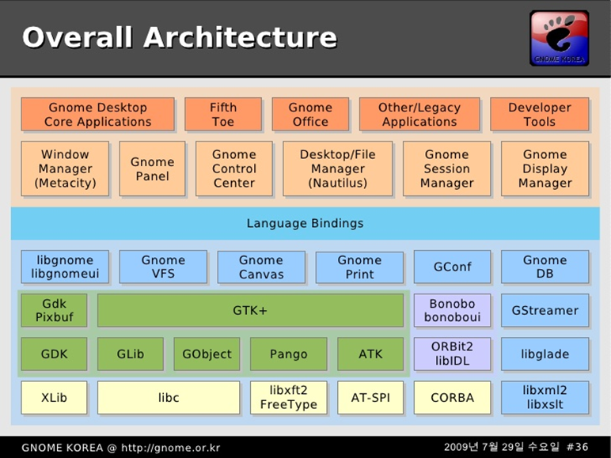
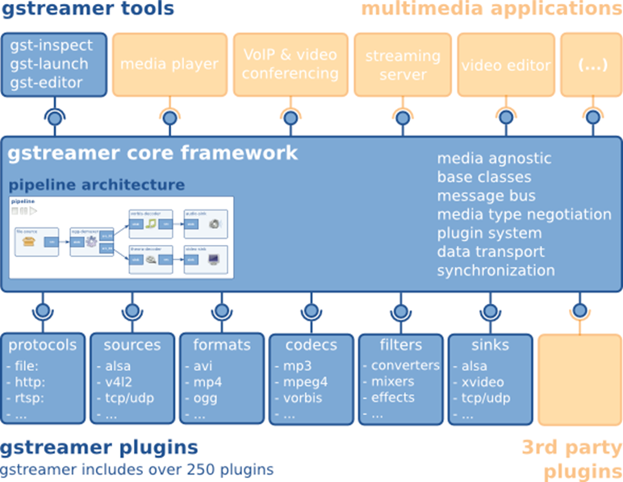
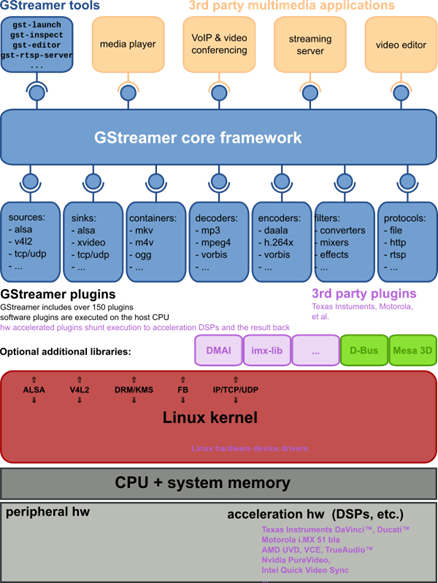
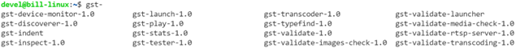
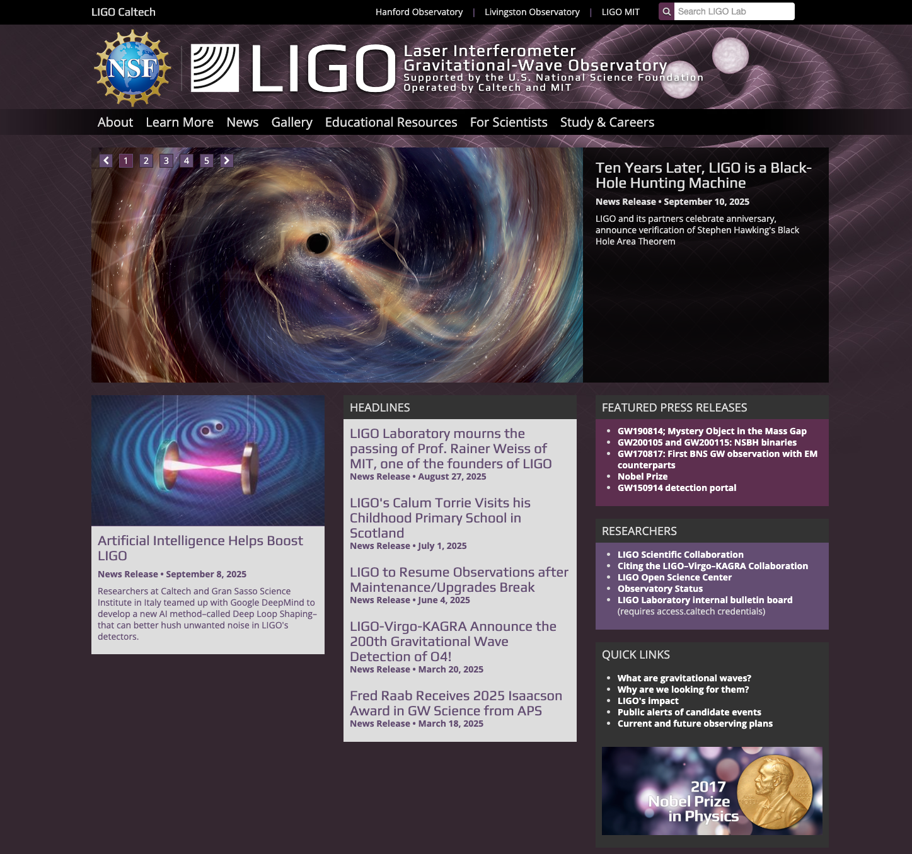
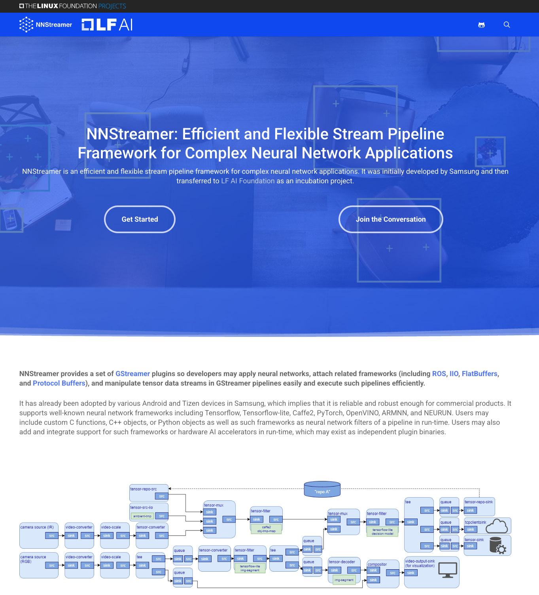

---
layout: top-title
hideInToc: true
---
:: title ::
# GStreamer in GNOME

:: content ::
<figure class="text-center">
  <div class="w-full mx-auto">
    
    <Box 
      shape="s-s-2-100" 
      custom="absolute top-87 left-166 !w-[92px] !h-[43px] !border-red-500" 
    />
  </div>
  <figcaption class="caption-center mt-3">
    <a href="https://www.slideshare.net/slideshow/gnome-architecture/8774">출처: https://www.slideshare.net/slideshow/gnome-architecture/8774</a>
  </figcaption>
</figure>

---
layout: top-title
hideInToc: true
---
:: title ::
# GStreamer

:: content ::
<figure class="text-center">
  <div class="w-full mx-auto">
    
  </div>
  <figcaption class="caption-center mt-3">
    <a href="https://gstreamer.freedesktop.org/">출처: https://gstreamer.freedesktop.org/</a>
  </figcaption>
</figure>

---
layout: top-title
hideInToc: true
---
:: title ::
# GStreamer

:: content ::
<figure class="text-center">
  <div class="w-full max-w-4xl mx-auto">
    
  </div>
</figure>

---
layout: top-title-two-cols
columns: is-10
hideInToc: true
---
:: title ::
# GStreamer - Core Framework

:: left ::
<div class="ns-c-tight">
<div class='flex flex-wrap'>
<div class='w-1/2'>

- 미디어를 직접 처리하지 않음
- 핵심 골격 제공
    - 멀티미디어 애플리케이션을 위한 API
    - 전역 기본 클래스
    - 플러그인 아키텍처
    - 파이프라인 아키텍처
    - 미디어 형식 처리 및 협상 메커니즘
    - 동기화 메커니즘
    - 메모리 및 버퍼 관리 자료구조
    - 컴포넌트 간 통신 방법
    - https://t.ly/Vpg4
</div>

<div class='w-1/2'>

- 기본 클래스를 제공한다
    - 플러그인 구현을 위한 베이스 클래스
    - 툴 및 애플리케이션을 위한 유틸리티 클래스
    - https://t.ly/6i2V
    - https://t.ly/MBiBX
</div>

</div>
</div>

:: right ::
<figure class="text-center">
  <div class="w-full max-w-4xl mx-auto">
    
    <Box 
      shape="s-s-2-100" 
      custom="absolute top-67 left-195 !w-[148px] !h-[42px] !border-red-500" 
    />
  </div>
</figure>

---
layout: top-title-two-cols
columns: is-10
hideInToc: true
---
:: title ::
# GStreamer - Tools

:: left ::
<figure class="text-center">
  <div class="w-full max-w-4xl mx-auto">
    
  </div>
</figure>

<div class="ns-c-tight">
<div class='flex flex-wrap'>
<div class='w-1/2'>

- 지속적으로 추가되고 있음
- gst-inspect-1.0
    - 내부 정보를 조회하는 진단 도구
    - 사용 가능한 플러그인 목록 표시
    - 엘리먼트 또는 플러그인의 상세 정보 제공
    - 인자 없이 실행 시 등록된 모든 타입 정보 나열
    - 특정 타입을 인자로 지정하면 해당 타입의 상세 정보 출력
    - https://t.ly/UDtUO
</div>

<div class='w-1/2'>

- gst-launch-1.0
    - 파이프라인을 구성하고 실행하는 명령줄 도구
    - 엘리먼트 이름 사이에 느낌표(!)를 사용하여 간단하게 연결
    - 유연한 도메인 특화 언어를 제공하여 구현 가능한 모든 파이프라인 표현
    - https://t.ly/_IEF
</div>

</div>
</div>

:: right ::
<figure class="text-center">
  <div class="w-full max-w-4xl mx-auto">
    
    <Box 
      shape="s-s-2-100" 
      custom="absolute top-61 left-195 !w-[32px] !h-[23px] !border-red-500" 
    />
  </div>
</figure>

---
layout: top-title-two-cols
columns: is-10
hideInToc: true
---
:: title ::
# GStreamer - Plugins

:: left ::
<div class="ns-c-tight">
<div class='flex flex-wrap'>
<div class='w-1/2'>

- 지속적으로 확장 중
- 기능에 따른 분류
    - 프로토콜 처리 (protocol handling)
    - 소스 및 포맷 (sources, formats)
    - 코덱 및 필터 (codec, filters)
    - 출력 (sink)
</div>

<div class='w-1/2'>

- 패키지별 분류
    - gstreamer: 핵심 패키지
    - gst-plugins-base: 필수 기본 엘리먼트 모음
    - gst-plugins-good: LGPL 라이선스 기반 고품질 플러그인 모음
    - gst-plugins-ugly: 라이선스 이슈로 배포에 제약이 있는 고품질 플러그인 모음
    - gst-plugins-bad: 개발 진행 중이거나 실험적 성격의 플러그인 모음
    - gst-libav: libav 기반 디코딩/인코딩 플러그인 모음
- 참고 자료
    - https://t.ly/Vpg4
</div>

</div>
</div>
<br>

``` bash
gst-inspect-1.0 -a | grep -ho Klass.\* | cut -c8- | sort | uniq
```

:: right ::
<figure class="text-center">
  <div class="w-full max-w-4xl mx-auto">
    
    <Box 
      shape="s-s-2-100" 
      custom="absolute top-77 left-195 !w-[148px] !h-[42px] !border-red-500" 
    />
  </div>
</figure>

---
layout: top-title
hideInToc: true
---
:: title ::
# GStreamer 주요 특징

:: content ::
<div class="custom-table-small">

| 영역 | 핵심 특징 | 실용적 가치 |
|------|-----------|-------------|
| **Multiplatform** | 모든 주요 OS/아키텍처 지원 | → 범용성과 이식성 |
| **Comprehensive Core Library** | 컴팩트하고 강력한 라이브러리 | → 고성능과 안정성 |
| **Intelligent Plugin Architecture** | 지능적인 동적 로딩 시스템 | → 확장성과 효율성 |
| **Broad Coverage of Multimedia Technologies** | 광범위한 포맷/코덱 지원 | → 호환성과 활용성 |
| **Extensive Development Tools** | 풍부한 개발/디버깅 환경 | → 생산성과 품질 |
| **Stability** | 10년 이상 검증된 API | → 신뢰성과 지속성 |

</div>

<div class="ns-c-tight">
<div class="highlight-box mt-8">

**참고 자료**
- https://gstreamer.freedesktop.org/features/
</div>
</div>

---
layout: top-title-two-cols
columns: is-6
hideInToc: true
---
:: title ::
#  GStreamer 주요 특징: Multiplatform


:: left ::

**지원하는 운영체제**
<div class="custom-table-small">

| 운영체제 | 지원 플랫폼 |
|----------|-------------|
| **데스크톱** | Linux, Windows, macOS, BSD 계열 |
| **모바일** | Android, iOS |
| **임베디드** | 상용 Unix, Solaris, Symbian |
</div>

<div class="mt-10">

**지원하는 하드웨어 아키텍쳐**
<div class="custom-table-small">

| 하드웨어 아키텍처 | 지원 사양 |
|-------------------|-----------|
| **프로세서** | x86, ARM, MIPS, SPARC, PowerPC |
| **비트 수** | 32-bit, 64-bit |
| **엔디안** | Little Endian, Big Endian |
</div>
</div>


:: right ::
**다른 멀티미디어 프레임워크와의 브리징**
<div class="custom-table-small">

| 운영체제 | 멀티미디어 프레임워크 |
|-------------------|-----------|
| **Multi OS** | FFmpeg |
| **Linux/Unix** | OpenMAX-IL (gst-omx 사용) |
| **Windows** | DirectShow |
| **macOS** | QuickTime |
</div>


---
layout: top-title
hideInToc: true
---
:: title ::
# GStreamer 주요 특징: Comprehensive Core Library

:: content ::
<div class="custom-table-small">

| 특징 | 상세 내용 | 장점 |
|------|-----------|------|
| **그래프 기반 구조** | 임의의 파이프라인 구성 가능 | 무한한 유연성 |
| **GLib 2.0 기반** | 객체 지향 설계와 상속 | 일관된 프로그래밍 모델 |
| **컴팩트한 코어** | 500KB 미만, 약 65K 라인 | 가벼운 메모리 사용량 |
| **멀티스레딩** | 투명하고 간단한 구성 | 병렬 처리 성능 |
| **깔끔한 API** | 플러그인/애플리케이션 개발자용 | 안정적인 개발 환경 |
| **경량 데이터 전송** | 극도로 가벼운 구조 | 고성능/저지연 |
| **완전한 디버깅** | 코어와 플러그인 모두 지원 | 효율적인 문제 해결 |
| **글로벌 동기화** | 클로킹 시스템 | A/V 동기화 보장 |
| **QoS 지원** | 품질 보장 시스템 | 고부하 시 최적 품질 |

</div>

---
layout: top-title-two-cols
columns: is-8
hideInToc: true
---
:: title ::
# GStreamer 주요 특징: Intelligent Plugin Architecture

:: left ::
<div class="ns-c-tight">

**동적 플러그인 로딩**
- 레지스트리 캐시를 통한 필요시 로드
- ld.so.cache와 유사한 메커니즘
- 메모리 효율적인 플러그인 관리

**엘리먼트 인터페이스**
- 모든 소스, 필터, 싱크 타입 처리
- 통합된 인터페이스 제공

**Capabilities 시스템**
- MIME 타입과 미디어별 속성 사용
- 엘리먼트 호환성 검증
- 자동 플러그인 연결 지원

</div>

:: right ::
<div class="ns-c-tight">
<div class="highlight-box">

**개발자 친화적 기능**
- 파이프라인 시각화 (.dot → PNG)
- 자동 경로 완성 (Autoplugging)
- 리소스 친화적 설계

</div>
</div>

```bash
# 파이프라인 시각화 예제
export GST_DEBUG_DUMP_DOT_DIR=/tmp
gst-launch-1.0 videotestsrc ! autovideosink

# DOT 파일을 PNG로 변환
dot -Tpng /tmp/pipeline.dot -o pipeline.png
```

<div class="success-box mt-4">
<strong>결과:</strong> 확장 가능하고 효율적인 플러그인 생태계
</div>

---
layout: top-title
hideInToc: true
---
:: title ::
# GStreamer 주요 특징: Broad Coverage

:: content ::
<div class="custom-table-small">

| 기술 영역 | 지원 포맷/기술 |
|-----------|----------------|
| **컨테이너 포맷** | ASF, AVI, 3GP/MP4/MOV, FLV, MPEG-PS/TS, MKV/WebM, MXF, OGG |
| **스트리밍** | HTTP, MMS, RTSP |
| **코덱** | FFmpeg, 다양한 코덱 라이브러리, 서드파티 코덱 팩 |
| **메타데이터** | 네이티브 컨테이너 포맷의 공통 매핑 |
| **비디오** | 다양한 컬러스페이스, Progressive/Interlaced 지원 |
| **오디오** | 정수/부동소수점, 다양한 bit depths, 멀티채널 |

</div>

<div class="ns-c-tight">
<div class="highlight-box mt-6">
<strong>확장성:</strong>

- 새로운 플러그인을 통해 기능 확장 가능.
- 위는 GStreamer 자체 플러그인만의 개요이며, 서드파티 플러그인은 별도입니다.
</div>
</div>

---
layout: top-title-two-cols
columns: is-7
hideInToc: true
---
:: title ::
# GStreamer 주요 특징: Extensive Development Tools

:: left ::
<div class="ns-c-tight">

**명령줄 도구**
- gst-launch: 빠른 프로토타이핑과 테스트
- ecasound와 유사한 기능

**문서화**
- 포괄적인 문서
- 매뉴얼 (부분 완료)
- 플러그인 개발자 가이드

**예제 코드**
- 각 모듈별 테스트 프로그램
- 풍부한 예제 코드

**언어 바인딩 API 지원**
- 다양한 프로그래밍 언어로 접근 가능

</div>

:: right ::
```bash
# gst-launch 예제들
# 비디오 테스트
gst-launch-1.0 videotestsrc ! autovideosink

# 오디오 테스트  
gst-launch-1.0 audiotestsrc ! autoaudiosink

# 파일 재생
gst-launch-1.0 filesrc location=video.mp4 ! \
  decodebin ! autovideosink

# 복잡한 파이프라인
gst-launch-1.0 \
  videotestsrc pattern=ball ! \
  video/x-raw,width=640,height=480,framerate=30/1 ! \
  videoconvert ! x264enc ! mp4mux ! \
  filesink location=output.mp4
```

<div class="success-box mt-4">
<strong>개발 효율성:</strong> 다양한 도구로 빠른 개발과 디버깅 지원
</div>

---
layout: top-title-two-cols
columns: is-3
hideInToc: true
---
:: title ::
# GStreamer 1.x 안정성

:: left ::
<figure class="text-center">
  <div class="w-full max-w-4xl mx-auto">
    
  </div>
</figure>

:: right ::
<div class="custom-table-small mt-6">

| 버전 계열 | 상태 | 특징 |
|-----------|------|------|
| **GStreamer 0.10** | 레거시 | 구형 API, 유지보수만 |
| **GStreamer 1.x** | 안정 버전 | 현재 활발히 개발 중인 메인 버전 |
| **향후 버전** | 개발 중 | 하위 호환성을 고려한 점진적 발전 |

</div>

<div class="highlight-box mt-6">
<strong>GStreamer 1.x는 2012년부터 안정적인 최신 API 시리즈입니다.</strong>
</div>

<div class="success-box mt-6">
<strong>장기 지원:</strong> 10년 이상의 안정성을 입증한 성숙한 멀티미디어 프레임워크
</div>

---
layout: top-title
hideInToc: true
---
:: title ::
# GStreamer 설계 원칙

:: content ::
<div class="highlight-box">
GStreamer는 강력하면서도 깔끔한 멀티미디어 프레임워크를 지향합니다.
</div>

<div class="custom-table">

| 원칙 | 핵심 내용 | 장점 |
|------|-----------|------|
| Clean & powerful | 직관적인 API와 강력한 기능 | 쉬운 학습, 빠른 개발 |
| Object oriented | GObject 기반 설계 | 일관된 프로그래밍 모델 |
| Extensible | 동적 플러그인 로딩 | 유연한 기능 확장 |
| Binary-only plugins | 헤더 파일 없는 플러그인 | 독립적인 배포, 모듈화 |
| High performance | 최적화된 메모리 관리 | 실시간 처리 가능 |
| Clean separation | 미디어 중립적 코어 | 코어/플러그인 분리<br> 다양한 실험 가능 |

</div>

---
layout: top-title-two-cols
columns: is-9
hideInToc: true
---
:: title ::
# GStreamer 설계 원칙: Clean and powerful

:: left ::
<div class="ns-c-tight">
<div class="info-box">

**애플리케이션 개발자를 위해**
- 미디어 파이프라인 구축을 위한 깔끔한 인터페이스
- 코드 한 줄 없이도 강력한 도구 세트 활용 가능
- 복잡한 미디어 조작이 매우 쉬워짐

**플러그인 개발자를 위해**
- 독립적인 플러그인 생성을 위한 깔끔하고 단순한 API
- 통합된 광범위한 디버깅 및 추적 메커니즘
- 실제 사례로 활용할 수 있는 풍부한 플러그인 예제

</div>
</div>

:: right ::
```bash
# 간단한 파이프라인 예제
gst-launch-1.0 videotestsrc ! autovideosink

# 복잡한 파이프라인도 쉽게
gst-launch-1.0 \
  videotestsrc pattern=ball ! \
  video/x-raw,width=640,height=480 ! \
  videoconvert ! \
  x264enc ! \
  mp4mux ! \
  filesink location=output.mp4
```

<div class="success-box mt-4">
<strong>핵심 철학:</strong> 복잡한 작업을 단순하게 만들기
</div>

---
layout: top-title-two-cols
columns: is-6
hideInToc: true
---
:: title ::
# GStreamer 설계 원칙: Object oriented

:: left ::
<div class="ns-c-tight">
<div class="info-box">

**GObject 기반 설계**
- GLib 2.0 객체 모델 준수
- GLib 2.0이나 GTK+ 경험자에게 친숙함
- signals와 properties 메커니즘 활용

**런타임 쿼리 지원**
- 모든 객체의 속성과 기능을 런타임에 조회 가능
- 동적 타입 검사 및 캐스팅
- 자동 메모리 관리 (참조 카운팅)

**GTK+ 유사한 프로그래밍 방법론**
- 일관된 객체 모델
- 객체 소유권 관리
- 참조 카운팅 등

</div>
</div>

:: right ::
<div class="code-sm">

```c
// GObject 기반 프로그래밍 예제
GstElement *pipeline =
  gst_pipeline_new("my-pipeline");
GstElement *source =
  gst_element_factory_make("videotestsrc", "source");

// 속성 설정
g_object_set(G_OBJECT(source), "pattern", 1, NULL);

// 신호 연결
g_signal_connect(pipeline, "about-to-finish", 
                 G_CALLBACK(on_about_to_finish), NULL);

// 참조 카운팅
gst_object_ref(pipeline);
gst_object_unref(pipeline);
```
</div> 

<div class="highlight-box mt-4">
<strong>장점:</strong> 기존 GNOME 생태계와의 자연스러운 통합
</div>

---
layout: top-title-two-cols
columns: is-7
hideInToc: true
---
:: title ::
# GStreamer 설계 원칙: Extensible & Binary-only plugins

:: left ::
<div class="ns-c-tight">
<div class="info-box">

**Extensible**
- GObject 상속 메커니즘으로 모든 객체 확장 가능
- 플러그인의 동적 로딩
- 독립적인 플러그인 확장 및 업그레이드

**Binary-only plugins**
- 런타임에 로드되는 공유 라이브러리
- 헤더 파일 설치 불필요
- GObject의 properties 메커니즘을 통한 모든 설정
- 완전히 독립적인 플러그인

</div>
</div>

:: right ::
```bash
# 플러그인 정보 확인
gst-inspect-1.0 videotestsrc

# 사용 가능한 모든 플러그인 나열
gst-inspect-1.0

# 특정 기능을 가진 플러그인 검색
gst-inspect-1.0 | grep -i h264
```

<div class="ns-c-tight">
<div class="highlight-box mt-4">

**주요 특징**
- 플러그인의 런타임 쿼리 가능
- 완전히 독립적인 배포 가능
- 소스 코드 공개 없이도 플러그인 제공 가능

</div>
</div>

---
layout: top-title
hideInToc: true
---
:: title ::
# GStreamer 설계 원칙: High performance

:: content ::
<div class="custom-table-small">

| 성능 최적화 요소 | 기술적 구현 | 성능 효과 |
|------------------|-------------|-----------|
| **메모리 할당** | GLib의 GSlice 할당자 사용 | 빠른 메모리 할당/해제 |
| **플러그인 연결** | 극도로 가벼운 링크 구조 | 최소한의 오버헤드로 데이터 전송 |
| **데이터 전송** | 포인터 역참조만으로 데이터 전달 | 복사 없는 제로카피 전송 |
| **메모리 접근** | 대상 메모리에 직접 작업 | X 서버 공유 메모리 직접 쓰기 |
| **버퍼 관리** | 참조 카운팅과 Copy-on-Write | memcpy 사용 최소화 |
| **스레딩** | 전용 스트리밍 스레드 | 커널 레벨 스케줄링 |
| **하드웨어 가속** | 전문 플러그인 지원 | GPU/DSP 활용 |
| **지연 로딩** | 플러그인 레지스트리 | 필요시에만 플러그인 로드 |

</div>

<div class="success-box mt-4">
<strong>결과:</strong> 실시간 멀티미디어 처리에 최적화된 고성능 프레임워크
</div>

---
layout: top-title-two-cols
columns: is-7
hideInToc: true
---
:: title ::
# GStreamer 설계 원칙: Clean separation

:: left ::
<div class="ns-c-tight">
<div class="info-box">

**깔끔한 코어/플러그인 분리**
- 미디어에 중립적인 코어
- 바이트와 블록만 처리하는 기본 요소
- `cp` 같은 저수준 시스템 도구도 구현 가능
- 모든 미디어 처리는 외부 플러그인이 담당

**코덱 실험 프레임워크**
- 코덱 개발자를 위한 쉬운 실험 환경
- 다양한 알고리즘 실험 지원
- 오픈소스 멀티미디어 코덱 개발 가속화

</div>
</div>

:: right ::
```bash
# 코어의 기본 요소만으로도 파일 복사 가능
gst-launch-1.0 \
  filesrc location=input.txt ! \
  filesink location=output.txt

# 실험적 코덱 테스트
gst-launch-1.0 \
  videotestsrc ! \
  theoraenc ! \
  oggmux ! \
  filesink location=test.ogv
```

<div class="ns-c-tight">
<div class="highlight-box">
<strong>핵심 가치:</strong> 유연성과 확장성을 통한 혁신 촉진

<strong>예)</strong> Xiph.Org Foundation 코덱 지원
- Theora (비디오 코덱)
- Vorbis (오디오 코덱)
- 기타 오픈 표준 코덱들
</div>
</div>

---
layout: top-title-two-cols
columns: is-2
hideInToc: true
---
:: title ::
# LIGO

:: left ::
<div class="ns-c-tight">

### Links
- https://www.ligo.caltech.edu/
- https://git.ligo.org/lscsoft/gstlal/
- https://arxiv.org/abs/2010.05082
</div>


:: right ::
<figure class="text-center">
  <div class="w-full mx-auto">
    
  </div>
</figure>

---
layout: top-title-two-cols
columns: is-3
hideInToc: true
---
:: title ::
# NNStreamer

:: left ::
<div class="ns-c-tight">

### Links
- https://nnstreamer.ai/
- https://github.com/nnstreamer
- https://arxiv.org/abs/1901.04985
- https://arxiv.org/abs/2101.06371
- https://arxiv.org/abs/2201.06026
- https://arxiv.org/abs/2206.04688
</div>


:: right ::
<figure class="text-center">
  <div class="w-full mx-auto">
    
  </div>
</figure>
