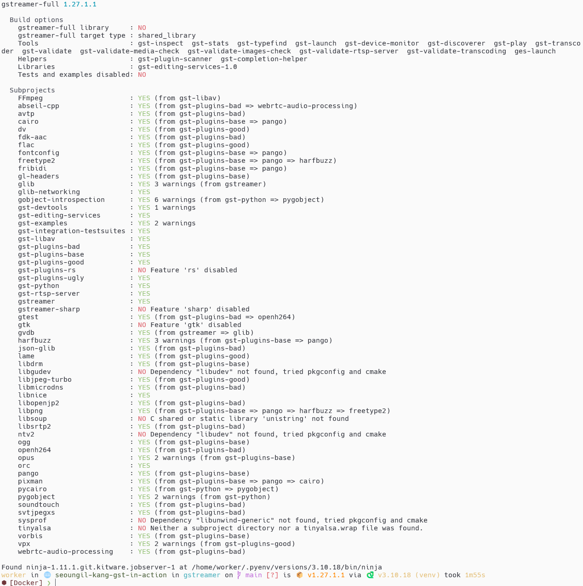

:: title ::
# 빌드 준비

:: content ::
#### node.js, python 가상 환경 설치(한 번만 하면 됩니다)

```bash
nvm install node
pyenv install 3.10.18
```

<div class="mt-10">

#### 작업 디렉토리 만들기 및 가상환경 설정

```bash
mkdir GStreamer
cd GStreamer
pyenv local 3.10.18
python -m venv venv
pip install meson ninja gitlint pre-commit jinja2 markdown markupsafe \
    packaging pygments typogrify tomli
```
</div>

<div class="mt-10">

#### 저장소 clone

```bash
git clone https://gitlab.freedesktop.org/gstreamer/gstreamer.git

```
</div>

---
layout: top-title
hideInToc: true
---
:: title ::
# 빌드 준비 확인

:: content ::
#### git clone 결과
```bash
worker in 🌐 seoungil-kang-gst-in-action in ~/GStreamer via 🐍 v3.10.18
⬢ [Docker] ❯ git clone https://gitlab.freedesktop.org/gstreamer/gstreamer.git
Cloning into 'gstreamer'...
remote: Enumerating objects: 955745, done.
remote: Counting objects: 100% (4053/4053), done.
remote: Compressing objects: 100% (1246/1246), done.
remote: Total 955745 (delta 2899), reused 3882 (delta 2797), pack-reused 951692 (from 1)
Receiving objects: 100% (955745/955745), 262.23 MiB | 10.05 MiB/s, done.
Resolving deltas: 100% (757802/757802), done.
Updating files: 100% (11442/11442), done.
```

<div class="mt-10">

#### 작업 디렉토리 확인
```bash
worker in 🌐 seoungil-kang-gst-in-action in ~/GStreamer via 🐍 v3.10.18 took 1m41s
⬢ [Docker] ❯ ls -al
.rw-rw-r-- 8 worker 18 Jul 23:20 - -     .python-version
drwxrwxr-x - worker  6 Sep 12:05 | main  gstreamer
drwxrwxr-x - worker 18 Jul 23:20 - -     venv
```
</div>

---
layout: top-title
hideInToc: true
---
:: title ::
# 빌드 실행 하기 - meson setup

:: content ::
<div class="success-box text-xs ns-c-tight">
참고 문서 : https://gitlab.freedesktop.org/gstreamer/gstreamer
</div>

<div class="mt-5 code-xs">

#### Python 가상 환경 시작

```bash
worker in 🌐 seoungil-kang-gst-in-action in ~/GStreamer via 🐍 v3.10.18
⬢ [Docker] ❯ source venv/bin/activate
worker in 🌐 seoungil-kang-gst-in-action in ~/GStreamer via 🐍 v3.10.18 (venv)
⬢ [Docker] ❯
```
</div>

<div class="mt-5 code-xs">

#### meson setup build 실행

```bash
worker in 🌐 seoungil-kang-gst-in-action in ~/GStreamer via 🐍 v3.10.18 (venv)
⬢ [Docker] ❯ cd gstreamer
worker in 🌐 seoungil-kang-gst-in-action in gstreamer on  main is 📦 v1.27.1.1 via 🐍 v3.10.18 (venv)
⬢ [Docker] ❯ meson setup build
The Meson build system
Version: 1.8.2
Source dir: /home/worker/GStreamer/gstreamer
Build dir: /home/worker/GStreamer/gstreamer/build
... [output truncated]

```
</div>

---
layout: top-title
hideInToc: true
---
:: title ::
# 빌드 실행 하기 - meson setup 결과

:: content ::

<figure class="text-center">
  <div class="w-full mx-auto">
    
  </div>
</figure>

---
layout: top-title
hideInToc: true
---
:: title ::
# 빌드 실행 하기 - meson compile

:: content ::
<div class="code-xs">

#### meson compile -C build 실행

```bash
worker in 🌐 seoungil-kang-gst-in-action in gstreamer on  main [?] is 📦 v1.27.1.1 via 🐍 v3.10.18 (venv)
⬢ [Docker] ❯ meson compile -C build
INFO: autodetecting backend as ninja
INFO: calculating backend command to run: /home/worker/.pyenv/versions/3.10.18/bin/ninja -C /home/worker/GStreamer/gstreamer/build
ninja: Entering directory `/home/worker/GStreamer/gstreamer/build'
[32/12147] Copying file subprojects/glib-2.82.4/gio/gdbus-2.0/codegen/parser.py
... [output truncated]
```
</div>

---
layout: top-title
hideInToc: true
---
:: title ::
# 빌드 실행 하기 - 빌드 결과 확인

:: content ::
<div class="success-box text-xs ns-c-tight">
참고 문서 : https://gitlab.freedesktop.org/gstreamer/gstreamer#development-environment
</div>


<div class="mt-3 code-xs code-dense">

#### meson devenv -C build 실행

```bash
worker in 🌐 seoungil-kang-gst-in-action in gstreamer on  main [?] is 📦 v1.27.1.1 via 🐍 v3.10.18 (venv)
⬢ [Docker] ❯ meson devenv -C build
Meson detected GDB helpers and added config in .gdbinit
To load it automatically you might need to:
 - Add add-auto-load-safe-path /home/worker/GStreamer/gstreamer/build in ~/.gdbinit
```
</div>

<div class="mt-3 code-xs code-dense">

#### 환경 변수 확인 해보기

```bash
worker in 🌐 seoungil-kang-gst-in-action in gstreamer/build on  main [?] via 🐍 v3.10.18 (venv) via ⬢ gstreamer-full
⬢ [Docker] ❯ env
... [output truncated]
LD_LIBRARY_PATH=/home/worker/GStreamer/gstreamer/build/subprojects/fribidi-1.0.13/lib:/home/worker/.....
PATH=........./home/worker/GStreamer/gstreamer/build/subprojects/gst-devtools/validate/tools:....
PYTHONPATH=/home/worker/GStreamer/gstreamer/subprojects/gst-python....
GST_PTP_HELPER=...
GST_PLUGIN_SCANNER=...
GST_PRESET_PATH=...
GST_ENCODING_TARGET_PATH=...
GST_VALIDATE_APPS_DIR=...
_GI_OVERRIDES_PATH=...
GIO_EXTRA_MODULES=...
GST_PLUGIN_PATH=...
```
</div>
