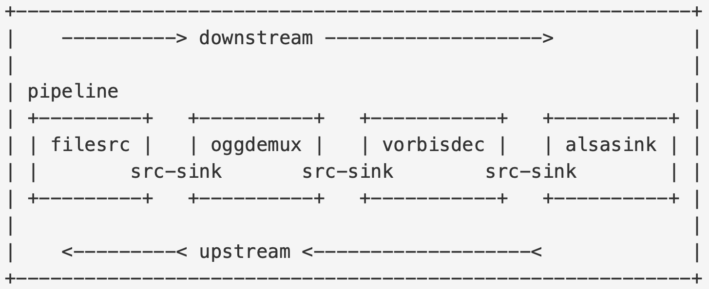
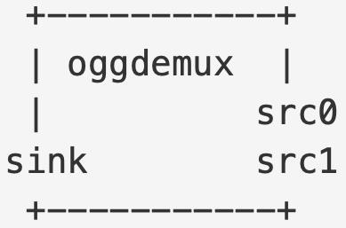
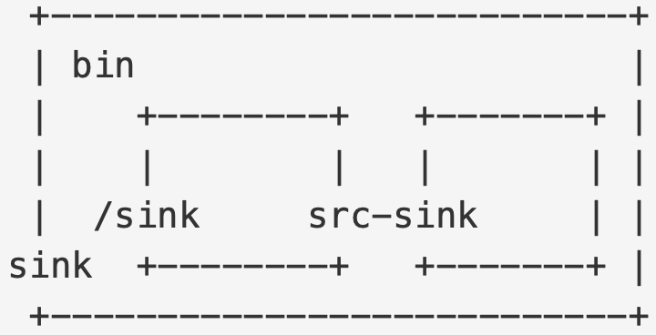
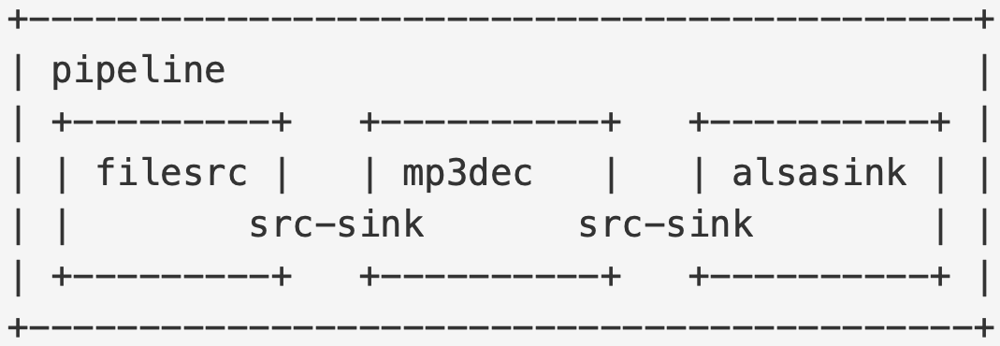
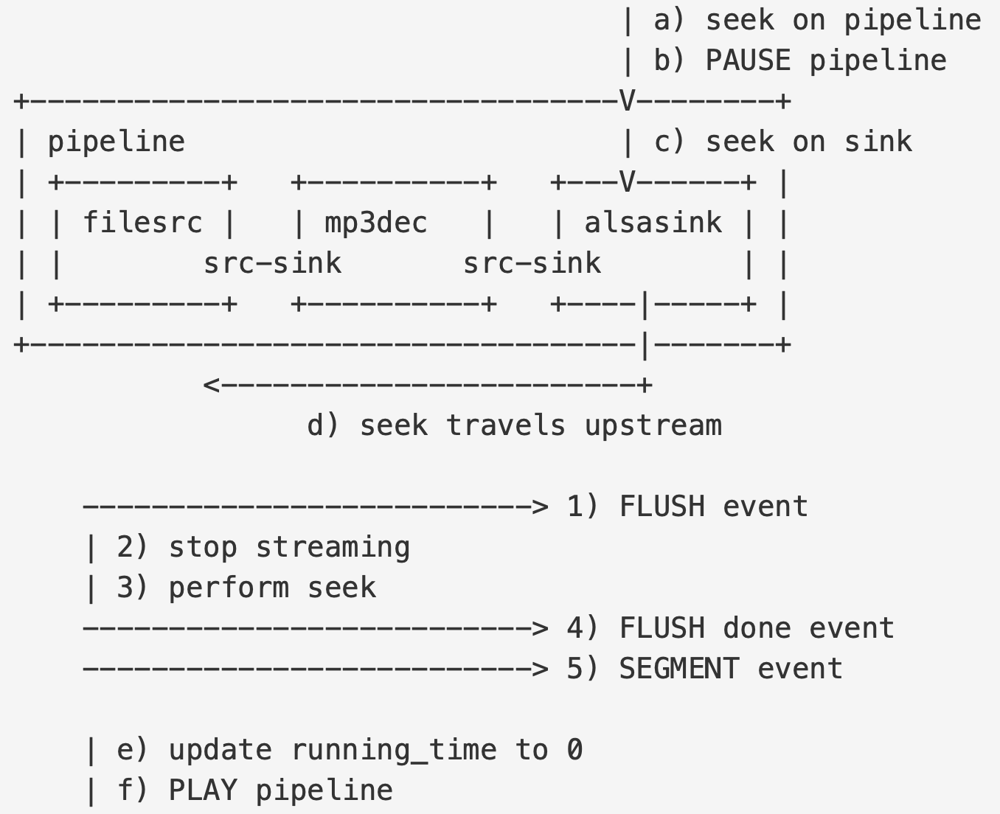

:: title ::
# GStreamer Overview

:: content ::

<strong>참고 자료:</strong> https://gstreamer.freedesktop.org/documentation/additional/design/overview.html?gi-language=c

<figure class="text-center">
  

    
  

</figure>

#### GStreamer 란,
- 멀티미디어 애플리케이션의 구현에 사용할 수 있는 라이브러리와 플러그인의 집합.
- 애플리케이션은 Element의 조합으로 이루어진 Pipeline을 바탕으로 구현.

#### Element 란,
- 멀티미디어 스트림에 어떤 행위를 수행할 수 있는 객체
  - 파일 읽기
  - 데이터 포맷 사이의 인코드/디코드
  - 하드웨어 장치로부터 캡쳐 또는 장치로 랜더
  - 복수의 스트림을 하나의 스트림으로 병합
  - 하나의 스트림에서 복수의 스트림으로 분할

---
layout: top-title
hideInToc: true
---
:: title ::
# GStreamer Overview

:: content ::
<figure class="text-center">
  

    
  

</figure>

#### 스트림의 방향
- **downstream** : source 에서 sink 로의 방향
- **upstream** : sink 에서 source 로의 방향

#### 애플리케이션의 역할
- Pipeline 에 실질적인 복잡한 작업들을 위임 (데이터 흐름, 디코딩, 변환, 동기화….)
- Pipeline 이 제공하는 고수준 API 호출하여 동작 제어 (PLAY, PAUSE, STOP, SEEK …)
- Message bus 를 통해 pipeline 에서 발신하는 메시지 수신하고, 이 내용에 따라 애플리케이션 실행 제어.
- GStreamer 가 제공하는 저수준 API 를 사용해 pipeline 을 세밀하게 제어할 수 도 있음.

---
layout: top-title
hideInToc: true
---
:: title ::
# GStreamer Overview

:: content ::

#### GStreamer 의 설계 목표
- 신속한 대용량 데이터 처리
- 완전한 멀티 스레드 처리 허용
- 복수의 포맷을 다룰 수 있는 기능
- 서로 다른 데이터 흐름의 동기화
- 복수의 장치를 다룰 수 있는 기능

#### GStreamer 코어 는 미디어 포맷을 직접 다루지 않습니다.
- 미디어 포맷을 다루는 기능은 element 를 통해 제공.

#### GStreamer 의 플러그인과 레지스트리
- 플러그인은 동적으로 추가 기능을 제공합니다.
- 시스템 전역 플러그인 경로와 사용자 정의 플러그인 경로를 사용 할 수 있습니다.
- 플러그인 정보는 레지스트리 파일에 저장됩니다.
- 어떤 플랫폼에서는 플러그인은 때로 정적 링크될 수도 있습니다.

---
layout: top-title-two-cols
columns: is-8
hideInToc: true
---
:: title ::
# GStreamer Overview

:: left ::

#### Elements
- 파이프라인의 가장 작은 단위 빌딩 블록.
- 여러 개의 pads 를 제공.
- sink pads : (입력) 데이터 소비 또는 수신.
- src pads : (출력) 데이터를 생산 또는 제공.

#### States
- 4 가지의 상태 : NULL, READY, PAUSED, PLAYING

#### Category
- source : 데이터를 소비하지 않고 파이프라인에 데이터를 제공만 한다.
- sink : 데이터를 생산하지 않고 출력장치에 데이터를 랜더링 한다.
- transform : 특정 포맷의 입력 스트림을 다른 포맷의 출력 스트림으로 변환.
- demuxer : 하나의 스트림을 파싱 하여 복수의 출력 스트림을 생성.
- muxer : 복수의 입력 스트림을 하나의 출력 스트림으로 결합.

:: right ::
<figure class="text-center">
  

    
  

</figure>

---
layout: top-title
hideInToc: true
---
:: title ::
# GStreamer Overview

:: content ::
<figure class="text-center">
  

    
  

</figure>

#### Bins
- Bin은 Element의 서브클래스.
- 이름과 같이 어떤 것을 담아내는 그릇의 역할.
- Bin은 내부의 Element와 부모-자식 의 관계를 가지게 된다.
- 자식의 상태 변경을 조정한다.
- 이벤트 및 다양한 기능을 자식들에게 분배한다.
- 자식이 가진 패드들 중 원하는 만큼을 ghostpad로 만들어 외부에 노출할 수 있다.

---
layout: top-title
hideInToc: true
---
:: title ::
# GStreamer Overview

:: content ::
<figure class="text-center">
  

    
  

</figure>

#### Pipeline
- Bin의 특별한 서브클래스
- 보관 중인 자식 Element에게 여러 가지 기능을 제공한다. 

#### 자식 Element에게 제공하는 기능,
- **Clock**: 모든 자식이 사용할 clock 을 선택하고 관리 한다.
- **Running Time**
    - 선택된 clock 을 기반으로 running_time 을 관리 한다.
    - Pipeline 이 PLAYING 상태에서 보낸 시간, 동기화에 사용됨.
- Pipeline의 latency 관리
- **통신 버스 제공**
    - GstBus 를 통해 자식 Element와 애플리케이션이 소통.
- Errors 또는 end-of-stream 과 같은 엘리먼트의 전역 상태 관리.

---
layout: top-title
hideInToc: true
---
:: title ::
# GStreamer Overview

:: content ::
<figure class="text-center">
  

    
  

</figure>

#### Dataflow types
- PUSH
    - (출발) upstream element
    - (도착) downstream element의 sink pad
    - 데이터를 전달한다.
- PULL
    - (출발) downstream element
    - (도착) upstream element의 src pad
    - 데이터를 요청한다.

#### Buffer
- pad 간에 전달 되는 데이터를 나타내는 자료구조.
- 데이터를 보관하는 메모리와 이를 설명하는 메타데이터이다.
- 메타데이터
    - 타임스템프 : 데이터가 캡쳐 되었거나, 재생되어야만 하는 시간을 나타낸다.
    - 데이터의 옵셋 : 버퍼가 가리키는 메모리에서 데이터가 위치하는 옵셋.
    - 데이터의 지속 시간
    - 플래그 : 데이터의 불연속성 또는 델타 유닛 과 같은 데이터의 특별한 속성을 나타낸다.
    - 임의의 추가 메타데이터.
- 하나의 Element 가 pad를 통해 다른 Element 에 데이터를 보내는 방법
    - PUSH : gst_pad_push()
    - PULL : gst_pad_pull_range()
- Buffer의 전달에 실패하면 데이터 전달 스레드는 일시 정지 상태가 된다.

---
layout: top-title
hideInToc: true
---
:: title ::
# GStreamer Overview

:: content ::
<figure class="text-center">
  

    
  

</figure>

#### 협상
- 하나의 Element가 pad를 사용해 Buffer를  다른 Element 로 보내기 전에 상대방이 이를  수신할 수 있을 지 확인.
- Element 가 서로 처리할 수 있는 포맷을 요청하고  적절한 공통 포맷을 협상하고 선택한다.

#### Caps
- pad 간에 전달될 수 있는 미디어 타입을 나타내는 자료구조.
- key – value 쌍의 리스트 형태.
    - key : 문자열
    - value : (정수/부동 소수점/문자열) 타입의 (단일 값/목록/범위) 를 나타내는 자료구조
- value 에 목록, 범위를 포함하는 Caps
    - pad 가 처리 가능한 미디어 타입의 범위와 목록을 나타내기 위한 용도.
- FIXED CAPS
    - 협상이 완료된 Caps
    - value 부분이 모두 단일 값 으로 확정된 Caps 자료구조.
    - pad 간 협상이 완료되어 모호함 없이 buffer의 데이터 타입을 확정한 상태임을 나타낸다.

---
layout: top-title
hideInToc: true
---
:: title ::
# GStreamer Overview

:: content ::
<figure class="text-center">
  

    
  

</figure>

#### Eevnts/Queries
- Pipeline 의 동작을 제어 하거나 정보를 요청하는 객체.
- Buffer 객체와 달리 upstream 또는 downstream 양쪽 방향으로 흐를 수 있다.
- Events
    - EOS, Flush, Seek 등의 제어 명령을 나타내는 객체
    - Buffer 전달과 순서를 맞춰 직렬화 되어야 하는 경우도 있다.
- Queries
    - Duration, Position 등의 정보를 요청하는 객체.
    - 이 객체들은 애플리케이션 또는 Elements 모두에서 활용 된다.

---
layout: top-title
hideInToc: true
---
:: title ::
# GStreamer Overview

:: content ::
<figure class="text-center">
  

    
  

</figure>

#### Pipeline의 생성 및 연결
- 애플리케이션은 gst_pipeline_new() API 를 사용해 Pipeline 객체를 생성 한다.
- Pipeline 객체는 Bin 이기도 하니, Element 의 추가에 gst_bin_add(), gst_bin_remove() 등을 사용한다.
- Element 를 추가한 뒤 gst_element_get_pad() 를 사용해 pad 를 검색하고 gst_pad_link() 를 사용해 연결.
- 일부 Element 는 데이터가 실제로 흐른 다음에 pad 를 새로 만들기도 한다.
 - 시그널을 사용해 pad 생성 이벤트를 수신하여 이 pad 와 Element 를 연결 할 수 있다.

#### Pipeline 의 Clock
- Element 는 Clock을 통해 동기화 한다.
- Pipeline 은 PLAYING 상태로 전환되기 직전에 각 Element 에게 Clock 을 제공할 수 있는지 질의 한다.
    - 애플리케이션에서 선택한 Clock 이 있다면 그것을 사용한다.
    - Source Element 에서 Clock을 제공한다면 그것을 사용한다.
    - Sink Element 부터 upstream 방향으로 거슬러 올라가며 Clock 을 제공하는 Element를 찾아 그것이 제공하는 Clock을 사용한다.
    - Clock 을 제공하는 Element 가 없다면, system clock을 사용한다.

---
layout: top-title
hideInToc: true
---
:: title ::
# GStreamer Overview

:: content ::
<figure class="text-center">
  

    
  

</figure>

#### Pipeline의 내부 상태 알림
- Pipeline은 GstBus 를 통해 내부의 이벤트들을 애플리케이션에게 알려준다.
- GstBus : Pipeline 이 제공하는 객체, gst_pipeline_get_bus() API 로 얻어온다.
- Element 는 GstBus 를 사용해 메시지를 post 한다.
    - ERROR, WARNING, EOS, STATE CHANGE 등의 메시지 타입이 있다.
- EOS 의 메시지는 조금 특별하게 처리 된다.
    - Pipeline 의 모든 sink element 가 EOS 를 post 해야만 애플리케이션에 EOS 메시지가 전달 된다.

---
layout: top-title
hideInToc: true
---
:: title ::
# GStreamer Overview

:: content ::
<figure class="text-center">
  

    
  

</figure>

#### Pipeline의 상태 전환 매커니즘
- Pipeline 에 Element 가 추가되고 서로의 pads 를 연결 하였다면 dataflow 를 시작할 수 있음.
- Pipeline 은 Bin 이고, Bin 에 상태 변경을 요청하면 이것이 보관하는 모든 자식 Element의 상태를 변경 한다.
    - Sink Element 에서 Source Element 방향으로 상태 변경을 수행한다.
    - 데이터를 수신할 준비가 되지 않은 downstream elements 에게 데이터를 전달하지 않기 위한 순서.

#### Pipeline 예제에서 상태 전환 시 일어나는 일 : NULL -> READY -> PAUSED
- alsasink -> mp3dec -> filesrc 순서로 상태 전환됨
- NULL -> READY
    - alsasink : 오디오 장치가 프로브 된다.
    - mp3dec : 아무 일도 일어나지 않는다.
    - filesrc : 파일이 프로브 된다.
- READY -> PAUSED
    - alsasink : 오디오 장치가 열린다. alsasink 는 sink 이며, 아직 데이터를 수신하지 못했기에 ASYNC 리턴. 
    - mp3dec : 디코딩 라이브러리 초기화
    - filesrc : 파일이 열리고 데이터를 mp3dec 로 push 하는 스레드가 시작된다.

---
layout: top-title
hideInToc: true
---
:: title ::
# GStreamer Overview

:: content ::
<figure class="text-center">
  

    
  

</figure>

#### Pipeline 예제에서 상태 전환 시 일어나는 일 : NULL -> READY -> PAUSED
- filesrc -> mp3dec -> alsasink 로 데이터가 흐르기 시작한다.
- mp3dec
    - filesrc 가 sink pad 를 통해 push 한 압축된 데이터를 수신한다.
    - 압축된 데이터를 디코드 하고, 오디오의 Caps 정보를 파악한다.
    - 파악된 Caps 정보와 함께 CAPS Event를 alsasink 로 push 하여 협상을 시작한다.
- alsasink
    - mp3dec 이 push 한 CAPS 이벤트에 담긴 Caps 정보를 바탕으로 협상을 시작한다.
    - 협상이 완료되면, Caps 에 맞추어 데이터를 처리 할 준비 한다.
- mp3dec -> alsasink 로 Buffer 하나가 push 된다.
    - alsasink 는 하나의 Buffer 를 수신 했으므로 PAUSED 로 상태 변경을 완료 한다.
    - 이 시점에 파이프라인은 PREROLLED 되고, 모든 Element 는 Buffer 를 하나씩 가지게 된다.

---
layout: top-title
hideInToc: true
---
:: title ::
# GStreamer Overview

:: content ::
<figure class="text-center">
  

    
  

</figure>

#### Pipeline 예제에서 상태 전환 시 일어나는 일 : PAUSED -> PLAYING
- Pipeline 이 PREROLLED 되면, alsasink 는 Pipeline 에 Clock을 제공할 수 있게 된다.
- alsasink 는 PAUSED 상태이기 때문에 Buffer 를 수신 한 뒤 실행을 멈추게 된다.
    - filesrc -> mp3dec -> alsasink 로의 Buffer push 과정은 함수 연쇄 호출로 구현된다.
    - alsasink 의 sink pad 객체에 적용한 gst_pad_push() 함수가 리턴하지 않음을 의미한다.
    - 이러한 매커니즘은 filesrc, mp3dec 를 효율적으로 멈춰 있게 한다.
- 모든 Element 가 gst_element_get_state() 함수에서 SUCCESS 를 리턴하게 되었다.
    - Pipeline 을 PLAYING 상태에 놓을 수 있게 되었다.
- PLAYING 상태로 이동하면서 Pipeline 이 수행하는 작업
    - 클럭을 선택하고 현재 시간을 셈플링한다 -> base_time 설정
    - Buffer의 running_time 을 활용한 동기화를 위해 각 Element 에 base_time 을 배포 한다.
- PAUSED -> PLAYING
    - alsasink : Buffer의 샘플이 오디오 장치로 재생 된다.
    - mp3dec : 아무 일도 일어나지 않는다.
    - filesrc : 아무 일도 일어나지 않는다.

---
layout: top-title
hideInToc: true
---
:: title ::
# GStreamer Overview

:: content ::
<figure class="text-center">
  

    
  

</figure>

#### Pipeline의 SEEK
- SEEK을 수행하기 위한 매우 구체적인 작업 순서에 따라야 한다.

---
layout: top-title
hideInToc: true
---
:: title ::
# GStreamer Overview

:: content ::
<figure class="text-center">
  

    
  

</figure>

#### Pipeline의 EOS 처리
- Source Element 가 스트림의 끝을 발견하면 downstream 으로 EOS Event 를 push 한다.
- Element 는 sink pad 에서 EOS Event 를 수신한 후에 더 이상 데이터를 수신하지 않아야 한다.
    - 스트리밍 스레드를 제공하는 Element 는 EOS의 push 이후 데이터 전송을 중지 한다.
- Sink Element 에서 EOS Event 를 수신하면 EOS 메시지를 post 한다.
    - Pipeline(Bin)의 모든 sink element 가 EOS 메시지를 post 하면 애플리케이션에 EOS 메시지가 전달 된다.
    - EOS 는 Pipeline 이 PLAYING 상태 일 때만 전달 된다.
- 애플리케이션은 EOS 를 수신하면 Pipeline 을 PAUSED 또는 READY 상태로 전환할 책임이 있다.

---
layout: top-title
hideInToc: true
---
:: title ::
# GStreamer Overview

:: content ::
<figure class="text-center">
  

    
  

</figure>

#### Pipeline 예제에서 상태 전환 시 일어나는 일 : PLAYING -> PAUSED -> READY
- PLAYING -> PAUSED
    - alsasink : 작동을 멈추고 다음 샘플에서 상태 변경을 완료. 만약 EOS 인 경우, 곧바로 상태 변경
    - mp3dec : 아무 일 하지 않음.
    - filesrc : 아무 일 하지 않음.
- PAUSED -> READY
    - alsasink : _chain() 함수 unblock, FLUSHING 리턴. sink pad 비활성화.
    - mp3dec : _chain() 함수 리턴하면, pad 들 비활성화 및 상태 변경 완료.
    - filesrc : pad 들 비활성화 및 스레드 일시 정지.

---
layout: top-title
hideInToc: true
---
:: title ::
# GStreamer Overview

:: content ::
<figure class="text-center">
  

    
  

</figure>
