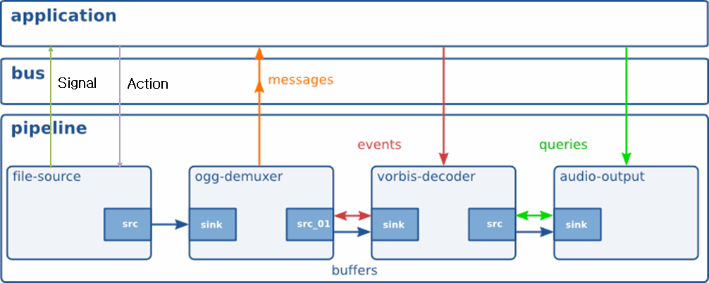
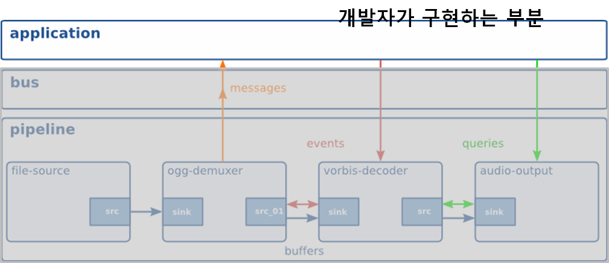
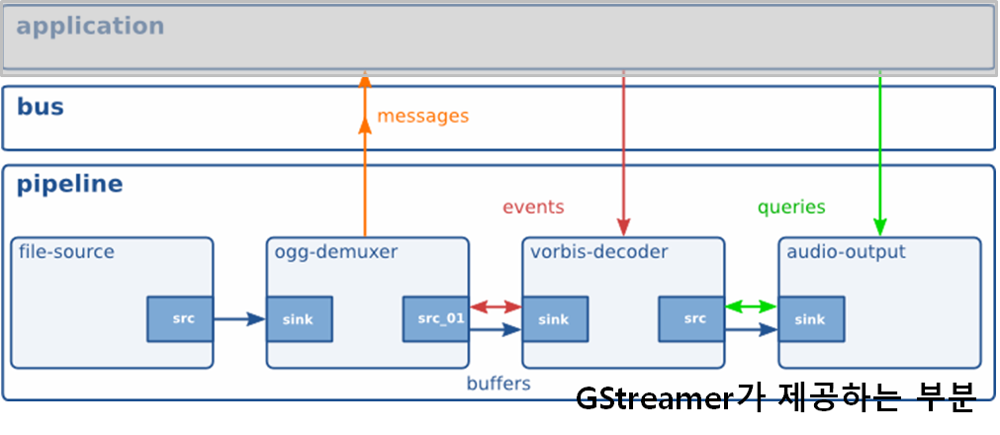
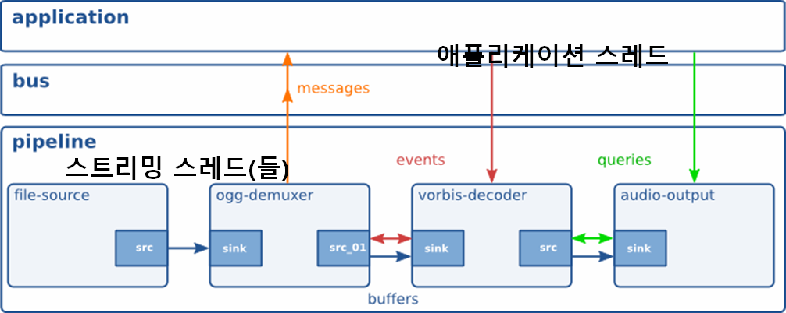
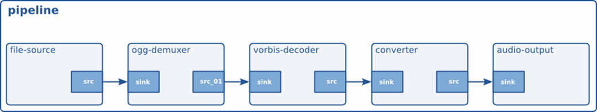
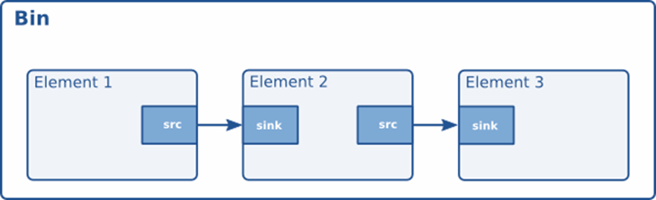
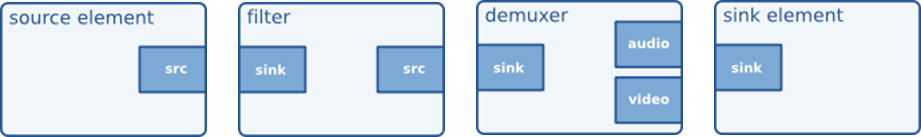
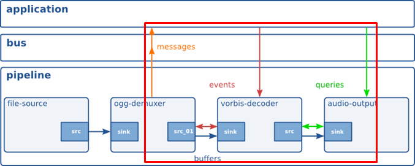

:: title ::
# GStreamer Application Development

:: content ::
<figure class="text-center">
  <div class="w-full mx-auto">
    
  </div>
</figure>

---
layout: top-title
hideInToc: true
---
:: title ::
# GStreamer Application Development

:: content ::
<figure class="text-center">
  <div class="w-full mx-auto">
    
  </div>
</figure>

---
layout: top-title
hideInToc: true
---
:: title ::
# GStreamer Application Development

:: content ::
<figure class="text-center">
  <div class="w-full mx-auto">
    
  </div>
</figure>

---
layout: top-title
hideInToc: true
---
:: title ::
# GStreamer Application Development

:: content ::
<figure class="text-center">
  <div class="w-full mx-auto">
    
  </div>
</figure>

---
layout: top-title
hideInToc: true
---
:: title ::
# GStreamer Application Development

:: content ::
<figure class="text-center">
  <div class="w-full mx-auto">
    
  </div>
</figure>

<div class="ns-c-tight text-xs mt-10">
<div class="flex flex-wrap">
<div class="w-1/2">

- 클락과 버스를 소유하고 있는 최 상위 Bin.
    - GstBin을 상속 받아 구현된 특별한 기능의 Bin => Bin과 동일한 기능 + 특수 기능.
    - 전역으로 사용  할 clock의 선택과 분배를 관리.
    - 애플리케이션에 버스를 제공한다.
</div>
<div class="w-1/2">

- 인터페이스
    - https://t.ly/0dHo
</div>
</div>
</div>

<div class="ns-c-tight code-dense mt-5">
<div class="flex flex-wrap">
<div class="w-1/2">

```c
GstElement* gst_pipeline_new ()
GstBus*     gst_pipeline_get_bus ()
gboolean    gst_pipeline_set_clock ()
GstClock*   gst_pipeline_get_pipeline_clock ()
GstClock*   gst_pipeline_get_clock ()
void        gst_pipeline_use_clock ()
void        gst_pipeline_auto_clock ()
```
</div>
<div class="w-1/2">

```c
void         gst_pipeline_set_auto_flush_bus ()
gboolean     gst_pipeline_get_auto_flush_bus ()
void         gst_pipeline_set_delay ()
GstClockTime gst_pipeline_get_delay ()
void         gst_pipeline_set_latency ()
GstClockTime gst_pipeline_get_latency ()
```
</div>
</div>
</div>

---
layout: top-title
hideInToc: true
---
:: title ::
# GStreamer Application Development

:: content ::
<figure class="text-center">
  <div class="w-full mx-auto">
    
  </div>
</figure>

<div class="ns-c-tight text-xs mt-5">
<div class="flex flex-wrap">
<div class="w-1/2">

- 파이프라인과 다른 점은 클락과 버스를 소유하지 않는 다는 것.
    - 여러 개의 단위 엘리먼트를 연결하여 의미있는 논리적인 기능 단위를 구현하는 수단.
    - 복잡한 파이프라인 구현 시 개별적인 단위 엘리먼트를 일일이 제어하는 수고를 덜어줌.
    - 파이프라인은 빈의 특별한 형태.
</div>
<div class="w-1/2">

- 인터페이스
    - https://t.ly/r2oV
</div>
</div>
</div>

<div class="ns-c-tight code-dense mt-1">
<div class="flex flex-wrap">
<div class="w-1/2">

```c
GstElement*  gst_bin_new ()
gboolean     gst_bin_add ()
gboolean     gst_bin_remove ()
GstElement*  gst_bin_get_by_name ()
GstElement*  gst_bin_get_by_name_recurse_up ()
GstElement*  gst_bin_get_by_interface ()
GstIterator* gst_bin_iterate_elements ()
GstIterator* gst_bin_iterate_recurse ()
GstIterator* gst_bin_iterate_sinks ()
GstIterator* gst_bin_iterate_sorted ()
GstIterator* gst_bin_iterate_sources ()
```
</div>
<div class="w-1/2">

```c
GstIterator* gst_bin_iterate_all_by_interface ()
gboolean     gst_bin_recalculate_latency ()
void         gst_bin_add_many ()
void         gst_bin_remove_many ()
GstPad*      gst_bin_find_unlinked_pad ()
gboolean     gst_bin_sync_children_states ()
#define      GST_BIN_IS_NO_RESYNC()
#define      GST_BIN_CHILDREN()
#define      GST_BIN_CHILDREN_COOKIE()
#define      GST_BIN_NUMCHILDREN()
```
</div>
</div>
</div>

---
layout: top-title
hideInToc: true
---
:: title ::
# GStreamer Application Development

:: content ::
<figure class="text-center">
  <div class="w-full mx-auto">
    
  </div>
</figure>

<div class="ns-c-tight text-xs mt-5">
<div class="flex flex-wrap">
<div class="w-1/2">

- 파이프라인을 구성하는 모든 객체는 엘리먼트
    - 애플리케이션 입장에서는 블랙박스로 취급.
    - 모양에 따라 4 가지 종류로 구분할 수 있음.
    - Source, Filter, (De)muxer, Sink
</div>
<div class="w-1/2">

- 인터페이스
    - https://t.ly/qGmur
</div>
</div>
</div>

<div class="ns-c-tight code-dense mt-1">
<div class="flex flex-wrap">
<div class="w-1/2">

```c
gboolean             gst_element_link ()
void                 gst_element_unlink ()
gboolean             gst_element_link_many ()
void                 gst_element_unlink_many ()
void                 gst_element_set_bus ()
GstBus*              gst_element_get_bus ()
void                 gst_element_set_context ()
GstContext*          gst_element_get_context ()
GstContext*          gst_element_get_context_unlocked ()
GstElementFactory*   gst_element_get_factory ()
GstStateChangeReturn gst_element_set_state ()
GstStateChangeReturn gst_element_get_state ()
```
</div>
<div class="w-1/2">

```c
gboolean	gst_element_post_message ()
gboolean	gst_element_query ()
gboolean	gst_element_query_convert ()
gboolean	gst_element_query_position ()
gboolean	gst_element_query_duration ()
gboolean	gst_element_send_event ()
gboolean	gst_element_seek_simple ()
gboolean	gst_element_seek ()
```
</div>
</div>
</div>

---
layout: top-title
hideInToc: true
---
:: title ::
# GStreamer Application Development

:: content ::
<figure class="text-center">
  <div class="w-full mx-auto">
    
  </div>
</figure>

<div class="ns-c-tight mt-10">

- 단방향 정보 전달 시스템
    - 정보의 생성 : 파이프라인에 소속된 엘리먼트.
    - 정보의 소비 : 애플리케이션.
- 두가지 방식의 정보 전달 채널
    - 동기 : 콜백, 시그널 핸들러.
    - 비동기 : 비동기 큐.
- 애플리케이션에서 메시지를 수신하는 방식
    - main 스레드에서 명시적으로 버스를 polling 하여 메시지를 수신.
    - GMainLoop에 event source로 등록하여 event handler를 통해 수신.
    - sync handler 또는 signal hander 등을 등록하여 콜백 함수를 통해 수신.
</div>

---
layout: top-title
hideInToc: true
---
:: title ::
# GStreamer Application Development

:: content ::
<figure class="text-center">
  <div class="w-full mx-auto">
    
  </div>
</figure>

<div class="ns-c-tight mt-10">

- 애플리케이션과 파이프라인의 통신 매커니즘
    - Message : 파이프라인의 구성 요소가 bus로 post 하는 객체.
    - Buffer : 파이프라인을 통해 흐를 데이터를 포함한다.
    - Event : 파이프라인의 엘리먼트들에 스트림의 상태 변경을 알리 거나 변경을 요청 하는 객체.
    - Query : 파이프라인의 스트림 속성들을 요청하는 객체.
</div>
