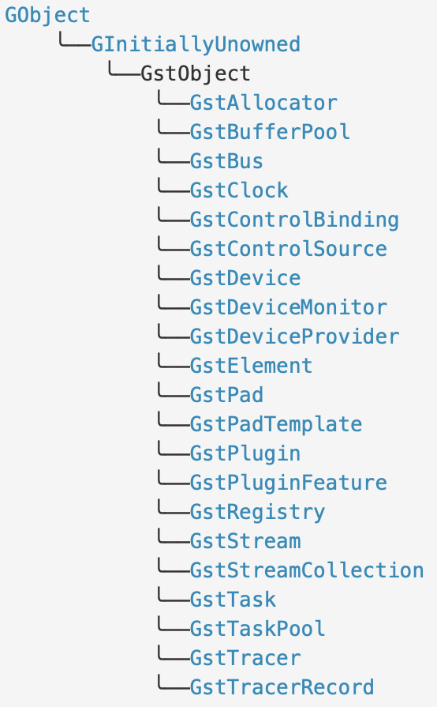
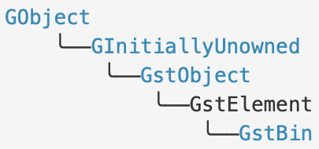
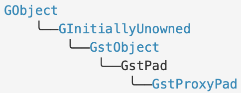
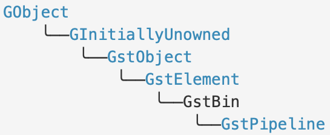
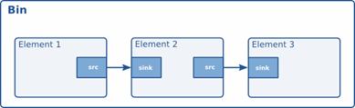
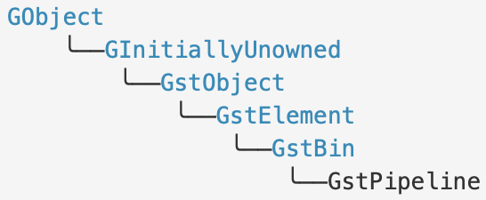
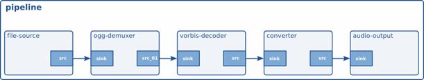
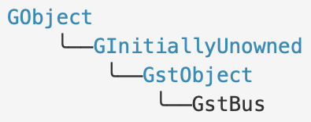

:: title ::
# GStreamer 라이브러리 초기화

:: content ::
<div class="highlight-box text-xs">
<strong>참고 자료:</strong> https://gstreamer.freedesktop.org/documentation/gstreamer/gst.html?gi-language=c
</div>

<div class="flex flex-wrap text-sm ns-c-tight code-dense mt-10">
<div class="w-2/3 pr-10">

#### Initializing the gstreamer library
```c
int main (int argc, char *argv[])
{
  // initialize the GStreamer library
  gst_init (&argc, &argv);
  ...
}
```
</div>

<div class="w-1/3">

#### APIs

- [Functions](https://gstreamer.freedesktop.org/documentation/gstreamer/gst.html#functions)
    - [gst_deinit](https://gstreamer.freedesktop.org/documentation/gstreamer/gst.html#gst_deinit)
    - [gst_get_main_executable_path](https://gstreamer.freedesktop.org/documentation/gstreamer/gst.html#gst_get_main_executable_path)
    - [gst_init](https://gstreamer.freedesktop.org/documentation/gstreamer/gst.html#gst_init)
    - [gst_init_check](https://gstreamer.freedesktop.org/documentation/gstreamer/gst.html#gst_init_check)
    - [gst_init_get_option_group](https://gstreamer.freedesktop.org/documentation/gstreamer/gst.html#gst_init_get_option_group)
    - [gst_is_initialized](https://gstreamer.freedesktop.org/documentation/gstreamer/gst.html#gst_is_initialized)
    - [gst_segtrap_is_enabled](https://gstreamer.freedesktop.org/documentation/gstreamer/gst.html#gst_segtrap_is_enabled)
    - [gst_segtrap_set_enabled](https://gstreamer.freedesktop.org/documentation/gstreamer/gst.html#gst_segtrap_set_enabled)
    - [gst_version](https://gstreamer.freedesktop.org/documentation/gstreamer/gst.html#gst_version)
    - [gst_version_string](https://gstreamer.freedesktop.org/documentation/gstreamer/gst.html#gst_version_string)
</div>
</div>

---
layout: top-title
hideInToc: true
---
:: title ::
# GStreamer 라이브러리 초기화

:: content ::
<div class="text-sm code-dense">

#### Initializing own parameters when initializing GStreamer
```c
static gboolean stats = FALSE;
...
int
main (int argc, char *argv[])
{
 GOptionEntry options[] = {
  {"tags", 't', 0, G_OPTION_ARG_NONE, &tags,
      N_("Output tags (also known as metadata)"), NULL},
  {NULL}
 };
 ctx = g_option_context_new ("[ADDITIONAL ARGUMENTS]");
 g_option_context_add_main_entries (ctx, options, GETTEXT_PACKAGE);
 g_option_context_add_group (ctx, gst_init_get_option_group ());
 if (!g_option_context_parse (ctx, &argc, &argv, &err)) {
   g_print ("Error initializing: %s\n", GST_STR_NULL (err->message));
   exit (1);
 }
 g_option_context_free (ctx);
...
}
```
</div>

---
layout: top-title
hideInToc: true
---
:: title ::
# GstObject

:: content ::

<div class="flex flex-wrap ns-c-tight">
<div class="w-2/3 pr-10 mt-10">

- GStreamer 라이브러리 객체 계층 트리의 부모 역할
    - Reference Counting, Lock, name 기능 제공
- Floating Reference
    - GInitiallyUnowned 를 상속하기 때문.
    - gst_bin_add 및 gst_element_add_pad와 같은 함수를 통해 floating reference의 소유권을 가진다.
</div>

<div class="w-1/3">
<figure class="text-center">
  <div class="w-full mx-auto">
    
  </div>
</figure>
</div>
</div>

---
layout: top-title
hideInToc: true
---
:: title ::
# GstObject

:: content ::

<div class="flex flex-wrap text-xs ns-c-tight">
<div class="w-1/3">

#### Members[](https://gstreamer.freedesktop.org/documentation/gstreamer/gstobject.html#members)

<div class="custom-table-xs">

| 멤버 | 타입 | 설명 |
|--------|------|-------------|
| **object** | [GInitiallyUnowned](https://docs.gtk.org/gobject/class.InitiallyUnowned.html) | _No description available_ |
| **lock** | [GMutex](https://docs.gtk.org/glib/union.Mutex.html) | object LOCK |
| **name** | [gchar](https://docs.gtk.org/glib/types.html#gchar) * | The name of the object |
| **parent** | [GstObject](https://gstreamer.freedesktop.org/documentation/gstreamer/gstobject.html#GstObject) * | this object's parent, weak ref |
| **flags** | [guint32](https://docs.gtk.org/glib/types.html#guint32) | flags for this object |

</div>

</div>

<div class="w-1/3">

- [Methods](https://gstreamer.freedesktop.org/documentation/gstreamer/gstobject.html#methods)
    - [gst_object_add_control_binding](https://gstreamer.freedesktop.org/documentation/gstreamer/gstobject.html#gst_object_add_control_binding)
    - [gst_object_default_error](https://gstreamer.freedesktop.org/documentation/gstreamer/gstobject.html#gst_object_default_error)
    - [gst_object_get_control_binding](https://gstreamer.freedesktop.org/documentation/gstreamer/gstobject.html#gst_object_get_control_binding)
    - [gst_object_get_control_rate](https://gstreamer.freedesktop.org/documentation/gstreamer/gstobject.html#gst_object_get_control_rate)
    - [gst_object_get_g_value_array](https://gstreamer.freedesktop.org/documentation/gstreamer/gstobject.html#gst_object_get_g_value_array)
    - [gst_object_get_name](https://gstreamer.freedesktop.org/documentation/gstreamer/gstobject.html#gst_object_get_name)
    - [gst_object_get_parent](https://gstreamer.freedesktop.org/documentation/gstreamer/gstobject.html#gst_object_get_parent)
    - [gst_object_get_path_string](https://gstreamer.freedesktop.org/documentation/gstreamer/gstobject.html#gst_object_get_path_string)
    - [gst_object_get_value](https://gstreamer.freedesktop.org/documentation/gstreamer/gstobject.html#gst_object_get_value)
    - [gst_object_get_value_array](https://gstreamer.freedesktop.org/documentation/gstreamer/gstobject.html#gst_object_get_value_array)
    - [gst_object_has_active_control_bindings](https://gstreamer.freedesktop.org/documentation/gstreamer/gstobject.html#gst_object_has_active_control_bindings)
    - [gst_object_has_as_ancestor](https://gstreamer.freedesktop.org/documentation/gstreamer/gstobject.html#gst_object_has_as_ancestor)
    - [gst_object_has_as_parent](https://gstreamer.freedesktop.org/documentation/gstreamer/gstobject.html#gst_object_has_as_parent)
    - [gst_object_ref](https://gstreamer.freedesktop.org/documentation/gstreamer/gstobject.html#gst_object_ref)
    - [gst_object_remove_control_binding](https://gstreamer.freedesktop.org/documentation/gstreamer/gstobject.html#gst_object_remove_control_binding)
    - [gst_object_set_control_binding_disabled](https://gstreamer.freedesktop.org/documentation/gstreamer/gstobject.html#gst_object_set_control_binding_disabled)
    - [gst_object_set_control_bindings_disabled](https://gstreamer.freedesktop.org/documentation/gstreamer/gstobject.html#gst_object_set_control_bindings_disabled)
    - [gst_object_set_control_rate](https://gstreamer.freedesktop.org/documentation/gstreamer/gstobject.html#gst_object_set_control_rate)
    - [gst_object_set_name](https://gstreamer.freedesktop.org/documentation/gstreamer/gstobject.html#gst_object_set_name)
    - [gst_object_set_parent](https://gstreamer.freedesktop.org/documentation/gstreamer/gstobject.html#gst_object_set_parent)
    - [gst_object_suggest_next_sync](https://gstreamer.freedesktop.org/documentation/gstreamer/gstobject.html#gst_object_suggest_next_sync)
</div>

<div class="w-1/3">

- [Methods](https://gstreamer.freedesktop.org/documentation/gstreamer/gstobject.html#methods)
    - [gst_object_sync_values](https://gstreamer.freedesktop.org/documentation/gstreamer/gstobject.html#gst_object_sync_values)
    - [gst_object_unparent](https://gstreamer.freedesktop.org/documentation/gstreamer/gstobject.html#gst_object_unparent)
    - [gst_object_unref](https://gstreamer.freedesktop.org/documentation/gstreamer/gstobject.html#gst_object_unref)
<div class="mt-5">

- [Functions](https://gstreamer.freedesktop.org/documentation/gstreamer/gstobject.html#functions)
    - [gst_object_check_uniqueness](https://gstreamer.freedesktop.org/documentation/gstreamer/gstobject.html#gst_object_check_uniqueness)
    - [gst_object_default_deep_notify](https://gstreamer.freedesktop.org/documentation/gstreamer/gstobject.html#gst_object_default_deep_notify)
    - [gst_object_ref_sink](https://gstreamer.freedesktop.org/documentation/gstreamer/gstobject.html#gst_object_ref_sink)
    - [gst_object_replace](https://gstreamer.freedesktop.org/documentation/gstreamer/gstobject.html#gst_object_replace)
</div>

<div class="mt-5">

- [Signals](https://gstreamer.freedesktop.org/documentation/gstreamer/gstobject.html#signals)
    - [deep-notify](https://gstreamer.freedesktop.org/documentation/gstreamer/gstobject.html#GstObject::deep-notify)
</div>

<div class="mt-5">

- [Properties](https://gstreamer.freedesktop.org/documentation/gstreamer/gstobject.html#properties)
    - [name](https://gstreamer.freedesktop.org/documentation/gstreamer/gstobject.html#GstObject:name)
    - [parent](https://gstreamer.freedesktop.org/documentation/gstreamer/gstobject.html#GstObject:parent)
</div>
</div>
</div>

---
layout: top-title
hideInToc: true
---
:: title ::
# GstMiniObject

:: content ::

<div class="ns-c-tight text-sm">

- reference count 타입을 구현하는데 사용할 수 있는 단순한 구조체이다.
    - 이를 상속하는 클래스는 GstMiniObject를 구조체의 첫 멤버로 포함.
    - gst_mini_object_init 함수를 호출하여 GstMiniObject의 필드들을 초기화 한다.
- Buffer, Memory, Message, Event, Query, Caps 등의 베이스 클래스.
</div>


<div class="flex flex-wrap text-xs ns-c-tight">
<div class="w-2/4">

#### Members[](https://gstreamer.freedesktop.org/documentation/gstreamer/gstminiobject.html#members)

<div class="custom-table-xs">

| 멤버 | 타입 | 설명 |
|------|------|------|
| **type** | [GType](https://docs.gtk.org/gobject/alias.Type.html) | the GType of the object |
| **refcount** | [gint](https://docs.gtk.org/glib/types.html#gint) | atomic refcount |
| **lockstate** | [gint](https://docs.gtk.org/glib/types.html#gint) | atomic state of the locks |
| **flags** | [guint](https://docs.gtk.org/glib/types.html#guint) | extra flags. |
| **copy** | [GstMiniObjectCopyFunction](https://gstreamer.freedesktop.org/documentation/gstreamer/gstminiobject.html#GstMiniObjectCopyFunction) | a copy function |
| **dispose** | [GstMiniObjectDisposeFunction](https://gstreamer.freedesktop.org/documentation/gstreamer/gstminiobject.html#GstMiniObjectDisposeFunction) | a dispose function |
| **free** | [GstMiniObjectFreeFunction](https://gstreamer.freedesktop.org/documentation/gstreamer/gstminiobject.html#GstMiniObjectFreeFunction) | the free function |

</div>
</div>
<div class="w-1/4">

- [Methods](https://gstreamer.freedesktop.org/documentation/gstreamer/gstminiobject.html#methods)
    - [gst_mini_object_add_parent](https://gstreamer.freedesktop.org/documentation/gstreamer/gstminiobject.html#gst_mini_object_add_parent)
    - [gst_mini_object_copy](https://gstreamer.freedesktop.org/documentation/gstreamer/gstminiobject.html#gst_mini_object_copy)
    - [gst_mini_object_get_qdata](https://gstreamer.freedesktop.org/documentation/gstreamer/gstminiobject.html#gst_mini_object_get_qdata)
    - [gst_mini_object_init](https://gstreamer.freedesktop.org/documentation/gstreamer/gstminiobject.html#gst_mini_object_init)
    - [gst_mini_object_is_writable](https://gstreamer.freedesktop.org/documentation/gstreamer/gstminiobject.html#gst_mini_object_is_writable)
    - [gst_mini_object_lock](https://gstreamer.freedesktop.org/documentation/gstreamer/gstminiobject.html#gst_mini_object_lock)
    - [gst_mini_object_make_writable](https://gstreamer.freedesktop.org/documentation/gstreamer/gstminiobject.html#gst_mini_object_make_writable)
    - [gst_mini_object_ref](https://gstreamer.freedesktop.org/documentation/gstreamer/gstminiobject.html#gst_mini_object_ref)
    - [gst_mini_object_remove_parent](https://gstreamer.freedesktop.org/documentation/gstreamer/gstminiobject.html#gst_mini_object_remove_parent)
    - [gst_mini_object_set_qdata](https://gstreamer.freedesktop.org/documentation/gstreamer/gstminiobject.html#gst_mini_object_set_qdata)
    - [gst_mini_object_steal_qdata](https://gstreamer.freedesktop.org/documentation/gstreamer/gstminiobject.html#gst_mini_object_steal_qdata)
    - [gst_mini_object_unlock](https://gstreamer.freedesktop.org/documentation/gstreamer/gstminiobject.html#gst_mini_object_unlock)
    - [gst_mini_object_unref](https://gstreamer.freedesktop.org/documentation/gstreamer/gstminiobject.html#gst_mini_object_unref)
    - [gst_mini_object_weak_ref](https://gstreamer.freedesktop.org/documentation/gstreamer/gstminiobject.html#gst_mini_object_weak_ref)
    - [gst_mini_object_weak_unref](https://gstreamer.freedesktop.org/documentation/gstreamer/gstminiobject.html#gst_mini_object_weak_unref)
</div>

<div class="w-1/4">

- [Functions](https://gstreamer.freedesktop.org/documentation/gstreamer/gstminiobject.html#functions)
    - [gst_mini_object_replace](https://gstreamer.freedesktop.org/documentation/gstreamer/gstminiobject.html#gst_mini_object_replace)
    - [gst_mini_object_steal](https://gstreamer.freedesktop.org/documentation/gstreamer/gstminiobject.html#gst_mini_object_steal)
    - [gst_mini_object_take](https://gstreamer.freedesktop.org/documentation/gstreamer/gstminiobject.html#gst_mini_object_take)
<div class="mt-5">

- [Callbacks](https://gstreamer.freedesktop.org/documentation/gstreamer/gstminiobject.html#callbacks)
    - [GstMiniObjectCopyFunction](https://gstreamer.freedesktop.org/documentation/gstreamer/gstminiobject.html#GstMiniObjectCopyFunction)
    - [GstMiniObjectDisposeFunction](https://gstreamer.freedesktop.org/documentation/gstreamer/gstminiobject.html#GstMiniObjectDisposeFunction)
    - [GstMiniObjectFreeFunction](https://gstreamer.freedesktop.org/documentation/gstreamer/gstminiobject.html#GstMiniObjectFreeFunction)
    - [GstMiniObjectNotify](https://gstreamer.freedesktop.org/documentation/gstreamer/gstminiobject.html#GstMiniObjectNotify)
</div>
</div>
</div>


---
layout: top-title
hideInToc: true
---
:: title ::
# GstElement

:: content ::
<div class="flex flex-wrap text-xs ns-c-tight">
<div class="w-1/4">
<figure class="text-center">
  <div class="w-full mx-auto">
    
  </div>
</figure>
</div>
<div class="w-3/4">
<figure class="text-center">
  <div class="w-full mx-auto">
    
  </div>
</figure>
</div>
</div>

<div class="ns-c-tight text-xs mt-5">


- **파이프라인의 엘리먼트를 구현하는 데 필요한 추상 기본 클래스**
    - 하위클래스 구현은 플러그인 작성자 가이드 참고.
- **패드를 가질 수 있다.**
    - 다른 엘리먼트들의 패드와 연결할 수 있고, 이를 통해 데이터가 흐른다.
    - 입력(sink), 출력(source) 패드들은 GList로 보관한다.
    - 패드는 _add_pad, _remove_pad 로 추가 및 제거 한다.
    - 존재하는 패드는 _get_static_pad, _request_pad, _iterate_pad 등으로 얻는다.
- **엘리먼트는 서로 연결 가능하다.**
    - 엘리먼트를 매개변수로 _link, _link_many, _link_filtered 함수를 사용해 연결
    - 패드를 매개변수로 _link_pads, _link_pads_filtered 함수를 사용해 연결
- **엘리먼트는 상태를 가진다. (GstStatus 참조 : 플러그인 파트에서 좀더 상세히 다룸)**
    - 상태는 _set_state, _get_state 함수를 통해 설정하고 얻는다. 상태를 설정하면 GstStatChange 가 시작된다.
    - GstState의 문자열 표현은 _state_get_name 을 통해 얻을 수 있다.
- **엘리먼트는 클락을 가진다.**
    - GST_ELEMENT_FLAG_PROVIDE_CLOCK 플래그가 설정된 엘리먼트는 클락을 제공한다.
    - _get_clock, _set_clock, _provide_clock 등의 함수로 조작한다.
</div>

---
layout: top-title
hideInToc: true
---
:: title ::
# GstElement

:: content ::

#### Members[](https://gstreamer.freedesktop.org/documentation/gstreamer/gstelement.html#members)

<div class="custom-table-xxs">

| 멤버 | 타입 | 설명 |
|--------|------|-------------|
| **object** | [GstObject](https://gstreamer.freedesktop.org/documentation/gstreamer/gstobject.html#GstObject) | _No description available_ |
| **state_lock** | [GRecMutex](https://docs.gtk.org/glib/struct.RecMutex.html) | Used to serialize execution of gst_element_set_state |
| **state_cond** | [GCond](https://docs.gtk.org/glib/struct.Cond.html) | Used to signal completion of a state change |
| **state_cookie** | [guint32](https://docs.gtk.org/glib/types.html#guint32) | Used to detect concurrent execution of gst_element_set_state and gst_element_get_state |
| **target_state** | [GstState](https://gstreamer.freedesktop.org/documentation/gstreamer/gstelement.html#GstState) | the target state of an element as set by the application |
| **current_state** | [GstState](https://gstreamer.freedesktop.org/documentation/gstreamer/gstelement.html#GstState) | the current state of an element |
| **next_state** | [GstState](https://gstreamer.freedesktop.org/documentation/gstreamer/gstelement.html#GstState) | the next state of an element, can be GST_STATE_VOID_PENDING if the element is in the correct state |
| **pending_state** | [GstState](https://gstreamer.freedesktop.org/documentation/gstreamer/gstelement.html#GstState) | the final state the element should go to, can be GST_STATE_VOID_PENDING if the element is in the correct state |
| **last_return** | [GstStateChangeReturn](https://gstreamer.freedesktop.org/documentation/gstreamer/gstelement.html#GstStateChangeReturn) | the last return value of an element state change |
| **bus** | [GstBus](https://gstreamer.freedesktop.org/documentation/gstreamer/gstbus.html#GstBus) * | the bus of the element. This bus is provided to the element by the parent element or the application. A GstPipeline has a bus of its own. |
| **clock** | [GstClock](https://gstreamer.freedesktop.org/documentation/gstreamer/gstclock.html#GstClock) * | the clock of the element. This clock is usually provided to the element by the toplevel GstPipeline. |
| **base_time** | [GstClockTimeDiff](https://gstreamer.freedesktop.org/documentation/gstreamer/gstclock.html#GstClockTimeDiff) | the time of the clock right before the element is set to PLAYING. Subtracting base_time from the current clock time in the PLAYING state will yield the running_time against the clock. |
| **start_time** | [GstClockTime](https://gstreamer.freedesktop.org/documentation/gstreamer/gstclock.html#GstClockTime) | the running_time of the last PAUSED state |
| **numpads** | [guint16](https://docs.gtk.org/glib/types.html#guint16) | number of pads of the element, includes both source and sink pads |
| **pads** | [GList](https://docs.gtk.org/glib/struct.List.html) * | list of pads |
| **numsrcpads** | [guint16](https://docs.gtk.org/glib/types.html#guint16) | number of source pads of the element |
| **srcpads** | [GList](https://docs.gtk.org/glib/struct.List.html) * | list of source pads |
| **numsinkpads** | [guint16](https://docs.gtk.org/glib/types.html#guint16) | number of sink pads of the element |
| **sinkpads** | [GList](https://docs.gtk.org/glib/struct.List.html) * | list of sink pads |
| **pads_cookie** | [guint32](https://docs.gtk.org/glib/types.html#guint32) | updated whenever the a pad is added or removed |
| **contexts** | [GList](https://docs.gtk.org/glib/struct.List.html) * | list of contexts |

</div>

---
layout: top-title
hideInToc: true
---
:: title ::
# GstElement

:: content ::

<div class="flex flex-wrap text-xs ns-c-tight">
<div class="w-1/2">

- [Methods](https://gstreamer.freedesktop.org/documentation/gstreamer/gstelement.html#methods)
    - [gst_element_abort_state](https://gstreamer.freedesktop.org/documentation/gstreamer/gstelement.html#gst_element_abort_state)
    - [gst_element_add_pad](https://gstreamer.freedesktop.org/documentation/gstreamer/gstelement.html#gst_element_add_pad)
    - [gst_element_add_property_deep_notify_watch](https://gstreamer.freedesktop.org/documentation/gstreamer/gstelement.html#gst_element_add_property_deep_notify_watch)
    - [gst_element_add_property_notify_watch](https://gstreamer.freedesktop.org/documentation/gstreamer/gstelement.html#gst_element_add_property_notify_watch)
    - [gst_element_call_async](https://gstreamer.freedesktop.org/documentation/gstreamer/gstelement.html#gst_element_call_async)
    - [gst_element_change_state](https://gstreamer.freedesktop.org/documentation/gstreamer/gstelement.html#gst_element_change_state)
    - [gst_element_continue_state](https://gstreamer.freedesktop.org/documentation/gstreamer/gstelement.html#gst_element_continue_state)
    - [gst_element_create_all_pads](https://gstreamer.freedesktop.org/documentation/gstreamer/gstelement.html#gst_element_create_all_pads)
    - [gst_element_decorate_stream_id](https://gstreamer.freedesktop.org/documentation/gstreamer/gstelement.html#gst_element_decorate_stream_id)
    - [gst_element_decorate_stream_id_printf](https://gstreamer.freedesktop.org/documentation/gstreamer/gstelement.html#gst_element_decorate_stream_id_printf)
    - [gst_element_decorate_stream_id_printf_valist](https://gstreamer.freedesktop.org/documentation/gstreamer/gstelement.html#gst_element_decorate_stream_id_printf_valist)
    - [gst_element_foreach_pad](https://gstreamer.freedesktop.org/documentation/gstreamer/gstelement.html#gst_element_foreach_pad)
    - [gst_element_foreach_sink_pad](https://gstreamer.freedesktop.org/documentation/gstreamer/gstelement.html#gst_element_foreach_sink_pad)
    - [gst_element_foreach_src_pad](https://gstreamer.freedesktop.org/documentation/gstreamer/gstelement.html#gst_element_foreach_src_pad)
    - [gst_element_get_base_time](https://gstreamer.freedesktop.org/documentation/gstreamer/gstelement.html#gst_element_get_base_time)
    - [gst_element_get_bus](https://gstreamer.freedesktop.org/documentation/gstreamer/gstelement.html#gst_element_get_bus)
    - [gst_element_get_clock](https://gstreamer.freedesktop.org/documentation/gstreamer/gstelement.html#gst_element_get_clock)
    - [gst_element_get_compatible_pad](https://gstreamer.freedesktop.org/documentation/gstreamer/gstelement.html#gst_element_get_compatible_pad)
    - [gst_element_get_compatible_pad_template](https://gstreamer.freedesktop.org/documentation/gstreamer/gstelement.html#gst_element_get_compatible_pad_template)
    - [gst_element_get_context](https://gstreamer.freedesktop.org/documentation/gstreamer/gstelement.html#gst_element_get_context)
    - [gst_element_get_context_unlocked](https://gstreamer.freedesktop.org/documentation/gstreamer/gstelement.html#gst_element_get_context_unlocked)
</div>
<div class="w-1/2">

- [Methods](https://gstreamer.freedesktop.org/documentation/gstreamer/gstelement.html#methods)
    - [gst_element_get_contexts](https://gstreamer.freedesktop.org/documentation/gstreamer/gstelement.html#gst_element_get_contexts)
    - [gst_element_get_current_clock_time](https://gstreamer.freedesktop.org/documentation/gstreamer/gstelement.html#gst_element_get_current_clock_time)
    - [gst_element_get_current_running_time](https://gstreamer.freedesktop.org/documentation/gstreamer/gstelement.html#gst_element_get_current_running_time)
    - [gst_element_get_factory](https://gstreamer.freedesktop.org/documentation/gstreamer/gstelement.html#gst_element_get_factory)
    - [gst_element_get_metadata](https://gstreamer.freedesktop.org/documentation/gstreamer/gstelement.html#gst_element_get_metadata)
    - [gst_element_get_pad_template](https://gstreamer.freedesktop.org/documentation/gstreamer/gstelement.html#gst_element_get_pad_template)
    - [gst_element_get_pad_template_list](https://gstreamer.freedesktop.org/documentation/gstreamer/gstelement.html#gst_element_get_pad_template_list)
    - [gst_element_get_start_time](https://gstreamer.freedesktop.org/documentation/gstreamer/gstelement.html#gst_element_get_start_time)
    - [gst_element_get_state](https://gstreamer.freedesktop.org/documentation/gstreamer/gstelement.html#gst_element_get_state)
    - [gst_element_get_static_pad](https://gstreamer.freedesktop.org/documentation/gstreamer/gstelement.html#gst_element_get_static_pad)
    - [gst_element_is_locked_state](https://gstreamer.freedesktop.org/documentation/gstreamer/gstelement.html#gst_element_is_locked_state)
    - [gst_element_iterate_pads](https://gstreamer.freedesktop.org/documentation/gstreamer/gstelement.html#gst_element_iterate_pads)
    - [gst_element_iterate_sink_pads](https://gstreamer.freedesktop.org/documentation/gstreamer/gstelement.html#gst_element_iterate_sink_pads)
    - [gst_element_iterate_src_pads](https://gstreamer.freedesktop.org/documentation/gstreamer/gstelement.html#gst_element_iterate_src_pads)
    - [gst_element_link](https://gstreamer.freedesktop.org/documentation/gstreamer/gstelement.html#gst_element_link)
    - [gst_element_link_filtered](https://gstreamer.freedesktop.org/documentation/gstreamer/gstelement.html#gst_element_link_filtered)
    - [gst_element_link_many](https://gstreamer.freedesktop.org/documentation/gstreamer/gstelement.html#gst_element_link_many)
    - [gst_element_link_pads](https://gstreamer.freedesktop.org/documentation/gstreamer/gstelement.html#gst_element_link_pads)
    - [gst_element_link_pads_filtered](https://gstreamer.freedesktop.org/documentation/gstreamer/gstelement.html#gst_element_link_pads_filtered)
    - [gst_element_link_pads_full](https://gstreamer.freedesktop.org/documentation/gstreamer/gstelement.html#gst_element_link_pads_full)
    - [gst_element_lost_state](https://gstreamer.freedesktop.org/documentation/gstreamer/gstelement.html#gst_element_lost_state)
</div>
</div>

---
layout: top-title
hideInToc: true
---
:: title ::
# GstElement

:: content ::

<div class="flex flex-wrap text-xs ns-c-tight">
<div class="w-1/2">

- [Methods](https://gstreamer.freedesktop.org/documentation/gstreamer/gstelement.html#methods)
    - [gst_element_message_full](https://gstreamer.freedesktop.org/documentation/gstreamer/gstelement.html#gst_element_message_full)
    - [gst_element_message_full_with_details](https://gstreamer.freedesktop.org/documentation/gstreamer/gstelement.html#gst_element_message_full_with_details)
    - [gst_element_no_more_pads](https://gstreamer.freedesktop.org/documentation/gstreamer/gstelement.html#gst_element_no_more_pads)
    - [gst_element_post_message](https://gstreamer.freedesktop.org/documentation/gstreamer/gstelement.html#gst_element_post_message)
    - [gst_element_provide_clock](https://gstreamer.freedesktop.org/documentation/gstreamer/gstelement.html#gst_element_provide_clock)
    - [gst_element_query](https://gstreamer.freedesktop.org/documentation/gstreamer/gstelement.html#gst_element_query)
    - [gst_element_query_convert](https://gstreamer.freedesktop.org/documentation/gstreamer/gstelement.html#gst_element_query_convert)
    - [gst_element_query_duration](https://gstreamer.freedesktop.org/documentation/gstreamer/gstelement.html#gst_element_query_duration)
    - [gst_element_query_position](https://gstreamer.freedesktop.org/documentation/gstreamer/gstelement.html#gst_element_query_position)
    - [gst_element_release_request_pad](https://gstreamer.freedesktop.org/documentation/gstreamer/gstelement.html#gst_element_release_request_pad)
    - [gst_element_remove_pad](https://gstreamer.freedesktop.org/documentation/gstreamer/gstelement.html#gst_element_remove_pad)
    - [gst_element_remove_property_notify_watch](https://gstreamer.freedesktop.org/documentation/gstreamer/gstelement.html#gst_element_remove_property_notify_watch)
    - [gst_element_request_pad](https://gstreamer.freedesktop.org/documentation/gstreamer/gstelement.html#gst_element_request_pad)
    - [gst_element_request_pad_simple](https://gstreamer.freedesktop.org/documentation/gstreamer/gstelement.html#gst_element_request_pad_simple)
    - [gst_element_seek](https://gstreamer.freedesktop.org/documentation/gstreamer/gstelement.html#gst_element_seek)
    - [gst_element_seek_simple](https://gstreamer.freedesktop.org/documentation/gstreamer/gstelement.html#gst_element_seek_simple)
    - [gst_element_send_event](https://gstreamer.freedesktop.org/documentation/gstreamer/gstelement.html#gst_element_send_event)
    - [gst_element_set_base_time](https://gstreamer.freedesktop.org/documentation/gstreamer/gstelement.html#gst_element_set_base_time)
    - [gst_element_set_bus](https://gstreamer.freedesktop.org/documentation/gstreamer/gstelement.html#gst_element_set_bus)
    - [gst_element_set_clock](https://gstreamer.freedesktop.org/documentation/gstreamer/gstelement.html#gst_element_set_clock)
    - [gst_element_set_context](https://gstreamer.freedesktop.org/documentation/gstreamer/gstelement.html#gst_element_set_context)
</div>
<div class="w-1/2">

- [Methods](https://gstreamer.freedesktop.org/documentation/gstreamer/gstelement.html#methods)
    - [gst_element_set_locked_state](https://gstreamer.freedesktop.org/documentation/gstreamer/gstelement.html#gst_element_set_locked_state)
    - [gst_element_set_start_time](https://gstreamer.freedesktop.org/documentation/gstreamer/gstelement.html#gst_element_set_start_time)
    - [gst_element_set_state](https://gstreamer.freedesktop.org/documentation/gstreamer/gstelement.html#gst_element_set_state)
    - [gst_element_sync_state_with_parent](https://gstreamer.freedesktop.org/documentation/gstreamer/gstelement.html#gst_element_sync_state_with_parent)
    - [gst_element_unlink](https://gstreamer.freedesktop.org/documentation/gstreamer/gstelement.html#gst_element_unlink)
    - [gst_element_unlink_many](https://gstreamer.freedesktop.org/documentation/gstreamer/gstelement.html#gst_element_unlink_many)
    - [gst_element_unlink_pads](https://gstreamer.freedesktop.org/documentation/gstreamer/gstelement.html#gst_element_unlink_pads)
</div>
</div>

---
layout: top-title
hideInToc: true
---
:: title ::
# GstElement

:: content ::

<div class="flex flex-wrap text-xs ns-c-tight">
<div class="w-2/3">

- [Class Methods](https://gstreamer.freedesktop.org/documentation/gstreamer/gstelement.html#class-methods)
    - [gst_element_class_add_metadata](https://gstreamer.freedesktop.org/documentation/gstreamer/gstelement.html#gst_element_class_add_metadata)
    - [gst_element_class_add_pad_template](https://gstreamer.freedesktop.org/documentation/gstreamer/gstelement.html#gst_element_class_add_pad_template)
    - [gst_element_class_add_static_metadata](https://gstreamer.freedesktop.org/documentation/gstreamer/gstelement.html#gst_element_class_add_static_metadata)
    - [gst_element_class_add_static_pad_template](https://gstreamer.freedesktop.org/documentation/gstreamer/gstelement.html#gst_element_class_add_static_pad_template)
    - [gst_element_class_add_static_pad_template_with_gtype](https://gstreamer.freedesktop.org/documentation/gstreamer/gstelement.html#gst_element_class_add_static_pad_template_with_gtype)
    - [gst_element_class_get_metadata](https://gstreamer.freedesktop.org/documentation/gstreamer/gstelement.html#gst_element_class_get_metadata)
    - [gst_element_class_get_pad_template](https://gstreamer.freedesktop.org/documentation/gstreamer/gstelement.html#gst_element_class_get_pad_template)
    - [gst_element_class_get_pad_template_list](https://gstreamer.freedesktop.org/documentation/gstreamer/gstelement.html#gst_element_class_get_pad_template_list)
    - [gst_element_class_set_metadata](https://gstreamer.freedesktop.org/documentation/gstreamer/gstelement.html#gst_element_class_set_metadata)
    - [gst_element_class_set_static_metadata](https://gstreamer.freedesktop.org/documentation/gstreamer/gstelement.html#gst_element_class_set_static_metadata)
<div class="mt-5">

- [Signals](https://gstreamer.freedesktop.org/documentation/gstreamer/gstelement.html#signals)
    - [no-more-pads](https://gstreamer.freedesktop.org/documentation/gstreamer/gstelement.html#GstElement::no-more-pads)
    - [pad-added](https://gstreamer.freedesktop.org/documentation/gstreamer/gstelement.html#GstElement::pad-added)
    - [pad-removed](https://gstreamer.freedesktop.org/documentation/gstreamer/gstelement.html#GstElement::pad-removed)
</div>

<div class="mt-5">

- [Callbacks](https://gstreamer.freedesktop.org/documentation/gstreamer/gstelement.html#callbacks)
    - [GstElementCallAsyncFunc](https://gstreamer.freedesktop.org/documentation/gstreamer/gstelement.html#GstElementCallAsyncFunc)
    - [GstElementForeachPadFunc](https://gstreamer.freedesktop.org/documentation/gstreamer/gstelement.html#GstElementForeachPadFunc)
</div>
</div>
<div class="w-1/3">

- [Virtual Methods](https://gstreamer.freedesktop.org/documentation/gstreamer/gstelement.html#virtual-methods)
    - [change_state](https://gstreamer.freedesktop.org/documentation/gstreamer/gstelement.html#GstElementClass::change_state)
    - [get_state](https://gstreamer.freedesktop.org/documentation/gstreamer/gstelement.html#GstElementClass::get_state)
    - [no_more_pads](https://gstreamer.freedesktop.org/documentation/gstreamer/gstelement.html#GstElementClass::no_more_pads)
    - [pad_added](https://gstreamer.freedesktop.org/documentation/gstreamer/gstelement.html#GstElementClass::pad_added)
    - [pad_removed](https://gstreamer.freedesktop.org/documentation/gstreamer/gstelement.html#GstElementClass::pad_removed)
    - [post_message](https://gstreamer.freedesktop.org/documentation/gstreamer/gstelement.html#GstElementClass::post_message)
    - [provide_clock](https://gstreamer.freedesktop.org/documentation/gstreamer/gstelement.html#GstElementClass::provide_clock)
    - [query](https://gstreamer.freedesktop.org/documentation/gstreamer/gstelement.html#GstElementClass::query)
    - [release_pad](https://gstreamer.freedesktop.org/documentation/gstreamer/gstelement.html#GstElementClass::release_pad)
    - [request_new_pad](https://gstreamer.freedesktop.org/documentation/gstreamer/gstelement.html#GstElementClass::request_new_pad)
    - [send_event](https://gstreamer.freedesktop.org/documentation/gstreamer/gstelement.html#GstElementClass::send_event)
    - [set_bus](https://gstreamer.freedesktop.org/documentation/gstreamer/gstelement.html#GstElementClass::set_bus)
    - [set_clock](https://gstreamer.freedesktop.org/documentation/gstreamer/gstelement.html#GstElementClass::set_clock)
    - [set_context](https://gstreamer.freedesktop.org/documentation/gstreamer/gstelement.html#GstElementClass::set_context)
    - [set_state](https://gstreamer.freedesktop.org/documentation/gstreamer/gstelement.html#GstElementClass::set_state)
    - [state_changed](https://gstreamer.freedesktop.org/documentation/gstreamer/gstelement.html#GstElementClass::state_changed)
</div>
</div>

---
layout: top-title
hideInToc: true
---
:: title ::
# GstPad

:: content ::
<div class="flex flex-wrap text-xs ns-c-tight">
<div class="w-1/4">
<figure class="text-center">
  <div class="w-full mx-auto">
    
  </div>
</figure>
</div>
<div class="w-3/4">
<figure class="text-center">
  <div class="w-full mx-auto">
    
  </div>
</figure>
</div>
</div>

<div class="ns-c-tight text-xs mt-5">

- **GstElement 는 Pad를 통해 다른 GstElement 와 연결된다.**
    - source pad 는 데이터를 생산하고, sink pad 는 데이터를 소비 한다.
- **Pad를 만드는 방법**
    - _new_from_template, _new 등의 함수를 사용해 새로운 GstPad 객체를 만든다.
    - _set_*_function 을 사용하여 GstPad 의 (event/query/buffer) callback function을 등록한다.
- **Pad를 연결하고 활성화 하기**
    - _link 로 연결하고 _unlink 로 연결을 해제 한다.
    - _get_peer 를 사용해 상대방 GstPad 를 참조 할 수 있다.
    - _set_activate 로 활성화 한다.
- **Pad에 데이터 보내기 : Query, Event, Buffer**
    - _query, _peer_query 를 통해 GstQuery 객체를 전달하고, 정보를 수신한다.
    - _send_event, _push_event 를 통해 GstEvent 객체를 전달해 파이프라인을 제어 한다.
    - GstPad 가 보관하는 (붙어 있는) GstEvent 객체는 _get_sticky_event, _sticky_events_foreach 로 검색한다.
    - _pad_push, _pad_pull_range 를 사용해 GstBuffer 객체를 전달한다.
- **Pad감시하기 : PadProbe**
    - GstPad 에서 발생하는 GstQuery/GstEvent/GstBuffer 의 흐름을 감시한다.
</div>

---
layout: top-title
hideInToc: true
---
:: title ::
# GstPad

:: content ::

#### Members[](https://gstreamer.freedesktop.org/documentation/gstreamer/gstpad.html#members)

<div class="custom-table-xs">

| 멤버 | 타입 | 설명 |
|--------|------|-------------|
| **object** | [GstObject](https://gstreamer.freedesktop.org/documentation/gstreamer/gstobject.html#GstObject) | _No description available_ |
| **element_private** | [gpointer](https://docs.gtk.org/glib/types.html#gpointer) | private data owned by the parent element |
| **padtemplate** | [GstPadTemplate](https://gstreamer.freedesktop.org/documentation/gstreamer/gstpadtemplate.html#GstPadTemplate) * | padtemplate for this pad |
| **direction** | [GstPadDirection](https://gstreamer.freedesktop.org/documentation/gstreamer/gstpad.html#GstPadDirection) | the direction of the pad, cannot change after creating the pad |
| **ABI._gst_reserved** | [gpointer](https://docs.gtk.org/glib/types.html#gpointer) * | _No description available_ |
| **ABI.abi.last_flowret** | [GstFlowReturn](https://gstreamer.freedesktop.org/documentation/gstreamer/gstpad.html#GstFlowReturn) | _No description available_ |
| **ABI.abi.eventfullfunc** | [GstPadEventFullFunction](https://gstreamer.freedesktop.org/documentation/gstreamer/gstpad.html#GstPadEventFullFunction) | _No description available_ |

</div>

---
layout: top-title
hideInToc: true
---
:: title ::
# GstPad

:: content ::

<div class="flex flex-wrap text-xs ns-c-tight">
<div class="w-1/2">

[Methods](https://gstreamer.freedesktop.org/documentation/gstreamer/gstpad.html#methods)

- [gst_pad_activate_mode](https://gstreamer.freedesktop.org/documentation/gstreamer/gstpad.html#gst_pad_activate_mode)
- [gst_pad_add_probe](https://gstreamer.freedesktop.org/documentation/gstreamer/gstpad.html#gst_pad_add_probe)
- [gst_pad_can_link](https://gstreamer.freedesktop.org/documentation/gstreamer/gstpad.html#gst_pad_can_link)
- [gst_pad_chain](https://gstreamer.freedesktop.org/documentation/gstreamer/gstpad.html#gst_pad_chain)
- [gst_pad_chain_list](https://gstreamer.freedesktop.org/documentation/gstreamer/gstpad.html#gst_pad_chain_list)
- [gst_pad_check_reconfigure](https://gstreamer.freedesktop.org/documentation/gstreamer/gstpad.html#gst_pad_check_reconfigure)
- [gst_pad_create_stream_id](https://gstreamer.freedesktop.org/documentation/gstreamer/gstpad.html#gst_pad_create_stream_id)
- [gst_pad_create_stream_id_printf](https://gstreamer.freedesktop.org/documentation/gstreamer/gstpad.html#gst_pad_create_stream_id_printf)
- [gst_pad_create_stream_id_printf_valist](https://gstreamer.freedesktop.org/documentation/gstreamer/gstpad.html#gst_pad_create_stream_id_printf_valist)
- [gst_pad_event_default](https://gstreamer.freedesktop.org/documentation/gstreamer/gstpad.html#gst_pad_event_default)
- [gst_pad_forward](https://gstreamer.freedesktop.org/documentation/gstreamer/gstpad.html#gst_pad_forward)
- [gst_pad_get_allowed_caps](https://gstreamer.freedesktop.org/documentation/gstreamer/gstpad.html#gst_pad_get_allowed_caps)
- [gst_pad_get_current_caps](https://gstreamer.freedesktop.org/documentation/gstreamer/gstpad.html#gst_pad_get_current_caps)
- [gst_pad_get_direction](https://gstreamer.freedesktop.org/documentation/gstreamer/gstpad.html#gst_pad_get_direction)
- [gst_pad_get_element_private](https://gstreamer.freedesktop.org/documentation/gstreamer/gstpad.html#gst_pad_get_element_private)
- [gst_pad_get_last_flow_return](https://gstreamer.freedesktop.org/documentation/gstreamer/gstpad.html#gst_pad_get_last_flow_return)
- [gst_pad_get_offset](https://gstreamer.freedesktop.org/documentation/gstreamer/gstpad.html#gst_pad_get_offset)
- [gst_pad_get_pad_template](https://gstreamer.freedesktop.org/documentation/gstreamer/gstpad.html#gst_pad_get_pad_template)
- [gst_pad_get_pad_template_caps](https://gstreamer.freedesktop.org/documentation/gstreamer/gstpad.html#gst_pad_get_pad_template_caps)
- [gst_pad_get_parent_element](https://gstreamer.freedesktop.org/documentation/gstreamer/gstpad.html#gst_pad_get_parent_element)
- [gst_pad_get_peer](https://gstreamer.freedesktop.org/documentation/gstreamer/gstpad.html#gst_pad_get_peer)
</div>
<div class="w-1/2">

[Methods](https://gstreamer.freedesktop.org/documentation/gstreamer/gstpad.html#methods)

- [gst_pad_get_range](https://gstreamer.freedesktop.org/documentation/gstreamer/gstpad.html#gst_pad_get_range)
- [gst_pad_get_single_internal_link](https://gstreamer.freedesktop.org/documentation/gstreamer/gstpad.html#gst_pad_get_single_internal_link)
- [gst_pad_get_sticky_event](https://gstreamer.freedesktop.org/documentation/gstreamer/gstpad.html#gst_pad_get_sticky_event)
- [gst_pad_get_stream](https://gstreamer.freedesktop.org/documentation/gstreamer/gstpad.html#gst_pad_get_stream)
- [gst_pad_get_stream_id](https://gstreamer.freedesktop.org/documentation/gstreamer/gstpad.html#gst_pad_get_stream_id)
- [gst_pad_get_task_state](https://gstreamer.freedesktop.org/documentation/gstreamer/gstpad.html#gst_pad_get_task_state)
- [gst_pad_has_current_caps](https://gstreamer.freedesktop.org/documentation/gstreamer/gstpad.html#gst_pad_has_current_caps)
- [gst_pad_is_active](https://gstreamer.freedesktop.org/documentation/gstreamer/gstpad.html#gst_pad_is_active)
- [gst_pad_is_blocked](https://gstreamer.freedesktop.org/documentation/gstreamer/gstpad.html#gst_pad_is_blocked)
- [gst_pad_is_blocking](https://gstreamer.freedesktop.org/documentation/gstreamer/gstpad.html#gst_pad_is_blocking)
- [gst_pad_is_linked](https://gstreamer.freedesktop.org/documentation/gstreamer/gstpad.html#gst_pad_is_linked)
- [gst_pad_iterate_internal_links](https://gstreamer.freedesktop.org/documentation/gstreamer/gstpad.html#gst_pad_iterate_internal_links)
- [gst_pad_iterate_internal_links_default](https://gstreamer.freedesktop.org/documentation/gstreamer/gstpad.html#gst_pad_iterate_internal_links_default)
- [gst_pad_link](https://gstreamer.freedesktop.org/documentation/gstreamer/gstpad.html#gst_pad_link)
- [gst_pad_link_full](https://gstreamer.freedesktop.org/documentation/gstreamer/gstpad.html#gst_pad_link_full)
- [gst_pad_link_maybe_ghosting](https://gstreamer.freedesktop.org/documentation/gstreamer/gstpad.html#gst_pad_link_maybe_ghosting)
- [gst_pad_link_maybe_ghosting_full](https://gstreamer.freedesktop.org/documentation/gstreamer/gstpad.html#gst_pad_link_maybe_ghosting_full)
- [gst_pad_mark_reconfigure](https://gstreamer.freedesktop.org/documentation/gstreamer/gstpad.html#gst_pad_mark_reconfigure)
- [gst_pad_needs_reconfigure](https://gstreamer.freedesktop.org/documentation/gstreamer/gstpad.html#gst_pad_needs_reconfigure)
- [gst_pad_pause_task](https://gstreamer.freedesktop.org/documentation/gstreamer/gstpad.html#gst_pad_pause_task)
- [gst_pad_peer_query](https://gstreamer.freedesktop.org/documentation/gstreamer/gstpad.html#gst_pad_peer_query)
</div>
</div>


---
layout: top-title
hideInToc: true
---
:: title ::
# GstPad

:: content ::

<div class="flex flex-wrap text-xs ns-c-tight">
<div class="w-1/2">

[Methods](https://gstreamer.freedesktop.org/documentation/gstreamer/gstpad.html#methods)

- [gst_pad_peer_query_accept_caps](https://gstreamer.freedesktop.org/documentation/gstreamer/gstpad.html#gst_pad_peer_query_accept_caps)
- [gst_pad_peer_query_caps](https://gstreamer.freedesktop.org/documentation/gstreamer/gstpad.html#gst_pad_peer_query_caps)
- [gst_pad_peer_query_convert](https://gstreamer.freedesktop.org/documentation/gstreamer/gstpad.html#gst_pad_peer_query_convert)
- [gst_pad_peer_query_duration](https://gstreamer.freedesktop.org/documentation/gstreamer/gstpad.html#gst_pad_peer_query_duration)
- [gst_pad_peer_query_position](https://gstreamer.freedesktop.org/documentation/gstreamer/gstpad.html#gst_pad_peer_query_position)
- [gst_pad_proxy_query_accept_caps](https://gstreamer.freedesktop.org/documentation/gstreamer/gstpad.html#gst_pad_proxy_query_accept_caps)
- [gst_pad_proxy_query_caps](https://gstreamer.freedesktop.org/documentation/gstreamer/gstpad.html#gst_pad_proxy_query_caps)
- [gst_pad_pull_range](https://gstreamer.freedesktop.org/documentation/gstreamer/gstpad.html#gst_pad_pull_range)
- [gst_pad_push](https://gstreamer.freedesktop.org/documentation/gstreamer/gstpad.html#gst_pad_push)
- [gst_pad_push_event](https://gstreamer.freedesktop.org/documentation/gstreamer/gstpad.html#gst_pad_push_event)
- [gst_pad_push_list](https://gstreamer.freedesktop.org/documentation/gstreamer/gstpad.html#gst_pad_push_list)
- [gst_pad_query](https://gstreamer.freedesktop.org/documentation/gstreamer/gstpad.html#gst_pad_query)
- [gst_pad_query_accept_caps](https://gstreamer.freedesktop.org/documentation/gstreamer/gstpad.html#gst_pad_query_accept_caps)
- [gst_pad_query_caps](https://gstreamer.freedesktop.org/documentation/gstreamer/gstpad.html#gst_pad_query_caps)
- [gst_pad_query_convert](https://gstreamer.freedesktop.org/documentation/gstreamer/gstpad.html#gst_pad_query_convert)
- [gst_pad_query_default](https://gstreamer.freedesktop.org/documentation/gstreamer/gstpad.html#gst_pad_query_default)
- [gst_pad_query_duration](https://gstreamer.freedesktop.org/documentation/gstreamer/gstpad.html#gst_pad_query_duration)
- [gst_pad_query_position](https://gstreamer.freedesktop.org/documentation/gstreamer/gstpad.html#gst_pad_query_position)
- [gst_pad_remove_probe](https://gstreamer.freedesktop.org/documentation/gstreamer/gstpad.html#gst_pad_remove_probe)
- [gst_pad_send_event](https://gstreamer.freedesktop.org/documentation/gstreamer/gstpad.html#gst_pad_send_event)
- [gst_pad_set_activate_function_full](https://gstreamer.freedesktop.org/documentation/gstreamer/gstpad.html#gst_pad_set_activate_function_full)
</div>
<div class="w-1/2">

[Methods](https://gstreamer.freedesktop.org/documentation/gstreamer/gstpad.html#methods)

- [gst_pad_set_activatemode_function_full](https://gstreamer.freedesktop.org/documentation/gstreamer/gstpad.html#gst_pad_set_activatemode_function_full)
- [gst_pad_set_active](https://gstreamer.freedesktop.org/documentation/gstreamer/gstpad.html#gst_pad_set_active)
- [gst_pad_set_chain_function_full](https://gstreamer.freedesktop.org/documentation/gstreamer/gstpad.html#gst_pad_set_chain_function_full)
- [gst_pad_set_chain_list_function_full](https://gstreamer.freedesktop.org/documentation/gstreamer/gstpad.html#gst_pad_set_chain_list_function_full)
- [gst_pad_set_element_private](https://gstreamer.freedesktop.org/documentation/gstreamer/gstpad.html#gst_pad_set_element_private)
- [gst_pad_set_event_full_function_full](https://gstreamer.freedesktop.org/documentation/gstreamer/gstpad.html#gst_pad_set_event_full_function_full)
- [gst_pad_set_event_function_full](https://gstreamer.freedesktop.org/documentation/gstreamer/gstpad.html#gst_pad_set_event_function_full)
- [gst_pad_set_getrange_function_full](https://gstreamer.freedesktop.org/documentation/gstreamer/gstpad.html#gst_pad_set_getrange_function_full)
- [gst_pad_set_iterate_internal_links_function_full](https://gstreamer.freedesktop.org/documentation/gstreamer/gstpad.html#gst_pad_set_iterate_internal_links_function_full)
- [gst_pad_set_link_function_full](https://gstreamer.freedesktop.org/documentation/gstreamer/gstpad.html#gst_pad_set_link_function_full)
- [gst_pad_set_offset](https://gstreamer.freedesktop.org/documentation/gstreamer/gstpad.html#gst_pad_set_offset)
- [gst_pad_set_query_function_full](https://gstreamer.freedesktop.org/documentation/gstreamer/gstpad.html#gst_pad_set_query_function_full)
- [gst_pad_set_unlink_function_full](https://gstreamer.freedesktop.org/documentation/gstreamer/gstpad.html#gst_pad_set_unlink_function_full)
- [gst_pad_start_task](https://gstreamer.freedesktop.org/documentation/gstreamer/gstpad.html#gst_pad_start_task)
- [gst_pad_sticky_events_foreach](https://gstreamer.freedesktop.org/documentation/gstreamer/gstpad.html#gst_pad_sticky_events_foreach)
- [gst_pad_stop_task](https://gstreamer.freedesktop.org/documentation/gstreamer/gstpad.html#gst_pad_stop_task)
- [gst_pad_store_sticky_event](https://gstreamer.freedesktop.org/documentation/gstreamer/gstpad.html#gst_pad_store_sticky_event)
- [gst_pad_unlink](https://gstreamer.freedesktop.org/documentation/gstreamer/gstpad.html#gst_pad_unlink)
- [gst_pad_use_fixed_caps](https://gstreamer.freedesktop.org/documentation/gstreamer/gstpad.html#gst_pad_use_fixed_caps)
</div>
</div>


---
layout: top-title
hideInToc: true
---
:: title ::
# GstPad

:: content ::

<div class="flex flex-wrap text-xs ns-c-tight">
<div class="w-1/3">

- [Signals](https://gstreamer.freedesktop.org/documentation/gstreamer/gstpad.html#signals)
    - [linked](https://gstreamer.freedesktop.org/documentation/gstreamer/gstpad.html#GstPad::linked)
    - [unlinked](https://gstreamer.freedesktop.org/documentation/gstreamer/gstpad.html#GstPad::unlinked)

<div class="mt-5">

- [Properties](https://gstreamer.freedesktop.org/documentation/gstreamer/gstpad.html#properties)
    - [caps](https://gstreamer.freedesktop.org/documentation/gstreamer/gstpad.html#GstPad:caps)
    - [direction](https://gstreamer.freedesktop.org/documentation/gstreamer/gstpad.html#GstPad:direction)
    - [offset](https://gstreamer.freedesktop.org/documentation/gstreamer/gstpad.html#GstPad:offset)
    - [template](https://gstreamer.freedesktop.org/documentation/gstreamer/gstpad.html#GstPad:template)
</div>

<div class="mt-5">

- [Virtual Methods](https://gstreamer.freedesktop.org/documentation/gstreamer/gstpad.html#virtual-methods)
    - [linked](https://gstreamer.freedesktop.org/documentation/gstreamer/gstpad.html#GstPadClass::linked)
    - [unlinked](https://gstreamer.freedesktop.org/documentation/gstreamer/gstpad.html#GstPadClass::unlinked)
</div>
</div>
<div class="w-1/3">

- [Enumerations](https://gstreamer.freedesktop.org/documentation/gstreamer/gstpad.html#enumerations)
    - [GstFlowReturn](https://gstreamer.freedesktop.org/documentation/gstreamer/gstpad.html#GstFlowReturn)
    - [GstPadDirection](https://gstreamer.freedesktop.org/documentation/gstreamer/gstpad.html#GstPadDirection)
    - [GstPadFlags](https://gstreamer.freedesktop.org/documentation/gstreamer/gstpad.html#GstPadFlags)
    - [GstPadLinkCheck](https://gstreamer.freedesktop.org/documentation/gstreamer/gstpad.html#GstPadLinkCheck)
    - [GstPadLinkReturn](https://gstreamer.freedesktop.org/documentation/gstreamer/gstpad.html#GstPadLinkReturn)
    - [GstPadMode](https://gstreamer.freedesktop.org/documentation/gstreamer/gstpad.html#GstPadMode)
    - [GstPadProbeReturn](https://gstreamer.freedesktop.org/documentation/gstreamer/gstpad.html#GstPadProbeReturn)
    - [GstPadProbeType](https://gstreamer.freedesktop.org/documentation/gstreamer/gstpad.html#GstPadProbeType)
</div>
<div class="w-1/3">

- [Callbacks](https://gstreamer.freedesktop.org/documentation/gstreamer/gstpad.html#callbacks)
    - [GstPadActivateFunction](https://gstreamer.freedesktop.org/documentation/gstreamer/gstpad.html#GstPadActivateFunction)
    - [GstPadActivateModeFunction](https://gstreamer.freedesktop.org/documentation/gstreamer/gstpad.html#GstPadActivateModeFunction)
    - [GstPadChainFunction](https://gstreamer.freedesktop.org/documentation/gstreamer/gstpad.html#GstPadChainFunction)
    - [GstPadChainListFunction](https://gstreamer.freedesktop.org/documentation/gstreamer/gstpad.html#GstPadChainListFunction)
    - [GstPadEventFullFunction](https://gstreamer.freedesktop.org/documentation/gstreamer/gstpad.html#GstPadEventFullFunction)
    - [GstPadEventFunction](https://gstreamer.freedesktop.org/documentation/gstreamer/gstpad.html#GstPadEventFunction)
    - [GstPadForwardFunction](https://gstreamer.freedesktop.org/documentation/gstreamer/gstpad.html#GstPadForwardFunction)
    - [GstPadGetRangeFunction](https://gstreamer.freedesktop.org/documentation/gstreamer/gstpad.html#GstPadGetRangeFunction)
    - [GstPadIterIntLinkFunction](https://gstreamer.freedesktop.org/documentation/gstreamer/gstpad.html#GstPadIterIntLinkFunction)
    - [GstPadLinkFunction](https://gstreamer.freedesktop.org/documentation/gstreamer/gstpad.html#GstPadLinkFunction)
    - [GstPadProbeCallback](https://gstreamer.freedesktop.org/documentation/gstreamer/gstpad.html#GstPadProbeCallback)
    - [GstPadQueryFunction](https://gstreamer.freedesktop.org/documentation/gstreamer/gstpad.html#GstPadQueryFunction)
    - [GstPadStickyEventsForeachFunction](https://gstreamer.freedesktop.org/documentation/gstreamer/gstpad.html#GstPadStickyEventsForeachFunction)
    - [GstPadUnlinkFunction](https://gstreamer.freedesktop.org/documentation/gstreamer/gstpad.html#GstPadUnlinkFunction)
</div>
</div>

---
layout: top-title
hideInToc: true
---
:: title ::
# GstBin

:: content ::
<div class="flex flex-wrap text-xs ns-c-tight">
<div class="w-1/4">
<figure class="text-center">
  <div class="w-full mx-auto">
    
  </div>
</figure>
</div>
<div class="w-3/4">
<figure class="text-center">
  <div class="w-full mx-auto">
    
  </div>
</figure>
</div>
</div>

<div class="ns-c-tight text-xs mt-5">

- **엘리먼트를 포함할 수 있는 엘리먼트이다.**
    - 자식 엘리먼트의 패드는 고스트 패드 형태로 외부에 노출 할 수 있다. (GstGhostPad 참조)
    - _new, _unref 함수로 생성 및 삭제 _add, _remove 함수로 엘리먼트를 추가 하고 제거한다.
    - _get_by_name 함수로 내부의 엘리먼트를 검색할 수 있으며, _iterate_elements 함수로 반복자를 얻는다.
    - 새 엘리먼트의 추가 및 제거 시 element-added, element-removed 시그널이 발생한다.
- **내부 엘리먼트가 전송하는 메시지를 가로챈다.**
    - GST_MESSAGE_EOS, GST_MESSAGE_SEGMENT_START, GST_MESSAGE_SEGMENT_DONE, GST_MESSAGE_DURATION_CHANGED, GST_MESSAGE_CLOCK_LOST, GST_MESSAGE_CLOCK_PROVIDE 등의 메시지에 대한 기본 처리를 수행한다.
    - 나머지는 재전송 한다.
- **쿼리를 처리 한다.**
    - GST_QUERY_DURATION, GST_QUERY_POSITION : 포함된 모든 sink 에 전달 후 최대 값 반환
    - 나머지 : 포함된 모든 sink 에 전달 후 처음 도작하는 응답 반환
- **이벤트를 처리 한다.**
    - 이벤트의 타입에 따라 모든 sink (GST_EVENT_TYPE_DOWNSTREAM) 또는 모든 source (GST_EVENT_UPSTREAM) 엘리먼트에 전달.
    - 모든 엘리먼트가 TRUE를 반환 하면 TRUE, 그렇지 않으면 FALSE를 반환 한다.
</div>

---
layout: top-title
hideInToc: true
---
:: title ::
# GstBin

:: content ::

#### Members[](https://gstreamer.freedesktop.org/documentation/gstreamer/gstpad.html#members)

<div class="custom-table-xs">

| Member | Type | Description |
|--------|------|-------------|
| **element** | [GstElement](https://gstreamer.freedesktop.org/documentation/gstreamer/gstelement.html#GstElement) | _No description available_ |
| **numchildren** | [gint](https://docs.gtk.org/glib/types.html#gint) | the number of children in this bin |
| **children** | [GList](https://docs.gtk.org/glib/struct.List.html) * | the list of children in this bin |
| **children_cookie** | [guint32](https://docs.gtk.org/glib/types.html#guint32) | updated whenever children changes |
| **child_bus** | [GstBus](https://gstreamer.freedesktop.org/documentation/gstreamer/gstbus.html#GstBus) * | internal bus for handling child messages |
| **messages** | [GList](https://docs.gtk.org/glib/struct.List.html) * | queued and cached messages |
| **polling** | [gboolean](https://docs.gtk.org/glib/types.html#gboolean) | the bin is currently calculating its state |
| **state_dirty** | [gboolean](https://docs.gtk.org/glib/types.html#gboolean) | the bin needs to recalculate its state (deprecated) |
| **clock_dirty** | [gboolean](https://docs.gtk.org/glib/types.html#gboolean) | the bin needs to select a new clock |
| **provided_clock** | [GstClock](https://gstreamer.freedesktop.org/documentation/gstreamer/gstclock.html#GstClock) * | the last clock selected |
| **clock_provider** | [GstElement](https://gstreamer.freedesktop.org/documentation/gstreamer/gstelement.html#GstElement) * | the element that provided provided_clock |

</div>

---
layout: top-title
hideInToc: true
---
:: title ::
# GstBin

:: content ::

<div class="flex flex-wrap text-xs ns-c-tight">
<div class="w-1/3">

- [Methods](https://gstreamer.freedesktop.org/documentation/gstreamer/gstbin.html#methods)
    - [gst_bin_add](https://gstreamer.freedesktop.org/documentation/gstreamer/gstbin.html#gst_bin_add)
    - [gst_bin_add_many](https://gstreamer.freedesktop.org/documentation/gstreamer/gstbin.html#gst_bin_add_many)
    - [gst_bin_find_unlinked_pad](https://gstreamer.freedesktop.org/documentation/gstreamer/gstbin.html#gst_bin_find_unlinked_pad)
    - [gst_bin_get_by_interface](https://gstreamer.freedesktop.org/documentation/gstreamer/gstbin.html#gst_bin_get_by_interface)
    - [gst_bin_get_by_name](https://gstreamer.freedesktop.org/documentation/gstreamer/gstbin.html#gst_bin_get_by_name)
    - [gst_bin_get_by_name_recurse_up](https://gstreamer.freedesktop.org/documentation/gstreamer/gstbin.html#gst_bin_get_by_name_recurse_up)
    - [gst_bin_get_suppressed_flags](https://gstreamer.freedesktop.org/documentation/gstreamer/gstbin.html#gst_bin_get_suppressed_flags)
    - [gst_bin_iterate_all_by_element_factory_name](https://gstreamer.freedesktop.org/documentation/gstreamer/gstbin.html#gst_bin_iterate_all_by_element_factory_name)
    - [gst_bin_iterate_all_by_interface](https://gstreamer.freedesktop.org/documentation/gstreamer/gstbin.html#gst_bin_iterate_all_by_interface)
    - [gst_bin_iterate_elements](https://gstreamer.freedesktop.org/documentation/gstreamer/gstbin.html#gst_bin_iterate_elements)
    - [gst_bin_iterate_recurse](https://gstreamer.freedesktop.org/documentation/gstreamer/gstbin.html#gst_bin_iterate_recurse)
    - [gst_bin_iterate_sinks](https://gstreamer.freedesktop.org/documentation/gstreamer/gstbin.html#gst_bin_iterate_sinks)
    - [gst_bin_iterate_sorted](https://gstreamer.freedesktop.org/documentation/gstreamer/gstbin.html#gst_bin_iterate_sorted)
    - [gst_bin_iterate_sources](https://gstreamer.freedesktop.org/documentation/gstreamer/gstbin.html#gst_bin_iterate_sources)
    - [gst_bin_recalculate_latency](https://gstreamer.freedesktop.org/documentation/gstreamer/gstbin.html#gst_bin_recalculate_latency)
    - [gst_bin_remove](https://gstreamer.freedesktop.org/documentation/gstreamer/gstbin.html#gst_bin_remove)
    - [gst_bin_remove_many](https://gstreamer.freedesktop.org/documentation/gstreamer/gstbin.html#gst_bin_remove_many)
    - [gst_bin_set_suppressed_flags](https://gstreamer.freedesktop.org/documentation/gstreamer/gstbin.html#gst_bin_set_suppressed_flags)
    - [gst_bin_sync_children_states](https://gstreamer.freedesktop.org/documentation/gstreamer/gstbin.html#gst_bin_sync_children_states)

</div>
<div class="w-1/3 pl-6">

- [Signals](https://gstreamer.freedesktop.org/documentation/gstreamer/gstbin.html#signals)
    - [deep-element-added](https://gstreamer.freedesktop.org/documentation/gstreamer/gstbin.html#GstBin::deep-element-added)
    - [deep-element-removed](https://gstreamer.freedesktop.org/documentation/gstreamer/gstbin.html#GstBin::deep-element-removed)
    - [do-latency](https://gstreamer.freedesktop.org/documentation/gstreamer/gstbin.html#GstBin::do-latency)
    - [element-added](https://gstreamer.freedesktop.org/documentation/gstreamer/gstbin.html#GstBin::element-added)
    - [element-removed](https://gstreamer.freedesktop.org/documentation/gstreamer/gstbin.html#GstBin::element-removed)
<div class="mt-5">

- [Properties](https://gstreamer.freedesktop.org/documentation/gstreamer/gstbin.html#properties)
    - [async-handling](https://gstreamer.freedesktop.org/documentation/gstreamer/gstbin.html#GstBin:async-handling)
    - [message-forward](https://gstreamer.freedesktop.org/documentation/gstreamer/gstbin.html#GstBin:message-forward)
</div>
</div>
<div class="w-1/3">

- [Virtual Methods](https://gstreamer.freedesktop.org/documentation/gstreamer/gstbin.html#virtual-methods)
    - [add_element](https://gstreamer.freedesktop.org/documentation/gstreamer/gstbin.html#GstBinClass::add_element)
    - [deep_element_added](https://gstreamer.freedesktop.org/documentation/gstreamer/gstbin.html#GstBinClass::deep_element_added)
    - [deep_element_removed](https://gstreamer.freedesktop.org/documentation/gstreamer/gstbin.html#GstBinClass::deep_element_removed)
    - [do_latency](https://gstreamer.freedesktop.org/documentation/gstreamer/gstbin.html#GstBinClass::do_latency)
    - [element_added](https://gstreamer.freedesktop.org/documentation/gstreamer/gstbin.html#GstBinClass::element_added)
    - [element_removed](https://gstreamer.freedesktop.org/documentation/gstreamer/gstbin.html#GstBinClass::element_removed)
    - [handle_message](https://gstreamer.freedesktop.org/documentation/gstreamer/gstbin.html#GstBinClass::handle_message)
    - [remove_element](https://gstreamer.freedesktop.org/documentation/gstreamer/gstbin.html#GstBinClass::remove_element)
</div>
</div>

---
layout: top-title
hideInToc: true
---
:: title ::
# GstPipeline

:: content ::
<div class="flex flex-wrap text-xs ns-c-tight">
<div class="w-1/4">
<figure class="text-center">
  <div class="w-full mx-auto">
    
  </div>
</figure>
</div>
<div class="w-3/4">
<figure class="text-center">
  <div class="w-full mx-auto">
    
  </div>
</figure>
</div>
</div>

<div class="ns-c-tight text-xs mt-5">

- **필터 그래프의 최 상위 컨테이너로 사용되는 특별한 Bin**
    - 전역으로 사용할 clock의 선택과 분배를 관리.
    - 애플리케이션에 버스를 제공한다.
- **GstBus**
    - 파이프라인 객체의 상태를 변경하기 전에 _get_bus 함수를 통해 얻어와 GstMessage 수신을 대기해야 한다.
    - 대기 하지 않으면 파이프라인의 에러를 확인할 수 없으며, GstBus 에 GstMessage 가 쌓이게 된다.
    - 파이프라인이 NULL 상태로 전환되면 자동으로 정리 된다.
- **GstClock**
    - 파이프라인이 PAUSED 상태에서 PLAYING 상태로 전환할 때 엘리먼트에 전달할 클락을 선택한다.
    - 선택 방법
        - 가장 업스트림 (소스에 가장 가까운) 클락을 선택한다.
        - 라이브 파이프라인은 라이브 소스에서 제공하는 클락을 선택한다.
        - 일반 파이프라인의 경우 sink (대부분 audio sink) 에서 제공하는 클락을 선택한다.
        - 클락을 제공하는 엘리먼트가 없으면 GstSystemClock 을 선택한다.
- **running time 관리**
    - running time = clock time – base time + start time
</div>

---
layout: top-title
hideInToc: true
---
:: title ::
# GstPipeline

:: content ::

#### Members[](https://gstreamer.freedesktop.org/documentation/gstreamer/gstpad.html#members)

<div class="custom-table-xs">

| Member | Type | Description |
|--------|------|-------------|
| **bin** | [GstBin](https://gstreamer.freedesktop.org/documentation/gstreamer/gstbin.html#GstBin) | _No description available_ |
| **fixed_clock** | [GstClock](https://gstreamer.freedesktop.org/documentation/gstreamer/gstclock.html#GstClock) * | The fixed clock of the pipeline, used when GST_PIPELINE_FLAG_FIXED_CLOCK is set. |
| **stream_time** | [GstClockTime](https://gstreamer.freedesktop.org/documentation/gstreamer/gstclock.html#GstClockTime) | The stream time of the pipeline. A better name for this property would be the running_time, the total time spent in the PLAYING state without being flushed. (deprecated, use the start_time on GstElement). |
| **delay** | [GstClockTime](https://gstreamer.freedesktop.org/documentation/gstreamer/gstclock.html#GstClockTime) | Extra delay added to base_time to compensate for computing delays when setting elements to PLAYING. |

</div>

<div class="flex flex-wrap text-xs ns-c-tight mt-10">
<div class="w-1/2">

- [Methods](https://gstreamer.freedesktop.org/documentation/gstreamer/gstpipeline.html#methods)
    - [gst_pipeline_auto_clock](https://gstreamer.freedesktop.org/documentation/gstreamer/gstpipeline.html#gst_pipeline_auto_clock)
    - [gst_pipeline_get_auto_flush_bus](https://gstreamer.freedesktop.org/documentation/gstreamer/gstpipeline.html#gst_pipeline_get_auto_flush_bus)
    - [gst_pipeline_get_bus](https://gstreamer.freedesktop.org/documentation/gstreamer/gstpipeline.html#gst_pipeline_get_bus)
    - [gst_pipeline_get_clock](https://gstreamer.freedesktop.org/documentation/gstreamer/gstpipeline.html#gst_pipeline_get_clock)
    - [gst_pipeline_get_configured_latency](https://gstreamer.freedesktop.org/documentation/gstreamer/gstpipeline.html#gst_pipeline_get_configured_latency)
    - [gst_pipeline_get_delay](https://gstreamer.freedesktop.org/documentation/gstreamer/gstpipeline.html#gst_pipeline_get_delay)
    - [gst_pipeline_get_latency](https://gstreamer.freedesktop.org/documentation/gstreamer/gstpipeline.html#gst_pipeline_get_latency)
    - [gst_pipeline_get_pipeline_clock](https://gstreamer.freedesktop.org/documentation/gstreamer/gstpipeline.html#gst_pipeline_get_pipeline_clock)
    - [gst_pipeline_is_live](https://gstreamer.freedesktop.org/documentation/gstreamer/gstpipeline.html#gst_pipeline_is_live)
    - [gst_pipeline_set_auto_flush_bus](https://gstreamer.freedesktop.org/documentation/gstreamer/gstpipeline.html#gst_pipeline_set_auto_flush_bus)
</div>
<div class="w-1/2">

- [Methods](https://gstreamer.freedesktop.org/documentation/gstreamer/gstpipeline.html#methods)
    - [gst_pipeline_set_clock](https://gstreamer.freedesktop.org/documentation/gstreamer/gstpipeline.html#gst_pipeline_set_clock)
    - [gst_pipeline_set_delay](https://gstreamer.freedesktop.org/documentation/gstreamer/gstpipeline.html#gst_pipeline_set_delay)
    - [gst_pipeline_set_latency](https://gstreamer.freedesktop.org/documentation/gstreamer/gstpipeline.html#gst_pipeline_set_latency)
    - [gst_pipeline_use_clock](https://gstreamer.freedesktop.org/documentation/gstreamer/gstpipeline.html#gst_pipeline_use_clock)
</div>
</div>

---
layout: top-title
hideInToc: true
---
:: title ::
# GstBus

:: content ::
<div class="flex flex-wrap text-xs ns-c-tight">
<div class="w-1/4">
<figure class="text-center">
  <div class="w-full mx-auto">
    
  </div>
</figure>
</div>
<div class="w-3/4">
<figure class="text-center">
  <div class="w-full mx-auto">
    
  </div>
</figure>
</div>
</div>

<div class="ns-c-tight text-xs mt-5">

- **정보 전달 시스템**
    - 스트리밍 스레드에서 애플리케이션에 FIFO 방식으로 GstMessage 패킷을 전달.
    - GstBus는 여러 스레드간의 메시지를 한 줄로 정렬
        - 불특정 여러 스레드에서 메시지 발신.
        - 하나의 애플리케이션 스레드에서 메시지 수신.
    - gst_bus_post를 사용해 메시지를 발신하고, gst_bus_peek 및 gst_bus_pop을 통해 메시지를 수신한다.
- **GSource 를 통한 비동기 처리 지원**
    - GMainLoop를 활용할 수 있다.
    - 메시지를 발신할 때 gst_bus_async_signal_func 함수를 통해 signal emission 으로 변환 할 수 있다.
- **메시지 수신 방법**
    - gst_bus_poll 함수로 특정 메시지를 타임아웃 시간동안 폴링 한다.
    - gst_bus_watch 함수로 비동기 콜백 함수를 default main loop 에 등록해 메시지를 수신할 수 있다.
    - g_signal_connect 함수를 통해 “message” 시그널을 처리하는 콜백을 등록할 수 있다.
    - gst_bus_set_sync_handler 함수를 통해 콜백을 등록해 스트리밍 스레드에서 핸들러를 직접 호출하게 할 수 있다.
</div>

---
layout: top-title
hideInToc: true
---
:: title ::
# GstBus

:: content ::

<div class="flex flex-wrap text-xs ns-c-tight">
<div class="w-1/2">

- [Methods](https://gstreamer.freedesktop.org/documentation/gstreamer/gstbus.html#methods)
    - [gst_bus_add_signal_watch](https://gstreamer.freedesktop.org/documentation/gstreamer/gstbus.html#gst_bus_add_signal_watch)
    - [gst_bus_add_signal_watch_full](https://gstreamer.freedesktop.org/documentation/gstreamer/gstbus.html#gst_bus_add_signal_watch_full)
    - [gst_bus_add_watch](https://gstreamer.freedesktop.org/documentation/gstreamer/gstbus.html#gst_bus_add_watch)
    - [gst_bus_add_watch_full](https://gstreamer.freedesktop.org/documentation/gstreamer/gstbus.html#gst_bus_add_watch_full)
    - [gst_bus_async_signal_func](https://gstreamer.freedesktop.org/documentation/gstreamer/gstbus.html#gst_bus_async_signal_func)
    - [gst_bus_create_watch](https://gstreamer.freedesktop.org/documentation/gstreamer/gstbus.html#gst_bus_create_watch)
    - [gst_bus_disable_sync_message_emission](https://gstreamer.freedesktop.org/documentation/gstreamer/gstbus.html#gst_bus_disable_sync_message_emission)
    - [gst_bus_enable_sync_message_emission](https://gstreamer.freedesktop.org/documentation/gstreamer/gstbus.html#gst_bus_enable_sync_message_emission)
    - [gst_bus_get_pollfd](https://gstreamer.freedesktop.org/documentation/gstreamer/gstbus.html#gst_bus_get_pollfd)
    - [gst_bus_have_pending](https://gstreamer.freedesktop.org/documentation/gstreamer/gstbus.html#gst_bus_have_pending)
    - [gst_bus_peek](https://gstreamer.freedesktop.org/documentation/gstreamer/gstbus.html#gst_bus_peek)
    - [gst_bus_poll](https://gstreamer.freedesktop.org/documentation/gstreamer/gstbus.html#gst_bus_poll)
    - [gst_bus_pop](https://gstreamer.freedesktop.org/documentation/gstreamer/gstbus.html#gst_bus_pop)
    - [gst_bus_pop_filtered](https://gstreamer.freedesktop.org/documentation/gstreamer/gstbus.html#gst_bus_pop_filtered)
    - [gst_bus_post](https://gstreamer.freedesktop.org/documentation/gstreamer/gstbus.html#gst_bus_post)
    - [gst_bus_remove_signal_watch](https://gstreamer.freedesktop.org/documentation/gstreamer/gstbus.html#gst_bus_remove_signal_watch)
    - [gst_bus_remove_watch](https://gstreamer.freedesktop.org/documentation/gstreamer/gstbus.html#gst_bus_remove_watch)
    - [gst_bus_set_flushing](https://gstreamer.freedesktop.org/documentation/gstreamer/gstbus.html#gst_bus_set_flushing)
    - [gst_bus_set_sync_handler](https://gstreamer.freedesktop.org/documentation/gstreamer/gstbus.html#gst_bus_set_sync_handler)
</div>
<div class="w-1/2">

- [Methods](https://gstreamer.freedesktop.org/documentation/gstreamer/gstbus.html#methods)
    - [gst_bus_sync_signal_handler](https://gstreamer.freedesktop.org/documentation/gstreamer/gstbus.html#gst_bus_sync_signal_handler)
    - [gst_bus_timed_pop](https://gstreamer.freedesktop.org/documentation/gstreamer/gstbus.html#gst_bus_timed_pop)
    - [gst_bus_timed_pop_filtered](https://gstreamer.freedesktop.org/documentation/gstreamer/gstbus.html#gst_bus_timed_pop_filtered)

<div class="mt-5">

- [Signals](https://gstreamer.freedesktop.org/documentation/gstreamer/gstbus.html#signals)
    - [message](https://gstreamer.freedesktop.org/documentation/gstreamer/gstbus.html#GstBus::message)
    - [sync-message](https://gstreamer.freedesktop.org/documentation/gstreamer/gstbus.html#GstBus::sync-message)
</div>
<div class="mt-5">

- [Virtual Methods](https://gstreamer.freedesktop.org/documentation/gstreamer/gstbus.html#virtual-methods)
    - [message](https://gstreamer.freedesktop.org/documentation/gstreamer/gstbus.html#GstBusClass::message)
    - [sync_message](https://gstreamer.freedesktop.org/documentation/gstreamer/gstbus.html#GstBusClass::sync_message)
</div>

<div class="mt-5">

- [Callbacks](https://gstreamer.freedesktop.org/documentation/gstreamer/gstbus.html#callbacks)
    - [GstBusFunc](https://gstreamer.freedesktop.org/documentation/gstreamer/gstbus.html#GstBusFunc)
    - [GstBusSyncHandler](https://gstreamer.freedesktop.org/documentation/gstreamer/gstbus.html#GstBusSyncHandler)
</div>
</div>
</div>

---
layout: top-title
hideInToc: true
---
:: title ::
# GstValue

:: content ::
#### GValue 를 상속해 GStreamer 의 Generic Type 처리 구현

<div class="code-dense">

````md magic-move
```c
struct _GTypeInfo
{
  /* interface types, classed types, instantiated types */
  guint16                class_size;
  
  GBaseInitFunc          base_init;
  GBaseFinalizeFunc      base_finalize;
  
  /* interface types, classed types, instantiated types */
  GClassInitFunc         class_init;
  GClassFinalizeFunc     class_finalize;
  gconstpointer          class_data;
  
  /* instantiated types */
  guint16                instance_size;
  guint16                n_preallocs;
  GInstanceInitFunc      instance_init;
  
  /* value handling */
  const GTypeValueTable *value_table;
};

GType g_type_register_static    (GType             parent_type,
                                 const gchar      *type_name,
                                 const GTypeInfo  *info,
                                 GTypeFlags        flags);

```
```c
static void test_int (void)
{
  GValue a_value = G_VALUE_INIT;
  GValue b_value = G_VALUE_INIT;
  guint64 a, b;

  a = 0xdeadbeef;

  g_value_init (&a_value, G_TYPE_UINT64);
  g_value_set_uint64 (&a_value, a);

  g_value_init (&b_value, G_TYPE_UINT64);
  g_value_copy (&a_value, &b_value);

  b = g_value_get_uint64 (&b_value);

  g_print("a : 0x%lx\n", a);
  g_print("b : 0x%lx\n", b);

  if (a == b) {
    g_print ("Yay !! 10 lines of code to copy around a uint64.\n\n");
  } else {
    g_print ("Are you sure this is not a Z80?\n\n");
  }
}

```
```c
static void test_object (void)
{
  GObject *obj;
  GValue obj_vala = G_VALUE_INIT;
  GValue obj_valb = G_VALUE_INIT;
  obj = g_object_new (G_TYPE_OBJECT, NULL);

  g_value_init (&obj_vala, G_TYPE_OBJECT);
  g_value_set_object (&obj_vala, obj);

  g_value_init (&obj_valb, G_TYPE_OBJECT);

  /* g_value_copy's semantics for G_TYPE_OBJECT types is to copy the reference.
     * This funciton thus calls g_object_ref.
     * It is interesting to note that the assignment works here because
     * VIEWER_TYPE_FILE is a G_TYPE_OBJECT.
     */
  g_value_copy (&obj_vala, &obj_valb);

  g_print ("unref OBJ\n");
  g_object_unref (G_OBJECT(obj));
  g_print ("unref VALA\n");
  g_object_unref (G_OBJECT(g_value_get_object(&obj_vala)));
  g_print ("unref VALB\n");
  g_object_unref (G_OBJECT(g_value_get_object(&obj_valb)));
}
```
````
</div>

---
layout: top-title
hideInToc: true
---
:: title ::
# GstValue

:: content ::

#### GstValueTable [](https://gstreamer.freedesktop.org/documentation/gstreamer/gstvalue.html#GstValueTable) : VTable for the [GValue](https://docs.gtk.org/gobject/struct.Value.html) _type_.

<div class="custom-table-xs">

| 멤버 | 타입 | 설명 |
|--------|------|-------------|
| **type** | [GType](https://docs.gtk.org/gobject/alias.Type.html) | a [GType](https://docs.gtk.org/gobject/alias.Type.html) |
| **compare** | [GstValueCompareFunc](https://gstreamer.freedesktop.org/documentation/gstreamer/gstvalue.html#GstValueCompareFunc) | a [GstValueCompareFunc](https://gstreamer.freedesktop.org/documentation/gstreamer/gstvalue.html#GstValueCompareFunc) |
| **serialize** | [GstValueSerializeFunc](https://gstreamer.freedesktop.org/documentation/gstreamer/gstvalue.html#GstValueSerializeFunc) | a [GstValueSerializeFunc](https://gstreamer.freedesktop.org/documentation/gstreamer/gstvalue.html#GstValueSerializeFunc) |
| **deserialize** | [GstValueDeserializeFunc](https://gstreamer.freedesktop.org/documentation/gstreamer/gstvalue.html#GstValueDeserializeFunc) | a [GstValueDeserializeFunc](https://gstreamer.freedesktop.org/documentation/gstreamer/gstvalue.html#GstValueDeserializeFunc) |
| **deserialize_with_pspec** | [GstValueDeserializeWithPSpecFunc](https://gstreamer.freedesktop.org/documentation/gstreamer/gstvalue.html#GstValueDeserializeWithPSpecFunc) | a [GstValueDeserializeWithPSpecFunc](https://gstreamer.freedesktop.org/documentation/gstreamer/gstvalue.html#GstValueDeserializeWithPSpecFunc) |
| **hash** | [GstValueHashFunc](https://gstreamer.freedesktop.org/documentation/gstreamer/gstvalue.html#GstValueHashFunc) | a [GstValueHashFunc](https://gstreamer.freedesktop.org/documentation/gstreamer/gstvalue.html#GstValueHashFunc) |

</div>

<div class="flex flex-wrap text-xs ns-c-tight mt-5">
<div class="w-1/2">

- GstValue Types
    - [GstBitmask](https://gstreamer.freedesktop.org/documentation/gstreamer/gstvalue.html#GstBitmask)
    - [GstDoubleRange](https://gstreamer.freedesktop.org/documentation/gstreamer/gstvalue.html#GstDoubleRange)
    - [GstFlagSet](https://gstreamer.freedesktop.org/documentation/gstreamer/gstvalue.html#GstFlagSet)
    - [GstFraction](https://gstreamer.freedesktop.org/documentation/gstreamer/gstvalue.html#GstFraction)
    - [GstFractionRange](https://gstreamer.freedesktop.org/documentation/gstreamer/gstvalue.html#GstFractionRange)
    - [GstInt64Range](https://gstreamer.freedesktop.org/documentation/gstreamer/gstvalue.html#GstInt64Range)
    - [GstIntRange](https://gstreamer.freedesktop.org/documentation/gstreamer/gstvalue.html#GstIntRange)
    - [GstValueArray](https://gstreamer.freedesktop.org/documentation/gstreamer/gstvalue.html#GstValueArray)
    - [GstValueList](https://gstreamer.freedesktop.org/documentation/gstreamer/gstvalue.html#GstValueList)

</div>
<div class="w-1/2">

- [Callbacks](https://gstreamer.freedesktop.org/documentation/gstreamer/gstvalue.html#callbacks)
    - [GstValueCompareFunc](https://gstreamer.freedesktop.org/documentation/gstreamer/gstvalue.html#GstValueCompareFunc)
    - [GstValueDeserializeFunc](https://gstreamer.freedesktop.org/documentation/gstreamer/gstvalue.html#GstValueDeserializeFunc)
    - [GstValueDeserializeWithPSpecFunc](https://gstreamer.freedesktop.org/documentation/gstreamer/gstvalue.html#GstValueDeserializeWithPSpecFunc)
    - [GstValueHashFunc](https://gstreamer.freedesktop.org/documentation/gstreamer/gstvalue.html#GstValueHashFunc)
    - [GstValueSerializeFunc](https://gstreamer.freedesktop.org/documentation/gstreamer/gstvalue.html#GstValueSerializeFunc)
</div>
</div>

---
layout: top-title
hideInToc: true
---
:: title ::
# GstValue

:: content ::

<div class="flex flex-wrap text-xs ns-c-tight">
<div class="w-1/3">

- [Functions](https://gstreamer.freedesktop.org/documentation/gstreamer/gstvalue.html#functions-3)
    - [gst_value_can_compare](https://gstreamer.freedesktop.org/documentation/gstreamer/gstvalue.html#gst_value_can_compare)
    - [gst_value_can_intersect](https://gstreamer.freedesktop.org/documentation/gstreamer/gstvalue.html#gst_value_can_intersect)
    - [gst_value_can_subtract](https://gstreamer.freedesktop.org/documentation/gstreamer/gstvalue.html#gst_value_can_subtract)
    - [gst_value_can_union](https://gstreamer.freedesktop.org/documentation/gstreamer/gstvalue.html#gst_value_can_union)
    - [gst_value_compare](https://gstreamer.freedesktop.org/documentation/gstreamer/gstvalue.html#gst_value_compare)
    - [gst_value_deserialize](https://gstreamer.freedesktop.org/documentation/gstreamer/gstvalue.html#gst_value_deserialize)
    - [gst_value_deserialize_with_pspec](https://gstreamer.freedesktop.org/documentation/gstreamer/gstvalue.html#gst_value_deserialize_with_pspec)
    - [gst_value_fixate](https://gstreamer.freedesktop.org/documentation/gstreamer/gstvalue.html#gst_value_fixate)
    - [gst_value_fraction_multiply](https://gstreamer.freedesktop.org/documentation/gstreamer/gstvalue.html#gst_value_fraction_multiply)
    - [gst_value_fraction_subtract](https://gstreamer.freedesktop.org/documentation/gstreamer/gstvalue.html#gst_value_fraction_subtract)
    - [gst_value_get_bitmask](https://gstreamer.freedesktop.org/documentation/gstreamer/gstvalue.html#gst_value_get_bitmask)
    - [gst_value_get_caps](https://gstreamer.freedesktop.org/documentation/gstreamer/gstvalue.html#gst_value_get_caps)
    - [gst_value_get_caps_features](https://gstreamer.freedesktop.org/documentation/gstreamer/gstvalue.html#gst_value_get_caps_features)
    - [gst_value_get_double_range_max](https://gstreamer.freedesktop.org/documentation/gstreamer/gstvalue.html#gst_value_get_double_range_max)
    - [gst_value_get_double_range_min](https://gstreamer.freedesktop.org/documentation/gstreamer/gstvalue.html#gst_value_get_double_range_min)
    - [gst_value_get_flagset_flags](https://gstreamer.freedesktop.org/documentation/gstreamer/gstvalue.html#gst_value_get_flagset_flags)
    - [gst_value_get_flagset_mask](https://gstreamer.freedesktop.org/documentation/gstreamer/gstvalue.html#gst_value_get_flagset_mask)
    - [gst_value_get_fraction_denominator](https://gstreamer.freedesktop.org/documentation/gstreamer/gstvalue.html#gst_value_get_fraction_denominator)
    - [gst_value_get_fraction_numerator](https://gstreamer.freedesktop.org/documentation/gstreamer/gstvalue.html#gst_value_get_fraction_numerator)
    - [gst_value_get_fraction_range_max](https://gstreamer.freedesktop.org/documentation/gstreamer/gstvalue.html#gst_value_get_fraction_range_max)
    - [gst_value_get_fraction_range_min](https://gstreamer.freedesktop.org/documentation/gstreamer/gstvalue.html#gst_value_get_fraction_range_min)
</div>
<div class="w-1/3">

- [Functions](https://gstreamer.freedesktop.org/documentation/gstreamer/gstvalue.html#functions-3)
    - [gst_value_get_int64_range_max](https://gstreamer.freedesktop.org/documentation/gstreamer/gstvalue.html#gst_value_get_int64_range_max)
    - [gst_value_get_int64_range_min](https://gstreamer.freedesktop.org/documentation/gstreamer/gstvalue.html#gst_value_get_int64_range_min)
    - [gst_value_get_int64_range_step](https://gstreamer.freedesktop.org/documentation/gstreamer/gstvalue.html#gst_value_get_int64_range_step)
    - [gst_value_get_int_range_max](https://gstreamer.freedesktop.org/documentation/gstreamer/gstvalue.html#gst_value_get_int_range_max)
    - [gst_value_get_int_range_min](https://gstreamer.freedesktop.org/documentation/gstreamer/gstvalue.html#gst_value_get_int_range_min)
    - [gst_value_get_int_range_step](https://gstreamer.freedesktop.org/documentation/gstreamer/gstvalue.html#gst_value_get_int_range_step)
    - [gst_value_get_structure](https://gstreamer.freedesktop.org/documentation/gstreamer/gstvalue.html#gst_value_get_structure)
    - [gst_value_hash](https://gstreamer.freedesktop.org/documentation/gstreamer/gstvalue.html#gst_value_hash)
    - [gst_value_init_and_copy](https://gstreamer.freedesktop.org/documentation/gstreamer/gstvalue.html#gst_value_init_and_copy)
    - [gst_value_intersect](https://gstreamer.freedesktop.org/documentation/gstreamer/gstvalue.html#gst_value_intersect)
    - [gst_value_is_fixed](https://gstreamer.freedesktop.org/documentation/gstreamer/gstvalue.html#gst_value_is_fixed)
    - [gst_value_is_subset](https://gstreamer.freedesktop.org/documentation/gstreamer/gstvalue.html#gst_value_is_subset)
    - [gst_value_register](https://gstreamer.freedesktop.org/documentation/gstreamer/gstvalue.html#gst_value_register)
    - [gst_value_serialize](https://gstreamer.freedesktop.org/documentation/gstreamer/gstvalue.html#gst_value_serialize)
    - [gst_value_set_bitmask](https://gstreamer.freedesktop.org/documentation/gstreamer/gstvalue.html#gst_value_set_bitmask)
    - [gst_value_set_caps](https://gstreamer.freedesktop.org/documentation/gstreamer/gstvalue.html#gst_value_set_caps)
    - [gst_value_set_caps_features](https://gstreamer.freedesktop.org/documentation/gstreamer/gstvalue.html#gst_value_set_caps_features)
    - [gst_value_set_double_range](https://gstreamer.freedesktop.org/documentation/gstreamer/gstvalue.html#gst_value_set_double_range)
    - [gst_value_set_flagset](https://gstreamer.freedesktop.org/documentation/gstreamer/gstvalue.html#gst_value_set_flagset)
    - [gst_value_set_fraction](https://gstreamer.freedesktop.org/documentation/gstreamer/gstvalue.html#gst_value_set_fraction)
    - [gst_value_set_fraction_range](https://gstreamer.freedesktop.org/documentation/gstreamer/gstvalue.html#gst_value_set_fraction_range)
</div>
<div class="w-1/3">

- [Functions](https://gstreamer.freedesktop.org/documentation/gstreamer/gstvalue.html#functions-3)
    - [gst_value_set_fraction_range_full](https://gstreamer.freedesktop.org/documentation/gstreamer/gstvalue.html#gst_value_set_fraction_range_full)
    - [gst_value_set_int64_range](https://gstreamer.freedesktop.org/documentation/gstreamer/gstvalue.html#gst_value_set_int64_range)
    - [gst_value_set_int64_range_step](https://gstreamer.freedesktop.org/documentation/gstreamer/gstvalue.html#gst_value_set_int64_range_step)
    - [gst_value_set_int_range](https://gstreamer.freedesktop.org/documentation/gstreamer/gstvalue.html#gst_value_set_int_range)
    - [gst_value_set_int_range_step](https://gstreamer.freedesktop.org/documentation/gstreamer/gstvalue.html#gst_value_set_int_range_step)
    - [gst_value_set_structure](https://gstreamer.freedesktop.org/documentation/gstreamer/gstvalue.html#gst_value_set_structure)
    - [gst_value_subtract](https://gstreamer.freedesktop.org/documentation/gstreamer/gstvalue.html#gst_value_subtract)
    - [gst_value_union](https://gstreamer.freedesktop.org/documentation/gstreamer/gstvalue.html#gst_value_union)
</div>
</div>

---
layout: top-title
hideInToc: true
---
:: title ::
# GstStructure

:: content ::
<div class="flex flex-wrap text-xs ns-c-tight">
<div class="w-1/3">

- **GstStructure는 key/value 쌍의 모음.**
    - key 는 GQuarks 이며, value 는 모든 GType
- **GstStructure는 이름을 가질 수 있다.**
    - 문자로 시작 하며, 나머지 부분은 문자/숫자/”/-_.:”.
- **GstStructure의 목적**
    - 유연하고 확장 가능한 방식으로 정보를 저장한다.
    - GstCaps/GstMessage/GstEvent/GstQuery 등의 내부 자료구조이다.
</div>
<div class="w-2/3 pl-10">

#### Serialization Format
- **GstStructure의 name, keys/GType/values 를 콤마로 분리한 목록으로 다음과 같은 서식.**
    - a-structure, field-is-string=(string)true, field-is-Boolean=true
    - Type 이름은 (GTypeName)value 와 같은 서식으로 명시한다.
    - 약간의 힌트를 주면 type system 에 힌트를 주면 된다. ex) 1, 1.0
- **특별한 구분자를 가진 타입들**
    - GValueArray : a-structure, array={1,2,3}
    - Range : a-structure, range=[1,6,2]; a-structure, a-int64-range=(gint64)[1,5]
    - GstValueList : a-structure, list=<1,2,3>
- **따옴표 (“”) 의 역할**
    - 기본 구분자이며, 다른 구분자를 가지지 않은 모든 타입에 사용. ex) a-struct, i=(int)”1”
    - 문자열 안에 공백/특수문자 를 포함하기 위해 사용됨. 백슬래시 (\\) 를 사용해 이스케이프할 수 있다.
    - a-struct, special="\\"{[(;)]}\\" can be used inside quotes"
- **중첩된 GstStructure 표현**
    - a-struct, nested=(GstStructure)"nested-struct, nested=true“
    - 1.20 부터 : a-struct, nested=[nested-struct, nested=true]
</div>
</div>

---
layout: top-title
hideInToc: true
---
:: title ::
# GstStructure

:: content ::

<div class="flex flex-wrap text-xs ns-c-tight">
<div class="w-1/3">

- [Methods](https://gstreamer.freedesktop.org/documentation/gstreamer/gststructure.html#methods)
    - [gst_structure_can_intersect](https://gstreamer.freedesktop.org/documentation/gstreamer/gststructure.html#gst_structure_can_intersect)
    - [gst_structure_copy](https://gstreamer.freedesktop.org/documentation/gstreamer/gststructure.html#gst_structure_copy)
    - [gst_structure_filter_and_map_in_place_id_str](https://gstreamer.freedesktop.org/documentation/gstreamer/gststructure.html#gst_structure_filter_and_map_in_place_id_str)
    - [gst_structure_fixate](https://gstreamer.freedesktop.org/documentation/gstreamer/gststructure.html#gst_structure_fixate)
    - [gst_structure_fixate_field](https://gstreamer.freedesktop.org/documentation/gstreamer/gststructure.html#gst_structure_fixate_field)
    - [gst_structure_fixate_field_boolean](https://gstreamer.freedesktop.org/documentation/gstreamer/gststructure.html#gst_structure_fixate_field_boolean)
    - [gst_structure_fixate_field_nearest_double](https://gstreamer.freedesktop.org/documentation/gstreamer/gststructure.html#gst_structure_fixate_field_nearest_double)
    - [gst_structure_fixate_field_nearest_fraction](https://gstreamer.freedesktop.org/documentation/gstreamer/gststructure.html#gst_structure_fixate_field_nearest_fraction)
    - [gst_structure_fixate_field_nearest_int](https://gstreamer.freedesktop.org/documentation/gstreamer/gststructure.html#gst_structure_fixate_field_nearest_int)
    - [gst_structure_fixate_field_string](https://gstreamer.freedesktop.org/documentation/gstreamer/gststructure.html#gst_structure_fixate_field_string)
    - [gst_structure_foreach_id_str](https://gstreamer.freedesktop.org/documentation/gstreamer/gststructure.html#gst_structure_foreach_id_str)
    - [gst_structure_free](https://gstreamer.freedesktop.org/documentation/gstreamer/gststructure.html#gst_structure_free)
    - [gst_structure_get](https://gstreamer.freedesktop.org/documentation/gstreamer/gststructure.html#gst_structure_get)
    - [gst_structure_get_array](https://gstreamer.freedesktop.org/documentation/gstreamer/gststructure.html#gst_structure_get_array)
    - [gst_structure_get_boolean](https://gstreamer.freedesktop.org/documentation/gstreamer/gststructure.html#gst_structure_get_boolean)
    - [gst_structure_get_caps](https://gstreamer.freedesktop.org/documentation/gstreamer/gststructure.html#gst_structure_get_caps)
    - [gst_structure_get_clock_time](https://gstreamer.freedesktop.org/documentation/gstreamer/gststructure.html#gst_structure_get_clock_time)
    - [gst_structure_get_date](https://gstreamer.freedesktop.org/documentation/gstreamer/gststructure.html#gst_structure_get_date)
    - [gst_structure_get_date_time](https://gstreamer.freedesktop.org/documentation/gstreamer/gststructure.html#gst_structure_get_date_time)
    - [gst_structure_get_double](https://gstreamer.freedesktop.org/documentation/gstreamer/gststructure.html#gst_structure_get_double)
    - [gst_structure_get_enum](https://gstreamer.freedesktop.org/documentation/gstreamer/gststructure.html#gst_structure_get_enum)
</div>
<div class="w-1/3">

- [Methods](https://gstreamer.freedesktop.org/documentation/gstreamer/gststructure.html#methods)
    - [gst_structure_get_field_type](https://gstreamer.freedesktop.org/documentation/gstreamer/gststructure.html#gst_structure_get_field_type)
    - [gst_structure_get_flags](https://gstreamer.freedesktop.org/documentation/gstreamer/gststructure.html#gst_structure_get_flags)
    - [gst_structure_get_flagset](https://gstreamer.freedesktop.org/documentation/gstreamer/gststructure.html#gst_structure_get_flagset)
    - [gst_structure_get_fraction](https://gstreamer.freedesktop.org/documentation/gstreamer/gststructure.html#gst_structure_get_fraction)
    - [gst_structure_get_int](https://gstreamer.freedesktop.org/documentation/gstreamer/gststructure.html#gst_structure_get_int)
    - [gst_structure_get_int64](https://gstreamer.freedesktop.org/documentation/gstreamer/gststructure.html#gst_structure_get_int64)
    - [gst_structure_get_list](https://gstreamer.freedesktop.org/documentation/gstreamer/gststructure.html#gst_structure_get_list)
    - [gst_structure_get_name](https://gstreamer.freedesktop.org/documentation/gstreamer/gststructure.html#gst_structure_get_name)
    - [gst_structure_get_name_id_str](https://gstreamer.freedesktop.org/documentation/gstreamer/gststructure.html#gst_structure_get_name_id_str)
    - [gst_structure_get_string](https://gstreamer.freedesktop.org/documentation/gstreamer/gststructure.html#gst_structure_get_string)
    - [gst_structure_get_uint](https://gstreamer.freedesktop.org/documentation/gstreamer/gststructure.html#gst_structure_get_uint)
    - [gst_structure_get_uint64](https://gstreamer.freedesktop.org/documentation/gstreamer/gststructure.html#gst_structure_get_uint64)
    - [gst_structure_get_valist](https://gstreamer.freedesktop.org/documentation/gstreamer/gststructure.html#gst_structure_get_valist)
    - [gst_structure_get_value](https://gstreamer.freedesktop.org/documentation/gstreamer/gststructure.html#gst_structure_get_value)
    - [gst_structure_has_field](https://gstreamer.freedesktop.org/documentation/gstreamer/gststructure.html#gst_structure_has_field)
    - [gst_structure_has_field_typed](https://gstreamer.freedesktop.org/documentation/gstreamer/gststructure.html#gst_structure_has_field_typed)
    - [gst_structure_has_name](https://gstreamer.freedesktop.org/documentation/gstreamer/gststructure.html#gst_structure_has_name)
    - [gst_structure_id_get_value](https://gstreamer.freedesktop.org/documentation/gstreamer/gststructure.html#gst_structure_id_get_value)
    - [gst_structure_id_str_get](https://gstreamer.freedesktop.org/documentation/gstreamer/gststructure.html#gst_structure_id_str_get)
    - [gst_structure_id_str_get_field_type](https://gstreamer.freedesktop.org/documentation/gstreamer/gststructure.html#gst_structure_id_str_get_field_type)
    - [gst_structure_id_str_get_valist](https://gstreamer.freedesktop.org/documentation/gstreamer/gststructure.html#gst_structure_id_str_get_valist)
</div>
<div class="w-1/3">

- [Methods](https://gstreamer.freedesktop.org/documentation/gstreamer/gststructure.html#methods)
    - [gst_structure_id_str_get_value](https://gstreamer.freedesktop.org/documentation/gstreamer/gststructure.html#gst_structure_id_str_get_value)
    - [gst_structure_id_str_has_field](https://gstreamer.freedesktop.org/documentation/gstreamer/gststructure.html#gst_structure_id_str_has_field)
    - [gst_structure_id_str_has_field_typed](https://gstreamer.freedesktop.org/documentation/gstreamer/gststructure.html#gst_structure_id_str_has_field_typed)
    - [gst_structure_id_str_nth_field_name](https://gstreamer.freedesktop.org/documentation/gstreamer/gststructure.html#gst_structure_id_str_nth_field_name)
    - [gst_structure_id_str_remove_field](https://gstreamer.freedesktop.org/documentation/gstreamer/gststructure.html#gst_structure_id_str_remove_field)
    - [gst_structure_id_str_remove_fields](https://gstreamer.freedesktop.org/documentation/gstreamer/gststructure.html#gst_structure_id_str_remove_fields)
    - [gst_structure_id_str_remove_fields_valist](https://gstreamer.freedesktop.org/documentation/gstreamer/gststructure.html#gst_structure_id_str_remove_fields_valist)
    - [gst_structure_id_str_set](https://gstreamer.freedesktop.org/documentation/gstreamer/gststructure.html#gst_structure_id_str_set)
    - [gst_structure_id_str_set_valist](https://gstreamer.freedesktop.org/documentation/gstreamer/gststructure.html#gst_structure_id_str_set_valist)
    - [gst_structure_id_str_set_value](https://gstreamer.freedesktop.org/documentation/gstreamer/gststructure.html#gst_structure_id_str_set_value)
    - [gst_structure_id_str_take_value](https://gstreamer.freedesktop.org/documentation/gstreamer/gststructure.html#gst_structure_id_str_take_value)
    - [gst_structure_intersect](https://gstreamer.freedesktop.org/documentation/gstreamer/gststructure.html#gst_structure_intersect)
    - [gst_structure_is_equal](https://gstreamer.freedesktop.org/documentation/gstreamer/gststructure.html#gst_structure_is_equal)
    - [gst_structure_is_subset](https://gstreamer.freedesktop.org/documentation/gstreamer/gststructure.html#gst_structure_is_subset)
    - [gst_structure_is_writable](https://gstreamer.freedesktop.org/documentation/gstreamer/gststructure.html#gst_structure_is_writable)
    - [gst_structure_map_in_place_id_str](https://gstreamer.freedesktop.org/documentation/gstreamer/gststructure.html#gst_structure_map_in_place_id_str)
    - [gst_structure_n_fields](https://gstreamer.freedesktop.org/documentation/gstreamer/gststructure.html#gst_structure_n_fields)
    - [gst_structure_nth_field_name](https://gstreamer.freedesktop.org/documentation/gstreamer/gststructure.html#gst_structure_nth_field_name)
    - [gst_structure_remove_all_fields](https://gstreamer.freedesktop.org/documentation/gstreamer/gststructure.html#gst_structure_remove_all_fields)
    - [gst_structure_remove_field](https://gstreamer.freedesktop.org/documentation/gstreamer/gststructure.html#gst_structure_remove_field)
    - [gst_structure_remove_fields](https://gstreamer.freedesktop.org/documentation/gstreamer/gststructure.html#gst_structure_remove_fields)
</div>
</div>


---
layout: top-title
hideInToc: true
---
:: title ::
# GstStructure

:: content ::

<div class="flex flex-wrap text-xs ns-c-tight">
<div class="w-1/3">

- [Methods](https://gstreamer.freedesktop.org/documentation/gstreamer/gststructure.html#methods)
    - [gst_structure_remove_fields_valist](https://gstreamer.freedesktop.org/documentation/gstreamer/gststructure.html#gst_structure_remove_fields_valist)
    - [gst_structure_serialize_full](https://gstreamer.freedesktop.org/documentation/gstreamer/gststructure.html#gst_structure_serialize_full)
    - [gst_structure_set](https://gstreamer.freedesktop.org/documentation/gstreamer/gststructure.html#gst_structure_set)
    - [gst_structure_set_array](https://gstreamer.freedesktop.org/documentation/gstreamer/gststructure.html#gst_structure_set_array)
    - [gst_structure_set_list](https://gstreamer.freedesktop.org/documentation/gstreamer/gststructure.html#gst_structure_set_list)
    - [gst_structure_set_name](https://gstreamer.freedesktop.org/documentation/gstreamer/gststructure.html#gst_structure_set_name)
    - [gst_structure_set_name_id_str](https://gstreamer.freedesktop.org/documentation/gstreamer/gststructure.html#gst_structure_set_name_id_str)
    - [gst_structure_set_name_static_str](https://gstreamer.freedesktop.org/documentation/gstreamer/gststructure.html#gst_structure_set_name_static_str)
    - [gst_structure_set_parent_refcount](https://gstreamer.freedesktop.org/documentation/gstreamer/gststructure.html#gst_structure_set_parent_refcount)
    - [gst_structure_set_static_str](https://gstreamer.freedesktop.org/documentation/gstreamer/gststructure.html#gst_structure_set_static_str)
    - [gst_structure_set_static_str_valist](https://gstreamer.freedesktop.org/documentation/gstreamer/gststructure.html#gst_structure_set_static_str_valist)
    - [gst_structure_set_valist](https://gstreamer.freedesktop.org/documentation/gstreamer/gststructure.html#gst_structure_set_valist)
    - [gst_structure_set_value](https://gstreamer.freedesktop.org/documentation/gstreamer/gststructure.html#gst_structure_set_value)
    - [gst_structure_set_value_static_str](https://gstreamer.freedesktop.org/documentation/gstreamer/gststructure.html#gst_structure_set_value_static_str)
    - [gst_structure_take_value](https://gstreamer.freedesktop.org/documentation/gstreamer/gststructure.html#gst_structure_take_value)
    - [gst_structure_take_value_static_str](https://gstreamer.freedesktop.org/documentation/gstreamer/gststructure.html#gst_structure_take_value_static_str)
    - [gst_structure_to_string](https://gstreamer.freedesktop.org/documentation/gstreamer/gststructure.html#gst_structure_to_string)
</div>
</div>

---
layout: top-title
hideInToc: true
---
:: title ::
# GstCaps

:: content ::
<div class="flex flex-wrap text-xs ns-c-tight">
<div class="w-3/5">

- **미디어 타입을 설명하는 경량 객체, GstStruct 의 배열로 구성된다.**
- **특정 GstPad 가 처리 가능한 모든 미디어 타입 설명.**
    - 이것은 GstPadTemplate 를 통해 노출된다.
    - GstElement의 설명과 함께 GstRegistry에 저장 된다.
    - gst_pad_query_caps() 를 사용해 런타임에 GstPad 가 처리 가능한 미디어 타입을 확인할 수 있다.
- **FIXED CAPS**
    - 협상이 완료된 Caps
    - value 부분이 모두 단일 값 으로 확정된 Caps 자료구조.
    - pad 간 협상이 완료되어 모호함 없이 buffer의 데이터 타입을 확정한 상태임을 나타낸다.
- **교집합, 부분 집합 등의 연산이 제공 된다.**
</div>
<div class="w-2/5 code-dense">

#### 객체 생성 예제
```c
  GstCaps *caps = gst_caps_new_simple ("video/x-raw",
     "format", G_TYPE_STRING, "I420",
     "framerate", GST_TYPE_FRACTION, 25, 1,
     "pixel-aspect-ratio", GST_TYPE_FRACTION, 1, 1,
     "width", G_TYPE_INT, 320,
     "height", G_TYPE_INT, 240,
     NULL);
```

</div>
</div>

<div class="flex flex-wrap text-xs ns-c-tight">
<div class="w-1/3">

- [Constructors](https://gstreamer.freedesktop.org/documentation/gstreamer/gstcaps.html#constructors)
    - [gst_caps_new_any](https://gstreamer.freedesktop.org/documentation/gstreamer/gstcaps.html#gst_caps_new_any)
    - [gst_caps_new_empty](https://gstreamer.freedesktop.org/documentation/gstreamer/gstcaps.html#gst_caps_new_empty)
    - [gst_caps_new_empty_simple](https://gstreamer.freedesktop.org/documentation/gstreamer/gstcaps.html#gst_caps_new_empty_simple)
    - [gst_caps_new_full](https://gstreamer.freedesktop.org/documentation/gstreamer/gstcaps.html#gst_caps_new_full)
    - [gst_caps_new_full_valist](https://gstreamer.freedesktop.org/documentation/gstreamer/gstcaps.html#gst_caps_new_full_valist)
    - [gst_caps_new_id_str_empty_simple](https://gstreamer.freedesktop.org/documentation/gstreamer/gstcaps.html#gst_caps_new_id_str_empty_simple)
    - [gst_caps_new_id_str_simple](https://gstreamer.freedesktop.org/documentation/gstreamer/gstcaps.html#gst_caps_new_id_str_simple)
    - [gst_caps_new_simple](https://gstreamer.freedesktop.org/documentation/gstreamer/gstcaps.html#gst_caps_new_simple)
    - [gst_caps_new_static_str_empty_simple](https://gstreamer.freedesktop.org/documentation/gstreamer/gstcaps.html#gst_caps_new_static_str_empty_simple)
    - [gst_caps_new_static_str_simple](https://gstreamer.freedesktop.org/documentation/gstreamer/gstcaps.html#gst_caps_new_static_str_simple)
</div>
<div class="w-1/3">

- [Methods](https://gstreamer.freedesktop.org/documentation/gstreamer/gstcaps.html#methods)
    - [gst_caps_append](https://gstreamer.freedesktop.org/documentation/gstreamer/gstcaps.html#gst_caps_append)
    - [gst_caps_append_structure](https://gstreamer.freedesktop.org/documentation/gstreamer/gstcaps.html#gst_caps_append_structure)
    - [gst_caps_append_structure_full](https://gstreamer.freedesktop.org/documentation/gstreamer/gstcaps.html#gst_caps_append_structure_full)
    - [gst_caps_can_intersect](https://gstreamer.freedesktop.org/documentation/gstreamer/gstcaps.html#gst_caps_can_intersect)
    - [gst_caps_copy](https://gstreamer.freedesktop.org/documentation/gstreamer/gstcaps.html#gst_caps_copy)
    - [gst_caps_copy_nth](https://gstreamer.freedesktop.org/documentation/gstreamer/gstcaps.html#gst_caps_copy_nth)
    - [gst_caps_filter_and_map_in_place](https://gstreamer.freedesktop.org/documentation/gstreamer/gstcaps.html#gst_caps_filter_and_map_in_place)
    - [gst_caps_fixate](https://gstreamer.freedesktop.org/documentation/gstreamer/gstcaps.html#gst_caps_fixate)
    - [gst_caps_foreach](https://gstreamer.freedesktop.org/documentation/gstreamer/gstcaps.html#gst_caps_foreach)
    - [gst_caps_get_features](https://gstreamer.freedesktop.org/documentation/gstreamer/gstcaps.html#gst_caps_get_features)
</div>
<div class="w-1/3">

- [Methods](https://gstreamer.freedesktop.org/documentation/gstreamer/gstcaps.html#methods)
    - [gst_caps_get_size](https://gstreamer.freedesktop.org/documentation/gstreamer/gstcaps.html#gst_caps_get_size)
    - [gst_caps_get_structure](https://gstreamer.freedesktop.org/documentation/gstreamer/gstcaps.html#gst_caps_get_structure)
    - [gst_caps_id_str_set_simple](https://gstreamer.freedesktop.org/documentation/gstreamer/gstcaps.html#gst_caps_id_str_set_simple)
    - [gst_caps_id_str_set_simple_valist](https://gstreamer.freedesktop.org/documentation/gstreamer/gstcaps.html#gst_caps_id_str_set_simple_valist)
    - [gst_caps_id_str_set_value](https://gstreamer.freedesktop.org/documentation/gstreamer/gstcaps.html#gst_caps_id_str_set_value)
    - [gst_caps_intersect](https://gstreamer.freedesktop.org/documentation/gstreamer/gstcaps.html#gst_caps_intersect)
    - [gst_caps_intersect_full](https://gstreamer.freedesktop.org/documentation/gstreamer/gstcaps.html#gst_caps_intersect_full)
    - [gst_caps_is_always_compatible](https://gstreamer.freedesktop.org/documentation/gstreamer/gstcaps.html#gst_caps_is_always_compatible)
    - [gst_caps_is_any](https://gstreamer.freedesktop.org/documentation/gstreamer/gstcaps.html#gst_caps_is_any)
    - [gst_caps_is_empty](https://gstreamer.freedesktop.org/documentation/gstreamer/gstcaps.html#gst_caps_is_empty)
</div>
</div>

---
layout: top-title
hideInToc: true
---
:: title ::
# GstCaps

:: content ::
<div class="flex flex-wrap text-xs ns-c-tight">
<div class="w-1/3">

- [Methods](https://gstreamer.freedesktop.org/documentation/gstreamer/gstcaps.html#methods)
    - [gst_caps_is_equal](https://gstreamer.freedesktop.org/documentation/gstreamer/gstcaps.html#gst_caps_is_equal)
    - [gst_caps_is_equal_fixed](https://gstreamer.freedesktop.org/documentation/gstreamer/gstcaps.html#gst_caps_is_equal_fixed)
    - [gst_caps_is_fixed](https://gstreamer.freedesktop.org/documentation/gstreamer/gstcaps.html#gst_caps_is_fixed)
    - [gst_caps_is_strictly_equal](https://gstreamer.freedesktop.org/documentation/gstreamer/gstcaps.html#gst_caps_is_strictly_equal)
    - [gst_caps_is_subset](https://gstreamer.freedesktop.org/documentation/gstreamer/gstcaps.html#gst_caps_is_subset)
    - [gst_caps_is_subset_structure](https://gstreamer.freedesktop.org/documentation/gstreamer/gstcaps.html#gst_caps_is_subset_structure)
    - [gst_caps_is_subset_structure_full](https://gstreamer.freedesktop.org/documentation/gstreamer/gstcaps.html#gst_caps_is_subset_structure_full)
    - [gst_caps_is_writable](https://gstreamer.freedesktop.org/documentation/gstreamer/gstcaps.html#gst_caps_is_writable)
    - [gst_caps_make_writable](https://gstreamer.freedesktop.org/documentation/gstreamer/gstcaps.html#gst_caps_make_writable)
    - [gst_caps_map_in_place](https://gstreamer.freedesktop.org/documentation/gstreamer/gstcaps.html#gst_caps_map_in_place)
    - [gst_caps_merge](https://gstreamer.freedesktop.org/documentation/gstreamer/gstcaps.html#gst_caps_merge)
    - [gst_caps_merge_structure](https://gstreamer.freedesktop.org/documentation/gstreamer/gstcaps.html#gst_caps_merge_structure)
    - [gst_caps_merge_structure_full](https://gstreamer.freedesktop.org/documentation/gstreamer/gstcaps.html#gst_caps_merge_structure_full)
    - [gst_caps_normalize](https://gstreamer.freedesktop.org/documentation/gstreamer/gstcaps.html#gst_caps_normalize)
    - [gst_caps_ref](https://gstreamer.freedesktop.org/documentation/gstreamer/gstcaps.html#gst_caps_ref)
    - [gst_caps_remove_structure](https://gstreamer.freedesktop.org/documentation/gstreamer/gstcaps.html#gst_caps_remove_structure)
    - [gst_caps_serialize](https://gstreamer.freedesktop.org/documentation/gstreamer/gstcaps.html#gst_caps_serialize)
    - [gst_caps_set_features](https://gstreamer.freedesktop.org/documentation/gstreamer/gstcaps.html#gst_caps_set_features)
    - [gst_caps_set_features_simple](https://gstreamer.freedesktop.org/documentation/gstreamer/gstcaps.html#gst_caps_set_features_simple)
    - [gst_caps_set_simple](https://gstreamer.freedesktop.org/documentation/gstreamer/gstcaps.html#gst_caps_set_simple)
    - [gst_caps_set_simple_static_str](https://gstreamer.freedesktop.org/documentation/gstreamer/gstcaps.html#gst_caps_set_simple_static_str)
</div>
<div class="w-1/3">

- [Methods](https://gstreamer.freedesktop.org/documentation/gstreamer/gstcaps.html#methods)
    - [gst_caps_set_simple_static_str_valist](https://gstreamer.freedesktop.org/documentation/gstreamer/gstcaps.html#gst_caps_set_simple_static_str_valist)
    - [gst_caps_set_simple_valist](https://gstreamer.freedesktop.org/documentation/gstreamer/gstcaps.html#gst_caps_set_simple_valist)
    - [gst_caps_set_value](https://gstreamer.freedesktop.org/documentation/gstreamer/gstcaps.html#gst_caps_set_value)
    - [gst_caps_set_value_static_str](https://gstreamer.freedesktop.org/documentation/gstreamer/gstcaps.html#gst_caps_set_value_static_str)
    - [gst_caps_simplify](https://gstreamer.freedesktop.org/documentation/gstreamer/gstcaps.html#gst_caps_simplify)
    - [gst_caps_steal_structure](https://gstreamer.freedesktop.org/documentation/gstreamer/gstcaps.html#gst_caps_steal_structure)
    - [gst_caps_subtract](https://gstreamer.freedesktop.org/documentation/gstreamer/gstcaps.html#gst_caps_subtract)
    - [gst_caps_to_string](https://gstreamer.freedesktop.org/documentation/gstreamer/gstcaps.html#gst_caps_to_string)
    - [gst_caps_truncate](https://gstreamer.freedesktop.org/documentation/gstreamer/gstcaps.html#gst_caps_truncate)
    - [gst_caps_unref](https://gstreamer.freedesktop.org/documentation/gstreamer/gstcaps.html#gst_caps_unref)
</div>
</div>


---
layout: top-title
hideInToc: true
---
:: title ::
# GstMessage

:: content ::
<div class="text-xs ns-c-tight">

- **GstMiniObject의 자식 클래스로, GstStructure를 소유하고 있다.**
    - 다양한 타입의 메시지를 허용하면서 API 변경 없이 사용자 정의 메시지를 작성
- **파이프라인의 엘리먼트에 의해 post되고 GstBus를 사용하여 애플리케이션에 전달**
- **GstMessage를 post하는 기본 사용 패턴**
    - gst_bus_post (bus, gst_message_new_eos());
- **gst_element_post_message 함수를 사용하여 상위 컨테이너가 제공하는 버스에 메시지를 post**
</div>

<div class="flex flex-wrap text-xs ns-c-tight">
<div class="w-1/3">

- [Constructors](https://gstreamer.freedesktop.org/documentation/gstreamer/gstmessage.html#constructors)
    - [gst_message_new_application](https://gstreamer.freedesktop.org/documentation/gstreamer/gstmessage.html#gst_message_new_application)
    - [gst_message_new_async_done](https://gstreamer.freedesktop.org/documentation/gstreamer/gstmessage.html#gst_message_new_async_done)
    - [gst_message_new_async_start](https://gstreamer.freedesktop.org/documentation/gstreamer/gstmessage.html#gst_message_new_async_start)
    - [gst_message_new_buffering](https://gstreamer.freedesktop.org/documentation/gstreamer/gstmessage.html#gst_message_new_buffering)
    - [gst_message_new_clock_lost](https://gstreamer.freedesktop.org/documentation/gstreamer/gstmessage.html#gst_message_new_clock_lost)
    - [gst_message_new_clock_provide](https://gstreamer.freedesktop.org/documentation/gstreamer/gstmessage.html#gst_message_new_clock_provide)
    - [gst_message_new_custom](https://gstreamer.freedesktop.org/documentation/gstreamer/gstmessage.html#gst_message_new_custom)
    - [gst_message_new_device_added](https://gstreamer.freedesktop.org/documentation/gstreamer/gstmessage.html#gst_message_new_device_added)
    - [gst_message_new_device_changed](https://gstreamer.freedesktop.org/documentation/gstreamer/gstmessage.html#gst_message_new_device_changed)
    - [gst_message_new_device_removed](https://gstreamer.freedesktop.org/documentation/gstreamer/gstmessage.html#gst_message_new_device_removed)
    - [gst_message_new_duration_changed](https://gstreamer.freedesktop.org/documentation/gstreamer/gstmessage.html#gst_message_new_duration_changed)
    - [gst_message_new_element](https://gstreamer.freedesktop.org/documentation/gstreamer/gstmessage.html#gst_message_new_element)
    - [gst_message_new_eos](https://gstreamer.freedesktop.org/documentation/gstreamer/gstmessage.html#gst_message_new_eos)
    - [gst_message_new_error](https://gstreamer.freedesktop.org/documentation/gstreamer/gstmessage.html#gst_message_new_error)
</div>
<div class="w-1/3">

- [Constructors](https://gstreamer.freedesktop.org/documentation/gstreamer/gstmessage.html#constructors)
    - [gst_message_new_error_with_details](https://gstreamer.freedesktop.org/documentation/gstreamer/gstmessage.html#gst_message_new_error_with_details)
    - [gst_message_new_have_context](https://gstreamer.freedesktop.org/documentation/gstreamer/gstmessage.html#gst_message_new_have_context)
    - [gst_message_new_info](https://gstreamer.freedesktop.org/documentation/gstreamer/gstmessage.html#gst_message_new_info)
    - [gst_message_new_info_with_details](https://gstreamer.freedesktop.org/documentation/gstreamer/gstmessage.html#gst_message_new_info_with_details)
    - [gst_message_new_instant_rate_request](https://gstreamer.freedesktop.org/documentation/gstreamer/gstmessage.html#gst_message_new_instant_rate_request)
    - [gst_message_new_latency](https://gstreamer.freedesktop.org/documentation/gstreamer/gstmessage.html#gst_message_new_latency)
    - [gst_message_new_need_context](https://gstreamer.freedesktop.org/documentation/gstreamer/gstmessage.html#gst_message_new_need_context)
    - [gst_message_new_new_clock](https://gstreamer.freedesktop.org/documentation/gstreamer/gstmessage.html#gst_message_new_new_clock)
    - [gst_message_new_progress](https://gstreamer.freedesktop.org/documentation/gstreamer/gstmessage.html#gst_message_new_progress)
    - [gst_message_new_property_notify](https://gstreamer.freedesktop.org/documentation/gstreamer/gstmessage.html#gst_message_new_property_notify)
    - [gst_message_new_qos](https://gstreamer.freedesktop.org/documentation/gstreamer/gstmessage.html#gst_message_new_qos)
    - [gst_message_new_redirect](https://gstreamer.freedesktop.org/documentation/gstreamer/gstmessage.html#gst_message_new_redirect)
    - [gst_message_new_request_state](https://gstreamer.freedesktop.org/documentation/gstreamer/gstmessage.html#gst_message_new_request_state)
    - [gst_message_new_reset_time](https://gstreamer.freedesktop.org/documentation/gstreamer/gstmessage.html#gst_message_new_reset_time)
</div>
<div class="w-1/3">

- [Constructors](https://gstreamer.freedesktop.org/documentation/gstreamer/gstmessage.html#constructors)
    - [gst_message_new_segment_done](https://gstreamer.freedesktop.org/documentation/gstreamer/gstmessage.html#gst_message_new_segment_done)
    - [gst_message_new_segment_start](https://gstreamer.freedesktop.org/documentation/gstreamer/gstmessage.html#gst_message_new_segment_start)
    - [gst_message_new_state_changed](https://gstreamer.freedesktop.org/documentation/gstreamer/gstmessage.html#gst_message_new_state_changed)
    - [gst_message_new_state_dirty](https://gstreamer.freedesktop.org/documentation/gstreamer/gstmessage.html#gst_message_new_state_dirty)
    - [gst_message_new_step_done](https://gstreamer.freedesktop.org/documentation/gstreamer/gstmessage.html#gst_message_new_step_done)
    - [gst_message_new_step_start](https://gstreamer.freedesktop.org/documentation/gstreamer/gstmessage.html#gst_message_new_step_start)
    - [gst_message_new_stream_collection](https://gstreamer.freedesktop.org/documentation/gstreamer/gstmessage.html#gst_message_new_stream_collection)
    - [gst_message_new_stream_start](https://gstreamer.freedesktop.org/documentation/gstreamer/gstmessage.html#gst_message_new_stream_start)
    - [gst_message_new_stream_status](https://gstreamer.freedesktop.org/documentation/gstreamer/gstmessage.html#gst_message_new_stream_status)
    - [gst_message_new_streams_selected](https://gstreamer.freedesktop.org/documentation/gstreamer/gstmessage.html#gst_message_new_streams_selected)
    - [gst_message_new_structure_change](https://gstreamer.freedesktop.org/documentation/gstreamer/gstmessage.html#gst_message_new_structure_change)
    - [gst_message_new_tag](https://gstreamer.freedesktop.org/documentation/gstreamer/gstmessage.html#gst_message_new_tag)
    - [gst_message_new_toc](https://gstreamer.freedesktop.org/documentation/gstreamer/gstmessage.html#gst_message_new_toc)
    - [gst_message_new_warning](https://gstreamer.freedesktop.org/documentation/gstreamer/gstmessage.html#gst_message_new_warning)
    - [gst_message_new_warning_with_details](https://gstreamer.freedesktop.org/documentation/gstreamer/gstmessage.html#gst_message_new_warning_with_details)
</div>
</div>

---
layout: top-title
hideInToc: true
---
:: title ::
# GstMessage

:: content ::
<div class="flex flex-wrap text-xs ns-c-tight">
<div class="w-1/3">

- [Methods](https://gstreamer.freedesktop.org/documentation/gstreamer/gstmessage.html#methods)
    - [gst_message_add_redirect_entry](https://gstreamer.freedesktop.org/documentation/gstreamer/gstmessage.html#gst_message_add_redirect_entry)
    - [gst_message_copy](https://gstreamer.freedesktop.org/documentation/gstreamer/gstmessage.html#gst_message_copy)
    - [gst_message_get_details](https://gstreamer.freedesktop.org/documentation/gstreamer/gstmessage.html#gst_message_get_details)
    - [gst_message_get_num_redirect_entries](https://gstreamer.freedesktop.org/documentation/gstreamer/gstmessage.html#gst_message_get_num_redirect_entries)
    - [gst_message_get_seqnum](https://gstreamer.freedesktop.org/documentation/gstreamer/gstmessage.html#gst_message_get_seqnum)
    - [gst_message_get_stream_status_object](https://gstreamer.freedesktop.org/documentation/gstreamer/gstmessage.html#gst_message_get_stream_status_object)
    - [gst_message_get_structure](https://gstreamer.freedesktop.org/documentation/gstreamer/gstmessage.html#gst_message_get_structure)
    - [gst_message_has_name](https://gstreamer.freedesktop.org/documentation/gstreamer/gstmessage.html#gst_message_has_name)
    - [gst_message_is_writable](https://gstreamer.freedesktop.org/documentation/gstreamer/gstmessage.html#gst_message_is_writable)
    - [gst_message_make_writable](https://gstreamer.freedesktop.org/documentation/gstreamer/gstmessage.html#gst_message_make_writable)
    - [gst_message_parse_async_done](https://gstreamer.freedesktop.org/documentation/gstreamer/gstmessage.html#gst_message_parse_async_done)
    - [gst_message_parse_buffering](https://gstreamer.freedesktop.org/documentation/gstreamer/gstmessage.html#gst_message_parse_buffering)
    - [gst_message_parse_buffering_stats](https://gstreamer.freedesktop.org/documentation/gstreamer/gstmessage.html#gst_message_parse_buffering_stats)
    - [gst_message_parse_clock_lost](https://gstreamer.freedesktop.org/documentation/gstreamer/gstmessage.html#gst_message_parse_clock_lost)
    - [gst_message_parse_clock_provide](https://gstreamer.freedesktop.org/documentation/gstreamer/gstmessage.html#gst_message_parse_clock_provide)
    - [gst_message_parse_context_type](https://gstreamer.freedesktop.org/documentation/gstreamer/gstmessage.html#gst_message_parse_context_type)
    - [gst_message_parse_device_added](https://gstreamer.freedesktop.org/documentation/gstreamer/gstmessage.html#gst_message_parse_device_added)
    - [gst_message_parse_device_changed](https://gstreamer.freedesktop.org/documentation/gstreamer/gstmessage.html#gst_message_parse_device_changed)
    - [gst_message_parse_device_removed](https://gstreamer.freedesktop.org/documentation/gstreamer/gstmessage.html#gst_message_parse_device_removed)
    - [gst_message_parse_error](https://gstreamer.freedesktop.org/documentation/gstreamer/gstmessage.html#gst_message_parse_error)
    - [gst_message_parse_error_details](https://gstreamer.freedesktop.org/documentation/gstreamer/gstmessage.html#gst_message_parse_error_details)
</div>
<div class="w-1/3">

- [Methods](https://gstreamer.freedesktop.org/documentation/gstreamer/gstmessage.html#methods)
    - [gst_message_parse_error_writable_details](https://gstreamer.freedesktop.org/documentation/gstreamer/gstmessage.html#gst_message_parse_error_writable_details)
    - [gst_message_parse_group_id](https://gstreamer.freedesktop.org/documentation/gstreamer/gstmessage.html#gst_message_parse_group_id)
    - [gst_message_parse_have_context](https://gstreamer.freedesktop.org/documentation/gstreamer/gstmessage.html#gst_message_parse_have_context)
    - [gst_message_parse_info](https://gstreamer.freedesktop.org/documentation/gstreamer/gstmessage.html#gst_message_parse_info)
    - [gst_message_parse_info_details](https://gstreamer.freedesktop.org/documentation/gstreamer/gstmessage.html#gst_message_parse_info_details)
    - [gst_message_parse_info_writable_details](https://gstreamer.freedesktop.org/documentation/gstreamer/gstmessage.html#gst_message_parse_info_writable_details)
    - [gst_message_parse_instant_rate_request](https://gstreamer.freedesktop.org/documentation/gstreamer/gstmessage.html#gst_message_parse_instant_rate_request)
    - [gst_message_parse_new_clock](https://gstreamer.freedesktop.org/documentation/gstreamer/gstmessage.html#gst_message_parse_new_clock)
    - [gst_message_parse_progress](https://gstreamer.freedesktop.org/documentation/gstreamer/gstmessage.html#gst_message_parse_progress)
    - [gst_message_parse_property_notify](https://gstreamer.freedesktop.org/documentation/gstreamer/gstmessage.html#gst_message_parse_property_notify)
    - [gst_message_parse_qos](https://gstreamer.freedesktop.org/documentation/gstreamer/gstmessage.html#gst_message_parse_qos)
    - [gst_message_parse_qos_stats](https://gstreamer.freedesktop.org/documentation/gstreamer/gstmessage.html#gst_message_parse_qos_stats)
    - [gst_message_parse_qos_values](https://gstreamer.freedesktop.org/documentation/gstreamer/gstmessage.html#gst_message_parse_qos_values)
    - [gst_message_parse_redirect_entry](https://gstreamer.freedesktop.org/documentation/gstreamer/gstmessage.html#gst_message_parse_redirect_entry)
    - [gst_message_parse_request_state](https://gstreamer.freedesktop.org/documentation/gstreamer/gstmessage.html#gst_message_parse_request_state)
    - [gst_message_parse_reset_time](https://gstreamer.freedesktop.org/documentation/gstreamer/gstmessage.html#gst_message_parse_reset_time)
    - [gst_message_parse_segment_done](https://gstreamer.freedesktop.org/documentation/gstreamer/gstmessage.html#gst_message_parse_segment_done)
    - [gst_message_parse_segment_start](https://gstreamer.freedesktop.org/documentation/gstreamer/gstmessage.html#gst_message_parse_segment_start)
    - [gst_message_parse_state_changed](https://gstreamer.freedesktop.org/documentation/gstreamer/gstmessage.html#gst_message_parse_state_changed)
    - [gst_message_parse_step_done](https://gstreamer.freedesktop.org/documentation/gstreamer/gstmessage.html#gst_message_parse_step_done)
    - [gst_message_parse_step_start](https://gstreamer.freedesktop.org/documentation/gstreamer/gstmessage.html#gst_message_parse_step_start)
</div>
<div class="w-1/3">

- [Methods](https://gstreamer.freedesktop.org/documentation/gstreamer/gstmessage.html#methods)
    - [gst_message_parse_stream_collection](https://gstreamer.freedesktop.org/documentation/gstreamer/gstmessage.html#gst_message_parse_stream_collection)
    - [gst_message_parse_stream_status](https://gstreamer.freedesktop.org/documentation/gstreamer/gstmessage.html#gst_message_parse_stream_status)
    - [gst_message_parse_streams_selected](https://gstreamer.freedesktop.org/documentation/gstreamer/gstmessage.html#gst_message_parse_streams_selected)
    - [gst_message_parse_structure_change](https://gstreamer.freedesktop.org/documentation/gstreamer/gstmessage.html#gst_message_parse_structure_change)
    - [gst_message_parse_tag](https://gstreamer.freedesktop.org/documentation/gstreamer/gstmessage.html#gst_message_parse_tag)
    - [gst_message_parse_toc](https://gstreamer.freedesktop.org/documentation/gstreamer/gstmessage.html#gst_message_parse_toc)
    - [gst_message_parse_warning](https://gstreamer.freedesktop.org/documentation/gstreamer/gstmessage.html#gst_message_parse_warning)
    - [gst_message_parse_warning_details](https://gstreamer.freedesktop.org/documentation/gstreamer/gstmessage.html#gst_message_parse_warning_details)
    - [gst_message_parse_warning_writable_details](https://gstreamer.freedesktop.org/documentation/gstreamer/gstmessage.html#gst_message_parse_warning_writable_details)
    - [gst_message_ref](https://gstreamer.freedesktop.org/documentation/gstreamer/gstmessage.html#gst_message_ref)
    - [gst_message_set_buffering_stats](https://gstreamer.freedesktop.org/documentation/gstreamer/gstmessage.html#gst_message_set_buffering_stats)
    - [gst_message_set_details](https://gstreamer.freedesktop.org/documentation/gstreamer/gstmessage.html#gst_message_set_details)
    - [gst_message_set_group_id](https://gstreamer.freedesktop.org/documentation/gstreamer/gstmessage.html#gst_message_set_group_id)
    - [gst_message_set_qos_stats](https://gstreamer.freedesktop.org/documentation/gstreamer/gstmessage.html#gst_message_set_qos_stats)
    - [gst_message_set_qos_values](https://gstreamer.freedesktop.org/documentation/gstreamer/gstmessage.html#gst_message_set_qos_values)
    - [gst_message_set_seqnum](https://gstreamer.freedesktop.org/documentation/gstreamer/gstmessage.html#gst_message_set_seqnum)
    - [gst_message_set_stream_status_object](https://gstreamer.freedesktop.org/documentation/gstreamer/gstmessage.html#gst_message_set_stream_status_object)
    - [gst_message_streams_selected_add](https://gstreamer.freedesktop.org/documentation/gstreamer/gstmessage.html#gst_message_streams_selected_add)
    - [gst_message_streams_selected_get_size](https://gstreamer.freedesktop.org/documentation/gstreamer/gstmessage.html#gst_message_streams_selected_get_size)
    - [gst_message_streams_selected_get_stream](https://gstreamer.freedesktop.org/documentation/gstreamer/gstmessage.html#gst_message_streams_selected_get_stream)
    - [gst_message_unref](https://gstreamer.freedesktop.org/documentation/gstreamer/gstmessage.html#gst_message_unref)
    - [gst_message_writable_details](https://gstreamer.freedesktop.org/documentation/gstreamer/gstmessage.html#gst_message_writable_details)
    - [gst_message_writable_structure](https://gstreamer.freedesktop.org/documentation/gstreamer/gstmessage.html#gst_message_writable_structure)
</div>
</div>


---
layout: top-title
hideInToc: true
---
:: title ::
# GstQuery

:: content ::
<div class="flex flex-wrap text-xs ns-c-tight">
<div class="w-3/5">

- **전송할 쿼리를 생성하는 팩토리 메서드와 수신된 쿼리를 파싱하는 함수 제공**
    - gst_pad_query 함수와 gst_element_query 함수를 사용해 패드 및 엘리먼트 각각에 실행 할 수 있다.
</div>
<div class="w-2/5 code-dense">

#### 객체 생성 예제
```c
   GstQuery *query;
   gboolean res;
   query = gst_query_new_duration (GST_FORMAT_TIME);
   res = gst_element_query (pipeline, query);
   if (res) {
     gint64 duration;
     gst_query_parse_duration (query, NULL, &duration);
     g_print ("duration = %"GST_TIME_FORMAT, GST_TIME_ARGS (duration));
   } else {
     g_print ("duration query failed...");
   }
   gst_query_unref (query);
```

</div>
</div>

<div class="flex flex-wrap text-xs ns-c-tight">
<div class="w-1/3">

- [Constructors](https://gstreamer.freedesktop.org/documentation/gstreamer/gstquery.html#constructors)
    - [gst_query_new_accept_caps](https://gstreamer.freedesktop.org/documentation/gstreamer/gstquery.html#gst_query_new_accept_caps)
    - [gst_query_new_allocation](https://gstreamer.freedesktop.org/documentation/gstreamer/gstquery.html#gst_query_new_allocation)
    - [gst_query_new_bitrate](https://gstreamer.freedesktop.org/documentation/gstreamer/gstquery.html#gst_query_new_bitrate)
    - [gst_query_new_buffering](https://gstreamer.freedesktop.org/documentation/gstreamer/gstquery.html#gst_query_new_buffering)
    - [gst_query_new_caps](https://gstreamer.freedesktop.org/documentation/gstreamer/gstquery.html#gst_query_new_caps)
    - [gst_query_new_context](https://gstreamer.freedesktop.org/documentation/gstreamer/gstquery.html#gst_query_new_context)
    - [gst_query_new_convert](https://gstreamer.freedesktop.org/documentation/gstreamer/gstquery.html#gst_query_new_convert)
    - [gst_query_new_custom](https://gstreamer.freedesktop.org/documentation/gstreamer/gstquery.html#gst_query_new_custom)
    - [gst_query_new_drain](https://gstreamer.freedesktop.org/documentation/gstreamer/gstquery.html#gst_query_new_drain)
    - [gst_query_new_duration](https://gstreamer.freedesktop.org/documentation/gstreamer/gstquery.html#gst_query_new_duration)
    - [gst_query_new_formats](https://gstreamer.freedesktop.org/documentation/gstreamer/gstquery.html#gst_query_new_formats)
</div>
<div class="w-1/3">

- [Constructors](https://gstreamer.freedesktop.org/documentation/gstreamer/gstquery.html#constructors)
    - [gst_query_new_latency](https://gstreamer.freedesktop.org/documentation/gstreamer/gstquery.html#gst_query_new_latency)
    - [gst_query_new_position](https://gstreamer.freedesktop.org/documentation/gstreamer/gstquery.html#gst_query_new_position)
    - [gst_query_new_scheduling](https://gstreamer.freedesktop.org/documentation/gstreamer/gstquery.html#gst_query_new_scheduling)
    - [gst_query_new_seeking](https://gstreamer.freedesktop.org/documentation/gstreamer/gstquery.html#gst_query_new_seeking)
    - [gst_query_new_segment](https://gstreamer.freedesktop.org/documentation/gstreamer/gstquery.html#gst_query_new_segment)
    - [gst_query_new_selectable](https://gstreamer.freedesktop.org/documentation/gstreamer/gstquery.html#gst_query_new_selectable)
    - [gst_query_new_uri](https://gstreamer.freedesktop.org/documentation/gstreamer/gstquery.html#gst_query_new_uri)
</div>
<div class="w-1/3">

- [Methods](https://gstreamer.freedesktop.org/documentation/gstreamer/gstquery.html#methods)
    - [gst_query_add_allocation_meta](https://gstreamer.freedesktop.org/documentation/gstreamer/gstquery.html#gst_query_add_allocation_meta)
    - [gst_query_add_allocation_param](https://gstreamer.freedesktop.org/documentation/gstreamer/gstquery.html#gst_query_add_allocation_param)
    - [gst_query_add_allocation_pool](https://gstreamer.freedesktop.org/documentation/gstreamer/gstquery.html#gst_query_add_allocation_pool)
    - [gst_query_add_buffering_range](https://gstreamer.freedesktop.org/documentation/gstreamer/gstquery.html#gst_query_add_buffering_range)
    - [gst_query_add_scheduling_mode](https://gstreamer.freedesktop.org/documentation/gstreamer/gstquery.html#gst_query_add_scheduling_mode)
    - [gst_query_copy](https://gstreamer.freedesktop.org/documentation/gstreamer/gstquery.html#gst_query_copy)
    - [gst_query_find_allocation_meta](https://gstreamer.freedesktop.org/documentation/gstreamer/gstquery.html#gst_query_find_allocation_meta)
    - [gst_query_get_n_allocation_metas](https://gstreamer.freedesktop.org/documentation/gstreamer/gstquery.html#gst_query_get_n_allocation_metas)
    - [gst_query_get_n_allocation_params](https://gstreamer.freedesktop.org/documentation/gstreamer/gstquery.html#gst_query_get_n_allocation_params)
    - [gst_query_get_n_allocation_pools](https://gstreamer.freedesktop.org/documentation/gstreamer/gstquery.html#gst_query_get_n_allocation_pools)
    - [gst_query_get_n_buffering_ranges](https://gstreamer.freedesktop.org/documentation/gstreamer/gstquery.html#gst_query_get_n_buffering_ranges)
</div>
</div>

---
layout: top-title
hideInToc: true
---
:: title ::
# GstQuery

:: content ::
<div class="flex flex-wrap text-xs ns-c-tight">
<div class="w-1/3">

- [Methods](https://gstreamer.freedesktop.org/documentation/gstreamer/gstquery.html#methods)
    - [gst_query_get_n_scheduling_modes](https://gstreamer.freedesktop.org/documentation/gstreamer/gstquery.html#gst_query_get_n_scheduling_modes)
    - [gst_query_get_structure](https://gstreamer.freedesktop.org/documentation/gstreamer/gstquery.html#gst_query_get_structure)
    - [gst_query_has_scheduling_mode](https://gstreamer.freedesktop.org/documentation/gstreamer/gstquery.html#gst_query_has_scheduling_mode)
    - [gst_query_has_scheduling_mode_with_flags](https://gstreamer.freedesktop.org/documentation/gstreamer/gstquery.html#gst_query_has_scheduling_mode_with_flags)
    - [gst_query_is_writable](https://gstreamer.freedesktop.org/documentation/gstreamer/gstquery.html#gst_query_is_writable)
    - [gst_query_make_writable](https://gstreamer.freedesktop.org/documentation/gstreamer/gstquery.html#gst_query_make_writable)
    - [gst_query_parse_accept_caps](https://gstreamer.freedesktop.org/documentation/gstreamer/gstquery.html#gst_query_parse_accept_caps)
    - [gst_query_parse_accept_caps_result](https://gstreamer.freedesktop.org/documentation/gstreamer/gstquery.html#gst_query_parse_accept_caps_result)
    - [gst_query_parse_allocation](https://gstreamer.freedesktop.org/documentation/gstreamer/gstquery.html#gst_query_parse_allocation)
    - [gst_query_parse_bitrate](https://gstreamer.freedesktop.org/documentation/gstreamer/gstquery.html#gst_query_parse_bitrate)
    - [gst_query_parse_buffering_percent](https://gstreamer.freedesktop.org/documentation/gstreamer/gstquery.html#gst_query_parse_buffering_percent)
    - [gst_query_parse_buffering_range](https://gstreamer.freedesktop.org/documentation/gstreamer/gstquery.html#gst_query_parse_buffering_range)
    - [gst_query_parse_buffering_stats](https://gstreamer.freedesktop.org/documentation/gstreamer/gstquery.html#gst_query_parse_buffering_stats)
    - [gst_query_parse_caps](https://gstreamer.freedesktop.org/documentation/gstreamer/gstquery.html#gst_query_parse_caps)
    - [gst_query_parse_caps_result](https://gstreamer.freedesktop.org/documentation/gstreamer/gstquery.html#gst_query_parse_caps_result)
    - [gst_query_parse_context](https://gstreamer.freedesktop.org/documentation/gstreamer/gstquery.html#gst_query_parse_context)
    - [gst_query_parse_context_type](https://gstreamer.freedesktop.org/documentation/gstreamer/gstquery.html#gst_query_parse_context_type)
    - [gst_query_parse_convert](https://gstreamer.freedesktop.org/documentation/gstreamer/gstquery.html#gst_query_parse_convert)
    - [gst_query_parse_duration](https://gstreamer.freedesktop.org/documentation/gstreamer/gstquery.html#gst_query_parse_duration)
    - [gst_query_parse_latency](https://gstreamer.freedesktop.org/documentation/gstreamer/gstquery.html#gst_query_parse_latency)
    - [gst_query_parse_n_formats](https://gstreamer.freedesktop.org/documentation/gstreamer/gstquery.html#gst_query_parse_n_formats)
</div>
<div class="w-1/3">

- [Methods](https://gstreamer.freedesktop.org/documentation/gstreamer/gstquery.html#methods)
    - [gst_query_parse_nth_allocation_meta](https://gstreamer.freedesktop.org/documentation/gstreamer/gstquery.html#gst_query_parse_nth_allocation_meta)
    - [gst_query_parse_nth_allocation_param](https://gstreamer.freedesktop.org/documentation/gstreamer/gstquery.html#gst_query_parse_nth_allocation_param)
    - [gst_query_parse_nth_allocation_pool](https://gstreamer.freedesktop.org/documentation/gstreamer/gstquery.html#gst_query_parse_nth_allocation_pool)
    - [gst_query_parse_nth_buffering_range](https://gstreamer.freedesktop.org/documentation/gstreamer/gstquery.html#gst_query_parse_nth_buffering_range)
    - [gst_query_parse_nth_format](https://gstreamer.freedesktop.org/documentation/gstreamer/gstquery.html#gst_query_parse_nth_format)
    - [gst_query_parse_nth_scheduling_mode](https://gstreamer.freedesktop.org/documentation/gstreamer/gstquery.html#gst_query_parse_nth_scheduling_mode)
    - [gst_query_parse_position](https://gstreamer.freedesktop.org/documentation/gstreamer/gstquery.html#gst_query_parse_position)
    - [gst_query_parse_scheduling](https://gstreamer.freedesktop.org/documentation/gstreamer/gstquery.html#gst_query_parse_scheduling)
    - [gst_query_parse_seeking](https://gstreamer.freedesktop.org/documentation/gstreamer/gstquery.html#gst_query_parse_seeking)
    - [gst_query_parse_segment](https://gstreamer.freedesktop.org/documentation/gstreamer/gstquery.html#gst_query_parse_segment)
    - [gst_query_parse_selectable](https://gstreamer.freedesktop.org/documentation/gstreamer/gstquery.html#gst_query_parse_selectable)
    - [gst_query_parse_uri](https://gstreamer.freedesktop.org/documentation/gstreamer/gstquery.html#gst_query_parse_uri)
    - [gst_query_parse_uri_redirection](https://gstreamer.freedesktop.org/documentation/gstreamer/gstquery.html#gst_query_parse_uri_redirection)
    - [gst_query_parse_uri_redirection_permanent](https://gstreamer.freedesktop.org/documentation/gstreamer/gstquery.html#gst_query_parse_uri_redirection_permanent)
    - [gst_query_ref](https://gstreamer.freedesktop.org/documentation/gstreamer/gstquery.html#gst_query_ref)
    - [gst_query_remove_nth_allocation_meta](https://gstreamer.freedesktop.org/documentation/gstreamer/gstquery.html#gst_query_remove_nth_allocation_meta)
    - [gst_query_remove_nth_allocation_param](https://gstreamer.freedesktop.org/documentation/gstreamer/gstquery.html#gst_query_remove_nth_allocation_param)
    - [gst_query_remove_nth_allocation_pool](https://gstreamer.freedesktop.org/documentation/gstreamer/gstquery.html#gst_query_remove_nth_allocation_pool)
    - [gst_query_set_accept_caps_result](https://gstreamer.freedesktop.org/documentation/gstreamer/gstquery.html#gst_query_set_accept_caps_result)
    - [gst_query_set_bitrate](https://gstreamer.freedesktop.org/documentation/gstreamer/gstquery.html#gst_query_set_bitrate)
    - [gst_query_set_buffering_percent](https://gstreamer.freedesktop.org/documentation/gstreamer/gstquery.html#gst_query_set_buffering_percent)
</div>
<div class="w-1/3">

- [Methods](https://gstreamer.freedesktop.org/documentation/gstreamer/gstquery.html#methods)
    - [gst_query_set_buffering_range](https://gstreamer.freedesktop.org/documentation/gstreamer/gstquery.html#gst_query_set_buffering_range)
    - [gst_query_set_buffering_stats](https://gstreamer.freedesktop.org/documentation/gstreamer/gstquery.html#gst_query_set_buffering_stats)
    - [gst_query_set_caps_result](https://gstreamer.freedesktop.org/documentation/gstreamer/gstquery.html#gst_query_set_caps_result)
    - [gst_query_set_context](https://gstreamer.freedesktop.org/documentation/gstreamer/gstquery.html#gst_query_set_context)
    - [gst_query_set_convert](https://gstreamer.freedesktop.org/documentation/gstreamer/gstquery.html#gst_query_set_convert)
    - [gst_query_set_duration](https://gstreamer.freedesktop.org/documentation/gstreamer/gstquery.html#gst_query_set_duration)
    - [gst_query_set_formats](https://gstreamer.freedesktop.org/documentation/gstreamer/gstquery.html#gst_query_set_formats)
    - [gst_query_set_formatsv](https://gstreamer.freedesktop.org/documentation/gstreamer/gstquery.html#gst_query_set_formatsv)
    - [gst_query_set_latency](https://gstreamer.freedesktop.org/documentation/gstreamer/gstquery.html#gst_query_set_latency)
    - [gst_query_set_nth_allocation_param](https://gstreamer.freedesktop.org/documentation/gstreamer/gstquery.html#gst_query_set_nth_allocation_param)
    - [gst_query_set_nth_allocation_pool](https://gstreamer.freedesktop.org/documentation/gstreamer/gstquery.html#gst_query_set_nth_allocation_pool)
    - [gst_query_set_position](https://gstreamer.freedesktop.org/documentation/gstreamer/gstquery.html#gst_query_set_position)
    - [gst_query_set_scheduling](https://gstreamer.freedesktop.org/documentation/gstreamer/gstquery.html#gst_query_set_scheduling)
    - [gst_query_set_seeking](https://gstreamer.freedesktop.org/documentation/gstreamer/gstquery.html#gst_query_set_seeking)
    - [gst_query_set_segment](https://gstreamer.freedesktop.org/documentation/gstreamer/gstquery.html#gst_query_set_segment)
    - [gst_query_set_selectable](https://gstreamer.freedesktop.org/documentation/gstreamer/gstquery.html#gst_query_set_selectable)
    - [gst_query_set_uri](https://gstreamer.freedesktop.org/documentation/gstreamer/gstquery.html#gst_query_set_uri)
    - [gst_query_set_uri_redirection](https://gstreamer.freedesktop.org/documentation/gstreamer/gstquery.html#gst_query_set_uri_redirection)
    - [gst_query_set_uri_redirection_permanent](https://gstreamer.freedesktop.org/documentation/gstreamer/gstquery.html#gst_query_set_uri_redirection_permanent)
    - [gst_query_unref](https://gstreamer.freedesktop.org/documentation/gstreamer/gstquery.html#gst_query_unref)
    - [gst_query_writable_structure](https://gstreamer.freedesktop.org/documentation/gstreamer/gstquery.html#gst_query_writable_structure)
</div>
</div>

---
layout: top-title
hideInToc: true
---
:: title ::
# GstEvent

:: content ::
<div class="flex flex-wrap text-xs ns-c-tight">
<div class="w-3/5">

- **전송할 이벤트를 생성하는 팩토리 메서드와 수신된 이벤트를 파싱하는 함수를 제공**
    - gst_pad_send_event, gst_pad_push_event, gst_element_send_event 함수를 사용해 패드 및 엘리먼트 각각에 실행 할 수 있다.
- **종류**
    - 용도에 따라 데이터 스트림과 병렬로 전달 되거나 직렬로 전달된다.
    - 전달 방향에 따라 업스트림, 다운스트림, 양방향 으로 전달되는 이벤트 종류가 있다.
</div>
<div class="w-2/5 code-dense">

#### 객체 생성 예제
```c
   GstEvent *event;
   gboolean result;
   ...
   // construct a seek event to play the media from second 2 to 5, flush
   // the pipeline to decrease latency.
   event = gst_event_new_seek (1.0,
      GST_FORMAT_TIME,
      GST_SEEK_FLAG_FLUSH,
      GST_SEEK_TYPE_SET, 2 * GST_SECOND,
      GST_SEEK_TYPE_SET, 5 * GST_SECOND);
   ...
   result = gst_element_send_event (pipeline, event);
   if (!result)
     g_warning ("seek failed");
   ...
```

</div>
</div>

<div class="flex flex-wrap text-xs ns-c-tight">
<div class="w-1/3">

- [Constructors](https://gstreamer.freedesktop.org/documentation/gstreamer/gstevent.html#constructors)
    - [gst_event_new_buffer_size](https://gstreamer.freedesktop.org/documentation/gstreamer/gstevent.html#gst_event_new_buffer_size)
    - [gst_event_new_caps](https://gstreamer.freedesktop.org/documentation/gstreamer/gstevent.html#gst_event_new_caps)
    - [gst_event_new_custom](https://gstreamer.freedesktop.org/documentation/gstreamer/gstevent.html#gst_event_new_custom)
    - [gst_event_new_eos](https://gstreamer.freedesktop.org/documentation/gstreamer/gstevent.html#gst_event_new_eos)
    - [gst_event_new_flush_start](https://gstreamer.freedesktop.org/documentation/gstreamer/gstevent.html#gst_event_new_flush_start)
    - [gst_event_new_flush_stop](https://gstreamer.freedesktop.org/documentation/gstreamer/gstevent.html#gst_event_new_flush_stop)
    - [gst_event_new_gap](https://gstreamer.freedesktop.org/documentation/gstreamer/gstevent.html#gst_event_new_gap)
    - [gst_event_new_instant_rate_change](https://gstreamer.freedesktop.org/documentation/gstreamer/gstevent.html#gst_event_new_instant_rate_change)
    - [gst_event_new_instant_rate_sync_time](https://gstreamer.freedesktop.org/documentation/gstreamer/gstevent.html#gst_event_new_instant_rate_sync_time)
</div>
<div class="w-1/3">

- [Constructors](https://gstreamer.freedesktop.org/documentation/gstreamer/gstevent.html#constructors)
    - [gst_event_new_latency](https://gstreamer.freedesktop.org/documentation/gstreamer/gstevent.html#gst_event_new_latency)
    - [gst_event_new_navigation](https://gstreamer.freedesktop.org/documentation/gstreamer/gstevent.html#gst_event_new_navigation)
    - [gst_event_new_protection](https://gstreamer.freedesktop.org/documentation/gstreamer/gstevent.html#gst_event_new_protection)
    - [gst_event_new_qos](https://gstreamer.freedesktop.org/documentation/gstreamer/gstevent.html#gst_event_new_qos)
    - [gst_event_new_reconfigure](https://gstreamer.freedesktop.org/documentation/gstreamer/gstevent.html#gst_event_new_reconfigure)
    - [gst_event_new_seek](https://gstreamer.freedesktop.org/documentation/gstreamer/gstevent.html#gst_event_new_seek)
    - [gst_event_new_segment](https://gstreamer.freedesktop.org/documentation/gstreamer/gstevent.html#gst_event_new_segment)
    - [gst_event_new_segment_done](https://gstreamer.freedesktop.org/documentation/gstreamer/gstevent.html#gst_event_new_segment_done)
    - [gst_event_new_select_streams](https://gstreamer.freedesktop.org/documentation/gstreamer/gstevent.html#gst_event_new_select_streams)
</div>
<div class="w-1/3">

- [Constructors](https://gstreamer.freedesktop.org/documentation/gstreamer/gstevent.html#constructors)
    - [gst_event_new_sink_message](https://gstreamer.freedesktop.org/documentation/gstreamer/gstevent.html#gst_event_new_sink_message)
    - [gst_event_new_step](https://gstreamer.freedesktop.org/documentation/gstreamer/gstevent.html#gst_event_new_step)
    - [gst_event_new_stream_collection](https://gstreamer.freedesktop.org/documentation/gstreamer/gstevent.html#gst_event_new_stream_collection)
    - [gst_event_new_stream_group_done](https://gstreamer.freedesktop.org/documentation/gstreamer/gstevent.html#gst_event_new_stream_group_done)
    - [gst_event_new_stream_start](https://gstreamer.freedesktop.org/documentation/gstreamer/gstevent.html#gst_event_new_stream_start)
    - [gst_event_new_tag](https://gstreamer.freedesktop.org/documentation/gstreamer/gstevent.html#gst_event_new_tag)
    - [gst_event_new_toc](https://gstreamer.freedesktop.org/documentation/gstreamer/gstevent.html#gst_event_new_toc)
    - [gst_event_new_toc_select](https://gstreamer.freedesktop.org/documentation/gstreamer/gstevent.html#gst_event_new_toc_select)
</div>
</div>


---
layout: top-title
hideInToc: true
---
:: title ::
# GstEvent

:: content ::
<div class="flex flex-wrap text-xs ns-c-tight">
<div class="w-1/3">

- [Methods](https://gstreamer.freedesktop.org/documentation/gstreamer/gstevent.html#methods)
    - [gst_event_copy](https://gstreamer.freedesktop.org/documentation/gstreamer/gstevent.html#gst_event_copy)
    - [gst_event_copy_segment](https://gstreamer.freedesktop.org/documentation/gstreamer/gstevent.html#gst_event_copy_segment)
    - [gst_event_get_running_time_offset](https://gstreamer.freedesktop.org/documentation/gstreamer/gstevent.html#gst_event_get_running_time_offset)
    - [gst_event_get_seqnum](https://gstreamer.freedesktop.org/documentation/gstreamer/gstevent.html#gst_event_get_seqnum)
    - [gst_event_get_structure](https://gstreamer.freedesktop.org/documentation/gstreamer/gstevent.html#gst_event_get_structure)
    - [gst_event_has_name](https://gstreamer.freedesktop.org/documentation/gstreamer/gstevent.html#gst_event_has_name)
    - [gst_event_is_writable](https://gstreamer.freedesktop.org/documentation/gstreamer/gstevent.html#gst_event_is_writable)
    - [gst_event_make_writable](https://gstreamer.freedesktop.org/documentation/gstreamer/gstevent.html#gst_event_make_writable)
    - [gst_event_parse_buffer_size](https://gstreamer.freedesktop.org/documentation/gstreamer/gstevent.html#gst_event_parse_buffer_size)
    - [gst_event_parse_caps](https://gstreamer.freedesktop.org/documentation/gstreamer/gstevent.html#gst_event_parse_caps)
    - [gst_event_parse_flush_stop](https://gstreamer.freedesktop.org/documentation/gstreamer/gstevent.html#gst_event_parse_flush_stop)
    - [gst_event_parse_gap](https://gstreamer.freedesktop.org/documentation/gstreamer/gstevent.html#gst_event_parse_gap)
    - [gst_event_parse_gap_flags](https://gstreamer.freedesktop.org/documentation/gstreamer/gstevent.html#gst_event_parse_gap_flags)
    - [gst_event_parse_group_id](https://gstreamer.freedesktop.org/documentation/gstreamer/gstevent.html#gst_event_parse_group_id)
    - [gst_event_parse_instant_rate_change](https://gstreamer.freedesktop.org/documentation/gstreamer/gstevent.html#gst_event_parse_instant_rate_change)
    - [gst_event_parse_instant_rate_sync_time](https://gstreamer.freedesktop.org/documentation/gstreamer/gstevent.html#gst_event_parse_instant_rate_sync_time)
    - [gst_event_parse_latency](https://gstreamer.freedesktop.org/documentation/gstreamer/gstevent.html#gst_event_parse_latency)
    - [gst_event_parse_protection](https://gstreamer.freedesktop.org/documentation/gstreamer/gstevent.html#gst_event_parse_protection)
    - [gst_event_parse_qos](https://gstreamer.freedesktop.org/documentation/gstreamer/gstevent.html#gst_event_parse_qos)
    - [gst_event_parse_seek](https://gstreamer.freedesktop.org/documentation/gstreamer/gstevent.html#gst_event_parse_seek)
    - [gst_event_parse_seek_trickmode_interval](https://gstreamer.freedesktop.org/documentation/gstreamer/gstevent.html#gst_event_parse_seek_trickmode_interval)
</div>
<div class="w-1/3">

- [Methods](https://gstreamer.freedesktop.org/documentation/gstreamer/gstevent.html#methods)
    - [gst_event_parse_segment](https://gstreamer.freedesktop.org/documentation/gstreamer/gstevent.html#gst_event_parse_segment)
    - [gst_event_parse_segment_done](https://gstreamer.freedesktop.org/documentation/gstreamer/gstevent.html#gst_event_parse_segment_done)
    - [gst_event_parse_select_streams](https://gstreamer.freedesktop.org/documentation/gstreamer/gstevent.html#gst_event_parse_select_streams)
    - [gst_event_parse_sink_message](https://gstreamer.freedesktop.org/documentation/gstreamer/gstevent.html#gst_event_parse_sink_message)
    - [gst_event_parse_step](https://gstreamer.freedesktop.org/documentation/gstreamer/gstevent.html#gst_event_parse_step)
    - [gst_event_parse_stream](https://gstreamer.freedesktop.org/documentation/gstreamer/gstevent.html#gst_event_parse_stream)
    - [gst_event_parse_stream_collection](https://gstreamer.freedesktop.org/documentation/gstreamer/gstevent.html#gst_event_parse_stream_collection)
    - [gst_event_parse_stream_flags](https://gstreamer.freedesktop.org/documentation/gstreamer/gstevent.html#gst_event_parse_stream_flags)
    - [gst_event_parse_stream_group_done](https://gstreamer.freedesktop.org/documentation/gstreamer/gstevent.html#gst_event_parse_stream_group_done)
    - [gst_event_parse_stream_start](https://gstreamer.freedesktop.org/documentation/gstreamer/gstevent.html#gst_event_parse_stream_start)
    - [gst_event_parse_tag](https://gstreamer.freedesktop.org/documentation/gstreamer/gstevent.html#gst_event_parse_tag)
    - [gst_event_parse_toc](https://gstreamer.freedesktop.org/documentation/gstreamer/gstevent.html#gst_event_parse_toc)
    - [gst_event_parse_toc_select](https://gstreamer.freedesktop.org/documentation/gstreamer/gstevent.html#gst_event_parse_toc_select)
    - [gst_event_ref](https://gstreamer.freedesktop.org/documentation/gstreamer/gstevent.html#gst_event_ref)
    - [gst_event_set_gap_flags](https://gstreamer.freedesktop.org/documentation/gstreamer/gstevent.html#gst_event_set_gap_flags)
    - [gst_event_set_group_id](https://gstreamer.freedesktop.org/documentation/gstreamer/gstevent.html#gst_event_set_group_id)
    - [gst_event_set_running_time_offset](https://gstreamer.freedesktop.org/documentation/gstreamer/gstevent.html#gst_event_set_running_time_offset)
    - [gst_event_set_seek_trickmode_interval](https://gstreamer.freedesktop.org/documentation/gstreamer/gstevent.html#gst_event_set_seek_trickmode_interval)
    - [gst_event_set_seqnum](https://gstreamer.freedesktop.org/documentation/gstreamer/gstevent.html#gst_event_set_seqnum)
    - [gst_event_set_stream](https://gstreamer.freedesktop.org/documentation/gstreamer/gstevent.html#gst_event_set_stream)
    - [gst_event_set_stream_flags](https://gstreamer.freedesktop.org/documentation/gstreamer/gstevent.html#gst_event_set_stream_flags)
</div>
<div class="w-1/3">

- [Methods](https://gstreamer.freedesktop.org/documentation/gstreamer/gstevent.html#methods)
    - [gst_event_unref](https://gstreamer.freedesktop.org/documentation/gstreamer/gstevent.html#gst_event_unref)
    - [gst_event_writable_structure](https://gstreamer.freedesktop.org/documentation/gstreamer/gstevent.html#gst_event_writable_structure)
</div>
</div>

---
layout: top-title
hideInToc: true
---
:: title ::
# GstBuffer

:: content ::
<div class="flex flex-wrap text-xs ns-c-tight">
<div class="w-3/5">

- **파이프라인을 통해 흐를 데이터를 보관한다.**
    - 소스 엘리먼트는 새 버퍼를 만들어 패드를 통해 연결된 다음 엘리먼트로 전달
    - GStreamer 인프라를 사용하여 미디어 파이프라인을 생성한다면 버퍼를 직접 처리할 일은 없다. (엘리먼트 내부에서 처리)
- **버퍼는 다음으로 구성**
    - 메모리 객체에 대한 포인터들, 버퍼의 타임스템프, 버퍼의 플래그, 메타데이터.

</div>
<div class="w-2/5 code-dense">

#### 객체 생성 예제
```c
  GstBuffer *buffer;
  GstMemory *memory;
  gint size, width, height, bpp;
  ...
  size = width * height * bpp;
  buffer = gst_buffer_new ();
  memory = gst_allocator_alloc (NULL, size, NULL);
  gst_buffer_insert_memory (buffer, -1, memory);
```
</div>
</div>

<div class="flex flex-wrap text-xs ns-c-tight">

#### Members[](https://gstreamer.freedesktop.org/documentation/gstreamer/gstbuffer.html#members)
<div class="custom-table-xs">

| 멤버 | 타입 | 설명 |
|--------|------|-------------|
| **mini_object** | [GstMiniObject](https://gstreamer.freedesktop.org/documentation/gstreamer/gstminiobject.html#GstMiniObject) | the parent structure |
| **pool** | [GstBufferPool](https://gstreamer.freedesktop.org/documentation/gstreamer/gstbufferpool.html#GstBufferPool)* | pointer to the pool owner of the buffer |
| **pts** | [GstClockTime](https://gstreamer.freedesktop.org/documentation/gstreamer/gstclock.html#GstClockTime) | presentation timestamp of the buffer, can be [GST_CLOCK_TIME_NONE](https://gstreamer.freedesktop.org/documentation/gstreamer/gstclock.html#GST_CLOCK_TIME_NONE) when the pts is not known or relevant. The pts contains the timestamp when the media should be presented to the user. |
| **dts** | [GstClockTime](https://gstreamer.freedesktop.org/documentation/gstreamer/gstclock.html#GstClockTime) | decoding timestamp of the buffer, can be [GST_CLOCK_TIME_NONE](https://gstreamer.freedesktop.org/documentation/gstreamer/gstclock.html#GST_CLOCK_TIME_NONE) when the dts is not known or relevant. The dts contains the timestamp when the media should be processed. |
| **duration** | [GstClockTime](https://gstreamer.freedesktop.org/documentation/gstreamer/gstclock.html#GstClockTime) | duration in time of the buffer data, can be [GST_CLOCK_TIME_NONE](https://gstreamer.freedesktop.org/documentation/gstreamer/gstclock.html#GST_CLOCK_TIME_NONE) when the duration is not known or relevant. |
| **offset** | [guint64](https://docs.gtk.org/glib/types.html#guint64) | a media specific offset for the buffer data. For video frames, this is the frame number of this buffer. For audio samples, this is the offset of the first sample in this buffer. For file data or compressed data this is the byte offset of the first byte in this buffer. |
| **offset_end** | [guint64](https://docs.gtk.org/glib/types.html#guint64) | the last offset contained in this buffer. It has the same format as offset. |

</div>
</div>

---
layout: top-title
hideInToc: true
---
:: title ::
# GstBuffer

:: content ::
<div class="flex flex-wrap text-xs ns-c-tight">
<div class="w-1/3">

- [Constructors](https://gstreamer.freedesktop.org/documentation/gstreamer/gstbuffer.html#constructors)
    - [gst_buffer_new](https://gstreamer.freedesktop.org/documentation/gstreamer/gstbuffer.html#gst_buffer_new)
    - [gst_buffer_new_allocate](https://gstreamer.freedesktop.org/documentation/gstreamer/gstbuffer.html#gst_buffer_new_allocate)
    - [gst_buffer_new_memdup](https://gstreamer.freedesktop.org/documentation/gstreamer/gstbuffer.html#gst_buffer_new_memdup)
    - [gst_buffer_new_wrapped](https://gstreamer.freedesktop.org/documentation/gstreamer/gstbuffer.html#gst_buffer_new_wrapped)
    - [gst_buffer_new_wrapped_bytes](https://gstreamer.freedesktop.org/documentation/gstreamer/gstbuffer.html#gst_buffer_new_wrapped_bytes)
    - [gst_buffer_new_wrapped_full](https://gstreamer.freedesktop.org/documentation/gstreamer/gstbuffer.html#gst_buffer_new_wrapped_full)

<div class="mt-5">

- [Methods](https://gstreamer.freedesktop.org/documentation/gstreamer/gstbuffer.html#methods)
    - [gst_buffer_add_custom_meta](https://gstreamer.freedesktop.org/documentation/gstreamer/gstbuffer.html#gst_buffer_add_custom_meta)
    - [gst_buffer_add_meta](https://gstreamer.freedesktop.org/documentation/gstreamer/gstbuffer.html#gst_buffer_add_meta)
    - [gst_buffer_add_parent_buffer_meta](https://gstreamer.freedesktop.org/documentation/gstreamer/gstbuffer.html#gst_buffer_add_parent_buffer_meta)
    - [gst_buffer_add_protection_meta](https://gstreamer.freedesktop.org/documentation/gstreamer/gstbuffer.html#gst_buffer_add_protection_meta)
    - [gst_buffer_add_reference_timestamp_meta](https://gstreamer.freedesktop.org/documentation/gstreamer/gstbuffer.html#gst_buffer_add_reference_timestamp_meta)
    - [gst_buffer_append](https://gstreamer.freedesktop.org/documentation/gstreamer/gstbuffer.html#gst_buffer_append)
    - [gst_buffer_append_memory](https://gstreamer.freedesktop.org/documentation/gstreamer/gstbuffer.html#gst_buffer_append_memory)
    - [gst_buffer_append_region](https://gstreamer.freedesktop.org/documentation/gstreamer/gstbuffer.html#gst_buffer_append_region)
    - [gst_buffer_copy](https://gstreamer.freedesktop.org/documentation/gstreamer/gstbuffer.html#gst_buffer_copy)
    - [gst_buffer_copy_deep](https://gstreamer.freedesktop.org/documentation/gstreamer/gstbuffer.html#gst_buffer_copy_deep)
    - [gst_buffer_copy_into](https://gstreamer.freedesktop.org/documentation/gstreamer/gstbuffer.html#gst_buffer_copy_into)
    - [gst_buffer_copy_region](https://gstreamer.freedesktop.org/documentation/gstreamer/gstbuffer.html#gst_buffer_copy_region)
    - [gst_buffer_extract](https://gstreamer.freedesktop.org/documentation/gstreamer/gstbuffer.html#gst_buffer_extract)
</div>
</div>
<div class="w-1/3">

- [Methods](https://gstreamer.freedesktop.org/documentation/gstreamer/gstbuffer.html#methods)
    - [gst_buffer_extract_dup](https://gstreamer.freedesktop.org/documentation/gstreamer/gstbuffer.html#gst_buffer_extract_dup)
    - [gst_buffer_fill](https://gstreamer.freedesktop.org/documentation/gstreamer/gstbuffer.html#gst_buffer_fill)
    - [gst_buffer_find_memory](https://gstreamer.freedesktop.org/documentation/gstreamer/gstbuffer.html#gst_buffer_find_memory)
    - [gst_buffer_foreach_meta](https://gstreamer.freedesktop.org/documentation/gstreamer/gstbuffer.html#gst_buffer_foreach_meta)
    - [gst_buffer_get_all_memory](https://gstreamer.freedesktop.org/documentation/gstreamer/gstbuffer.html#gst_buffer_get_all_memory)
    - [gst_buffer_get_custom_meta](https://gstreamer.freedesktop.org/documentation/gstreamer/gstbuffer.html#gst_buffer_get_custom_meta)
    - [gst_buffer_get_flags](https://gstreamer.freedesktop.org/documentation/gstreamer/gstbuffer.html#gst_buffer_get_flags)
    - [gst_buffer_get_memory](https://gstreamer.freedesktop.org/documentation/gstreamer/gstbuffer.html#gst_buffer_get_memory)
    - [gst_buffer_get_memory_range](https://gstreamer.freedesktop.org/documentation/gstreamer/gstbuffer.html#gst_buffer_get_memory_range)
    - [gst_buffer_get_meta](https://gstreamer.freedesktop.org/documentation/gstreamer/gstbuffer.html#gst_buffer_get_meta)
    - [gst_buffer_get_n_meta](https://gstreamer.freedesktop.org/documentation/gstreamer/gstbuffer.html#gst_buffer_get_n_meta)
    - [gst_buffer_get_reference_timestamp_meta](https://gstreamer.freedesktop.org/documentation/gstreamer/gstbuffer.html#gst_buffer_get_reference_timestamp_meta)
    - [gst_buffer_get_size](https://gstreamer.freedesktop.org/documentation/gstreamer/gstbuffer.html#gst_buffer_get_size)
    - [gst_buffer_get_sizes](https://gstreamer.freedesktop.org/documentation/gstreamer/gstbuffer.html#gst_buffer_get_sizes)
    - [gst_buffer_get_sizes_range](https://gstreamer.freedesktop.org/documentation/gstreamer/gstbuffer.html#gst_buffer_get_sizes_range)
    - [gst_buffer_has_flags](https://gstreamer.freedesktop.org/documentation/gstreamer/gstbuffer.html#gst_buffer_has_flags)
    - [gst_buffer_insert_memory](https://gstreamer.freedesktop.org/documentation/gstreamer/gstbuffer.html#gst_buffer_insert_memory)
    - [gst_buffer_is_all_memory_writable](https://gstreamer.freedesktop.org/documentation/gstreamer/gstbuffer.html#gst_buffer_is_all_memory_writable)
    - [gst_buffer_is_memory_range_writable](https://gstreamer.freedesktop.org/documentation/gstreamer/gstbuffer.html#gst_buffer_is_memory_range_writable)
    - [gst_buffer_is_writable](https://gstreamer.freedesktop.org/documentation/gstreamer/gstbuffer.html#gst_buffer_is_writable)
    - [gst_buffer_iterate_meta](https://gstreamer.freedesktop.org/documentation/gstreamer/gstbuffer.html#gst_buffer_iterate_meta)
</div>
<div class="w-1/3">

- [Methods](https://gstreamer.freedesktop.org/documentation/gstreamer/gstbuffer.html#methods)
    - [gst_buffer_iterate_meta_filtered](https://gstreamer.freedesktop.org/documentation/gstreamer/gstbuffer.html#gst_buffer_iterate_meta_filtered)
    - [gst_buffer_make_writable](https://gstreamer.freedesktop.org/documentation/gstreamer/gstbuffer.html#gst_buffer_make_writable)
    - [gst_buffer_map](https://gstreamer.freedesktop.org/documentation/gstreamer/gstbuffer.html#gst_buffer_map)
    - [gst_buffer_map_range](https://gstreamer.freedesktop.org/documentation/gstreamer/gstbuffer.html#gst_buffer_map_range)
    - [gst_buffer_memcmp](https://gstreamer.freedesktop.org/documentation/gstreamer/gstbuffer.html#gst_buffer_memcmp)
    - [gst_buffer_memset](https://gstreamer.freedesktop.org/documentation/gstreamer/gstbuffer.html#gst_buffer_memset)
    - [gst_buffer_n_memory](https://gstreamer.freedesktop.org/documentation/gstreamer/gstbuffer.html#gst_buffer_n_memory)
    - [gst_buffer_peek_memory](https://gstreamer.freedesktop.org/documentation/gstreamer/gstbuffer.html#gst_buffer_peek_memory)
    - [gst_buffer_prepend_memory](https://gstreamer.freedesktop.org/documentation/gstreamer/gstbuffer.html#gst_buffer_prepend_memory)
    - [gst_buffer_ref](https://gstreamer.freedesktop.org/documentation/gstreamer/gstbuffer.html#gst_buffer_ref)
    - [gst_buffer_remove_all_memory](https://gstreamer.freedesktop.org/documentation/gstreamer/gstbuffer.html#gst_buffer_remove_all_memory)
    - [gst_buffer_remove_memory](https://gstreamer.freedesktop.org/documentation/gstreamer/gstbuffer.html#gst_buffer_remove_memory)
    - [gst_buffer_remove_memory_range](https://gstreamer.freedesktop.org/documentation/gstreamer/gstbuffer.html#gst_buffer_remove_memory_range)
    - [gst_buffer_remove_meta](https://gstreamer.freedesktop.org/documentation/gstreamer/gstbuffer.html#gst_buffer_remove_meta)
    - [gst_buffer_replace_all_memory](https://gstreamer.freedesktop.org/documentation/gstreamer/gstbuffer.html#gst_buffer_replace_all_memory)
    - [gst_buffer_replace_memory](https://gstreamer.freedesktop.org/documentation/gstreamer/gstbuffer.html#gst_buffer_replace_memory)
    - [gst_buffer_replace_memory_range](https://gstreamer.freedesktop.org/documentation/gstreamer/gstbuffer.html#gst_buffer_replace_memory_range)
    - [gst_buffer_resize](https://gstreamer.freedesktop.org/documentation/gstreamer/gstbuffer.html#gst_buffer_resize)
    - [gst_buffer_resize_range](https://gstreamer.freedesktop.org/documentation/gstreamer/gstbuffer.html#gst_buffer_resize_range)
    - [gst_buffer_set_flags](https://gstreamer.freedesktop.org/documentation/gstreamer/gstbuffer.html#gst_buffer_set_flags)
    - [gst_buffer_set_size](https://gstreamer.freedesktop.org/documentation/gstreamer/gstbuffer.html#gst_buffer_set_size)
    - [gst_buffer_unmap](https://gstreamer.freedesktop.org/documentation/gstreamer/gstbuffer.html#gst_buffer_unmap)
    - [gst_buffer_unref](https://gstreamer.freedesktop.org/documentation/gstreamer/gstbuffer.html#gst_buffer_unref)
    - [gst_buffer_unset_flags](https://gstreamer.freedesktop.org/documentation/gstreamer/gstbuffer.html#gst_buffer_unset_flags)
</div>
</div>

---
layout: top-title
hideInToc: true
---
:: title ::
# GstMemory

:: content ::
<div class="text-xs ns-c-tight">

- **메모리 영역을 래핑한다.**
    - 일반적으로는 GstBuffer의 데이터를 관리하는데 사용.
- **특징**
    - GstAllocator 를 사용해 메모리를 할당 하거나, 이미 할당된 메모리를 래핑 해서 소유.
    - 소유한 메모리는 _map(), _unmap() 메소드로 접근.
    - _copy() 로 복사, _share() 로 공유 가능

</div>

<div class="text-xs mt-10">

#### Members[](https://gstreamer.freedesktop.org/documentation/gstreamer/gstmemory.html#members-1)
<div class="custom-table-xs">

| 멤버 | 타입 | 설명 |
|--------|------|-------------|
| **mini_object** | [GstMiniObject](https://gstreamer.freedesktop.org/documentation/gstreamer/gstminiobject.html#GstMiniObject) | parent structure |
| **allocator** | [GstAllocator](https://gstreamer.freedesktop.org/documentation/gstreamer/gstallocator.html#GstAllocator) * | pointer to the [GstAllocator](https://gstreamer.freedesktop.org/documentation/gstreamer/gstallocator.html#GstAllocator) |
| **parent** | [GstMemory](https://gstreamer.freedesktop.org/documentation/gstreamer/gstmemory.html#GstMemory) * | parent memory block |
| **maxsize** | [gsize](https://docs.gtk.org/glib/types.html#gsize) | the maximum size allocated |
| **align** | [gsize](https://docs.gtk.org/glib/types.html#gsize) | the alignment of the memory |
| **offset** | [gsize](https://docs.gtk.org/glib/types.html#gsize) | the offset where valid data starts |
| **size** | [gsize](https://docs.gtk.org/glib/types.html#gsize) | the size of valid data |

</div>
</div>

---
layout: top-title
hideInToc: true
---
:: title ::
# GstMemory

:: content ::
<div class="flex flex-wrap text-xs ns-c-tight">
<div class="w-1/3">

- [Methods](https://gstreamer.freedesktop.org/documentation/gstreamer/gstmemory.html#methods)
    - [gst_memory_copy](https://gstreamer.freedesktop.org/documentation/gstreamer/gstmemory.html#gst_memory_copy)
    - [gst_memory_get_sizes](https://gstreamer.freedesktop.org/documentation/gstreamer/gstmemory.html#gst_memory_get_sizes)
    - [gst_memory_init](https://gstreamer.freedesktop.org/documentation/gstreamer/gstmemory.html#gst_memory_init)
    - [gst_memory_is_span](https://gstreamer.freedesktop.org/documentation/gstreamer/gstmemory.html#gst_memory_is_span)
    - [gst_memory_is_type](https://gstreamer.freedesktop.org/documentation/gstreamer/gstmemory.html#gst_memory_is_type)
    - [gst_memory_is_writable](https://gstreamer.freedesktop.org/documentation/gstreamer/gstmemory.html#gst_memory_is_writable)
    - [gst_memory_make_mapped](https://gstreamer.freedesktop.org/documentation/gstreamer/gstmemory.html#gst_memory_make_mapped)
    - [gst_memory_make_writable](https://gstreamer.freedesktop.org/documentation/gstreamer/gstmemory.html#gst_memory_make_writable)
    - [gst_memory_map](https://gstreamer.freedesktop.org/documentation/gstreamer/gstmemory.html#gst_memory_map)
    - [gst_memory_ref](https://gstreamer.freedesktop.org/documentation/gstreamer/gstmemory.html#gst_memory_ref)
    - [gst_memory_resize](https://gstreamer.freedesktop.org/documentation/gstreamer/gstmemory.html#gst_memory_resize)
    - [gst_memory_share](https://gstreamer.freedesktop.org/documentation/gstreamer/gstmemory.html#gst_memory_share)
    - [gst_memory_unmap](https://gstreamer.freedesktop.org/documentation/gstreamer/gstmemory.html#gst_memory_unmap)
    - [gst_memory_unref](https://gstreamer.freedesktop.org/documentation/gstreamer/gstmemory.html#gst_memory_unref)
</div>
<div class="w-1/3">

- [Callbacks](https://gstreamer.freedesktop.org/documentation/gstreamer/gstmemory.html#callbacks)
    - [GstMemoryCopyFunction](https://gstreamer.freedesktop.org/documentation/gstreamer/gstmemory.html#GstMemoryCopyFunction)
    - [GstMemoryIsSpanFunction](https://gstreamer.freedesktop.org/documentation/gstreamer/gstmemory.html#GstMemoryIsSpanFunction)
    - [GstMemoryMapFullFunction](https://gstreamer.freedesktop.org/documentation/gstreamer/gstmemory.html#GstMemoryMapFullFunction)
    - [GstMemoryMapFunction](https://gstreamer.freedesktop.org/documentation/gstreamer/gstmemory.html#GstMemoryMapFunction)
    - [GstMemoryShareFunction](https://gstreamer.freedesktop.org/documentation/gstreamer/gstmemory.html#GstMemoryShareFunction)
    - [GstMemoryUnmapFullFunction](https://gstreamer.freedesktop.org/documentation/gstreamer/gstmemory.html#GstMemoryUnmapFullFunction)
    - [GstMemoryUnmapFunction](https://gstreamer.freedesktop.org/documentation/gstreamer/gstmemory.html#GstMemoryUnmapFunction)
</div>
</div>


