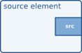
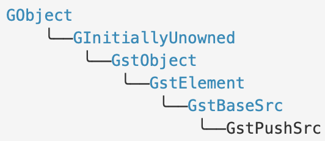
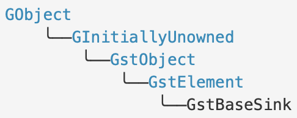
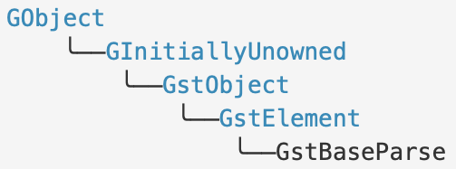
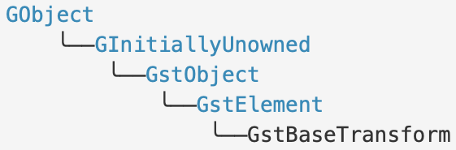
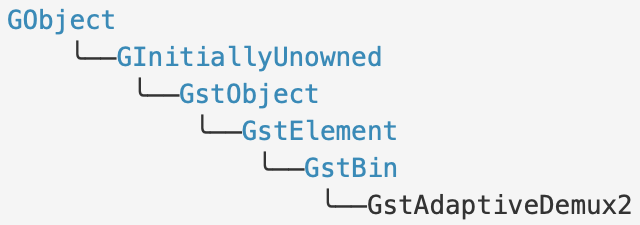
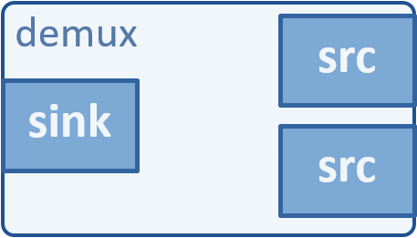
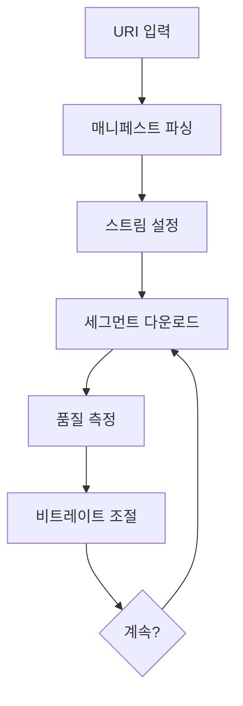

:: title ::
# GStreamer 플러그인 개발 API

:: content ::
<div class="highlight-box">
GStreamer 플러그인 개발을 위한 핵심 API와 기본 클래스들을 학습합니다.
</div>

<div class="custom-table">

| API 영역 | 핵심 구성요소 | 역할 |
|----------|---------------|------|
| **Plugin Framework** | GstPlugin, GstElementFactory | 플러그인 등록 및 관리 |
| **Base Classes** | GstElement, GstBaseSrc, GstBaseSink, ... | 기본 엘리먼트 구현 기반 |
| **Pad API** | GstPad, GstPadTemplate | 데이터 입출력 인터페이스 |
| **Caps API** | GstCaps, GstStructure | 미디어 형식 협상 및 정의 |
| **Buffer API** | GstBuffer, GstMemory | 메모리 관리 및 데이터 전송 |

</div>

---
layout: top-title
hideInToc: true
---
:: title ::
# GstPlugin

:: content ::
<div class="flex flex-wrap text-xs ns-c-tight">
<div class="w-1/4">
<figure class="text-center">
  <div class="w-full mx-auto">
    
  </div>
</figure>
</div>
</div>

<div class="ns-c-tight text-xs mt-1">
<div class="text-xs ns-c-tight flex flex-wrap">

<div class="w-1/2">

- **GStreamer 는 plugin 을 통해 확장한다.**
    - GstElement 인스턴스를 런타임에 로드.
    - 하나 이상의 기본 GStreamer GstPluginFeature 서브클래스 제공.
    - GstElementFactory가 GstPluginFeature 서브 클래스 중 하나.
</div>
<div class="w-1/2">

- **규칙**
    - 플러그인은 GstPluginDesc 타입의 구조체인 gst_plugin_desc 심볼을 익스포트.
    - 로더는 플러그인이 링크된 코어 라이브러리의 버전을 확인하고 새 GstPlugin을 생성
    - gst_plugin_desc 에 제공된 GstPluginInitFunc 함수 호출.
</div>
</div>

<div class="text-xs mt-1">

#### GstPluginDesc 구조체
<div class="custom-table-xxs">

| Member | Type | Description |
|--------|------|-------------|
| **major_version** | [gint](https://docs.gtk.org/glib/types.html#gint) | the major version number of core that plugin was compiled for |
| **minor_version** | [gint](https://docs.gtk.org/glib/types.html#gint) | the minor version number of core that plugin was compiled for |
| **name** | const [gchar](https://docs.gtk.org/glib/types.html#gchar) * | a unique name of the plugin |
| **description** | const [gchar](https://docs.gtk.org/glib/types.html#gchar) * | description of plugin |
| **plugin_init** | [GstPluginInitFunc](https://gstreamer.freedesktop.org/documentation/gstreamer/gstplugin.html#GstPluginInitFunc) | pointer to the init function of this plugin |
| **version** | const [gchar](https://docs.gtk.org/glib/types.html#gchar) * | version of the plugin |
| **license** | const [gchar](https://docs.gtk.org/glib/types.html#gchar) * | effective license of plugin |
| **source** | const [gchar](https://docs.gtk.org/glib/types.html#gchar) * | source module plugin belongs to |
| **package** | const [gchar](https://docs.gtk.org/glib/types.html#gchar) * | shipped package plugin belongs to |
| **origin** | const [gchar](https://docs.gtk.org/glib/types.html#gchar) * | URL to provider of plugin |
| **release_datetime** | const [gchar](https://docs.gtk.org/glib/types.html#gchar) * | date time string in ISO 8601 format (or rather, a subset thereof), or [NULL](https://web.mit.edu/barnowl/share/gtk-doc/html/glib/glib-Standard-Macros.html#NULL:CAPS). Allowed are the following formats: "YYYY-MM-DD" and "YYY-MM-DDTHH:MMZ" (with 'T' a separator and 'Z' indicating UTC/Zulu time). This field should be set via the GST_PACKAGE_RELEASE_DATETIME preprocessor macro. |

</div>

</div>
</div>

---
layout: top-title
hideInToc: true
---
:: title ::
# GstPlugin

:: content ::
<div class="flex flex-wrap text-xs ns-c-tight">
<div class="w-1/3">

- [Methods](https://gstreamer.freedesktop.org/documentation/gstreamer/gstplugin.html#methods)
    - [gst_plugin_add_dependency](https://gstreamer.freedesktop.org/documentation/gstreamer/gstplugin.html#gst_plugin_add_dependency)
    - [gst_plugin_add_dependency_simple](https://gstreamer.freedesktop.org/documentation/gstreamer/gstplugin.html#gst_plugin_add_dependency_simple)
    - [gst_plugin_add_status_error](https://gstreamer.freedesktop.org/documentation/gstreamer/gstplugin.html#gst_plugin_add_status_error)
    - [gst_plugin_add_status_info](https://gstreamer.freedesktop.org/documentation/gstreamer/gstplugin.html#gst_plugin_add_status_info)
    - [gst_plugin_add_status_warning](https://gstreamer.freedesktop.org/documentation/gstreamer/gstplugin.html#gst_plugin_add_status_warning)
    - [gst_plugin_get_cache_data](https://gstreamer.freedesktop.org/documentation/gstreamer/gstplugin.html#gst_plugin_get_cache_data)
    - [gst_plugin_get_description](https://gstreamer.freedesktop.org/documentation/gstreamer/gstplugin.html#gst_plugin_get_description)
    - [gst_plugin_get_filename](https://gstreamer.freedesktop.org/documentation/gstreamer/gstplugin.html#gst_plugin_get_filename)
    - [gst_plugin_get_license](https://gstreamer.freedesktop.org/documentation/gstreamer/gstplugin.html#gst_plugin_get_license)
    - [gst_plugin_get_name](https://gstreamer.freedesktop.org/documentation/gstreamer/gstplugin.html#gst_plugin_get_name)
    - [gst_plugin_get_origin](https://gstreamer.freedesktop.org/documentation/gstreamer/gstplugin.html#gst_plugin_get_origin)
    - [gst_plugin_get_package](https://gstreamer.freedesktop.org/documentation/gstreamer/gstplugin.html#gst_plugin_get_package)
    - [gst_plugin_get_release_date_string](https://gstreamer.freedesktop.org/documentation/gstreamer/gstplugin.html#gst_plugin_get_release_date_string)
    - [gst_plugin_get_source](https://gstreamer.freedesktop.org/documentation/gstreamer/gstplugin.html#gst_plugin_get_source)
    - [gst_plugin_get_status_errors](https://gstreamer.freedesktop.org/documentation/gstreamer/gstplugin.html#gst_plugin_get_status_errors)
    - [gst_plugin_get_status_infos](https://gstreamer.freedesktop.org/documentation/gstreamer/gstplugin.html#gst_plugin_get_status_infos)
    - [gst_plugin_get_status_warnings](https://gstreamer.freedesktop.org/documentation/gstreamer/gstplugin.html#gst_plugin_get_status_warnings)
    - [gst_plugin_get_version](https://gstreamer.freedesktop.org/documentation/gstreamer/gstplugin.html#gst_plugin_get_version)
    - [gst_plugin_is_loaded](https://gstreamer.freedesktop.org/documentation/gstreamer/gstplugin.html#gst_plugin_is_loaded)
    - [gst_plugin_load](https://gstreamer.freedesktop.org/documentation/gstreamer/gstplugin.html#gst_plugin_load)
    - [gst_plugin_set_cache_data](https://gstreamer.freedesktop.org/documentation/gstreamer/gstplugin.html#gst_plugin_set_cache_data)
</div>
<div class="w-1/3">

- [Functions](https://gstreamer.freedesktop.org/documentation/gstreamer/gstplugin.html#functions)
    - [gst_plugin_list_free](https://gstreamer.freedesktop.org/documentation/gstreamer/gstplugin.html#gst_plugin_list_free)
    - [gst_plugin_load_by_name](https://gstreamer.freedesktop.org/documentation/gstreamer/gstplugin.html#gst_plugin_load_by_name)
    - [gst_plugin_load_file](https://gstreamer.freedesktop.org/documentation/gstreamer/gstplugin.html#gst_plugin_load_file)
    - [gst_plugin_register_static](https://gstreamer.freedesktop.org/documentation/gstreamer/gstplugin.html#gst_plugin_register_static)
    - [gst_plugin_register_static_full](https://gstreamer.freedesktop.org/documentation/gstreamer/gstplugin.html#gst_plugin_register_static_full)
</div>
</div>

---
layout: top-title
hideInToc: true
---
:: title ::
# Base Classes

:: content ::
<div class="text-sm">

## Core
<div class="custom-table-small">

| Base Class | 상속 관계 | 용도 | 주요 가상 함수 |
|------------|-----------|------|----------------|
| **GstBaseSrc** | GstElement | Source 엘리먼트 기본 클래스 | `create()`, `start()`, `stop()` |
| **GstPushSrc** | GstBaseSrc | Push 모드 소스 (중간 클래스) | `create()`, `fill()` |
| **GstBaseSink** | GstElement | Sink 엘리먼트 기본 클래스 | `render()`, `preroll()` |
| **GstBaseTransform** | GstElement | Transform 엘리먼트 기본 클래스 | `transform()`, `transform_ip()` |
| **GstBaseParse** | GstElement | 파서 엘리먼트 기본 클래스 | `handle_frame()`, `detect()` |
| **GstAggregator** | GstElement | 다중 입력 집계 기본 클래스 | `aggregate()`, `create_new_pad()` |
</div>
</div>

---
layout: top-title
hideInToc: true
---
:: title ::
# Base Classes

:: content ::
<div class="text-sm">

## Audio
<div class="custom-table-small">

| Base Class | 상속 관계 | 용도 | 주요 가상 함수 |
|------------|-----------|------|----------------|
| **GstAudioBaseSrc** | GstPushSrc | 오디오 소스 기본 클래스 | `create_ringbuffer()` |
| **GstAudioSrc** | GstAudioBaseSrc | 오디오 캡처 장치 (구체적 구현) | `open()`, `close()`, `read()`, `prepare()` |
| **GstAudioBaseSink** | GstBaseSink | 오디오 싱크 기본 클래스 | `create_ringbuffer()` |
| **GstAudioSink** | GstAudioBaseSink | 오디오 재생 장치 (구체적 구현) | `open()`, `close()`, `write()`, `prepare()` |
| **GstAudioFilter** | GstBaseTransform | 오디오 필터 기본 클래스 | `setup()` |
| **GstAudioDecoder** | GstElement | 오디오 디코더 기본 클래스 | `set_format()`, `parse()`, `handle_frame()` |
| **GstAudioEncoder** | GstElement | 오디오 인코더 기본 클래스 | `set_format()`, `handle_frame()` |

</div>
</div>

---
layout: top-title
hideInToc: true
---
:: title ::
# Base Classes

:: content ::
<div class="text-sm">

## Video
<div class="custom-table-small">

| Base Class | 상속 관계 | 용도 | 주요 가상 함수 |
|------------|-----------|------|----------------|
| **GstVideoDecoder** | GstElement | 비디오 디코더 기본 클래스 | `set_format()`, `handle_frame()`, `parse()` |
| **GstVideoEncoder** | GstElement | 비디오 인코더 기본 클래스 | `set_format()`, `handle_frame()` |
| **GstVideoFilter** | GstBaseTransform | 비디오 필터 기본 클래스 | `set_info()`, `transform_frame()` |
| **GstVideoSink** | GstBaseSink | 비디오 싱크 기본 클래스 | `show_frame()` |
| **GstVideoAggregator** | GstAggregator | 비디오 집계 (믹서/컴포지터) | `aggregate_frames()`, `update_caps()` |

</div>
</div>

---
layout: top-title
hideInToc: true
---
:: title ::
# Base Classes

:: content ::
<div class="text-sm">

## Networking & RTP
<div class="custom-table-small">

| Base Class | 상속 관계 | 용도 | 주요 가상 함수 |
|------------|-----------|------|----------------|
| **GstRTPBasePayload** | GstElement | RTP 페이로드 기본 클래스 | `set_caps()`, `handle_buffer()` |
| **GstRTPBaseDepayload** | GstElement | RTP 디페이로드 기본 클래스 | `set_caps()`, `process_rtp_packet()` |

</div>
</div>

<div class="text-sm mt-10">

## Adaptive Streaming
<div class="custom-table-small">

| Base Class | 상속 관계 | 용도 | 주요 가상 함수 |
|------------|-----------|------|----------------|
| **GstAdaptiveDemux** | GstBin | 어댑티브 스트리밍 디먹서 | `process_manifest()`, `update_manifest()`,<br> `stream_select_bitrate()` |
| **GstAdaptiveDemux2** | GstBin | 차세대 어댑티브 디먹서 | `process_manifest()`, `update_manifest()`, `finish_fragment()` |
</div>
</div>

---
layout: top-title
hideInToc: true
---
:: title ::
# GstBaseSrc

:: content ::
<div class="flex flex-wrap text-xs ns-c-tight">
<div class="w-1/4">
<figure class="text-center">
  <div class="w-full mx-auto">
    
  </div>
</figure>
</div>
<div class="w-1/4">
<figure class="text-center">
  <div class="w-full mx-auto">
    
  </div>
</figure>
</div>
</div>

<div class="text-small mt-10">

**source 엘리먼트를 위한 범용 기본 클래스**로, 다양한 타입의 소스를 지원합니다.
</div>

<div class="custom-table-xs">

| 지원하는 소스 타입 | 설명 | 예시 |
|-------------------|------|------|
| **Random Access** | 임의 위치 접근 가능 | filesrc, memorysrc |
| **Seekable** | 탐색 가능한 소스 | HTTP range requests |
| **Live** | 실시간 데이터 생성 | 카메라, 마이크, 네트워크 스트림 |

</div>

<div class="text-small mt-10">

GstBaseSrc는 Push/Pull 두 가지 동작 모드를 지원하며, 각 모드는 서로 다른 조건과 특성을 가집니다.
</div>

<div class="custom-table-xs">


| 특징 | 기본값 | 설정 방법 |
|------|--------|-----------|
| **기본 포맷** | GST_FORMAT_BYTES | `gst_base_src_set_format()` |
| **스케줄링** | Push 모드 (항상 지원) | Pull 모드 (조건부) |
| **패드 구성** | 단일 소스 패드 "src" | 정적 패드 템플릿 |

</div>

---
layout: top-title
hideInToc: true
---
:: title ::
# GstBaseSrc : 동작 모드

:: content ::

<div class="custom-table-xs">

| 동작 모드 | 지원 여부 | 데이터 제어 흐름 | 주요 특징 |
|-----------|-----------|-------------|-----------|
| **Push 모드 (기본)** | 항상 지원 | Source → Downstream | 소스가 능동적으로 데이터 전송 |
| **Pull 모드** | 조건부 지원 | Source ← Downstream | 다운스트림이 필요시 데이터 요청 |
</div>

<div class="flex flex-wrap ns-c-tight text-xs code-dense mt-10">

<div class="w-1/2">

**Pull Mode는 모든 조건을 만족해야 함:**
1. 포맷이 `GST_FORMAT_BYTES` (기본값)
2. `is_seekable()` 함수가 TRUE 반환

**Pull 모드 지원 시 자동 혜택**
- **자동 Seek 지원**: Pull 모드 = Seek 가능
- **효율적인 랜덤 액세스**

**Push 모드에서 GST_FORMAT_BYTES 가 아닌 경우 Seek 지원 조건**
1. `is_seekable()` = TRUE
2. `query()`: 모든 seek 포맷을 내부 포맷으로 변환
3. `do_seek()`: 실제 seek 수행 및 TRUE 반환

</div>

<div class="w-1/2">

```c
// Pull 모드 지원 구현 예시
static gboolean
my_src_is_seekable (GstBaseSrc *src)
{
  MySource *mysrc = MY_SOURCE (src);
  // 파일이나 메모리 기반 소스
  return (mysrc->file != NULL || mysrc->data != NULL);
}
// 클래스 초기화에서 포맷 설정
static void
my_source_init (MySource *src)
{
  // 기본값이므로 생략 가능
  gst_base_src_set_format (GST_BASE_SRC (src), 
                           GST_FORMAT_BYTES);
}
// Push 모드 seek 구현 (추가 작업)
static gboolean
my_src_do_seek (GstBaseSrc *src, GstSegment *segment)
{
  // TIME → BYTES 변환 후 실제 seek
  return perform_actual_seek(src, segment);
}
```

</div>
</div>

---
layout: top-title
hideInToc: true
---
:: title ::
# GstBaseSrc : Live Source 및 Controlled Shutdown

:: content ::

<div class="flex flex-wrap ns-c-tight text-xs code-dense">
<div class="w-1/2 pr-4">

<div>

#### Live Source 특징
- **PAUSED 상태에서 데이터 폐기**: 캡처 장치 특성
- **고정 속도 데이터 생성**: 클록 제공
- **PLAYING 상태에서만 데이터 생성**
- **GST_STATE_CHANGE_NO_PREROLL** 반환
</div>
 

<div class="mt-4">

#### Live Source 활성화
```c
// Live 모드 설정
gst_base_src_set_live (GST_BASE_SRC (src), TRUE);

// 상태 변경 대기 (오디오 소스 등)
gst_base_src_wait_playing (src);
```
</div>

<div class="mt-4">

#### Pseudo-Live Source
- `get_times()` 함수 구현
- 0부터 시작하는 타임스탬프 반환
- Base class가 running_time으로 자동 변환
</div>
</div>

<div class="w-1/2 pl-4">

#### 제어된 종료 (Controlled Shutdown)
```c
// 1. 애플리케이션에서 EOS 이벤트 전송
gst_element_send_event (source_element, 
                       gst_event_new_eos ());

// 2. 파이프라인 버스에서 EOS 메시지 대기
GstMessage *msg = gst_bus_timed_pop_filtered (
  bus, GST_CLOCK_TIME_NONE, GST_MESSAGE_EOS);

// 3. EOS 수신 후 안전한 파이프라인 종료
gst_element_set_state (pipeline, GST_STATE_NULL);
```

#### 패드 템플릿 등록
```c
static void
my_element_class_init (GstMyElementClass *klass)
{
  GstElementClass *element_class = GST_ELEMENT_CLASS (klass);
  
  // "src" 이름의 소스 패드 템플릿
  gst_element_class_add_static_pad_template (
    element_class, &src_template);
  
  gst_element_class_set_static_metadata (element_class,
    "Source name", "Source", 
    "My Source element", "Author <email>");
}
```
</div>
</div>

---
layout: top-title
hideInToc: true
---
:: title ::
# GstBaseSrc

:: content ::
<div class="flex flex-wrap text-xs ns-c-tight">
<div class="w-1/3">

- [Methods](https://gstreamer.freedesktop.org/documentation/base/gstbasesrc.html#methods)
    - [gst_base_src_get_allocator](https://gstreamer.freedesktop.org/documentation/base/gstbasesrc.html#gst_base_src_get_allocator)
    - [gst_base_src_get_blocksize](https://gstreamer.freedesktop.org/documentation/base/gstbasesrc.html#gst_base_src_get_blocksize)
    - [gst_base_src_get_buffer_pool](https://gstreamer.freedesktop.org/documentation/base/gstbasesrc.html#gst_base_src_get_buffer_pool)
    - [gst_base_src_get_do_timestamp](https://gstreamer.freedesktop.org/documentation/base/gstbasesrc.html#gst_base_src_get_do_timestamp)
    - [gst_base_src_is_async](https://gstreamer.freedesktop.org/documentation/base/gstbasesrc.html#gst_base_src_is_async)
    - [gst_base_src_is_live](https://gstreamer.freedesktop.org/documentation/base/gstbasesrc.html#gst_base_src_is_live)
    - [gst_base_src_negotiate](https://gstreamer.freedesktop.org/documentation/base/gstbasesrc.html#gst_base_src_negotiate)
    - [gst_base_src_new_segment](https://gstreamer.freedesktop.org/documentation/base/gstbasesrc.html#gst_base_src_new_segment)
    - [gst_base_src_push_segment](https://gstreamer.freedesktop.org/documentation/base/gstbasesrc.html#gst_base_src_push_segment)
    - [gst_base_src_query_latency](https://gstreamer.freedesktop.org/documentation/base/gstbasesrc.html#gst_base_src_query_latency)
    - [gst_base_src_set_async](https://gstreamer.freedesktop.org/documentation/base/gstbasesrc.html#gst_base_src_set_async)
    - [gst_base_src_set_automatic_eos](https://gstreamer.freedesktop.org/documentation/base/gstbasesrc.html#gst_base_src_set_automatic_eos)
    - [gst_base_src_set_blocksize](https://gstreamer.freedesktop.org/documentation/base/gstbasesrc.html#gst_base_src_set_blocksize)
    - [gst_base_src_set_caps](https://gstreamer.freedesktop.org/documentation/base/gstbasesrc.html#gst_base_src_set_caps)
    - [gst_base_src_set_do_timestamp](https://gstreamer.freedesktop.org/documentation/base/gstbasesrc.html#gst_base_src_set_do_timestamp)
    - [gst_base_src_set_dynamic_size](https://gstreamer.freedesktop.org/documentation/base/gstbasesrc.html#gst_base_src_set_dynamic_size)
    - [gst_base_src_set_format](https://gstreamer.freedesktop.org/documentation/base/gstbasesrc.html#gst_base_src_set_format)
    - [gst_base_src_set_live](https://gstreamer.freedesktop.org/documentation/base/gstbasesrc.html#gst_base_src_set_live)
    - [gst_base_src_start_complete](https://gstreamer.freedesktop.org/documentation/base/gstbasesrc.html#gst_base_src_start_complete)

</div>
<div class="w-1/3">

- [Methods](https://gstreamer.freedesktop.org/documentation/base/gstbasesrc.html#methods)
    - [gst_base_src_start_wait](https://gstreamer.freedesktop.org/documentation/base/gstbasesrc.html#gst_base_src_start_wait)
    - [gst_base_src_submit_buffer_list](https://gstreamer.freedesktop.org/documentation/base/gstbasesrc.html#gst_base_src_submit_buffer_list)
    - [gst_base_src_wait_playing](https://gstreamer.freedesktop.org/documentation/base/gstbasesrc.html#gst_base_src_wait_playing)


<div class="mt-10">

- [Properties](https://gstreamer.freedesktop.org/documentation/base/gstbasesrc.html#properties)
    - [automatic-eos](https://gstreamer.freedesktop.org/documentation/base/gstbasesrc.html#GstBaseSrc:automatic-eos)
    - [blocksize](https://gstreamer.freedesktop.org/documentation/base/gstbasesrc.html#GstBaseSrc:blocksize)
    - [do-timestamp](https://gstreamer.freedesktop.org/documentation/base/gstbasesrc.html#GstBaseSrc:do-timestamp)
    - [num-buffers](https://gstreamer.freedesktop.org/documentation/base/gstbasesrc.html#GstBaseSrc:num-buffers)
    - [typefind](https://gstreamer.freedesktop.org/documentation/base/gstbasesrc.html#GstBaseSrc:typefind)
</div>

</div>
<div class="w-1/3">

- [Virtual Methods](https://gstreamer.freedesktop.org/documentation/base/gstbasesrc.html#virtual-methods)
    - [alloc](https://gstreamer.freedesktop.org/documentation/base/gstbasesrc.html#GstBaseSrcClass::alloc)
    - [create](https://gstreamer.freedesktop.org/documentation/base/gstbasesrc.html#GstBaseSrcClass::create)
    - [decide_allocation](https://gstreamer.freedesktop.org/documentation/base/gstbasesrc.html#GstBaseSrcClass::decide_allocation)
    - [do_seek](https://gstreamer.freedesktop.org/documentation/base/gstbasesrc.html#GstBaseSrcClass::do_seek)
    - [event](https://gstreamer.freedesktop.org/documentation/base/gstbasesrc.html#GstBaseSrcClass::event)
    - [fill](https://gstreamer.freedesktop.org/documentation/base/gstbasesrc.html#GstBaseSrcClass::fill)
    - [fixate](https://gstreamer.freedesktop.org/documentation/base/gstbasesrc.html#GstBaseSrcClass::fixate)
    - [get_caps](https://gstreamer.freedesktop.org/documentation/base/gstbasesrc.html#GstBaseSrcClass::get_caps)
    - [get_size](https://gstreamer.freedesktop.org/documentation/base/gstbasesrc.html#GstBaseSrcClass::get_size)
    - [get_times](https://gstreamer.freedesktop.org/documentation/base/gstbasesrc.html#GstBaseSrcClass::get_times)
    - [is_seekable](https://gstreamer.freedesktop.org/documentation/base/gstbasesrc.html#GstBaseSrcClass::is_seekable)
    - [negotiate](https://gstreamer.freedesktop.org/documentation/base/gstbasesrc.html#GstBaseSrcClass::negotiate)
    - [prepare_seek_segment](https://gstreamer.freedesktop.org/documentation/base/gstbasesrc.html#GstBaseSrcClass::prepare_seek_segment)
    - [query](https://gstreamer.freedesktop.org/documentation/base/gstbasesrc.html#GstBaseSrcClass::query)
    - [set_caps](https://gstreamer.freedesktop.org/documentation/base/gstbasesrc.html#GstBaseSrcClass::set_caps)
    - [start](https://gstreamer.freedesktop.org/documentation/base/gstbasesrc.html#GstBaseSrcClass::start)
    - [stop](https://gstreamer.freedesktop.org/documentation/base/gstbasesrc.html#GstBaseSrcClass::stop)
    - [unlock](https://gstreamer.freedesktop.org/documentation/base/gstbasesrc.html#GstBaseSrcClass::unlock)
    - [unlock_stop](https://gstreamer.freedesktop.org/documentation/base/gstbasesrc.html#GstBaseSrcClass::unlock_stop)
</div>
</div>

---
layout: top-title
hideInToc: true
---
:: title ::
# GstPushSrc

:: content ::
<div class="flex flex-wrap">
<div class="w-1/4">
<figure class="text-center">
  <div class="w-full mx-auto">
    
  </div>
</figure>
</div>
<div class="w-1/4">
<figure class="text-center">
  <div class="w-full mx-auto">
    
  </div>
</figure>
</div>
<div class="w-2/4">
GstPushSrc는 랜덤 액세스가 불가능하거나 매우 느린 소스를 위한 특화된 Base Class입니다.
</div>
</div>

<div class="flex flex-wrap ns-c-tight text-xs code-dense mt-10">
<div class="w-1/2 pr-4">
<div class="custom-table-xs">

| 특징 | GstBaseSrc | GstPushSrc |
|------|------------|------------|
| **랜덤 액세스** | 지원 (조건부) | 지원하지 않음 또는 매우 느림 |
| **기본 포맷** | GST_FORMAT_BYTES | 주로 다른 포맷 (TIME, DEFAULT 등) |
| **스케줄링** | Push/Pull 모드 | 주로 Push 모드 |
| **데이터 크기** | 가변적 | 고정 크기 버퍼 선호 |

</div>

<div class="custom-table-xs mt-6">

| 자동 처리 기능 | 설명 |
|----------------|------|
| **Seeking** | Base class에서 자동 처리 |
| **Flushing** | 상태 변경 시 자동 flush |
| **Scheduling** | SCHEDULING 쿼리 기반 자동 모드 선택 |
| **Sync** | 동기화 로직 자동 처리 |

</div>
</div>

<div class="w-1/2 pl-4">

#### 적용 사례
- **실시간 소스**: 카메라, 마이크, 네트워크 스트림
- **순차 접근**: 테이프, 시리얼 포트, 파이프
- **고정 블록**: 오디오 캡처 (고정 샘플 수), 비디오 프레임

#### 핵심 구현 요구사항
- **`create()` 메서드**: 고정 크기 버퍼 생성
- **SCHEDULING 쿼리**: getrange 모드 지원 여부 결정 (선택적)
- **포맷 설정**: 적절한 GstFormat 선택
</div>
</div>

---
layout: top-title
hideInToc: true
---
:: title ::
# GstBaseSink

:: content ::
<div class="flex flex-wrap">
<div class="w-1/4">
<figure class="text-center">
  <div class="w-full mx-auto">
    
  </div>
</figure>
</div>
<div class="w-1/4">
<figure class="text-center">
  <div class="w-full mx-auto">
    
  </div>
</figure>
</div>
<div class="w-2/4">
GstBaseSink는 Sink 엘리먼트를 위한 기본 클래스로, 복잡한 세부사항들을 자동으로 처리합니다.
</div>
</div>

<div class="text-small mt-10">
<div class="custom-table-xs">

| 자동 처리 기능 | 설명 | 개발자 혜택 |
|----------------|------|-------------|
| **Preroll** | 첫 번째 버퍼 도착 시까지 ASYNC 상태 유지 | 상태 관리 자동화 |
| **Clock Sync** | `get_times()` 기반 자동 동기화 | 타이밍 처리 불필요 |
| **Push/Pull Mode** | 활성화 모드 자동 감지 및 처리 | 모드별 구현 불필요 |
| **State Changes** | 상태 전환 로직 자동 처리 | 복잡한 상태 관리 생략 |
| **Queries** | 기본 쿼리들 자동 응답 | 표준 쿼리 구현 생략 |

</div>

<div class="custom-table-xs mt-6">

| 기본 구성 | 요구사항 | 구현 방법 |
|-----------|----------|-----------|
| **패드 구성** | 단일 sink 패드 "sink" | 정적 패드 템플릿 등록 |
| **필수 구현** | `render()` 메서드 | 실제 출력 처리 |
| **선택적 구현** | `preroll()`, `get_times()` | 고급 기능 |

</div>
</div>

---
layout: top-title
hideInToc: true
---
:: title ::
# GstBaseSink : 동기화 및 렌더링

:: content ::
<div class="flex flex-wrap ns-c-tight text-xs code-dense">
<div class="w-1/2 pr-4">

<div>

#### 동기화 메커니즘
PLAYING 상태에서 자동 동기화:
1. `get_times()` 함수에서 시간 정보 획득
2. 클록과 비교하여 적절한 시점에 렌더링
3. GST_CLOCK_TIME_NONE 반환 시 동기화 비활성
</div>

<div class="mt-4">

#### 동기화 비활성화
```c
// sync 프로퍼티로 완전 비활성화
g_object_set(sink, "sync", FALSE, NULL);
```
</div>

<div class="mt-4">

#### 블록킹 렌더링 지원
```c
// 오디오 sink 등에서 블록킹 대기
static GstFlowReturn
my_audio_sink_render (GstBaseSink *sink, GstBuffer *buffer)
{
  // 클록 대기가 필요한 경우
  gst_base_sink_wait_preroll (sink);
  
  // 실제 오디오 출력
  return write_audio_data(buffer);
}
```
</div>
</div>

<div class="w-1/2 pl-4">

<div>

#### Preroll 처리
PAUSED 상태에서:
1. 첫 번째 버퍼 도착까지 GST_STATE_CHANGE_ASYNC 반환
2. `preroll()` 가상 함수 호출
3. 상태 변경을 다음 대기 상태로 커밋

</div>

<div class="mt-4">

#### EOS 처리
PLAYING 상태:
- 마지막 `get_times()` 호출의 stop time까지 대기
- 클록 시간 도달 후 EOS 메시지 게시

PAUSED 상태:
- preroll 완료, 이벤트 큐잉
- PLAYING 전환 시 EOS 메시지 게시

</div>
</div>
</div>

---
layout: top-title
hideInToc: true
---
:: title ::
# GstBaseSink : 고급 기능 및 프로퍼티

:: content ::

<div class="flex flex-wrap ns-c-tight text-xs code-dense">
<div class="w-1/2 pr-4">

#### max-lateness 프로퍼티
지연된 버퍼 처리:
- 프레젠테이션 시간이 현재 클록 시간보다 늦은 버퍼
- max-lateness 시간보다 더 늦으면 버퍼 드롭
- `render()` 메서드 호출 없이 폐기

```c
// 최대 지연 시간 설정 (100ms)
gst_base_sink_set_max_lateness (sink, 100 * GST_MSECOND);

// 기능 비활성화 (-1 설정, 기본값)
gst_base_sink_set_max_lateness (sink, -1);
```

<div class="mt-4">

#### QoS (Quality of Service)
성능 통계 및 피드백:
- 실시간 성능 통계 수집
- 각 버퍼에 대한 QoS 이벤트를 upstream에 전송
- upstream 엘리먼트의 처리율 조절 유도

```c
// QoS 활성화
g_object_set(sink, "qos", TRUE, NULL);
```

</div>
</div>

<div class="w-1/2 pl-4">

#### 특수 프로퍼티
- **async**: ASYNC 상태 변경 비활성화 (비동기 스트림용)
- **sync**: 동기화 완전 비활성화
- **qos**: QoS 기능 활성화
- **max-lateness**: 지연 버퍼 허용 시간

<div class="mt-4">

#### 세그먼트 처리
- GST_EVENT_SEGMENT 이벤트 자동 처리
- 세그먼트 밖 버퍼 자동 드롭
- 부분 겹침 버퍼는 렌더링 (서브클래스에서 클리핑)
</div>
</div>
</div>

---
layout: top-title
hideInToc: true
---
:: title ::
# GstBaseSink : 구현 가이드라인

:: content ::

<div class="custom-table-small">

| 구현 레벨 | 필수 메서드 | 선택적 메서드 | 적용 사례 |
|-----------|-------------|---------------|-----------|
| **최소 구현** | `render()` | - | 간단한 파일 출력 |
| **기본 구현** | `render()`, `set_caps()` | `start()`, `stop()` | 일반적인 미디어 출력 |
| **고급 구현** | 위 + `get_times()` | `preroll()`, `event()` | 정밀한 동기화 필요 |
| **특수 구현** | 위 + `unlock()` | `query()` | 파일 sink, 특수 요구사항 |

</div>

<div class="flex flex-wrap ns-c-tight text-sm code-dense mt-10">
<div class="w-1/2 pr-4">

#### 구현 순서 권장사항
1. **패드 템플릿 등록**: 클래스 초기화에서
2. **render() 구현**: 핵심 출력 로직
3. **set_caps() 구현**: 미디어 타입 설정
4. **start()/stop() 추가**: 리소스 관리
5. **고급 기능 추가**: 동기화, QoS, 특수 이벤트
</div>

<div class="w-1/2 pl-4">

#### 주의사항
- **블록킹 작업**: `unlock()` 메서드로 중단 가능하게 구현
- **동기화**: 특별한 요구가 없으면 기본 동기화 사용
- **에러 처리**: 적절한 GstFlowReturn 값 반환
- **스레드 안전성**: 멀티스레드 환경 고려
</div>

</div>

---
layout: top-title
hideInToc: true
---
:: title ::
# GstBaseSink

:: content ::
<div class="flex flex-wrap text-xs ns-c-tight">
<div class="w-1/3">

- [Methods](https://gstreamer.freedesktop.org/documentation/base/gstbasesink.html#methods)
    - [gst_base_sink_do_preroll](https://gstreamer.freedesktop.org/documentation/base/gstbasesink.html#gst_base_sink_do_preroll)
    - [gst_base_sink_get_blocksize](https://gstreamer.freedesktop.org/documentation/base/gstbasesink.html#gst_base_sink_get_blocksize)
    - [gst_base_sink_get_drop_out_of_segment](https://gstreamer.freedesktop.org/documentation/base/gstbasesink.html#gst_base_sink_get_drop_out_of_segment)
    - [gst_base_sink_get_last_sample](https://gstreamer.freedesktop.org/documentation/base/gstbasesink.html#gst_base_sink_get_last_sample)
    - [gst_base_sink_get_latency](https://gstreamer.freedesktop.org/documentation/base/gstbasesink.html#gst_base_sink_get_latency)
    - [gst_base_sink_get_max_bitrate](https://gstreamer.freedesktop.org/documentation/base/gstbasesink.html#gst_base_sink_get_max_bitrate)
    - [gst_base_sink_get_max_lateness](https://gstreamer.freedesktop.org/documentation/base/gstbasesink.html#gst_base_sink_get_max_lateness)
    - [gst_base_sink_get_processing_deadline](https://gstreamer.freedesktop.org/documentation/base/gstbasesink.html#gst_base_sink_get_processing_deadline)
    - [gst_base_sink_get_render_delay](https://gstreamer.freedesktop.org/documentation/base/gstbasesink.html#gst_base_sink_get_render_delay)
    - [gst_base_sink_get_stats](https://gstreamer.freedesktop.org/documentation/base/gstbasesink.html#gst_base_sink_get_stats)
    - [gst_base_sink_get_sync](https://gstreamer.freedesktop.org/documentation/base/gstbasesink.html#gst_base_sink_get_sync)
    - [gst_base_sink_get_throttle_time](https://gstreamer.freedesktop.org/documentation/base/gstbasesink.html#gst_base_sink_get_throttle_time)
    - [gst_base_sink_get_ts_offset](https://gstreamer.freedesktop.org/documentation/base/gstbasesink.html#gst_base_sink_get_ts_offset)
    - [gst_base_sink_is_async_enabled](https://gstreamer.freedesktop.org/documentation/base/gstbasesink.html#gst_base_sink_is_async_enabled)
    - [gst_base_sink_is_last_sample_enabled](https://gstreamer.freedesktop.org/documentation/base/gstbasesink.html#gst_base_sink_is_last_sample_enabled)
    - [gst_base_sink_is_qos_enabled](https://gstreamer.freedesktop.org/documentation/base/gstbasesink.html#gst_base_sink_is_qos_enabled)
    - [gst_base_sink_query_latency](https://gstreamer.freedesktop.org/documentation/base/gstbasesink.html#gst_base_sink_query_latency)
    - [gst_base_sink_set_async_enabled](https://gstreamer.freedesktop.org/documentation/base/gstbasesink.html#gst_base_sink_set_async_enabled)
    - [gst_base_sink_set_blocksize](https://gstreamer.freedesktop.org/documentation/base/gstbasesink.html#gst_base_sink_set_blocksize)
    - [gst_base_sink_set_drop_out_of_segment](https://gstreamer.freedesktop.org/documentation/base/gstbasesink.html#gst_base_sink_set_drop_out_of_segment)
    - [gst_base_sink_set_last_sample_enabled](https://gstreamer.freedesktop.org/documentation/base/gstbasesink.html#gst_base_sink_set_last_sample_enabled)
</div>
<div class="w-1/3">

- [Methods](https://gstreamer.freedesktop.org/documentation/base/gstbasesink.html#methods)
    - [gst_base_sink_set_max_bitrate](https://gstreamer.freedesktop.org/documentation/base/gstbasesink.html#gst_base_sink_set_max_bitrate)
    - [gst_base_sink_set_max_lateness](https://gstreamer.freedesktop.org/documentation/base/gstbasesink.html#gst_base_sink_set_max_lateness)
    - [gst_base_sink_set_processing_deadline](https://gstreamer.freedesktop.org/documentation/base/gstbasesink.html#gst_base_sink_set_processing_deadline)
    - [gst_base_sink_set_qos_enabled](https://gstreamer.freedesktop.org/documentation/base/gstbasesink.html#gst_base_sink_set_qos_enabled)
    - [gst_base_sink_set_render_delay](https://gstreamer.freedesktop.org/documentation/base/gstbasesink.html#gst_base_sink_set_render_delay)
    - [gst_base_sink_set_sync](https://gstreamer.freedesktop.org/documentation/base/gstbasesink.html#gst_base_sink_set_sync)
    - [gst_base_sink_set_throttle_time](https://gstreamer.freedesktop.org/documentation/base/gstbasesink.html#gst_base_sink_set_throttle_time)
    - [gst_base_sink_set_ts_offset](https://gstreamer.freedesktop.org/documentation/base/gstbasesink.html#gst_base_sink_set_ts_offset)
    - [gst_base_sink_wait](https://gstreamer.freedesktop.org/documentation/base/gstbasesink.html#gst_base_sink_wait)
    - [gst_base_sink_wait_clock](https://gstreamer.freedesktop.org/documentation/base/gstbasesink.html#gst_base_sink_wait_clock)
    - [gst_base_sink_wait_preroll](https://gstreamer.freedesktop.org/documentation/base/gstbasesink.html#gst_base_sink_wait_preroll)

<div class="mt-2">

- [Properties](https://gstreamer.freedesktop.org/documentation/base/gstbasesink.html#properties)
    - [async](https://gstreamer.freedesktop.org/documentation/base/gstbasesink.html#GstBaseSink:async)
    - [blocksize](https://gstreamer.freedesktop.org/documentation/base/gstbasesink.html#GstBaseSink:blocksize)
    - [enable-last-sample](https://gstreamer.freedesktop.org/documentation/base/gstbasesink.html#GstBaseSink:enable-last-sample)
    - [last-sample](https://gstreamer.freedesktop.org/documentation/base/gstbasesink.html#GstBaseSink:last-sample)
    - [max-bitrate](https://gstreamer.freedesktop.org/documentation/base/gstbasesink.html#GstBaseSink:max-bitrate)
    - [max-lateness](https://gstreamer.freedesktop.org/documentation/base/gstbasesink.html#GstBaseSink:max-lateness)
    - [processing-deadline](https://gstreamer.freedesktop.org/documentation/base/gstbasesink.html#GstBaseSink:processing-deadline)
    - [qos](https://gstreamer.freedesktop.org/documentation/base/gstbasesink.html#GstBaseSink:qos)
    - [render-delay](https://gstreamer.freedesktop.org/documentation/base/gstbasesink.html#GstBaseSink:render-delay)
</div>

</div>
<div class="w-1/3">

- [Properties](https://gstreamer.freedesktop.org/documentation/base/gstbasesink.html#properties)
    - [stats](https://gstreamer.freedesktop.org/documentation/base/gstbasesink.html#GstBaseSink:stats)
    - [sync](https://gstreamer.freedesktop.org/documentation/base/gstbasesink.html#GstBaseSink:sync)
    - [throttle-time](https://gstreamer.freedesktop.org/documentation/base/gstbasesink.html#GstBaseSink:throttle-time)
    - [ts-offset](https://gstreamer.freedesktop.org/documentation/base/gstbasesink.html#GstBaseSink:ts-offset)
<div class="mt-2">

- [Virtual Methods](https://gstreamer.freedesktop.org/documentation/base/gstbasesink.html#virtual-methods)
    - [activate_pull](https://gstreamer.freedesktop.org/documentation/base/gstbasesink.html#GstBaseSinkClass::activate_pull)
    - [event](https://gstreamer.freedesktop.org/documentation/base/gstbasesink.html#GstBaseSinkClass::event)
    - [fixate](https://gstreamer.freedesktop.org/documentation/base/gstbasesink.html#GstBaseSinkClass::fixate)
    - [get_caps](https://gstreamer.freedesktop.org/documentation/base/gstbasesink.html#GstBaseSinkClass::get_caps)
    - [get_times](https://gstreamer.freedesktop.org/documentation/base/gstbasesink.html#GstBaseSinkClass::get_times)
    - [prepare](https://gstreamer.freedesktop.org/documentation/base/gstbasesink.html#GstBaseSinkClass::prepare)
    - [prepare_list](https://gstreamer.freedesktop.org/documentation/base/gstbasesink.html#GstBaseSinkClass::prepare_list)
    - [preroll](https://gstreamer.freedesktop.org/documentation/base/gstbasesink.html#GstBaseSinkClass::preroll)
    - [propose_allocation](https://gstreamer.freedesktop.org/documentation/base/gstbasesink.html#GstBaseSinkClass::propose_allocation)
    - [query](https://gstreamer.freedesktop.org/documentation/base/gstbasesink.html#GstBaseSinkClass::query)
    - [render](https://gstreamer.freedesktop.org/documentation/base/gstbasesink.html#GstBaseSinkClass::render)
    - [render_list](https://gstreamer.freedesktop.org/documentation/base/gstbasesink.html#GstBaseSinkClass::render_list)
    - [set_caps](https://gstreamer.freedesktop.org/documentation/base/gstbasesink.html#GstBaseSinkClass::set_caps)
    - [start](https://gstreamer.freedesktop.org/documentation/base/gstbasesink.html#GstBaseSinkClass::start)
    - [stop](https://gstreamer.freedesktop.org/documentation/base/gstbasesink.html#GstBaseSinkClass::stop)
    - [unlock](https://gstreamer.freedesktop.org/documentation/base/gstbasesink.html#GstBaseSinkClass::unlock)
    - [unlock_stop](https://gstreamer.freedesktop.org/documentation/base/gstbasesink.html#GstBaseSinkClass::unlock_stop)
    - [wait_event](https://gstreamer.freedesktop.org/documentation/base/gstbasesink.html#GstBaseSinkClass::wait_event)
</div>
</div>
</div>

---
layout: top-title
hideInToc: true
---
:: title ::
# GstBaseParse

:: content ::
<div class="flex flex-wrap">
<div class="w-1/4">
<figure class="text-center">
  <div class="w-full mx-auto">
    
  </div>
</figure>
</div>
<div class="w-1/4">
<figure class="text-center">
  <div class="w-full mx-auto">
    
  </div>
</figure>
</div>
<div class="w-2/4">
GstBaseParse는 데이터를 처리하여 개별 오디오/비디오/기타 프레임으로 분할하는 파서 엘리먼트를 위한 기본 클래스입니다.
</div>
</div>

<div class="custom-table-xs mt-10">

| 자동 처리 기능 | 설명 | 개발자 혜택 |
|----------------|------|-------------|
| **패드 관리** | 하나의 sink 패드와 source 패드 | 패드 설정 자동화 |
| **상태 변경** | 상태 전환 로직 처리 | 복잡한 상태 관리 생략 |
| **Push/Pull 모드** | 두 모드 모두 지원 | 모드별 구현 불필요 |
| **Seeking** | 양방향 seek 지원 | Seek 로직 자동 처리 |
| **이벤트 처리** | SEGMENT/EOS/FLUSH 처리 | 표준 이벤트 자동 처리 |
| **쿼리 처리** | POSITION/DURATION/SEEKING 등 | 기본 쿼리 자동 응답 |

</div>

<div class="custom-table-xs mt-6">

| 기본 구성 | 요구사항 | 구현 방법 |
|-----------|----------|-----------|
| **패드 구성** | "sink"와 "src" 패드 | 정적 패드 템플릿 등록 |
| **포맷** | GST_FORMAT_DEFAULT = 프레임 수 | 변환 함수에서 고려 |
| **필수 구현** | `handle_frame()` | 프레임 파싱 로직 |

</div>

---
layout: top-title-two-cols
columns: is-6
hideInToc: true
---
:: title ::
# GstBaseParse : 3단계 파싱 메커니즘

:: left ::
<div class="ns-c-tight text-xs code-dense">

#### 1. Set-up Phase (설정 단계)
```c
// 1. 데이터 처리 시작 알림
static gboolean
my_parser_start (GstBaseParse *parse)
{
  // 초기화 작업
  return TRUE;
}

// 2. Sink caps 설정 알림
static gboolean  
my_parser_set_sink_caps (GstBaseParse *parse, GstCaps *caps)
{
  // Source caps 설정 가능 (지연 가능)
  return TRUE;
}

// 3. 최소 프레임 크기 설정 (필수)
gst_base_parse_set_min_frame_size (parse, MIN_FRAME_SIZE);

// 4. 적절한 데이터 전달 모드 설정
```

#### 2. Parsing Phase (파싱 단계)
**데이터 수집:**
- Pull 모드: upstream에서 데이터 당기기
- Push 모드: 내부 GstAdapter에 버퍼 수집
- 최소 min_frame_size 바이트 확보

</div>

:: right ::
<div class="ns-c-tight text-xs code-dense">

#### handle_frame() 처리 흐름
```c
static GstFlowReturn
my_parser_handle_frame (GstBaseParse *parse, 
                       GstBaseParseFrame *frame, 
                       gint *skipsize)
{
  // 1. 데이터 검사
  if (!is_complete_frame(frame->buffer)) {
    // 더 많은 데이터 필요
    return GST_FLOW_OK;
  }
  
  if (need_to_skip_data()) {
    *skipsize = bytes_to_skip;  // DISCONT 발생
    return GST_FLOW_OK;
  }
  
  // 2. 완전한 프레임 처리
  frame->size = actual_frame_size;
  
  // 3. 메타데이터 설정
  GST_BUFFER_TIMESTAMP(frame->buffer) = timestamp;
  GST_BUFFER_DURATION(frame->buffer) = duration;
  
  // 4. 프레임 완료
  return gst_base_parse_finish_frame(parse, frame, frame->size);
}
```

#### 3. Shutdown Phase (종료 단계)
- `stop()` 함수 호출: 파싱 중단 알림

</div>

---
layout: top-title
hideInToc: true
---
:: title ::
# GstBaseParse : 서브클래스 구현 요구사항

:: content ::

<div class="flex flex-wrap ns-c-tight text-xs code-dense">
<div class="w-1/2 pr-4">

#### 필수 구현 사항
```c
// 1. 패드 템플릿 제공
static GstStaticPadTemplate sink_template = 
  GST_STATIC_PAD_TEMPLATE("sink", ...);
static GstStaticPadTemplate src_template = 
  GST_STATIC_PAD_TEMPLATE("src", ...);

// 2. Source caps 고정 (적절한 시점)
gst_pad_set_caps(parse->srcpad, caps);

// 3. 최소 프레임 크기 설정  
gst_base_parse_set_min_frame_size(parse, size);

// 4. handle_frame 구현
static GstFlowReturn
handle_frame(GstBaseParse *parse, GstBaseParseFrame *frame, 
             gint *skipsize);

// 5. 변환 함수 제공
static gboolean
convert(GstBaseParse *parse, GstFormat src_format, 
        gint64 src_value, GstFormat dest_format, 
        gint64 *dest_value);
```
</div>
<div class="w-1/2 pl-4">

#### 선택적 고급 설정
```c
// Duration 정보 업데이트
gst_base_parse_set_duration(parse, GST_FORMAT_TIME, duration);
// Passthrough 모드 (변환 없이 통과)
gst_base_parse_set_passthrough(parse, TRUE);
// 평균 비트레이트 설정
gst_base_parse_set_average_bitrate(parse, bitrate);
// 동기화 가능 여부
gst_base_parse_set_syncable(parse, TRUE);
// 프레임레이트 정보
gst_base_parse_set_frame_rate(parse, fps_num, fps_den);
// 커스텀 전처리 (푸시 직전)
static GstFlowReturn
pre_push_frame(GstBaseParse *parse, GstBaseParseFrame *frame)
{
  // 메타데이터 최종 검사, 태그 이벤트 전송 등
  return GST_FLOW_OK;
}
```

<div class="mt-4">

#### 포맷 변환 핵심
**GST_FORMAT_DEFAULT = 프레임 번호**
- TIME → DEFAULT: 시간 → 프레임 번호
- BYTES → DEFAULT: 바이트 위치 → 프레임 번호
- 내부 seek 및 쿼리에서 활용
</div>
</div>
</div>

:: left ::
<div class="ns-c-tight">


</div>

:: right ::
<div class="ns-c-tight">


</div>

---
layout: top-title
hideInToc: true
---
:: title ::
# GstBaseParse : 구현 가이드라인

:: content ::
<div class="custom-table-xxs">

| 구현 단계 | 핵심 작업 | 구현 메서드 | 주의사항 |
|-----------|-----------|-------------|----------|
| **1. 기본 구조** | 패드 템플릿, 클래스 설정 | `class_init()` | "sink", "src" 패드 이름 고정 |
| **2. 파싱 로직** | 프레임 경계 감지 | `handle_frame()` | 불완전 프레임 처리 |
| **3. 메타데이터** | 타임스탬프, duration 설정 | `handle_frame()` | 정확한 시간 정보 |
| **4. 변환 지원** | 포맷 간 변환 | `convert()` | 프레임 기반 계산 |
| **5. 최적화** | 비트레이트, 프레임레이트 | 설정 함수들 | 성능 및 정확도 향상 |

</div>

<div class="ns-c-tight code-dense text-xs mt-3">

#### 일반적인 파서 패턴
```c
// MP3 파서 예시 패턴
static GstFlowReturn
mp3_parse_handle_frame (GstBaseParse *parse, GstBaseParseFrame *frame, gint *skipsize)
{
  // 1. MP3 헤더 찾기
  if (!find_mp3_header(data, size, &header_pos)) {
    *skipsize = 1;  // 1바이트씩 건너뛰며 헤더 찾기
    return GST_FLOW_OK;
  }
  // 2. 프레임 크기 계산
  frame_size = calculate_mp3_frame_size(&header);
  // 3. 완전한 프레임인지 확인
  if (available_size < frame_size) {
    return GST_FLOW_OK;  // 더 많은 데이터 대기
  }
  // 4. 메타데이터 설정 및 완료
  set_mp3_metadata(frame, &header);
  return gst_base_parse_finish_frame(parse, frame, frame_size);
}
```
</div>

---
layout: top-title
hideInToc: true
---
:: title ::
# GstBaseParse

:: content ::
<div class="flex flex-wrap text-xs ns-c-tight">
<div class="w-1/3">

- [Methods](https://gstreamer.freedesktop.org/documentation/base/gstbaseparse.html#methods)
    - [gst_base_parse_add_index_entry](https://gstreamer.freedesktop.org/documentation/base/gstbaseparse.html#gst_base_parse_add_index_entry)
    - [gst_base_parse_convert_default](https://gstreamer.freedesktop.org/documentation/base/gstbaseparse.html#gst_base_parse_convert_default)
    - [gst_base_parse_drain](https://gstreamer.freedesktop.org/documentation/base/gstbaseparse.html#gst_base_parse_drain)
    - [gst_base_parse_finish_frame](https://gstreamer.freedesktop.org/documentation/base/gstbaseparse.html#gst_base_parse_finish_frame)
    - [gst_base_parse_merge_tags](https://gstreamer.freedesktop.org/documentation/base/gstbaseparse.html#gst_base_parse_merge_tags)
    - [gst_base_parse_push_frame](https://gstreamer.freedesktop.org/documentation/base/gstbaseparse.html#gst_base_parse_push_frame)
    - [gst_base_parse_set_average_bitrate](https://gstreamer.freedesktop.org/documentation/base/gstbaseparse.html#gst_base_parse_set_average_bitrate)
    - [gst_base_parse_set_duration](https://gstreamer.freedesktop.org/documentation/base/gstbaseparse.html#gst_base_parse_set_duration)
    - [gst_base_parse_set_frame_rate](https://gstreamer.freedesktop.org/documentation/base/gstbaseparse.html#gst_base_parse_set_frame_rate)
    - [gst_base_parse_set_has_timing_info](https://gstreamer.freedesktop.org/documentation/base/gstbaseparse.html#gst_base_parse_set_has_timing_info)
    - [gst_base_parse_set_infer_ts](https://gstreamer.freedesktop.org/documentation/base/gstbaseparse.html#gst_base_parse_set_infer_ts)
    - [gst_base_parse_set_latency](https://gstreamer.freedesktop.org/documentation/base/gstbaseparse.html#gst_base_parse_set_latency)
    - [gst_base_parse_set_min_frame_size](https://gstreamer.freedesktop.org/documentation/base/gstbaseparse.html#gst_base_parse_set_min_frame_size)
    - [gst_base_parse_set_passthrough](https://gstreamer.freedesktop.org/documentation/base/gstbaseparse.html#gst_base_parse_set_passthrough)
    - [gst_base_parse_set_pts_interpolation](https://gstreamer.freedesktop.org/documentation/base/gstbaseparse.html#gst_base_parse_set_pts_interpolation)
    - [gst_base_parse_set_syncable](https://gstreamer.freedesktop.org/documentation/base/gstbaseparse.html#gst_base_parse_set_syncable)
    - [gst_base_parse_set_ts_at_offset](https://gstreamer.freedesktop.org/documentation/base/gstbaseparse.html#gst_base_parse_set_ts_at_offset)
    

</div>
<div class="w-1/3">

- [properties](https://gstreamer.freedesktop.org/documentation/base/gstbaseparse.html#properties)
    - [disable-clip](https://gstreamer.freedesktop.org/documentation/base/gstbaseparse.html#GstBaseParse:disable-clip)
    - [disable-passthrough](https://gstreamer.freedesktop.org/documentation/base/gstbaseparse.html#GstBaseParse:disable-passthrough)

<div class="mt-10">

- [Virtual Methods](https://gstreamer.freedesktop.org/documentation/base/gstbaseparse.html#virtual-methods)
    - [convert](https://gstreamer.freedesktop.org/documentation/base/gstbaseparse.html#GstBaseParseClass::convert)
    - [detect](https://gstreamer.freedesktop.org/documentation/base/gstbaseparse.html#GstBaseParseClass::detect)
    - [get_sink_caps](https://gstreamer.freedesktop.org/documentation/base/gstbaseparse.html#GstBaseParseClass::get_sink_caps)
    - [handle_frame](https://gstreamer.freedesktop.org/documentation/base/gstbaseparse.html#GstBaseParseClass::handle_frame)
    - [pre_push_frame](https://gstreamer.freedesktop.org/documentation/base/gstbaseparse.html#GstBaseParseClass::pre_push_frame)
    - [set_sink_caps](https://gstreamer.freedesktop.org/documentation/base/gstbaseparse.html#GstBaseParseClass::set_sink_caps)
    - [sink_event](https://gstreamer.freedesktop.org/documentation/base/gstbaseparse.html#GstBaseParseClass::sink_event)
    - [sink_query](https://gstreamer.freedesktop.org/documentation/base/gstbaseparse.html#GstBaseParseClass::sink_query)
    - [src_event](https://gstreamer.freedesktop.org/documentation/base/gstbaseparse.html#GstBaseParseClass::src_event)
    - [src_query](https://gstreamer.freedesktop.org/documentation/base/gstbaseparse.html#GstBaseParseClass::src_query)
    - [start](https://gstreamer.freedesktop.org/documentation/base/gstbaseparse.html#GstBaseParseClass::start)
    - [stop](https://gstreamer.freedesktop.org/documentation/base/gstbaseparse.html#GstBaseParseClass::stop)
</div>
</div>
</div>

---
layout: top-title
hideInToc: true
---
:: title ::
# GstBaseTransform

:: content ::
<div class="flex flex-wrap">
<div class="w-1/4">
<figure class="text-center">
  <div class="w-full mx-auto">
    
  </div>
</figure>
</div>
<div class="w-1/4">
<figure class="text-center">
  <div class="w-full mx-auto">
    
  </div>
</figure>
</div>
<div class="w-2/4">
GstBaseTransform은 데이터를 처리하는 필터 엘리먼트를 위한 기본 클래스로, 입력 caps와 버퍼 크기로부터 출력을 완전히 결정할 수 있는 엘리먼트에 적합합니다.
</div>
</div>

<div class="custom-table-xs mt-10">

| 자동 처리 기능 | 설명 | 개발자 혜택 |
|----------------|------|-------------|
| **패드 관리** | 하나의 sinkpad와 srcpad | 패드 설정 자동화 |
| **포맷 협상** | `transform_caps()` 기반 자동 협상 | Caps 협상 로직 간소화 |
| **상태 변경** | 상태 전환 자동 처리 | 복잡한 상태 관리 생략 |
| **Flushing** | 플러시 이벤트 자동 처리 | 버퍼 관리 자동화 |
| **Push/Pull 모드** | 두 모드 모두 지원 | 모드별 구현 불필요 |

</div>

<div class="custom-table-xs mt-6">

| 적용 조건 | 설명 | 예시 |
|-----------|------|------|
| **직접 변환** | 하나의 입력 → 하나의 출력 | videoconvert, audioconvert |
| **In-place 수정** | 버퍼 내용 제자리 수정 | volume, audioresample |
| **집계** | 여러 입력 → 하나의 출력 | audio mixer (단순한 경우) |
| **확장** | 하나의 입력 → 여러 출력 | deinterleave |
</div>

---
layout: top-title
hideInToc: true
---
:: title ::
# GstBaseTransform : 4가지 주요 사용 사례

:: content ::

<div class="flex flex-wrap ns-c-tight text-xs code-dense">
<div class="w-1/2 pr-4">

#### 1. Passthrough 모드
데이터 수정 없이 통과
```c
// 검사만 하는 경우 transform_ip 구현
static GstFlowReturn
my_element_transform_ip (GstBaseTransform *trans, GstBuffer *buf)
{
  // 데이터 검사/분석만 수행
  analyze_buffer(buf);
  return GST_FLOW_OK;
}

// 자동 passthrough 설정
passthrough_on_same_caps = TRUE;  // 같은 caps일 때 자동
```

**예시:** level, identity

</div>
<div class="w-1/2 pl-4">

#### 2. In-place 수정
입력/출력 버퍼가 동일
```c
static GstFlowReturn  
my_element_transform_ip (GstBaseTransform *trans, GstBuffer *buf)
{
  GstMapInfo map;
  gst_buffer_map(buf, &map, GST_MAP_READWRITE);
  
  // 데이터 제자리 수정
  modify_data_inplace(map.data, map.size);
  
  gst_buffer_unmap(buf, &map);
  return GST_FLOW_OK;
}

// 설정: always_in_place = TRUE (자동)
```

**예시:** volume, 엔디안 변환
</div>
</div>

---
layout: top-title
hideInToc: true
---
:: title ::
# GstBaseTransform : 4가지 주요 사용 사례

:: content ::

<div class="flex flex-wrap ns-c-tight text-xs code-dense">
<div class="w-1/2 pr-4">

#### 3. 메타데이터만 수정
데이터는 그대로, caps/메타데이터만 변경
```c
static GstBuffer *
my_element_prepare_output_buffer (GstBaseTransform *trans, 
                                 GstBuffer *input)
{
  // 서브버퍼 생성으로 메타데이터만 교체
  GstBuffer *outbuf = gst_buffer_copy_region(input, 
    GST_BUFFER_COPY_ALL, 0, gst_buffer_get_size(input));
  
  // 새로운 메타데이터 설정
  return outbuf;
}

// always_in_place = TRUE 설정
```

**예시:** capsfilter, identity (타임스탬프 변경)

</div>
<div class="w-1/2 pl-4">

#### 4. Normal 모드
별도 출력 버퍼로 변환
```c
static GstFlowReturn
my_element_transform (GstBaseTransform *trans,
                     GstBuffer *inbuf, GstBuffer *outbuf)
{
  // 입력 → 출력 변환
  convert_data(inbuf, outbuf);
  return GST_FLOW_OK;
}

// always_in_place = FALSE (기본값)
```

**예시:** videoscale, 포맷 변환
</div>
</div>

---
layout: top-title
hideInToc: true
---
:: title ::
# GstBaseTransform : 플래그 및 구현 가이드라인

:: content ::

<div class="flex flex-wrap ns-c-tight text-xs code-dense">
<div class="w-1/2 pr-4">

#### 주요 플래그
```c
// passthrough: 현재 설정에서 수정 불필요
gst_base_transform_set_passthrough(trans, TRUE);

// always_in_place: 쓰기 불가 버퍼 복사 여부
gst_base_transform_set_in_place(trans, TRUE);

// 자동 설정 규칙:
// - transform_ip만 구현 → always_in_place = TRUE
// - transform만 구현 → always_in_place = FALSE
// - passthrough_on_same_caps = TRUE → 동일 caps시 자동 passthrough
```


</div>
<div class="w-1/2 pl-4">

#### 핵심 가상 함수들
```c
struct _GstBaseTransformClass {
  // Caps 협상
  GstCaps* (*transform_caps) (GstBaseTransform *trans,
                             GstPadDirection direction,
                             GstCaps *caps, GstCaps *filter);

  // 크기 계산
  gboolean (*transform_size) (GstBaseTransform *trans,
                             GstPadDirection direction,
                             GstCaps *caps, gsize size,
                             GstCaps *othercaps, gsize *othersize);

  // 실제 변환
  GstFlowReturn (*transform) (GstBaseTransform *trans,
                             GstBuffer *inbuf, GstBuffer *outbuf);

  // In-place 변환  
  GstFlowReturn (*transform_ip) (GstBaseTransform *trans,
                                GstBuffer *buf);
};
```
</div>
</div>

---
layout: top-title
hideInToc: true
---
:: title ::
# GstBaseTransform : 플래그 및 구현 가이드라인

:: content ::

<div class="flex flex-wrap ns-c-tight text-xs code-dense">
<div class="w-1/2 pr-4">

#### 구현 패턴 선택
```c
// 1. 검사만 하는 엘리먼트
class->transform_ip = my_transform_ip;
class->passthrough_on_same_caps = TRUE;

// 2. In-place 수정 엘리먼트  
class->transform_ip = my_transform_ip;
// always_in_place는 자동으로 TRUE

// 3. 포맷 변환 엘리먼트
class->transform_caps = my_transform_caps;
class->transform_size = my_transform_size;
class->transform = my_transform;

// 4. 특수 버퍼 할당 필요
class->prepare_output_buffer = my_prepare_output_buffer;
```


</div>
<div class="w-1/2 pl-4">

#### 특수 출력 버퍼 할당
```c
// efence 플러그인처럼 특수한 메모리 할당이 필요한 경우
static GstBuffer *
my_prepare_output_buffer (GstBaseTransform *trans, GstBuffer *input)
{
  // 커스텀 allocator 사용
  GstBuffer *output = gst_buffer_new_allocate(custom_allocator, 
                                             size, NULL);
  return output;
}
```

<div class="mt-10">

#### Pull 모드 지원 조건
임의의 데이터에서 동작 가능해야 함
- 프레임 경계에 의존하지 않음
- 바이트 단위 처리 가능
</div>
</div>
</div>


---
layout: top-title
hideInToc: true
---
:: title ::
# GstBaseTransform : 구현 결정 트리

:: content ::
<div class="flex flex-wrap ns-c-tight text-xs code-dense">
<div class="w-1/2 pr-4">
<div class="custom-table-xxs">

| 질문 | YES | NO |
|------|-----|-----|
| **데이터를 수정하나?** | 다음 질문으로 → | **Passthrough 모드**<br>`passthrough_on_same_caps = TRUE` |
| **제자리에서 수정 가능?** | 다음 질문으로 → | **Normal 모드** : `transform()` 구현 |
| **출력 크기 ≤ 입력 크기?** | **In-place 모드**<br>`transform_ip()` 구현 | **Normal 모드** : `transform()` 구현 |


<div class="mt-10">

구현 순서 권장사항:
1. **용도 결정**: 위 결정 트리 활용
2. **Caps 협상**: `transform_caps()` 구현
3. **크기 계산**: `transform_size()` 구현 (필요시)
4. **변환 로직**: `transform()` 또는 `transform_ip()` 구현
5. **최적화**: 플래그 설정 및 특수 기능 추가
</div>
</div>
</div>

<div class="w-1/2 pl-4">

#### 실제 구현 예시
```c
// Volume 엘리먼트 (In-place)
static GstFlowReturn
gst_volume_transform_ip (GstBaseTransform *base, GstBuffer *outbuf)
{
  GstVolume *volume = GST_VOLUME (base);
  
  if (volume->mute || volume->volume == 0.0) {
    gst_buffer_memset(outbuf, 0, 0, gst_buffer_get_size(outbuf));
  } else if (volume->volume != 1.0) {
    // 볼륨 조절 로직
    apply_volume_transformation(outbuf, volume->volume);
  }
  
  return GST_FLOW_OK;
}

// VideoScale 엘리먼트 (Normal)
static GstFlowReturn
gst_video_scale_transform (GstBaseTransform *trans,
                          GstBuffer *in, GstBuffer *out)
{
  // 비디오 스케일링 수행
  return scale_video_buffer(in, out);
}
```

</div>
</div>

---
layout: top-title
hideInToc: true
---
:: title ::
# GstBaseTransform

:: content ::
<div class="flex flex-wrap text-xs ns-c-tight">
<div class="w-1/3">

- [Methods](https://gstreamer.freedesktop.org/documentation/base/gstbasetransform.html#methods)
    - [gst_base_transform_get_allocator](https://gstreamer.freedesktop.org/documentation/base/gstbasetransform.html#gst_base_transform_get_allocator)
    - [gst_base_transform_get_buffer_pool](https://gstreamer.freedesktop.org/documentation/base/gstbasetransform.html#gst_base_transform_get_buffer_pool)
    - [gst_base_transform_is_in_place](https://gstreamer.freedesktop.org/documentation/base/gstbasetransform.html#gst_base_transform_is_in_place)
    - [gst_base_transform_is_passthrough](https://gstreamer.freedesktop.org/documentation/base/gstbasetransform.html#gst_base_transform_is_passthrough)
    - [gst_base_transform_is_qos_enabled](https://gstreamer.freedesktop.org/documentation/base/gstbasetransform.html#gst_base_transform_is_qos_enabled)
    - [gst_base_transform_reconfigure](https://gstreamer.freedesktop.org/documentation/base/gstbasetransform.html#gst_base_transform_reconfigure)
    - [gst_base_transform_reconfigure_sink](https://gstreamer.freedesktop.org/documentation/base/gstbasetransform.html#gst_base_transform_reconfigure_sink)
    - [gst_base_transform_reconfigure_src](https://gstreamer.freedesktop.org/documentation/base/gstbasetransform.html#gst_base_transform_reconfigure_src)
    - [gst_base_transform_set_gap_aware](https://gstreamer.freedesktop.org/documentation/base/gstbasetransform.html#gst_base_transform_set_gap_aware)
    - [gst_base_transform_set_in_place](https://gstreamer.freedesktop.org/documentation/base/gstbasetransform.html#gst_base_transform_set_in_place)
    - [gst_base_transform_set_passthrough](https://gstreamer.freedesktop.org/documentation/base/gstbasetransform.html#gst_base_transform_set_passthrough)
    - [gst_base_transform_set_prefer_passthrough](https://gstreamer.freedesktop.org/documentation/base/gstbasetransform.html#gst_base_transform_set_prefer_passthrough)
    - [gst_base_transform_set_qos_enabled](https://gstreamer.freedesktop.org/documentation/base/gstbasetransform.html#gst_base_transform_set_qos_enabled)
    - [gst_base_transform_update_qos](https://gstreamer.freedesktop.org/documentation/base/gstbasetransform.html#gst_base_transform_update_qos)
    - [gst_base_transform_update_src_caps](https://gstreamer.freedesktop.org/documentation/base/gstbasetransform.html#gst_base_transform_update_src_caps)

    

</div>
<div class="w-1/3">

- [properties](https://gstreamer.freedesktop.org/documentation/base/gstbasetransform.html#properties)
    - [qos](https://gstreamer.freedesktop.org/documentation/base/gstbasetransform.html#GstBaseTransform:qos)
</div>
<div class="w-1/3">

- [Virtual Methods]([GstBaseTransform](https://gstreamer.freedesktop.org/documentation/base/gstbasetransform.html#virtual-methods))
    - [accept_caps](https://gstreamer.freedesktop.org/documentation/base/gstbasetransform.html#GstBaseTransformClass::accept_caps)
    - [before_transform](https://gstreamer.freedesktop.org/documentation/base/gstbasetransform.html#GstBaseTransformClass::before_transform)
    - [copy_metadata](https://gstreamer.freedesktop.org/documentation/base/gstbasetransform.html#GstBaseTransformClass::copy_metadata)
    - [decide_allocation](https://gstreamer.freedesktop.org/documentation/base/gstbasetransform.html#GstBaseTransformClass::decide_allocation)
    - [fixate_caps](https://gstreamer.freedesktop.org/documentation/base/gstbasetransform.html#GstBaseTransformClass::fixate_caps)
    - [generate_output](https://gstreamer.freedesktop.org/documentation/base/gstbasetransform.html#GstBaseTransformClass::generate_output)
    - [get_unit_size](https://gstreamer.freedesktop.org/documentation/base/gstbasetransform.html#GstBaseTransformClass::get_unit_size)
    - [prepare_output_buffer](https://gstreamer.freedesktop.org/documentation/base/gstbasetransform.html#GstBaseTransformClass::prepare_output_buffer)
    - [propose_allocation](https://gstreamer.freedesktop.org/documentation/base/gstbasetransform.html#GstBaseTransformClass::propose_allocation)
    - [query](https://gstreamer.freedesktop.org/documentation/base/gstbasetransform.html#GstBaseTransformClass::query)
    - [set_caps](https://gstreamer.freedesktop.org/documentation/base/gstbasetransform.html#GstBaseTransformClass::set_caps)
    - [sink_event](https://gstreamer.freedesktop.org/documentation/base/gstbasetransform.html#GstBaseTransformClass::sink_event)
    - [src_event](https://gstreamer.freedesktop.org/documentation/base/gstbasetransform.html#GstBaseTransformClass::src_event)
    - [start](https://gstreamer.freedesktop.org/documentation/base/gstbasetransform.html#GstBaseTransformClass::start)
    - [stop](https://gstreamer.freedesktop.org/documentation/base/gstbasetransform.html#GstBaseTransformClass::stop)
    - [submit_input_buffer](https://gstreamer.freedesktop.org/documentation/base/gstbasetransform.html#GstBaseTransformClass::submit_input_buffer)
    - [transform](https://gstreamer.freedesktop.org/documentation/base/gstbasetransform.html#GstBaseTransformClass::transform)
    - [transform_caps](https://gstreamer.freedesktop.org/documentation/base/gstbasetransform.html#GstBaseTransformClass::transform_caps)
    - [transform_ip](https://gstreamer.freedesktop.org/documentation/base/gstbasetransform.html#GstBaseTransformClass::transform_ip)
    - [transform_meta](https://gstreamer.freedesktop.org/documentation/base/gstbasetransform.html#GstBaseTransformClass::transform_meta)
    - [transform_size](https://gstreamer.freedesktop.org/documentation/base/gstbasetransform.html#GstBaseTransformClass::transform_size)

</div>
</div>

---
layout: top-title
hideInToc: true
---
:: title ::
# GstAdaptiveDemux

:: content ::
<div class="flex flex-wrap">
<div class="w-1/4">
<figure class="text-center">
  <div class="w-full mx-auto">
    
  </div>
</figure>
</div>
<div class="w-1/4">
<figure class="text-center">
  <div class="w-full mx-auto">
    
  </div>
</figure>
</div>
<div class="w-2/4">
GstAdaptiveDemux는 적응형 스트리밍 프로토콜(DASH, HLS, Smooth Streaming)을 위한 기본 클래스로, 네트워크 상황에 따라 품질을 동적으로 조절합니다.
</div>
</div>

![[09-plugin_api-09.png]]

<div class="custom-table-xs mt-10">

| 특징 | 설명 | 장점 |
|------|------|------|
| **적응형 비트레이트** | 네트워크 상황에 따른 자동 품질 조절 | 끊김 없는 재생 |
| **다중 스트림** | 오디오, 비디오, 자막 동시 처리 | 완전한 미디어 경험 |
| **세그먼트 기반** | 작은 청크 단위로 다운로드 | 빠른 시작 시간 |
| **매니페스트 처리** | 스트림 정보가 담긴 playlist 파싱 | 동적 스트림 관리 |
| **라이브 지원** | 실시간 스트리밍 지원 | 방송 서비스 |

</div>

<div class="custom-table-xs mt-6">

| 프로토콜 | 매니페스트 형식 | 세그먼트 형식 | 구현체 |
|----------|-----------------|---------------|---------|
| **DASH** | MPD (XML) | MP4, WebM | dashdemux |
| **HLS** | M3U8 (텍스트) | TS, MP4, AAC | hlsdemux |
| **Smooth Streaming** | Manifest (XML) | MP4 fragments | mssdemux |

</div>

---
layout: top-title
hideInToc: true
---
:: title ::
# GstAdaptiveDemux : 아키텍처

:: content ::
<div class="flex flex-wrap ns-c-tight text-xs code-dense">
<div class="w-1/2 pr-4">

#### 핵심 구성요소
```c
// 주요 가상 함수들
struct _GstAdaptiveDemuxClass {
  // 매니페스트 파싱
  gboolean (*process_manifest) (GstAdaptiveDemux *demux, 
                                GstBuffer *manifest);
  
  // 매니페스트 업데이트
  gboolean (*update_manifest) (GstAdaptiveDemux *demux);
  
  // 라이브 스트림 여부
  gboolean (*is_live) (GstAdaptiveDemux *demux);
  
  // 스트림 정보 업데이트
  GstFlowReturn (*stream_update_fragment_info) (
    GstAdaptiveDemuxStream *stream);
  
  // 비트레이트 선택
  gboolean (*stream_select_bitrate) (
    GstAdaptiveDemuxStream *stream, guint64 bitrate);
};
```

#### 스트림 관리
- **다운로드 스레드**: 각 스트림별 독립적 다운로드
- **버퍼링 정책**: 최소/최대 버퍼 레벨 관리
- **에러 복구**: 세그먼트 다운로드 실패 시 재시도

</div>

<div class="w-1/2 pl-10 mermaid-xs">

#### 작동 흐름


#### DASH 구현 예시
```c
static gboolean
gst_dash_demux_process_manifest (GstAdaptiveDemux *demux, 
                                GstBuffer *buf)
{
  // MPD XML 파싱
  xmlDocPtr doc = parse_mpd_xml(buf);
  
  // Period, AdaptationSet, Representation 추출
  extract_stream_info(demux, doc);
  
  // 초기 비트레이트 선택
  select_initial_bitrate(demux);
  
  return TRUE;
}
```

</div>
</div>

---
layout: top-title
hideInToc: true
---
:: title ::
# GstAdaptiveDemux2 : 개선사항

:: content ::
<div class="flex flex-wrap ns-c-tight text-xs code-dense">
<div class="w-1/2 pr-4">

#### 주요 개선 영역
**1. 고급 다운로드 관리**
```c
// 새로운 가상 함수들
struct _GstAdaptiveDemux2Class {
  // 세그먼트 완료 처리
  GstFlowReturn (*finish_fragment) (GstAdaptiveDemux2 *demux,
                                   GstAdaptiveDemux2Stream *stream);
  
  // 추가 청크 필요 여부
  gboolean (*need_another_chunk) (GstAdaptiveDemux2Stream *stream);
  
  // 라이브 seek 범위
  gboolean (*get_live_seek_range) (GstAdaptiveDemux2 *demux,
                                  gint64 *start, gint64 *stop);
};
```

**2. 성능 최적화**
- **병렬 다운로드**: 여러 세그먼트 동시 다운로드
- **예측적 버퍼링**: 네트워크 상태 예측
- **메모리 최적화**: 25% 메모리 사용량 감소
- **CPU 효율성**: 15% CPU 사용률 감소

</div>

<div class="w-1/2 pl-4">

#### 적응형 알고리즘 개선
```c
// 향상된 ABR (Adaptive Bitrate) 로직
static void
adaptive_demux2_update_bitrate (GstAdaptiveDemux2Stream *stream)
{
  // 1. 다운로드 속도 측정
  guint64 download_rate = calculate_download_rate(stream);
  // 2. 버퍼 레벨 확인
  GstClockTime buffer_level = get_buffer_level(stream);
  // 3. 네트워크 변화 추세 분석
  gboolean network_improving = analyze_network_trend(stream);
  // 4. 최적 비트레이트 선택
  guint64 target_bitrate = select_optimal_bitrate(
    download_rate, buffer_level, network_improving);
  // 5. 스무스한 전환
  if (should_switch_bitrate(stream, target_bitrate)) {
    switch_to_bitrate(stream, target_bitrate);
  }
}
```

#### v1 vs v2 성능 비교
- **시작 지연**: 30% 단축
- **버퍼 언더런**: 50% 감소
- **품질 전환**: 더 스무스함
- **네트워크 효율**: 40% 향상

</div>
</div>

---
layout: top-title
hideInToc: true
---
:: title ::
# GstAdaptiveDemux2 : 실제 구현 및 사용법

:: content ::
<div class="flex flex-wrap ns-c-tight text-xs code-dense">
<div class="w-1/2 pr-4">

#### HLS Demux2 구현 예시
```c
// HLS 플레이리스트 처리
static gboolean
gst_hls_demux2_process_manifest (GstAdaptiveDemux2 *demux, 
                                GstBuffer *buf)
{
  GstHLSDemux2 *hlsdemux = GST_HLS_DEMUX2 (demux);
  gchar *playlist;
  
  // M3U8 플레이리스트 파싱
  playlist = extract_playlist_data(buf);
  
  if (is_master_playlist(playlist)) {
    // Master playlist: 다양한 품질 옵션
    parse_master_playlist(hlsdemux, playlist);
    setup_variant_streams(hlsdemux);
  } else {
    // Media playlist: 세그먼트 목록
    parse_media_playlist(hlsdemux, playlist);
    update_segment_list(hlsdemux);
  }
  
  return TRUE;
}
```
</div>

<div class="w-1/2 pl-4 mt-7">

```c
// 세그먼트 완료 후 처리
static GstFlowReturn
gst_hls_demux2_finish_fragment (GstAdaptiveDemux2 *demux,
                                GstAdaptiveDemux2Stream *stream)
{
  // 다운로드 통계 업데이트
  update_download_stats(stream);
  
  // 다음 세그먼트 준비
  prepare_next_segment(stream);
  
  // ABR 알고리즘 실행
  adaptive_bitrate_decision(stream);
  
  return GST_FLOW_OK;
}
```
</div>
</div>

---
layout: top-title
hideInToc: true
---
:: title ::
# GstAdaptiveDemux2 : 실제 구현 및 사용법

:: content ::
<div class="flex flex-wrap ns-c-tight text-xs code-dense">
<div class="w-1/2 pr-4">

#### 사용법 및 설정
```bash
# 기본 사용 (playbin3 통해)
gst-launch-1.0 playbin3 uri=https://example.com/playlist.m3u8

# 직접 demux 사용
gst-launch-1.0 \
  souphttpsrc location=https://example.com/manifest.mpd ! \
  dashdemux2 ! \
  decodebin ! \
  autovideosink

# 환경변수로 v2 강제 사용
GST_PLUGIN_FEATURE_RANK=hlsdemux2:MAX \
gst-launch-1.0 playbin3 uri=https://example.com/playlist.m3u8
```
</div>

<div class="w-1/2 pl-4">

#### 라이브 스트리밍 최적화
```c
// 라이브 스트림을 위한 설정
g_object_set(demux,
  "connection-speed", 1000,     // 연결 속도 (kbps)
  "max-buffering-time", 30,     // 최대 버퍼링 (초)
  "max-bitrate", 5000000,       // 최대 비트레이트
  NULL);

// 라이브 seek 범위 구현
static gboolean
get_live_seek_range (GstAdaptiveDemux2 *demux, 
                    gint64 *start, gint64 *stop)
{
  // DVR 윈도우 계산
  *start = get_dvr_window_start();
  *stop = get_current_live_position();
  return TRUE;
}
```

#### 개발자를 위한 선택 기준
- **새 프로젝트**: GstAdaptiveDemux2 권장
- **기존 프로젝트**: 안정성 확인 후 마이그레이션
- **모바일/임베디드**: v2의 메모리 효율성 활용
- **라이브 스트리밍**: v2의 낮은 지연시간 필수

</div>
</div>

---
layout: top-title
hideInToc: true
---
:: title ::
# 커스텀 Adaptive Demux 개발

:: content ::
<div class="custom-table-small">

| 개발 단계 | GstAdaptiveDemux | GstAdaptiveDemux2 | 핵심 구현사항 |
|-----------|------------------|-------------------|---------------|
| **1. 매니페스트 파싱** | `process_manifest()` | `process_manifest()` | 프로토콜별 파서 구현 |
| **2. 스트림 설정** | `stream_update_fragment_info()` | 자동 처리 | 세그먼트 URL 생성 |
| **3. 비트레이트 선택** | `stream_select_bitrate()` | 고급 ABR 알고리즘 | 네트워크 적응 로직 |
| **4. 라이브 처리** | `update_manifest()` | `finish_fragment()` | 동적 매니페스트 업데이트 |
| **5. 에러 처리** | 기본 재시도 | 강화된 복구 | 네트워크 장애 대응 |

</div>


---
layout: top-title
hideInToc: true
---
:: title ::
# 커스텀 Adaptive Demux 개발

:: content ::
<div class="ns-c-tight text-sm code-dense">

#### 새로운 프로토콜 지원 구현 예시
```c
// 커스텀 적응형 스트리밍 프로토콜
typedef struct _GstMyAdaptiveDemux {
  GstAdaptiveDemux2 parent;
  
  // 프로토콜별 필드
  MyProtocolContext *context;
  GHashTable *stream_info;
} GstMyAdaptiveDemux;

// 필수 구현 함수들
static gboolean my_demux_process_manifest (GstAdaptiveDemux2 *demux, GstBuffer *manifest);
static gboolean my_demux_update_manifest (GstAdaptiveDemux2 *demux);
static gboolean my_demux_is_live (GstAdaptiveDemux2 *demux);
static GstFlowReturn my_demux_finish_fragment (GstAdaptiveDemux2 *demux, 
                                              GstAdaptiveDemux2Stream *stream);
```

**성능 최적화 팁:**
- **병렬 다운로드** 활용으로 처리량 증가
- **예측적 버퍼링**으로 끊김 방지
- **메모리 풀** 사용으로 GC 부하 감소
- **네트워크 상태 모니터링**으로 정확한 ABR
</div>

---
layout: top-title
hideInToc: true
---
:: title ::
# AdaptiveDemux 구현체들

:: content ::
GStreamer의 Adaptive Demux Base Classes를 상속받은 실제 구현체들과 차세대 구현의 개선사항을 살펴봅니다.

<div class="custom-table-small mt-10">

| Base Class | 구현체 | 프로토콜 | 패키지 위치 |
|------------|--------|----------|-------------|
| **GstAdaptiveDemux** | dashdemux | DASH (MPEG-DASH) | gst-plugins-bad |
| **GstAdaptiveDemux** | hlsdemux | HLS (HTTP Live Streaming) | gst-plugins-bad |
| **GstAdaptiveDemux** | mssdemux | Microsoft Smooth Streaming | gst-plugins-bad |
| **GstAdaptiveDemux2** | dashdemux2 | DASH (차세대) | gst-plugins-bad |
| **GstAdaptiveDemux2** | hlsdemux2 | HLS (차세대) | gst-plugins-bad |
| **GstAdaptiveDemux2** | mssdemux2 | Smooth Streaming (차세대) | gst-plugins-bad |

</div>

---
layout: top-title
hideInToc: true
---
:: title ::
# AdaptiveDemux 구현체 사용 예시

:: content ::
<div class="flex flex-wrap ns-c-tight text-xs code-dense">
<div class="w-1/2 pr-4">

#### DASH 스트리밍
```bash
# 기존 구현 (v1)
gst-launch-1.0 \
  playbin uri=https://example.com/manifest.mpd

# 차세대 구현 (v2) - 환경변수로 선택
GST_PLUGIN_FEATURE_RANK=dashdemux2:MAX \
gst-launch-1.0 \
  playbin uri=https://example.com/manifest.mpd
```

#### HLS 스트리밍
```bash
# 기존 구현
gst-launch-1.0 \
  playbin uri=https://example.com/playlist.m3u8

# 차세대 구현  
GST_PLUGIN_FEATURE_RANK=hlsdemux2:MAX \
gst-launch-1.0 \
  playbin uri=https://example.com/playlist.m3u8
```

</div>

<div class="w-1/2 pl-4">

#### Microsoft Smooth Streaming
```bash
# 기존 구현
gst-launch-1.0 \
  playbin uri=https://example.com/manifest

# 차세대 구현
GST_PLUGIN_FEATURE_RANK=mssdemux2:MAX \
gst-launch-1.0 \
  playbin uri=https://example.com/manifest
```

#### 직접 엘리먼트 사용
```bash
# DASH 직접 사용
gst-launch-1.0 \
  souphttpsrc location=https://example.com/manifest.mpd ! \
  dashdemux2 ! \
  decodebin ! \
  autovideosink
```

</div>
</div>

---
layout: top-title
hideInToc: true
---
:: title ::
# DASH Demux 구현 예시

:: content ::
<div class="flex flex-wrap ns-c-tight text-xs code-dense">
<div class="w-1/2 pr-2">

#### GstAdaptiveDemux 기반 구현
```c
// DASH MPD 매니페스트 처리
static gboolean
gst_dash_demux_process_manifest (GstAdaptiveDemux * demux, 
                                GstBuffer * buf)
{
  GstDashDemux *dashdemux = GST_DASH_DEMUX_CAST (demux);
  
  // MPD XML 파싱
  xmlDocPtr doc = xmlReadMemory ((const char *) data, size, 
                                 "manifest.mpd", NULL, 0);
  if (!doc) {
    GST_ERROR_OBJECT (demux, "Failed to parse MPD");
    return FALSE;
  }
  
  // Period, AdaptationSet, Representation 파싱
  if (!gst_dash_demux_parse_mpd (dashdemux, doc)) {
    xmlFreeDoc (doc);
    return FALSE;
  }
  
  xmlFreeDoc (doc);
  return TRUE;
}
```

</div>

<div class="w-1/2 pl-2">

#### Bitrate 선택 로직
```c
// 네트워크 상황에 따른 적응적 bitrate 선택
static gboolean
gst_dash_demux_stream_select_bitrate (GstAdaptiveDemuxStream * stream, 
                                     guint64 bitrate)
{
  GstDashDemuxStream *dashstream = (GstDashDemuxStream *) stream;
  
  // 사용 가능한 representation들 중에서 선택
  GList *representations = dashstream->active_stream->representations;
  GstDashDemuxRepresentation *best_rep = NULL;
  
  for (GList *iter = representations; iter; iter = iter->next) {
    GstDashDemuxRepresentation *rep = iter->data;
    
    if (rep->bandwidth <= bitrate) {
      if (!best_rep || rep->bandwidth > best_rep->bandwidth) {
        best_rep = rep;
      }
    }
  }
  
  if (best_rep) {
    dashstream->current_representation = best_rep;
    return TRUE;
  }
  
  return FALSE;
}
```

</div>
</div>

---
layout: top-title
hideInToc: true
---
:: title ::
# HLS Demux 구현 예시

:: content ::
<div class="flex flex-wrap ns-c-tight text-xs code-dense">
<div class="w-1/2 pr-2">

#### GstAdaptiveDemux2 기반 구현
```c
// HLS m3u8 플레이리스트 처리
static gboolean
gst_hls_demux2_process_manifest (GstAdaptiveDemux2 * demux, 
                                GstBuffer * buf)
{
  GstHLSDemux2 *hlsdemux = GST_HLS_DEMUX2_CAST (demux);
  gchar *playlist_data;
  
  // 플레이리스트 데이터 추출
  GstMapInfo map;
  gst_buffer_map (buf, &map, GST_MAP_READ);
  playlist_data = g_strndup ((gchar *) map.data, map.size);
  gst_buffer_unmap (buf, &map);
  
  // m3u8 파싱
  if (gst_hls_demux2_is_master_playlist (playlist_data)) {
    // Master playlist 처리
    return gst_hls_demux2_update_master_playlist (hlsdemux, 
                                                  playlist_data);
  } else {
    // Media playlist 처리  
    return gst_hls_demux2_update_media_playlist (hlsdemux, 
                                                 playlist_data);
  }
}
```

</div>

<div class="w-1/2 pl-2">

#### 세그먼트 완료 처리
```c
// 다운로드 완료된 세그먼트 처리
static GstFlowReturn
gst_hls_demux2_finish_fragment (GstAdaptiveDemux2 * demux, 
                               GstAdaptiveDemux2Stream * stream)
{
  GstHLSDemux2 *hlsdemux = GST_HLS_DEMUX2_CAST (demux);
  GstHLSDemux2Stream *hlsstream = (GstHLSDemux2Stream *) stream;
  
  // 세그먼트 완료 통계 업데이트
  hlsstream->download_finish_time = gst_util_get_timestamp ();
  
  // 다운로드 속도 계산
  GstClockTime download_time = hlsstream->download_finish_time - 
                              hlsstream->download_start_time;
  
  if (download_time > 0) {
    guint64 download_rate = gst_util_uint64_scale (
      hlsstream->fragment_size, GST_SECOND, download_time);
    
    // 적응형 bitrate 알고리즘에 피드백
    gst_adaptive_demux2_stream_update_download_stats (
      stream, download_rate);
  }
  
  return GST_FLOW_OK;
}
```

</div>
</div>

---
layout: top-title
hideInToc: true
---
:: title ::
# GstAdaptiveDemux vs GstAdaptiveDemux2 비교

:: content ::
<div class="custom-table-small">

| 특징 | GstAdaptiveDemux | GstAdaptiveDemux2 | 개선 효과 |
|------|------------------|-------------------|-----------|
| **다운로드 방식** | 단순한 HTTP 다운로드 | 고급 다운로드 관리자 | 병렬 다운로드, 재시도 로직 |
| **버퍼링 전략** | 기본적인 버퍼링 | 적응적 버퍼링 | 네트워크 상황 대응 |
| **스트림 관리** | 단순한 스트림 처리 | 복잡한 멀티스트림 지원 | 오디오/비디오/자막 동기화 |
| **ABR 알고리즘** | 기본적인 bitrate 선택 | 고급 적응형 알고리즘 | 스무스한 품질 변경 |
| **라이브 지원** | 제한적 라이브 지원 | 완전한 라이브 스트리밍 | 낮은 지연시간, 정확한 동기화 |
| **메모리 사용** | 높은 메모리 사용량 | 최적화된 메모리 관리 | 모바일 친화적 |
| **에러 처리** | 기본적인 에러 복구 | 강력한 에러 복구 | 네트워크 불안정 환경 대응 |

</div>

<div class="success-box mt-6">
<strong>마이그레이션 권장:</strong> 새로운 프로젝트에서는 GstAdaptiveDemux2 기반 구현체를 사용하는 것을 강력히 권장합니다.
</div>

---
layout: top-title-two-cols
columns: is-6
hideInToc: true
---
:: title ::
# 차세대 구현의 핵심 개선사항

:: left ::
<div class="ns-c-tight">

#### 고급 다운로드 관리
```c
// GstAdaptiveDemux2 전용 가상 함수들
struct _GstAdaptiveDemux2Class {
  // 라이브 스트림 seek 범위 계산
  gboolean (*get_live_seek_range) (
    GstAdaptiveDemux2 *demux, 
    gint64 *start, 
    gint64 *stop
  );
  
  // 세그먼트 완료 후 처리
  GstFlowReturn (*finish_fragment) (
    GstAdaptiveDemux2 *demux, 
    GstAdaptiveDemux2Stream *stream
  );
  
  // 추가 청크 필요 여부 판단
  gboolean (*need_another_chunk) (
    GstAdaptiveDemux2Stream *stream
  );
};
```

</div>

:: right ::
<div class="ns-c-tight">

#### 실제 성능 개선 예시
- **버퍼 언더런 감소**: 50% 이상 감소
- **시작 지연시간**: 30% 단축
- **메모리 사용량**: 25% 절약
- **CPU 사용률**: 15% 감소
- **네트워크 효율성**: 40% 향상

#### 지원하는 고급 기능
- **병렬 세그먼트 다운로드**
- **예측적 품질 조정**
- **동적 manifest 업데이트**
- **정밀한 라이브 동기화**
- **강화된 에러 복구**

</div>

---
layout: top-title
hideInToc: true
---
:: title ::
# 개발자를 위한 선택 가이드라인

:: content ::
<div class="custom-table-small">

| 상황 | 권장 Base Class | 이유 |
|------|----------------|------|
| **새 프로젝트** | GstAdaptiveDemux2 | 최신 기능과 성능 최적화 |
| **기존 프로젝트 유지** | GstAdaptiveDemux | 안정성과 호환성 |
| **모바일/임베디드** | GstAdaptiveDemux2 | 메모리 효율성 |
| **라이브 스트리밍** | GstAdaptiveDemux2 | 낮은 지연시간 지원 |
| **단순한 VOD** | GstAdaptiveDemux | 충분한 기능 제공 |
| **고급 ABR 필요** | GstAdaptiveDemux2 | 정교한 알고리즘 지원 |

</div>

