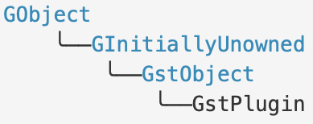
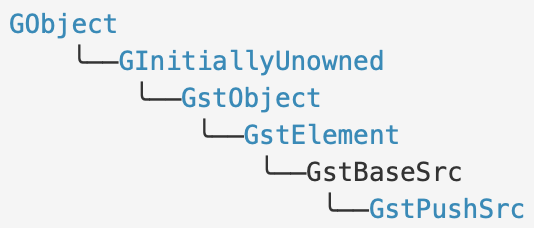

:: title ::
# GstPlugn

:: content ::

<figure class="text-center">
  

    
  

</figure>

- **GStreamer 는 plugin 을 통해 확장한다.**
    - GstElement 인스턴스를 런타임에 로드.
    - 하나 이상의 기본 GStreamer GstPluginFeature 서브클래스 제공.

- **규칙**
    - 플러그인은 GstPluginDesc 타입의 구조체인 gst_plugin_desc 심볼을 익스포트.
    - 로더는 플러그인이 링크된 코어 라이브러리의 버전을 확인하고 새 GstPlugin을 생성
    - gst_plugin_desc 에 제공된 GstPluginInitFunc 함수 호출.

#### GstPluginDesc 구조체

| Member | Type | Description |
|--------|------|-------------|
| **major_version** | [gint](https://docs.gtk.org/glib/types.html#gint) | the major version number of core that plugin was compiled for |
| **minor_version** | [gint](https://docs.gtk.org/glib/types.html#gint) | the minor version number of core that plugin was compiled for |
| **name** | const [gchar](https://docs.gtk.org/glib/types.html#gchar) * | a unique name of the plugin |
| **description** | const [gchar](https://docs.gtk.org/glib/types.html#gchar) * | description of plugin |
| **plugin_init** | [GstPluginInitFunc](https://gstreamer.freedesktop.org/documentation/gstreamer/gstplugin.html#GstPluginInitFunc) | pointer to the init function of this plugin |
| **version** | const [gchar](https://docs.gtk.org/glib/types.html#gchar) * | version of the plugin |
| **license** | const [gchar](https://docs.gtk.org/glib/types.html#gchar) * | effective license of plugin |
| **source** | const [gchar](https://docs.gtk.org/glib/types.html#gchar) * | source module plugin belongs to |
| **package** | const [gchar](https://docs.gtk.org/glib/types.html#gchar) * | shipped package plugin belongs to |
| **origin** | const [gchar](https://docs.gtk.org/glib/types.html#gchar) * | URL to provider of plugin |
| **release_datetime** | const [gchar](https://docs.gtk.org/glib/types.html#gchar) * | date time string in ISO 8601 format (or rather, a subset thereof), or [NULL](https://web.mit.edu/barnowl/share/gtk-doc/html/glib/glib-Standard-Macros.html#NULL:CAPS). Allowed are the following formats: "YYYY-MM-DD" and "YYY-MM-DDTHH:MMZ" (with 'T' a separator and 'Z' indicating UTC/Zulu time). This field should be set via the GST_PACKAGE_RELEASE_DATETIME preprocessor macro. |

---
layout: top-title
hideInToc: true
---
:: title ::
# GstPlugin

:: content ::

- [Methods](https://gstreamer.freedesktop.org/documentation/gstreamer/gstplugin.html#methods)
    - [gst_plugin_add_dependency](https://gstreamer.freedesktop.org/documentation/gstreamer/gstplugin.html#gst_plugin_add_dependency)
    - [gst_plugin_add_dependency_simple](https://gstreamer.freedesktop.org/documentation/gstreamer/gstplugin.html#gst_plugin_add_dependency_simple)
    - [gst_plugin_add_status_error](https://gstreamer.freedesktop.org/documentation/gstreamer/gstplugin.html#gst_plugin_add_status_error)
    - [gst_plugin_add_status_info](https://gstreamer.freedesktop.org/documentation/gstreamer/gstplugin.html#gst_plugin_add_status_info)
    - [gst_plugin_add_status_warning](https://gstreamer.freedesktop.org/documentation/gstreamer/gstplugin.html#gst_plugin_add_status_warning)
    - [gst_plugin_get_cache_data](https://gstreamer.freedesktop.org/documentation/gstreamer/gstplugin.html#gst_plugin_get_cache_data)
    - [gst_plugin_get_description](https://gstreamer.freedesktop.org/documentation/gstreamer/gstplugin.html#gst_plugin_get_description)
    - [gst_plugin_get_filename](https://gstreamer.freedesktop.org/documentation/gstreamer/gstplugin.html#gst_plugin_get_filename)
    - [gst_plugin_get_license](https://gstreamer.freedesktop.org/documentation/gstreamer/gstplugin.html#gst_plugin_get_license)
    - [gst_plugin_get_name](https://gstreamer.freedesktop.org/documentation/gstreamer/gstplugin.html#gst_plugin_get_name)
    - [gst_plugin_get_origin](https://gstreamer.freedesktop.org/documentation/gstreamer/gstplugin.html#gst_plugin_get_origin)
    - [gst_plugin_get_package](https://gstreamer.freedesktop.org/documentation/gstreamer/gstplugin.html#gst_plugin_get_package)
    - [gst_plugin_get_release_date_string](https://gstreamer.freedesktop.org/documentation/gstreamer/gstplugin.html#gst_plugin_get_release_date_string)
    - [gst_plugin_get_source](https://gstreamer.freedesktop.org/documentation/gstreamer/gstplugin.html#gst_plugin_get_source)
    - [gst_plugin_get_status_errors](https://gstreamer.freedesktop.org/documentation/gstreamer/gstplugin.html#gst_plugin_get_status_errors)
    - [gst_plugin_get_status_infos](https://gstreamer.freedesktop.org/documentation/gstreamer/gstplugin.html#gst_plugin_get_status_infos)
    - [gst_plugin_get_status_warnings](https://gstreamer.freedesktop.org/documentation/gstreamer/gstplugin.html#gst_plugin_get_status_warnings)
    - [gst_plugin_get_version](https://gstreamer.freedesktop.org/documentation/gstreamer/gstplugin.html#gst_plugin_get_version)
    - [gst_plugin_is_loaded](https://gstreamer.freedesktop.org/documentation/gstreamer/gstplugin.html#gst_plugin_is_loaded)
    - [gst_plugin_load](https://gstreamer.freedesktop.org/documentation/gstreamer/gstplugin.html#gst_plugin_load)
    - [gst_plugin_set_cache_data](https://gstreamer.freedesktop.org/documentation/gstreamer/gstplugin.html#gst_plugin_set_cache_data)

- [Functions](https://gstreamer.freedesktop.org/documentation/gstreamer/gstplugin.html#functions)
    - [gst_plugin_list_free](https://gstreamer.freedesktop.org/documentation/gstreamer/gstplugin.html#gst_plugin_list_free)
    - [gst_plugin_load_by_name](https://gstreamer.freedesktop.org/documentation/gstreamer/gstplugin.html#gst_plugin_load_by_name)
    - [gst_plugin_load_file](https://gstreamer.freedesktop.org/documentation/gstreamer/gstplugin.html#gst_plugin_load_file)
    - [gst_plugin_register_static](https://gstreamer.freedesktop.org/documentation/gstreamer/gstplugin.html#gst_plugin_register_static)
    - [gst_plugin_register_static_full](https://gstreamer.freedesktop.org/documentation/gstreamer/gstplugin.html#gst_plugin_register_static_full)

---
layout: top-title
hideInToc: true
---
:: title ::
# GstBaseSrc

:: content ::

<figure class="text-center">
  

    
  

</figure>

- **source 엘리먼트의 기본 구현 제공**
    - random access source
    - seekable source
    - live source

- **SEGMENT FORMAT 설정**
    - GST_FORMAT_BYTES 가 기본

- **스케쥴링 모드**
    - 항상 PUSH 모드를 지원하며, 아래 조건이 되면 PULL 모드도 지원
        - SEGMENT FORMAT == GST_FORMAT_BYTES
        - is_seekable == TRUE
    - PULL 모드를 지원하면, PUSH 모드에서도 자동으로 SEEK 가능한 상태가 된다.
    - SEGMENT FORMAT != GST_FORMAT_BYTES 인 경우, 아래를 만족하면 PULL 모드 SEEK 가능
        - is_seekable == TRUE
        - query 는 지원되는 모든 SEEK 포맷들을 gst_base_src_set_format 를 사용해 설정할 수 있는 내부 형식으로 변환할 수 있다.
        - do_seek 이 구현되어 있어 SEEK을 실행하고 TRUE를 리턴한다.
    - 기타 PULL 모드 관련 주의 사항.
        - 요구사항 충족되지 않는 경우, create 함수의 offset, length 값을 무시해야 한다.
        - 특정 offset, length 일 때만 PULL 모드로 동작한다면 create 함수에 잘못된 입력이 오는 경우 에러 발생.
        - 지원하지 않는다면 GstPushSrc 를 상속 받길 권한다.

- **라이브 소스**
    - 장치로부터 데이터를 실시간으로 수신하는 소스.
    - PAUSE 상태일 때는 데이터를 버린다.
    - 보통 고정된 속도로 데이터를 수신하기 때문에, 이를 반영하는 클락을 제공한다.
    - gst_base_src_set_live 함수를 사용하여 라이브 소스 모드를 활성화 한다.
    - GST_STATE_CHANGE_NO_PREROLL
    - 라이브소스는 PAUSE 상태에서 데이터를 생산하지 않는다 => PREROLL이 불가능하다.
    - 따라서 READY -> PAUSED 상태 전환 시 GST_STATE_CHANGE_NO_PREROLL을 리턴한다.
    - 현재 running_time 을 버퍼의 타임스템프로 설정한다.
    - 클락에 동기화 되는 경우 PAUSED 상태 전환으로 create 함수가 중단 되었을 때 gst_base_src_wait_playing 사용.
- **소스엘리먼트의 셧다운**
    - 라이브 소스의 입력을 레코딩 하는 사례의 경우 셧다운 처리.
    - 파이프라인에 입력된 버퍼를 모두 레코딩 한 뒤 파일을 정상적으로 마무리 해야한다.
    - gst_element_send_event 함수로 파이프라인에 EOS 이벤트 전달.
    - 파이프라인이 버스에 EOS 메시지를 전달하면 안전하게 셧다운 처리 시작.

