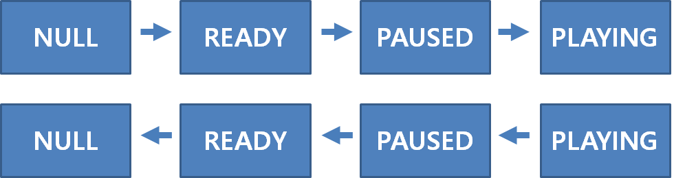

:: title ::
# GstElement States

:: content ::
<div class="highlight-box text-xs">
<strong>중요:</strong> NULL 상태에서 PLAYING으로 직접 설정해도 모든 중간 단계를 순차적으로 실행합니다.
</div>
<figure class="text-center mt-5">
  <div class="w-full mx-auto">
    
  </div>
</figure>

<div class="flex flex-wrap ns-c-tight text-sm code-dense mt-4">
<div class="w-3/5 pr-3">
<div class="custom-table-xs">

| 상태 | 자원 할당 | 스트림 상태 | Clock 동작 | 주요 특징 |
|------|-----------|-------------|------------|-----------|
| **NULL** | 없음 | 없음 | 없음 | 초기 상태 |
| **READY** | 전역 자원 | 준비 | 없음 | 디바이스 열림, PAUSE 준비 |
| **PAUSED** | 모든 자원 | 시작됨 | 정지 | 데이터 처리 준비, preroll 완료 |
| **PLAYING** | 모든 자원 | 진행 중 | 동작 | 실제 렌더링/생산 |

</div>
</div>

<div class="w-2/5 pl-3">
<div class="ns-c-tight text-sm mt-5">

#### 상태 전환 방법
```bash
gst_element_set_state(element, GST_STATE_PLAYING);
# NULL → READY → PAUSED → PLAYING 순차 실행
```
</div>
</div>
</div>

---
layout: top-title
hideInToc: true
---
:: title ::
# 상태별 세부 동작

:: content ::

<div class="flex flex-wrap ns-c-tight">
<div class="w-1/2 pr-3 text-sm">

#### GST_STATE_NULL
- **초기 상태**: 자원 할당 없음
- **메모리**: 런타임 라이브러리 미로드
- **디바이스**: 접근 불가

<div class="mt-20">

#### GST_STATE_READY  
- **전역 자원**: 디바이스 열기, 버퍼 생성
- **준비 완료**: PAUSE 상태 진행 준비
- **스트림**: 아직 시작 안함
</div>

</div>
<div class="w-1/2 text-sm">

#### GST_STATE_PAUSED
- **데이터 처리**: 수신/처리 준비 완료
- **Sink 특성**: preroll 완료 상태
- **Clock**: 정지 상태 (재생 불가)
- **나머지**: PLAYING과 거의 동일

<div class="mt-13">

#### GST_STATE_PLAYING
- **Sink**: 실제 데이터 렌더링
- **Live Source**: 데이터 생산 시작
- **Clock**: 동작 (동기화 가능)
- **일반 Element**: PAUSED와 동일
</div>

</div>
</div>

---
layout: top-title
hideInToc: true
---
:: title ::
# 상태 전환 함수와 반환값

:: content ::

<div class="code-sm mb-5">

```c
GstStateChangeReturn gst_element_set_state(GstElement *element, GstState state);
```

</div>

<div class="custom-table-small">

| 반환값 | 의미 | 발생 상황 | 후속 처리 |
|--------|------|-----------|-----------|
| **GST_STATE_CHANGE_FAILURE** | 전환 실패 | 자원 부족, 디바이스 오류 등 | 에러 메시지 버스 전송 |
| **GST_STATE_CHANGE_SUCCESS** | 전환 완료 | 즉시 상태 변경 성공 | 다음 단계 진행 가능 |
| **GST_STATE_CHANGE_ASYNC** | 비동기 완료 | Preroll 필요, 시간 소요 | 완료 대기 필요 |
| **GST_STATE_CHANGE_NO_PREROLL** | 성공 (Live Source) | PAUSED에서 데이터 미생산 | PLAYING에서 동작 시작 |

</div>

<div class="flex flex-wrap ns-c-tight text-sm code-dense mt-5">
</div>

---
layout: top-title
hideInToc: true
---
:: title ::
# Preroll 이란?

:: content ::
<div class="highlight-box text-xs">
<strong>Preroll 목적:</strong> PAUSED → PLAYING 전환 시 시각적 지연 없이 즉시 재생을 시작하기 위한 메커니즘
</div>
<figure class="text-center mt-5">
  <div class="w-full mx-auto">
    
  </div>
</figure>

<div class="flex flex-wrap ns-c-tight text-sm mt-10">
<div class="w-1/2 pr-3">

#### Preroll의 정의
- **READY → PAUSED**: Sink가 버퍼 수신까지 대기
- **상태 완료 조건**: 입력 패드에 버퍼가 큐잉된 후
- **목적**: 파이프라인을 버퍼로 채워 빠른 PLAYING 전환

</div>
<div class="w-1/2 pl-3">

#### 핵심 효과
- **시각적 지연 제거**: 사용자에게 즉각적 반응
- **동기화 유지**: 정확한 오디오/비디오 동기화
- **버퍼 손실 방지**: Sink에서 버퍼 드롭 방지

</div>
</div>

---
layout: top-title
hideInToc: true
---
:: title ::
# Preroll commit 및 unblock

:: content ::
<div class="text-sm">

#### Preroll commit 조건 및 동작
<div class="custom-table-small">

| 조건 | 설명 | 동작 |
|------|------|------|
| **Buffer 수신** | Sink 패드에 버퍼 도착 | 상태 커밋, preroll 완료 |
| **GAP Event** | 데이터 없음을 알리는 이벤트 | 상태 커밋 (버퍼 대신) |
| **EOS Event** | 스트림 종료 이벤트 | 상태 커밋 (더 이상 버퍼 없음) |

</div>

<div class="mt-10">

#### Preroll unblock 조건 및 동작
<div class="custom-table-small">

| 해제 조건 | 반환값 | 결과 동작 |
|-----------|--------|-----------|
| **State Change → PLAYING** | 정상 진행 | 버퍼 렌더링 및 재생 시작 |
| **State Change → READY** | `GST_FLOW_FLUSHING` | 버퍼 폐기, 피어에게 FLUSHING 반환 |
| **Flush Event** | `GST_FLOW_FLUSHING` | preroll 중단, 피어에게 FLUSHING 반환 |

</div>
</div>
</div>

---
layout: top-title
hideInToc: true
---
:: title ::
# ASYNC와 NO_PREROLL 처리 전략

:: content ::

<div class="flex flex-wrap text-sm code-dense ns-c-tight">
<div class="w-1/2 pr-3">

#### ASYNC 처리 (Preroll 대기)
<div class="code-xs code-dense">

```c
static void
handle_bus_message(GstBus *bus, GstMessage *msg,
                   gpointer user_data) {

    switch (GST_MESSAGE_TYPE(msg)) {
        case GST_MESSAGE_ASYNC_DONE:
            g_print("Preroll 완료! 파이프라인 준비됨\n");
            // 이제 PLAYING으로 전환하거나 다른 작업 수행
            break;
    }

}
```

</div>

<div class="mt-28">

#### ASYNC 발생 상황
- **Sink Element**: 첫 번째 버퍼 대기
- **Demuxer**: 스트림 분석 진행 중
- **Network Source**: 연결 설정 중
</div>
</div>

<div class="w-1/2">

#### NO_PREROLL 처리 (Live Source)
<div class="code-xs code-dense">

```c
static void
handle_bus_message(GstBus *bus, GstMessage *msg,
                   gpointer user_data) {
    switch (GST_MESSAGE_TYPE(msg)) {
        case GST_MESSAGE_STATE_CHANGED:
            if (GST_MESSAGE_SRC(msg) == GST_OBJECT(pipeline)) {
                GstState old_state, new_state, pending_state;
                gst_message_parse_state_changed(
                    msg, &old_state,
                    &new_state, &pending_state);
                
                if (new_state == GST_STATE_PAUSED &&
                    old_state < GST_STATE_PAUSED) {
                    // 이제 PLAYING으로 전환하거나 다른 작업 수행
                }
            }
            break;
    }
}
```

</div>

<div class="mt-4">

#### NO_PREROLL 특징
- **Live Source**: v4l2src, alsasrc, rtsp 등
- **PAUSED 제한**: 데이터 생산 안함
- **실시간 제약**: 과거 데이터 제공 불가
- **즉시 재생**: PLAYING 상태에서만 동작
</div>
</div>
</div>

---
layout: top-title
hideInToc: true
---
:: title ::
# 상태 전환 상세 동작

:: content ::

<div class="flex flex-wrap ns-c-tight text-sm code-dense">
<div class="w-1/2 pr-3">

#### NULL → READY
```c
// 자원 유효성 검사 및 디바이스 접근
- 필요한 자원이 유효한지 점검
- 장치 접근 엘리먼트: caps 지원 확인  
- 기능 확인 완료 후 장치 open
```

#### READY → PAUSED  
```c
// 스트리밍 준비 및 preroll
- PAD들을 활성화하여 데이터 수신 준비
- 스트리밍 스레드 시작
- Sink: ASYNC 반환 → 첫 번째 버퍼/EOS 대기 → preroll 완료
- Live Source: NO_PREROLL 반환, 데이터 미생산
- Pipeline: running_time = 0 설정
```

#### PAUSED → PLAYING
```c
// Clock 관리 및 실제 동작 시작
- Pipeline: Clock 선정 및 모든 자식에게 분배
- Pipeline: base_time 계산 (Clock + running_time) 후 분배  
- Sink: preroll 블록 해제, 렌더링 시작
- Sink: EOS 메시지 전송 가능 (PLAYING에서만)
- Live Source: 데이터 생산 시작, SUCCESS 반환
- Sometimes pad 생성/제거 가능
```
</div>

<div class="w-1/2 pl-3">

#### PLAYING → PAUSED
```c
// 일시정지 및 상태 보존
- Pipeline: running_time 계산 (Clock + base_time)
- Pipeline: 재생 재개를 위한 상태 정보 저장
- Sink: Clock 동기화 대기 모두 unblock
- Sink: 지연 버퍼 없으면 ASYNC 반환 → 새 버퍼/EOS 대기
- 쌓인 EOS 메시지 모두 제거 (재생 시 재전송)
- Live Source: 데이터 생산 중지, NO_PREROLL 반환
```

#### PAUSED → READY
```c  
// 스트리밍 중단 및 정리
- Sink: 모든 preroll 대기 작업 해제
- 모든 엘리먼트: 디바이스 대기 작업 해제
- _chain()/_get_range(): GST_FLOW_FLUSHING 반환
- 엘리먼트 패드들 비활성화, 스트리밍 스레드 중단
- Sink: 협상된 format 정보 모두 삭제
- Sometimes pad 모두 제거
```

#### READY → NULL
```c
// 완전한 정리 및 초기화
- 모든 디바이스 닫기
- 엘리먼트 내부 상태 완전 초기화
- 할당된 모든 자원 해제
```
</div>
</div>

---
layout: top-title
hideInToc: true
---
:: title ::
# 플러그인 개발 시 고려사항

:: content ::

<div class="code-dense">

```c
static GstStateChangeReturn
gst_my_filter_change_state (GstElement *element, GstStateChange transition)
{
    GstStateChangeReturn ret = GST_STATE_CHANGE_SUCCESS;
    GstMyFilter *filter = GST_MY_FILTER (element);
    switch (transition) {
        case GST_STATE_CHANGE_NULL_TO_READY:
            if (!gst_my_filter_allocate_memory (filter))
                return GST_STATE_CHANGE_FAILURE;
            break;
        case GST_STATE_CHANGE_READY_TO_PAUSED:
            break;
        default:
            break;
    }

    // ⚠️ 중요: 부모 클래스 체인업
    ret = GST_ELEMENT_CLASS (parent_class)->change_state (element, transition);
    if (ret == GST_STATE_CHANGE_FAILURE)
        return ret;

    switch (transition) {
        case GST_STATE_CHANGE_PAUSED_TO_READY:
            break;
        case GST_STATE_CHANGE_READY_TO_NULL:
            gst_my_filter_free_memory (filter);
            break;
        default:
            break;
    }
    return ret;
}
```

</div>

