:: title ::
# 통신 방법

:: content ::
<div class="highlight-box text-xs">
GStreamer는 GstMiniObject를 상속하는 4가지 종류의 객체와 GObject의 signals 를 통신에 활용 합니다.
</div>
<figure class="text-center mt-5">
  <div class="w-full mx-auto">
    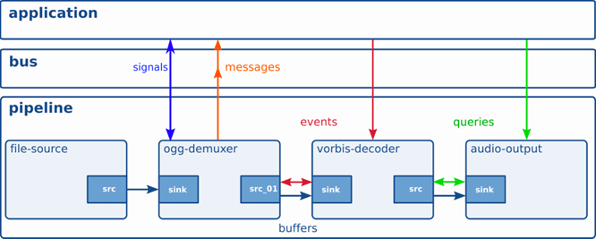
  </div>
</figure>

<div class="flex flex-wrap ns-c-tight text-sm code-dense mt-8">
<div class="w-1/2 pr-3">

#### GstMiniObject를 상속하는 객체
<div class="custom-table-xs">

| 객체 | 설명 |
|------|------|
| GstMessage | 엘리먼트들이 애플리케이션에 정보 전달 |
| GstBuffer | 미디어 데이터 전달 |
| GstEvent | 재생 제어 관련 명령 전달 |
| GstQuery | 현재 상태를 질의 |

</div>

</div>
<div class="w-1/2 pl-3">

#### GObject signals
<div class="custom-table-xs">

| GObject signals | 설명 |
|------|------|
| signal | 엘리먼트가 애플리캐이션의 함수 호출 |
| action signal | 애플리케이션이 엘리먼트의 함수 호출 |

</div>
</div>
</div>

---
layout: top-title
hideInToc: true
---
:: title ::
# 통신에 사용하는 객체

:: content ::

<div class="flex flex-wrap ns-c-tight text-sm code-dense">
<div class="w-1/2 pr-3">

#### GstMessage
- 파이프라인의 엘리먼트들이 생성하여 GstBus 에 전달.
- 애플리케이션은 GstBus를 통해 수신.
- GstBus는 비동기 큐를 사용한 스레드 간 통신 방법을 제공한다.

<div class="mt-23">

#### GstBuffer
- 엘리먼트들이 실제로 처리 할 데이터를 보관.
- 파이프라인 내부를 흐르는 객체.
- Upstream 에서 생성하고 Downstream 방향으로 전달.
</div>
</div>
<div class="w-1/2 pl-3">

#### GstEvent
- 주로 재생 제어 관련 명령을 전달하는데 사용.
- 애플리케이션이 파이프라인에 직접 전달 할 수 있다.
- 엘리먼트가 패드를 통해 서로 직접 전달 할 수 있다.
- 버퍼처럼 파이프라인 내부를 흐르는 객체.
- Up/Down stream 양방향으로 전달.

<div class="mt-10">

#### GstQuery
- 주로 현재 상태를 질의 하는데 사용.
- 애플리케이션이 파이프라인에 직접 전달 할 수 있다.
- 엘리먼트가 패드를 통해 서로 직접 전달 할 수 있다.
- 버퍼처럼 파이프라인 내부를 흐르는 객체.
- Up/Down stream 양방향으로 전달.
</div>

</div>
</div>

---
layout: top-title
hideInToc: true
---
:: title ::
# GstMessage

:: content ::

<div class="flex flex-wrap ns-c-tight text-sm code-dense">
<div class="w-1/2 pr-3">

- 파이프라인의 엘리먼트들이 생성 하여 GstBus에 전달.
- GstBus는 비동기 큐를 사용한 스레드 간 통신 방법을 제공.
- 세 종류의 메시지 처리 방법:
<div class="custom-table-xs">

| 종류 | 설명 |
|------|------|
| **폴링** | `gst_bus_poll` 활용. 메시지 큐에 메시지가 입력되면 리턴한다. |
| **비동기** | `gst_bus_add_watch` 를 통해 GMainLoop 에 GSource 를 등록한다. <br> 애플리케이션의 메인 스레드가 비동기적으로 처리 |
| **동기** | 메시지가 포스트 된 스레드에서 메시지 핸들러 함수를 직접 호출한다. <br> 메인 스레드가 다른 스레드로부터의 메시지를 처리할 수 있을 때만 사용해야 함. |

</div>

<div class="mt-10">

- 메시지는 오른쪽의 정보를 엘리먼트에서 애플리케이션에 스레드 안전한 방법으로 전달.
</div>
</div>
<div class="w-1/2 pl-3">

<figure class="text-center">
  <div class="w-full mx-auto">
    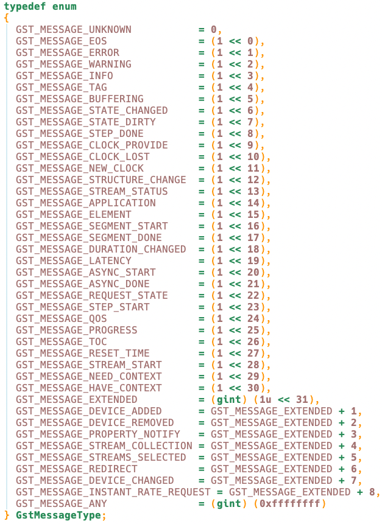
  </div>
</figure>
</div>
</div>

---
layout: top-title
hideInToc: true
---
:: title ::
# GstBuffer

:: content ::
<div class="highlight-box text-xs">
GStreamer에서 데이터 전송의 기본 단위로, 타이밍 정보와 메타데이터를 포함한 GstMemory 블록들의 컨테이너입니다.
</div>

<div class="flex flex-wrap ns-c-tight code-dense text-sm mt-5">
<div class="w-1/2 pr-3">

#### 핵심 구성 요소
- **GstMemory**: 실제 데이터를 담는 메모리 블록들
- **타이밍 정보**: PTS/DTS 타임스탬프, duration (나노초 단위)
- **오프셋**: 미디어 타입별 위치 정보 (프레임 번호, 샘플 수 등)
- **메타데이터**: 임의의 추가 정보 (GstMeta)

<div class="mt-10">

#### 참조 카운팅
- **gst_buffer_ref()**: 참조 카운트 증가
- **gst_buffer_unref()**: 참조 카운트 감소, 0이 되면 해제
- **쓰기 가능성**: 참조 카운트가 정확히 1일 때만 수정 가능

</div>
</div>

<div class="w-1/2">

#### 주요 API
```c
// 버퍼 생성 및 메모리 할당
GstBuffer *buffer = gst_buffer_new();
GstMemory *memory = gst_allocator_alloc(NULL, size, NULL);
gst_buffer_insert_memory(buffer, -1, memory);

// 사전 할당된 버퍼 생성
GstBuffer *buffer = gst_buffer_new_allocate(NULL, size, NULL);

// 버퍼 복사 및 병합
GstBuffer *copy = gst_buffer_copy_region(buffer,
                                         GST_BUFFER_COPY_ALL, 0, size);
GstBuffer *merged = gst_buffer_append(buffer1, buffer2);

// 메타데이터 조작
gst_buffer_add_meta(buffer, meta_info, params);
meta = gst_buffer_get_meta(buffer, meta_type);
```

#### 타임스탬프
- **PTS**: 사용자에게 표시될 시간 (항상 단조증가 아님)
- **DTS**: 디코딩되어야 할 시간 (보통 단조증가)

</div>
</div>

---
layout: top-title
hideInToc: true
---
:: title ::
# GstBuffer 전달 방법

:: content ::
<figure class="text-center">
  <div class="w-full mx-auto">
    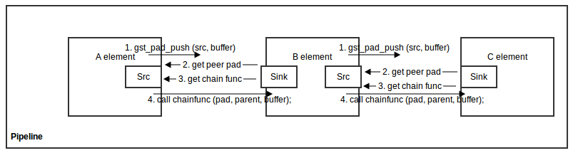
  </div>
</figure>

<figure class="text-center mt-10">
  <div class="w-full mx-auto">
    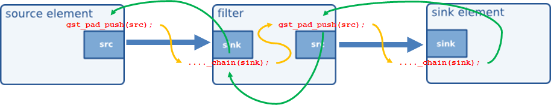
  </div>
</figure>

---
layout: top-title
hideInToc: true
---
:: title ::
# GstEvent

:: content ::

<div class="highlight-box text-xs">
애플리케이션 또는 엘리먼트에서 엘리먼트에게 다음과 같은 제어 명령 객체를 전달 합니다.
</div>

<figure class="text-center mt-4">
  <div class="w-full mx-auto">
    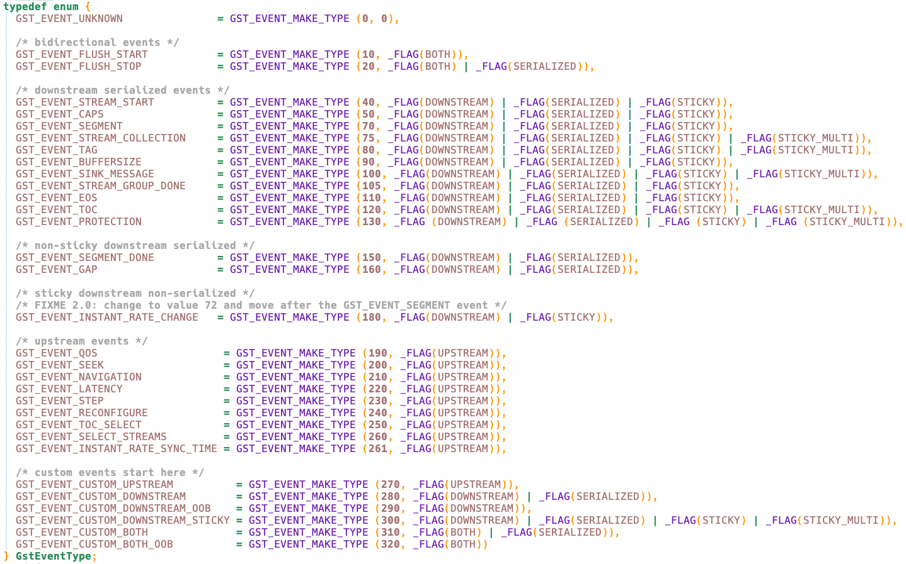
  </div>
</figure>

---
layout: top-title
hideInToc: true
---
:: title ::
# GstEvent 전달 방법

:: content ::
<figure class="text-center">
  <div class="w-full mx-auto">
    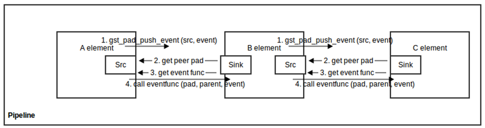
  </div>
</figure>

<figure class="text-center mt-10">
  <div class="w-full mx-auto">
    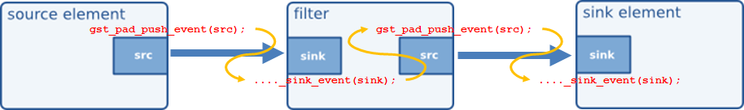
  </div>
</figure>

<figure class="text-center mt-10">
  <div class="w-full mx-auto">
    
  </div>
</figure>

---
layout: top-title
hideInToc: true
---
:: title ::
# GstQuery

:: content ::

<div class="highlight-box text-xs">
애플리케이션 또는 엘리먼트에서 엘리먼트에게 다음과 같은 정보를 질의 하는데 사용 합니다.
</div>

<figure class="text-center mt-4">
  <div class="w-full mx-auto">
    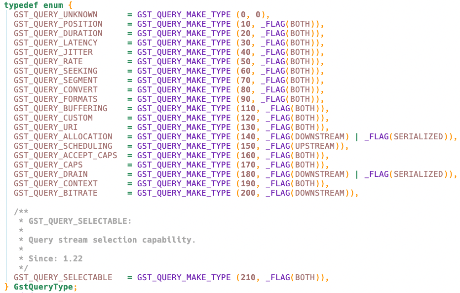
  </div>
</figure>

---
layout: top-title
hideInToc: true
---
:: title ::
# GstQuery 전달 방법

:: content ::
<figure class="text-center">
  <div class="w-full mx-auto">
    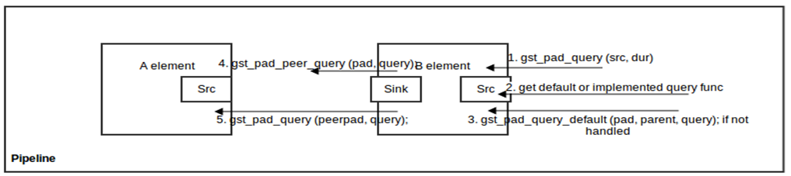
  </div>
</figure>

<figure class="text-center mt-10">
  <div class="w-full mx-auto">
    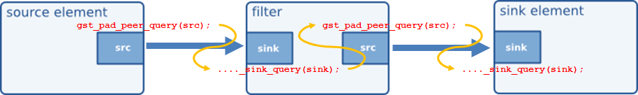
  </div>
</figure>

<figure class="text-center mt-10">
  <div class="w-full mx-auto">
    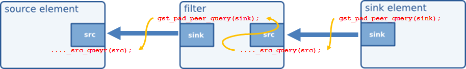
  </div>
</figure>
