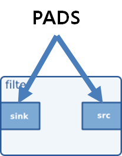

:: title ::
# Pad

:: content ::
<div class="flex flex-wrap ns-c-tight text-sm code-dense">
<div class="w-2/5 pr-3 mt-37">

- PAD는 엘리먼트가 외부와 통신하는 인터페이스.
- 세 개의 특성으로 패드의 종류(Type)를 정의할 수 있음.
</div>
<div class="w-1/5 pl-3">
<figure class="text-center">
  <div class="w-full mx-auto">
    
  </div>
</figure>
</div>
<div class="w-2/5 pl-3">

```bash
Pad Templates:
  SINK template: 'sink'
    Availability: Always
    Capabilities:
      audio/x-vorbis

  SRC template: 'src'
    Availability: Always
    Capabilities:
      audio/x-raw
                 format: F32LE
                   rate: [ 1, 2147483647 ]
               channels: [ 1, 256 ]
```
</div>
</div>
<div class="ns-c-tight text-sm pl-10">

- **특성 1** : 방향 (Direction)
    - sink pad : 데이터를 수신하며, 엘리먼트의 왼쪽에 그려줌.
    - src pad : 데이터를 생성하며, 엘리먼트의 오른쪽에 그려줌.
- **특성 2** : 유효성 (Availability)
    - Always : 항상 유효.
    - Sometimes : 엘리먼트가 생성되었을 때에는 존재하지 않지만, 상황에 따라 유동적으로 생성됨. Demux에서 유용함.
    - On request : 엘리먼트의 생성 후, 명시적인 요청에 의해 생성 됨. Mux에서 유용함.
- **특성 3** : 능력 (Capability)
    - pad 자신이 처리하는 데이터 형식을 특정할 수 있음.
</div>

---
layout: top-title
hideInToc: true
---
:: title ::
# Capabilities

:: content ::
<figure class="text-center">
  <div class="w-full mx-auto">
    
  </div>
</figure>

<div class="flex flex-wrap ns-c-tight text-sm code-dense mt-5">
<div class="w-1/2 pr-3">

#### Capabilities (Caps)
- 패드를 통해 흐를 수 있는 미디어 타입을 설명하는 구조체
- **구성**: GstCaps → GstStructure → key-value 쌍
- **협상된 패드**: 정확히 하나의 구조체와 고정값만 포함

<div class="mt-7">

#### Properties와 Value 타입
- **기본 타입**: Integer, Boolean, Float, String, Fraction
- **범위 타입**: INT_RANGE, FLOAT_RANGE, FRACTION_RANGE
- **집합 타입**: LIST(선택 가능한 값들), ARRAY(전체로서 해석되는 값들)
</div>
</div>
<div class="w-1/2 pl-3">

#### Capabilities의 용도
1. **Autoplugging**: 자동 엘리먼트 연결
2. **호환성 검사**: 패드 간 미디어 타입 호환성 검증
3. **메타데이터**: 스트림 정보 제공
4. **필터링**: 특정 미디어 타입으로 제한

#### Caps 생성 및 필터링
- `gst_caps_new_simple()`: 간단한 caps 생성
- `gst_caps_new_full()`: 복합 구조의 caps 생성
- `gst_element_link_filtered()`: caps 필터를 사용한 엘리먼트 연결
</div>
</div>

---
layout: top-title
hideInToc: true
---
:: title ::
# GstCaps 와 GstStructure

:: content ::
<div class="flex flex-wrap ns-c-tight text-sm code-dense">
<div class="w-1/2 pr-3">

#### GstCaps (Capabilities)
- **정의**: 미디어 타입을 설명하는 경량 참조 카운트 객체
- **구성**: GstStructure 배열로 구성됨
- **용도**: 
  - GstPadTemplate에서 패드가 처리할 수 있는 모든 타입 설명
  - GstRegistry에 GstElement 설명과 함께 저장
  - 런타임에 패드가 처리/생산할 수 있는 타입을 `gst_pad_query_caps`로 노출
</div>
<div class="w-1/2 pl-3">

#### GstCaps 생성 예제
```c
GstCaps *caps = gst_caps_new_simple ("video/x-raw",
   "format", G_TYPE_STRING, "I420",
   "framerate", GST_TYPE_FRACTION, 25, 1,
   "pixel-aspect-ratio", GST_TYPE_FRACTION, 1, 1,
   "width", G_TYPE_INT, 320,
   "height", G_TYPE_INT, 240,
   NULL);
```

<div class="mt-10">

#### Media Type과 Properties
- **Media Type**: MIME type과 비슷한 형식, GStreamer 타입시스템에 등록
- **Properties**: 미디어 타입의 기타 특성 정보
  - **정적 타입**: G_TYPE_INT, G_TYPE_BOOLEAN, G_TYPE_FLOAT, G_TYPE_STRING, GST_TYPE_FRACTION
  - **범위 타입**: GST_TYPE_INT_RANGE, GST_TYPE_FLOAT_RANGE, GST_TYPE_FRACTION_RANGE
  - **목록 타입**: GST_TYPE_LIST
  - **배열 타입**: GST_TYPE_ARRAY
</div>

</div>
</div>

---
layout: top-title
hideInToc: true
---
:: title ::
# GstCaps 와 GstStructure

:: content ::
<div class="flex flex-wrap ns-c-tight text-sm code-dense">
<div class="w-1/2 pr-3">

#### PAD에서의 Capabilities 지정 방식
1. **pad template**: 템플릿으로 만들어질 패드에 흐를 수 있는 데이터 형식
2. **pad**: 
   - 협상 완료 이전: 처리할 수 있는 데이터 형식 리스트
   - 협상 완료 이후: 현재 처리 중인 데이터 형식

<div class="mt-10">

#### Fixed Caps
- 범위나 리스트 필드가 없는 GstCaps
- `gst_caps_is_fixed`로 테스트 가능
- caps 이벤트에서 다운스트림 엘리먼트에 현재 미디어 타입 알림에 사용
</div>
</div>

<div class="w-1/2 pl-3">

#### 협상 완료 전
<figure class="text-center">
  <div class="w-full mx-auto">
    
  </div>
</figure>

<div class="mt-10">

#### 협상 완료 후
<figure class="text-center">
  <div class="w-full mx-auto">
    
  </div>
</figure>
</div>
</div>
</div>

---
layout: top-title
hideInToc: true
---
:: title ::
# GstCaps 와 GstStructure

:: content ::
<div class="flex flex-wrap ns-c-tight text-sm code-dense">
<div class="w-1/2 pr-3">

#### GstStructure
- **정의**: key/value 쌍의 컬렉션
- **키**: GQuarks로 표현
- **값**: 모든 GType 가능
- **이름**: 문자로 시작, 문자/숫자/"/-_.:" 포함 가능
- **참조 카운트**: 없음 (상위 객체의 일부로 존재)
</div>

<div class="w-1/2 pl-3">

#### 생성 및 조작
<div class="custom-table-xs">

| 동작 | 함수 |
|------|------|
| **생성**| `gst_structure_new_empty`<br> `gst_structure_new` |
| **값 변경** | `gst_structure_set_value`<br> `gst_structure_set` |
| **값 조회** | `gst_structure_get_value`<br> `gst_structure_get_*()` |
| **필드 제거** | `gst_structure_remove_field`<br> `gst_structure_remove_fields` |
</div>

<div class="mt-5">

#### 직렬화 형식
- **기본 형식**: `구조체명, key=value` 형태
- **타입 명시**: `(GTypeName)value` 구문 사용
- **특수 구분자**:
  - GstValueArray: `<1, 2, 3>`
  - Ranges: `[1, 6, 2]` (최소, 최대, 스텝)
  - GstValueList: `{1, 2, 3}`
  - GStrv: `<"foo", "bar">`
</div>

</div>
</div>

---
layout: top-title
hideInToc: true
---
:: title ::
# Caps Negotiation

:: content ::
<div class="ns-c-tight text-sm">

## Caps Negotiation 기본 규칙
1. **다운스트림 엘리먼트**의 sink pad는 GST_QUERY_CAPS 결과에 제안사항을 배치하여 형식 제안.
2. **업스트림 엘리먼트**는 형식을 결정하고 source pad에서 GST_EVENT_CAPS 로 선택된 미디어 형식을 다운스트림에 전송
3. **다운스트림 엘리먼트**는 GST_EVENT_RECONFIGURE를 업스트림으로 보내 새로운 형식을 제안할 수 있음
4. **GST_QUERY_ACCEPT_CAPS**로 특정 caps가 엘리먼트에서 수용 가능한지 빠르게 확인

<div class="mt-10">

## 협상에 사용되는 4가지 쿼리/이벤트
1. **GST_QUERY_CAPS**: 가능한 형식 조회
2. **GST_QUERY_ACCEPT_CAPS**: 형식 수용 가능 여부 확인
3. **GST_EVENT_CAPS**: 형식 설정 (downstream)
4. **GST_EVENT_RECONFIGURE**: 새로운 caps 가능성을 upstream에 알림
</div>
</div>

---
layout: top-title
hideInToc: true
---
:: title ::
# Caps Negotiation

:: content ::
<div class="flex flex-wrap ns-c-tight text-sm code-dense">
<div class="w-1/2 pr-10">

## 쿼리 (Queries)
<div class="info-box">

#### GST_QUERY_CAPS
- 지원되는 GstCaps 조회
- **filter** (입력): 결과를 제한하는 GstCaps
- **caps** (출력): 결과 caps
- 재귀적으로 작동하여 peer 요소들을 고려
- 출력은 caps 의 선호도 순서대로 정렬된 목록
- 각 caps 는 고정되어 있지 않을 수 있음
</div>

<div class="info-box mt-5">

#### GST_QUERY_ACCEPT_CAPS
- 주어진 caps 지원 여부 확인
- **caps** (입력): 확인할 고정된 GstCaps
- **result** (출력): caps 수용 여부 (TRUE/FALSE)
</div>
</div>

<div class="w-1/2 pl-10">

## 이벤트 (Events)

<div class="info-box">

#### GST_EVENT_CAPS
- 협상된 형식을 peer 요소에 알림
- **caps**: 협상된 고정 GstCaps
</div>

<div class="info-box mt-5">

#### GST_EVENT_RECONFIGURE
- 새로운 caps 가능성을 upstream에 알림
- **방향**: downstream → upstream
- **목적**: 이미 협상된 파이프라인을 새로운 형식으로 재협상 요청
- **트리거**: 다운스트림 엘리먼트가 다른 형식을 원할 때
</div>

</div>
</div>

---
layout: top-title
hideInToc: true
---
:: title ::
# Caps Negotiation : Scheduling mode

:: content ::

<div class="ns-c-tight text-sm code-dense">

<div class="highlight-box">

#### 스케쥴링 모드란.
- Source 엘리먼트에서 데이터를 가져오거나 Sink 엘리먼트로 데이터를 보내는 방법
- PUSH 모드와 PULL 모드로 구분.
</div>


<figure class="text-center">
  <div class="w-full mx-auto">
    
  </div>
</figure>

<figure class="text-center mt-5">
  <div class="w-full mx-auto">
    
  </div>
</figure>
</div>

---
layout: top-title
hideInToc: true
---
:: title ::
# Caps Negotiation : Push-mode usecase

:: content ::
<div class="ns-c-tight text-sm code-dense">

<div class="highlight-box">

#### 기본 동작 원리
sink pad 는 미디어 형식을 upstream src pad 에 제안하고, src pad 는 이를 결정하여 downstream 에 알림.
</div>
<div class="flex flex-wrap ns-c-tight text-sm code-dense mt-5">
<div class="w-3/5">

#### 1. Fixed Negotiation
- **특징**: 하나의 고정된 형식만 출력 가능
- **예시**: typefinder, 대부분의 demuxer, 일부 decoder, 고정 형식 source
- **구현**: `gst_pad_use_fixed_caps()` 사용, `gst_pad_set_caps()`로 고정 caps 설정

<div class="mt-4">

#### 2. Transform Negotiation  
- **특징**: 입력과 출력 형식 간에 고정된 변환 관계 존재
- **예시**: videobox, identity 엘리먼트, 비디오/오디오 효과, mulawdec/mulawenc
- **구현**: sink pad의 CAPS 이벤트 핸들러에서 source pad용 caps 계산 및 설정
</div>
</div>
<div class="w-2/5">

```
            src              sink
             |                 |
             |  querycaps?     |
             |---------------->|
             |     caps        |
select caps  |< - - - - - - - -|
from the     |                 |
candidates   |                 |
             |                 |-.
             |  accepts?       | |
 type A      |---------------->| | optional
             |      yes        | |
             |< - - - - - - - -| |
             |                 |-'
             |  send_event()   |
send CAPS    |---------------->| Receive type A,
event A      |                 | reconfigure to 
             |                 | process type A. 
             |  push           |
push buffer  |---------------->| Process buffer of type A
             |                 |
```
</div>
<div class="w-1/4">
</div>
</div>
</div>

---
layout: top-title
hideInToc: true
---
:: title ::
# Caps Negotiation : Push-mode usecase

:: content ::
<div class="ns-c-tight text-sm code-dense">


#### 3. Dynamic Negotiation
- **특징**: 많은 형식을 출력할 수 있는 가장 복잡하고 강력한 방식
- **예시**: converter 엘리먼트(videoconvert, audioconvert), source 엘리먼트(audiotestsrc, videotestsrc)
- **과정**:
  1. Sink pad에서 caps 수신
  2. Passthrough 모드 선호 시 ACCEPT_CAPS 쿼리로 다운스트림 수용성 확인
  3. Source pad용 가능한 caps 계산
  4. 다운스트림 peer pad에 가능한 caps 목록 쿼리
  5. 다운스트림 목록에서 변환 가능한 첫 번째 caps 선택 및 설정
</div>

---
layout: top-title
hideInToc: true
---
:: title ::
# Caps Negotiation : Push-mode usecase

:: content ::
<div class="ns-c-tight text-sm code-dense">
<figure class="text-center">
  <div class="w-full mx-auto">
    
  </div>
</figure>
</div>

---
layout: top-title
hideInToc: true
---
:: title ::
# Caps Negotiation : Push-mode usecase

:: content ::
<div class="flex flex-wrap ns-c-tight text-sm code-dense">
<div class="w-3/5 pr-5">

#### 4. Upstream Caps (Re)negotiation
- **목적**: 이미 협상된 파이프라인을 새로운 형식으로 재협상
- **방법**: GST_EVENT_RECONFIGURE 이벤트를 업스트림으로 전송
- **각 엘리먼트의 책임**:

<div class="custom-table-xs mt-5">

| 엘리먼트 유형 | 책임 |
|---------------|------|
| **새 형식 제안** | ACCEPT_CAPS 쿼리로 확인 후 RECONFIGURE 이벤트 전송 |
| **Transform nego.** | RECONFIGURE 이벤트를 업스트림으로 전달 |
| **Fixed nego.** | RECONFIGURE 이벤트 드롭 |
| **Dynamic nego.** | `gst_pad_check_reconfigure()`로 NEED_RECONFIGURE 플래그 확인 |
</div>
</div>
<div class="w-2/5">
```
            src              sink
             |                 |
             |  accepts?       |
             |<----------------| type B
             |      yes        |
             |- - - - - - - - >|-.
             |                 | | suggest B caps next
             |                 |<'
             |                 |
             |   push_event()  |
 mark      .-|<----------------| send RECONFIGURE event
renegotiate| |                 |
           '>|                 |
             |  querycaps()    |
renegotiate  |---------------->|
             |  suggest B      |
             |< - - - - - - - -|
             |                 |
             |  send_event()   |
send CAPS    |---------------->| Receive type B,
event B      |                 | reconfigure to
             |                 | process type B.
             |  push           |
push buffer  |---------------->| Process buffer of type B
             |                 |
```
</div>
</div>

---
layout: top-title
hideInToc: true
---
:: title ::
# Caps Negotiation : Pull-mode usecase

:: content ::

<div class="ns-c-tight text-sm code-dense">

#### Pull-mode scheduling 일 때 해결해야 하는 문제

파이프라인이 pull-mode 로 동작할 때는, 다운스트림 엘리먼트가 자신의 sink pad 에 gst_pad_pull_range() 함수를 적용 해 데이터를 직접 당겨오기 때문에 push-mode 와는 다른 협상 메커니즘이 필요합니다.


  > #### 다운스트림 엘리먼트 sink pad의 고민 🤔 
  > "데이터를 당겨와야 하는데... 얼마나 당겨야 할지 모르겠어!"
  >
  > -   100 바이트?
  > -   480 바이트?
  > -   아니면 1536 바이트?

데이터의 크기는 미디어의 형식(caps)에 따라 결정됩니다.
- 오디오 샘플 하나는 2바이트일 수 있지만,
- 압축된 비디오 프레임 하나는 수천 바이트일 수 있습니다.

<div class="success-box mt-5">

#### 결론
다운스트림 엘리먼트의 sink pad는 데이터를 당기기 전에 미디어 형식(caps)을 반드시 알아야 합니다.
</div>
</div>

---
layout: top-title
hideInToc: true
---
:: title ::
# Caps Negotiation : Pull-mode usecase

:: content ::
<div class="ns-c-tight text-sm code-dense">

#### 해결 방법 : 다운스트림 엘리먼트가 협상을 주도
push-mode에서는 데이터가 흐르면서 자연스럽게 협상이 일어나지만, pull-mode에서는 다릅니다.

#### Pull-mode 협상 메커니즘

**타이밍**
- **SCHEDULING 쿼리 성공 후**, **pulling 스레드 시작 전**에 협상 수행
- **PAUSED→PLAYING 상태 변경 전**에 협상 완료
- **저지연 유지**를 위해 pulling 스레드 내에서 협상 회피

**단계별 과정**
1. **GST_QUERY_SCHEDULING**로 업스트림의 pull-mode 지원 확인
2. **sink가 협상 시작**: sink pad와 peer src pad의 `gst_pad_query_caps()` 결과를 교집합
3. **caps 고정화**: 결과 caps를 fixate하여 flow caps 생성
4. **caps 설정**: sink pad에 고정된 caps 설정 (실패 시 버스에 에러 메시지)
5. **pull-mode 활성화**: sink pad와 연결된 업스트림 엘리먼트의 pad들을 pull-mode로 활성화
6. **GST_STATE_CHANGE_ASYNC 반환**: 상태 변경 함수에서 ASYNC 반환, 첫 버퍼 수신 시 PAUSED로 커밋

</div>


---
layout: top-title
hideInToc: true
---
:: title ::
# Caps Negotiation : Pull-mode usecase

:: content ::
<div class="ns-c-tight text-sm code-dense">

#### 특징과 사용 사례
1. **RTP같은 손실 소스에서 재생**: 파이프라인 지연 정보로 품질 향상
2. **오디오 합성**: 하드웨어 인터럽트로 필요한 샘플만 생성
3. **저지연 효과 처리**: 링 버퍼에서 sink로 전송 중 필터 적용

협상이 성공적으로 끝나면, Sink의 데이터 처리 루프는 매우 단순하고 예측 가능해집니다.
```c
/* 협상은 이미 끝났고, 포맷은 하나로 고정되었습니다!
 *
 * 예시: audio/x-raw, 2 channels, 16-bit integer
 *       -> 1 프레임 = 2 채널 * 2 바이트 = 4 바이트
 */

// 이제 안심하고 데이터 풀링(pulling) 루프를 시작할 수 있습니다.
while (sink_is_running) {

  GstBuffer *buffer;

  // 1 프레임에 해당하는 4 바이트를 정확히 요청합니다.
  gst_pad_pull_range(sinkpad, offset, 4, &buffer);

  // 이제 4바이트 크기의 버퍼를 안전하게 처리합니다.
  process_my_audio_buffer(buffer);

  gst_buffer_unref(buffer);
  offset += 4;
}
```

</div>

