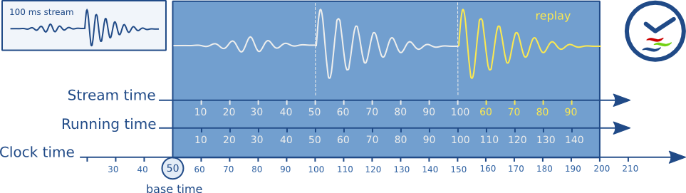
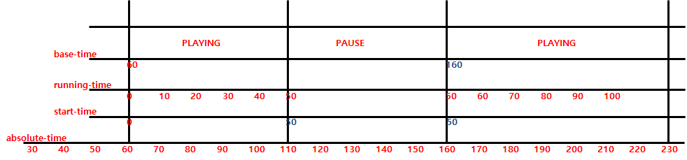

:: title ::
# Synchronization

:: content ::
<div class="ns-c-tight text-sm code-dense">
<div class="info-box">
GStreamer는 복잡한 미디어 재생에서 각 사운드와 비디오 샘플이 특정 순서와 특정 시간에 재생되도록 하는 동기화 메커니즘을 제공합니다.
</div>
<figure class="text-center mt-5">
  <div class="w-full mx-auto">
    
  </div>
</figure>
<div class="flex flex-wrap mt-5">
<div class="w-2/5 pr-3">

#### 동기화 구성 요소
GStreamer 파이프라인의 동기화 구성 요소:
- **GstClock**: 파이프라인의 모든 엘리먼트에 전역적인 클록
- **GstBuffer의 타임스탬프**: 버퍼에 포함된 시간 정보
- **SEGMENT 이벤트**: 버퍼에 앞서는 세그먼트 이벤트
</div>
<div class="w-3/5 pl-3">

#### 용어 설명
<div class="custom-table-xs">

| 용어 | 설명 |
|------|------|
| **absolute time** | 클록이 가리키는 절대 시간 |
| **running time** | 파이프라인이 시작된 이후의 실제 경과 시간|
| **clock time** | 파이프라인의 클록이 가리키는 시간 |
| **base time** |  파이프라인이 시작된 시점의 클록 시간 |
| **start time** | 최근 PAUSE 된 시점의 running time |
| **stream time** | 스트림에서 현재 버퍼의 재생 위치 |
</div>
</div>
</div>
</div>

---
layout: top-title
hideInToc: true
---
:: title ::
# Synchronization : GstClock

:: content ::
<div class="flex flex-wrap ns-c-tight text-sm code-dense">
<div class="w-1/2 pr-3">

#### 기본 개념
- `gst_clock_get_time()` 이 반환하는 unsigned 64 bit 숫자.
- 나노초 단위의 단조 증가하는 절대 시간(**absolute-time**).
- 클록 시간은 0이나 알려진 값에서 시작하지 않음
- 시작 날짜, 마지막 재부팅 시점 등 구현에 따라 다름
- 특정 시간과 현재 시간 간의 차이 계산에만 의미 있음

<div class="mt-8">

#### 소스의 종류
- 시스템 시간 (`g_get_current_time()`, 마이크로초 정확도)
- 단조 시간 (`g_get_monotonic_time()`, 마이크로초 정확도)
- 오디오 디바이스 (재생된 샘플 수 기반)
- 네트워크 소스 (수신된 패킷 + 타임스탬프 기반, 예: RTP 소스)
</div>
</div>

<div class="w-1/2 pl-3">

#### 선택 과정
1. 파이프라인이 PLAYING 상태로 전환될 때 클록 선택
2. 싱크에서 소스 방향으로 모든 엘리먼트에게 클록 제공 가능 여부 질의
3. 클록을 제공할 수 있는 마지막 엘리먼트가 클록 제공자로 선택
4. 일반적으로 재생 파이프라인에서는 오디오 싱크, 캡처 파이프라인에서는 소스 엘리먼트 선호

<div class="mt-10">

#### 관련 메시지
- **NEW_CLOCK**: 선택된 클록을 알려주는 메시지
- **CLOCK_LOST**: 클록 제공자가 파이프라인에서 제거될 때
- **CLOCK_PROVIDE**: 클록을 제공할 수 있는 엘리먼트가 추가될 때
</div>
</div>
</div>

---
layout: top-title
hideInToc: true
---
:: title ::
# Synchronization : Running Time & Base Time

:: content ::
<div class="flex flex-wrap ns-c-tight text-sm code-dense">
<div class="w-1/2 pr-3">

#### Running Time 계산
```
running-time = absolute-time - base-time
```

<div class="mt-8">

#### 파이프라인 상태별 Running Time
<div class="custom-table-xs">

| 상태 | Running Time |
|------|--------------|
| **NULL/READY** | running-time 미정의 |
| **PAUSED** | 마지막 PAUSED 시점의 running-time 유지 (첫 PAUSED시 0) |
| **PLAYING** |  absolute-time - base-time |
| **FLUSH SEEK** | running-time이 0으로 재설정 |
</div>
</div>

</div>

<div class="w-1/2 pl-3">

#### Base Time 설정
- 파이프라인이 PLAYING 상태로 전환될 때 base-time 선택
- running-time이 PLAYING 상태에서 보낸 총 시간을 반영하도록 설정
- 모든 엘리먼트가 동일한 클록과 base-time을 가짐

</div>
</div>


---
layout: top-title
hideInToc: true
---
:: title ::
# Synchronization : Segment Event 와 running time 변환

:: content ::
<div class="ns-c-tight text-sm code-dense">

<div class="mt-5">

#### 계산에 사용하는 용어 정리

```
C : GstClock
- C.running_time as the running_time obtained by looking at the clock

B : GstBuffer
- B.timestamp = buffer timestamp (`GST_BUFFER_PTS` or `GST_BUFFER_DTS`)

S : GstSegment
- S.start        : start field in the SEGMENT event. This is the lowest allowed timestamp.
- S.stop         : stop field in the SEGMENT event. This is the highers allowed timestamp.
- S.rate         : rate field of SEGMENT event. This is the playback rate.
- S.base         : a base time for the time. This is the total elapsed `running_time`
- S.offset       : an offset to apply to S.start or S.stop
- S.time         : time field in the SEGMENT event. This the stream-time of S.start
- S.applied_rate : The rate already applied to the segment.
```

</div>
</div>

---
layout: top-title
hideInToc: true
---
:: title ::
# Synchronization : Segment Event 와 running time 변환

:: content ::
<div class="ns-c-tight text-sm code-dense">

#### Running Time
```
C.running_time = absolute_time - base_time
```

<div class="mt-8">

#### Buffer Running Time
```
if (S.rate > 0.0)
  B.running_time = (B.timestamp - (S.start + S.offset)) / ABS (S.rate) + S.base
  =>
  B.timestamp = (B.running_time - S.base) * ABS (S.rate) + S.start + S.offset
else
  B.running_time = ((S.stop - S.offset) - B.timestamp) / ABS (S.rate) + S.base
  =>
  B.timestamp = S.stop - S.offset - ((B.running_time - S.base) * ABS (S.rate))
```

</div>

<div class="info-box mt-8">

제각각인 버퍼의 고유 시간(B.timestamp)을 파이프라인 전체가 공유하는 통일된 재생 시간 축인 `running_time`으로 변환합니다.<br>
이를 통해 재생 속도 변경, 역재생, 탐색(seek) 등 복잡한 상황에서도 모든 엘리먼트가 일관된 시간 기준을 갖고 동기화를 수행할 수 있습니다.
</div>

</div>


---
layout: top-title
hideInToc: true
---
:: title ::
# Synchronization : Segment Event 와 running time 변환

:: content ::
<div class="ns-c-tight text-sm code-dense">

#### 정방향 재생 (S.rate > 0.0)
```
B.running_time = (B.timestamp - (S.start + S.offset)) / ABS (S.rate) + S.base
```

이 공식을 단계별로 해석하면 다음과 같습니다.

<div class="mt-15">

#### 1단계: `(B.timestamp - (S.start + S.offset))`
<div class="custom-table-small">

| 항목 | 설명 |
|------|------|
| **목적** | 현재 재생 구간(**Segment**) 내에서 버퍼의 상대적 위치를 계산합니다. |
| **해석** | **B.timestamp**는 미디어 전체를 기준으로 한 절대적인 시간입니다.<br> **S.start + S.offset**은 현재 재생 구간이 시작되는 시간입니다.<br> 이 둘을 빼면, **현재 재생 구간이 시작된 후 얼마나 지난 시점의 데이터인가?** 를 알 수 있습니다. |
| **예시** | 영화 전체의 30분 지점에 있는 버퍼(**B.timestamp**)를, 10분부터 시작하는 구간(**S.start**)에서 재생한다면,<br> 이 값은 **30분 - 10분 = 20분**이 됩니다. 즉, 이 버퍼는 현재 구간의**20분**째에 해당하는 데이터입니다. |
</div>
</div>
</div>


---
layout: top-title
hideInToc: true
---
:: title ::
# Synchronization : Segment Event 와 running time 변환

:: content ::
<div class="ns-c-tight text-sm code-dense">

####  2단계: `... / ABS (S.rate)`
<div class="custom-table-small">

| 항목 | 설명 |
|------|------|
| **목적** | 재생 속도(**rate**)를 적용하여 실제 소요 시간을 계산합니다. |
| **해석** | **S.rate**는 재생 속도입니다 (1.0: 정상, 2.0: 2배속, 0.5: 0.5배속).<br> 위 1단계에서 계산된 **구간 내 상대 위치(20분)** 를 재생 속도로 나눕니다. |
| **예시** | 만약 2배속(S.rate = 2.0)으로 재생한다면, 20분 분량의 데이터를 재생하는 데 실제로는 **10분(20분 / 2.0)** 밖에 걸리지 않습니다.<br> 이 단계는 그 실제 소요 시간을 계산합니다. |
</div>

<div class="mt-4">

#### 3단계: `... + S.base`
<div class="custom-table-small">

| 항목 | 설명 |
|------|------|
| **목적** | 이전 구간들에서 누적된 running_time을 더해 최종 **running_time**을 완성합니다. |
| **해석** | **S.base**는 현재 구간이 시작되기 전까지 누적된 총 running_time입니다. 탐색(seek) 없이 처음부터 재생했다면 **0**입니다. |
| **예시** | 만약 이전에 다른 구간을 5분 동안 재생한 기록(**S.base = 5분**)이 있다면,<br> 현재 구간에서 소요된 시간(**10분**)에 이 5분을 더해 최종 **running_time**은 **15분**이 됩니다.<br> 이 덕분에 탐색을 하더라도 running_time은 항상 연속적으로 증가하게 됩니다. |
</div>
</div>
</div>


---
layout: top-title
hideInToc: true
---
:: title ::
# Synchronization : Segment Event 와 running time 변환

:: content ::
<div class="ns-c-tight text-sm code-dense">

#### 역방향 재생 (S.rate < 0.0)
```
B.running_time = ((S.stop - S.offset) - B.timestamp) / ABS (S.rate) + S.base
```
<div class="custom-table-small">

| 항목 | 설명 |
|------|------|
| **목적** | 역재생 시에도 running_time이 **0부터 순차적으로 증가**하도록 보장합니다. |
| **해석** | 역재생은 구간의 끝(**S.stop**)에서 시작점으로 거슬러 올라갑니다.<br> **((S.stop - S.offset) - B.timestamp)** 부분은 구간의 끝에서부터 현재 버퍼까지 얼마나 **'거꾸로'** 진행되었는지를 계산합니다.<br> B.timestamp가 S.stop에서 S.start로 감소함에 따라 이 값은 **0부터 점점 커**집니다. <br> 결과적으로, **재생 방향과 상관없이 B.running_time은 항상 0부터 단조롭게 증가**하는 값을 갖게 됩니다.<br> 이는 파이프라인의 다른 엘리먼트들이 재생 방향을 신경 쓰지 않고 일관된 running_time으로 동기화를 처리할 수 있게 해줍니다. |
</div>

</div>

---
layout: top-title
hideInToc: true
---
:: title ::
# Synchronization : Segment Event 와 running time 변환

:: content ::
<div class="ns-c-tight text-sm code-dense">

#### B.timestamp 역산
```
  B.timestamp = (B.running_time - S.base) * ABS (S.rate) + S.start + S.offset
```

<div class="custom-table-small">

| 항목 | 설명 |
|------|------|
| **목적** | B.running_time으로부터 원본 B.timestamp를 역으로 계산합니다. |
| **해석** | 위에서 설명한 계산 과정을 정확히 거꾸로 수행하는 것입니다.<br> **"파이프라인의 running_time이 X일 때, 그 시점에 해당되는 데이터는 원본 미디어의 몇 초 지점 데이터인가?"** 를 알아낼 때 사용됩니다.<br> 이는 현재 재생 위치를 사용자에게 보여주거나, 정확한 시점에 이벤트를 발생시키는 등의 용도로 활용될 수 있습니다. |
</div>
</div>

---
layout: top-title
hideInToc: true
---
:: title ::
# Synchronization : stream time 변환

:: content ::
<div class="ns-c-tight text-sm code-dense">

#### Stream Time의 용도
- 스트림에서의 현재 위치 보고 (GST_QUERY_POSITION)
- GST_EVENT_SEEK 과 GST_QUERY_SEEKING 에서 사용되는 위치
- 동기화 제어에 사용되는 위치

<div class="mt-3">

#### 계산에 사용하는 용어 정리
```
B : GstBuffer
- B.timestamp = buffer timestamp (`GST_BUFFER_PTS` or `GST_BUFFER_DTS`)

S : GstSegment
- S.start        : start field in the SEGMENT event. This is the lowest allowed timestamp.
- S.stop         : stop field in the SEGMENT event. This is the highers allowed timestamp.
- S.time         : time field in the SEGMENT event. This the stream-time of S.start
- S.applied_rate : The rate already applied to the segment.
```

**정방향 재생**:
```
stream_time = (B.timestamp - S.start) * ABS(S.applied_rate) + S.time <-> B.timestamp = (stream_time - S.time) / ABS(S.applied_rate) + S.start
```


**역방향 재생**:
```
stream_time = (S.stop - B.timestamp) * ABS(S.applied_rate) + S.time <-> B.timestamp = S.stop - (stream_time - S.time) / ABS(S.applied_rate)
```
</div>
</div>

---
layout: top-title
hideInToc: true
---
:: title ::
# Synchronization : Process

:: content ::
<div class="ns-c-tight text-sm code-dense">

#### 동기화의 최종 목표: `B.running_time == C.running_time`
<div class="custom-table-small">

| 시간 | 의미 |
|------|------|
| **C.running_time** | 계속해서 앞으로 흐르는 현재 시간 |
| **B.running_time** | 각 버퍼가 재생되어야 할 목표 시간 |
</div>
즉, "버퍼가 재생되어야 할 목표 시간(B.running_time)"이 "시계가 가리키는 현재 재생 시간(C.running_time)"과 같아질 때, 그 버퍼를 재생(렌더링)하면 완벽한 동기화가 이루어집니다.

<div class="mt-8">

#### Sink의 동기화 실행 방법: B.sync_time 계산 후 대기
</div>
```
B.sync_time = B.running_time + base_time
```

1. C.running_time = absolute_time - base_time 이므로,
2. B.running_time = absolute_time - base_time 이라고 할 수 도 있음.
3. absolute_time = B.running_time + base_time 이므로,
4. sink 가 기다려야하는 미래의 시간을 B.sync_time 에 이 absolute_time 을 설정 할 수 있음.
5. 즉, sink 는 B.sync_time 에 도달 할 때 까지 기다렸다가 (gst_clock_id_wait() 등의 함수 사용) 버퍼를 렌더링 하면 됨.
</div>

---
layout: top-title
hideInToc: true
---
:: title ::
# Synchronization : Latency

:: content ::
<div class="ns-c-tight text-sm code-dense">

#### 지연시간의 정의
타임스탬프 X에서 캡처된 샘플이 싱크에 도달하는 데 걸리는 시간

<div class="mt-8">

#### 지연시간 보상 과정
1. 파이프라인이 PLAYING 상태로 전환되기 전에 모든 싱크에 LATENCY 쿼리 실행
2. 파이프라인에서 최대 지연시간 선택
3. LATENCY 이벤트로 이 값을 설정
4. 모든 싱크 엘리먼트가 동일한 시간만큼 재생 지연
</div>

<div class="mt-8">

#### 동적 지연시간
- 엘리먼트 추가/제거나 속성 변경으로 지연시간 변경 가능
- LATENCY 메시지를 버스에 포스팅하여 지연시간 변경 요청
- 애플리케이션이 새로운 지연시간 쿼리 및 재분배 여부 결정
</div>
</div>

---
layout: top-title
hideInToc: true
---
:: title ::
# Synchronization : Obligations of each element

:: content ::
<div class="flex flex-wrap ns-c-tight text-sm code-dense">
<div class="w-1/2 pr-4">

#### Non-live 소스 엘리먼트
- 가능한 경우 각 버퍼에 타임스탬프 배치
- running-time이 0부터 시작하도록 타임스탬프와 SEGMENT 이벤트 값 선택
- SEGMENT 이벤트 후 타임스탬프된 버퍼 푸시

<div class="mt-8">

#### Live 소스 엘리먼트  
- 각 버퍼에 타임스탬프 배치 필수
- 버퍼의 running-time이 첫 바이트 캡처 시점의 파이프라인 클록 running-time과 정확히 일치하도록 설정
</div>

<div class="mt-8">

#### Parser/Decoder/Encoder 엘리먼트
- 입력 타임스탬프를 출력 버퍼로 전달
- 누락된 입력 버퍼의 타임스탬프 보간 또는 재구성 허용
</div>
</div>

<div class="w-1/2 pl-4">

#### Demuxer 엘리먼트
- 미디어 파일 내부에 저장된 타임스탬프를 출력 버퍼에 설정
- 동시에 재생될 출력 버퍼들이 동일한 running-time을 갖도록 보장
- 입력 버퍼 타임스탬프를 고려하여 출력 버퍼 타임스탬프 오프셋 계산

<div class="mt-8">

#### Muxer 엘리먼트
- 입력 버퍼 running-time을 사용하여 다른 스트림들 mux
- 입력 running-time을 출력 버퍼로 복사
</div>

<div class="mt-8">

#### Sink 엘리먼트
- 특정 시간에 샘플 출력이 필요한 경우 클록 요구 및 set_clock 메소드 구현
- running-time + 지연시간에 정확히 파이프라인 클록이 도달할 때 샘플 재생
- `gst_clock_id_wait()` 등의 클록 API 사용 또는 기타 타이밍 수단 활용
</div>
</div>
</div>

---
layout: top-title
hideInToc: true
---
:: title ::
# Synchronization

:: content ::
<div class="ns-c-tight text-sm code-dense">
<figure class="text-center">
  <div class="w-full mx-auto">
    
  </div>
</figure>
<div class="flex flex-wrap mt-5">

<div class="w-1/2 pr-1">

#### PLAYING : absolute-time (60)
<div class="custom-table-xs">

| 변수 | 값 | 수식 |
|------|----|------|
| **base_time** | 60 | absolute-time at PLAYING |
| **start_time** | 0 | initial state |
| **running_time** | 0 | absolute-time (60) - base_time (60) + start_time (0) |
</div>

<div class="mt-5">

#### PLAYING : absolute-time (160)
<div class="custom-table-xs">

| 변수 | 값 | 수식 |
|------|----|------|
| **base_time** | 160 | absolute-time at PLAYING |
| **start_time** | 50 | running-time at PAUSED |
| **running_time** | 50 | absolute-time (160) - base_time (160) + start_time (50) |
</div>
</div>
</div>

<div class="w-1/2 pl-1">

#### PAUSED : absolute-time (110)
<div class="custom-table-xs">

| 변수 | 값 | 수식 |
|------|----|------|
| **base_time** | 60 | initial state |
| **running_time** | 50 | absolute-time (110) - base_time (60) + start_time (0) |
| **start_time** | **50** | updated start_time : running-time at PAUSED |
</div>
</div>
</div>
</div>
