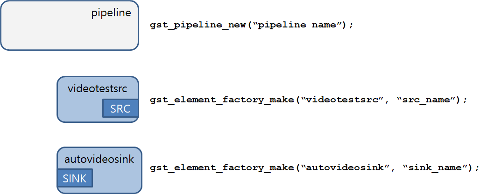

:: title ::
# Hello World

:: content ::
<div class="code-dense">

```c {*|1-2|4-9|14-20}
#include <gst/gst.h>
#include <glib.h>

typedef struct _CustomData {
    GstElement *pipeline;
    GstElement *source;
    GstElement *sink;
    GMainLoop *loop;
} CustomData;

```

<div class="flex flex-wrap ns-c-tight">
<div class="w-1/2 mt-10">

#### 핵심 포인트
- `gst/gst.h`, `glib.h` 인클루드
- `CustomData` 구조체로 파이프라인 컴포넌트 관리
</div>

<div class="w-1/2 mt-10">

#### 데이터 구조
- `pipeline`: 전체 파이프라인 컨테이너
- `source`: videotestsrc 엘리먼트
- `sink`: autovideosink 엘리먼트
- `loop`: 이벤트 루프
</div>
</div>
</div>

---
layout: top-title
hideInToc: true
---
:: title ::
# Hello World

:: content ::
<div class="text-xs code-dense">

#### `bus_call()` 메시지 핸들러

````md magic-move
```c
/* Handler for the bus message */
static gboolean
bus_call(GstBus *bus, GstMessage *msg, gpointer data)
{
    CustomData *custom_data = (CustomData *)data;

    switch (GST_MESSAGE_TYPE(msg)) {
        case GST_MESSAGE_EOS:
            break;

        case GST_MESSAGE_ERROR:
            break;

        case GST_MESSAGE_STATE_CHANGED: {
            break;

        default:
            break;
    }

    return TRUE;
}
```
```c
/* Handler for the bus message */
static gboolean
bus_call(GstBus *bus, GstMessage *msg, gpointer data)
{
    CustomData *custom_data = (CustomData *)data;

    switch (GST_MESSAGE_TYPE(msg)) {
        case GST_MESSAGE_EOS:
            g_print("End of stream\n");
            g_main_loop_quit(custom_data->loop);
            break;

        case GST_MESSAGE_ERROR:
            break;

        case GST_MESSAGE_STATE_CHANGED:
            break;

        default:
            break;
    }

    return TRUE;
}
```
```c
/* Handler for the bus message */
static gboolean
bus_call(GstBus *bus, GstMessage *msg, gpointer data)
{
    CustomData *custom_data = (CustomData *)data;

    switch (GST_MESSAGE_TYPE(msg)) {
        case GST_MESSAGE_EOS:
            break;

        case GST_MESSAGE_ERROR: {
            gchar *debug;
            GError *error;

            gst_message_parse_error(msg, &error, &debug);
            g_free(debug);

            g_printerr("Error: %s\n", error->message);
            g_error_free(error);

            g_main_loop_quit(custom_data->loop);
            break;
        }

        case GST_MESSAGE_STATE_CHANGED:
            break;

        default:
            break;
    }

    return TRUE;
}
```
```c
/* Handler for the bus message */
static gboolean
bus_call(GstBus *bus, GstMessage *msg, gpointer data)
{
    CustomData *custom_data = (CustomData *)data;

    switch (GST_MESSAGE_TYPE(msg)) {
        case GST_MESSAGE_EOS:
            break;

        case GST_MESSAGE_ERROR:
            break;

        case GST_MESSAGE_STATE_CHANGED: {
            GstState old_state, new_state, pending_state;
            gst_message_parse_state_changed(msg, &old_state, &new_state, &pending_state);
            
            if (GST_MESSAGE_SRC(msg) == GST_OBJECT(custom_data->pipeline)) {
                g_print("Pipeline state changed from %s to %s\n",
                    gst_element_state_get_name(old_state),
                    gst_element_state_get_name(new_state));
            }
            break;
        }

        default:
            break;
    }

    return TRUE;
}
```
````
</div>


---
layout: top-title
columns: is-5
hideInToc: true
---
:: title ::
# Hello World

:: content ::
<div class="text-xs code-dense">

#### `main()` 함수

````md magic-move
```c
int main(int argc, char *argv[])
{
    CustomData data;
    GstBus *bus;
    guint bus_watch_id;
    GstStateChangeReturn ret;

    /* Initialize GStreamer */

    /* Create the main loop */

    /* Create gstreamer elements */

    /* Set up the pipeline */
    /* 1. Configure videotestsrc properties */

    /* 2. we add a message handler */

    /* 3. we add all elements into the pipeline */

    /* 4. we link the elements together */

    /* Set the pipeline to "playing" state */

    /* Start playing */

    /* Out of the main loop, clean up nicely */
    return 0;
}
```
```c
int main(int argc, char *argv[])
{
    /* Initialize GStreamer */
    gst_init(&argc, &argv);

    /* Create the main loop */

    /* Create gstreamer elements */

    /* Set up the pipeline */
    /* 1. Configure videotestsrc properties */

    /* 2. we add a message handler */

    /* 3. we add all elements into the pipeline */

    /* 4. we link the elements together */

    /* Set the pipeline to "playing" state */

    /* Start playing */

    /* Out of the main loop, clean up nicely */

    return 0;
}
```
```c
int main(int argc, char *argv[])
{
    /* Initialize GStreamer */

    /* Create the main loop */
    data.loop = g_main_loop_new(NULL, FALSE);

    /* Create gstreamer elements */

    /* Set up the pipeline */
    /* 1. Configure videotestsrc properties */

    /* 2. we add a message handler */

    /* 3. we add all elements into the pipeline */

    /* 4. we link the elements together */

    /* Set the pipeline to "playing" state */

    /* Start playing */

    /* Out of the main loop, clean up nicely */

    return 0;
}
```
```c
int main(int argc, char *argv[])
{
    /* Initialize GStreamer */

    /* Create the main loop */

    /* Create gstreamer elements */
    data.pipeline = gst_pipeline_new("video-player");
    data.source = gst_element_factory_make("videotestsrc", "video-source");
    data.sink = gst_element_factory_make("autovideosink", "video-output");

    if (!data.pipeline || !data.source || !data.sink) {
        g_printerr("Not all elements could be created.\n");
        return -1;
    }

    /* Set up the pipeline */
    /* 1. Configure videotestsrc properties */

    /* 2. we add a message handler */

    /* 3. we add all elements into the pipeline */

    /* 4. we link the elements together */

    /* Set the pipeline to "playing" state */

    /* Start playing */

    /* Out of the main loop, clean up nicely */

    return 0;
}
```
```c
int main(int argc, char *argv[])
{
    /* Initialize GStreamer */

    /* Create the main loop */

    /* Create gstreamer elements */

    /* Set up the pipeline */
    /* 1. Configure videotestsrc properties */
    g_object_set(G_OBJECT(data.source), "pattern", 0, NULL);  // SMPTE pattern

    /* 2. we add a message handler */

    /* 3. we add all elements into the pipeline */

    /* 4. we link the elements together */

    /* Set the pipeline to "playing" state */

    /* Start playing */

    /* Out of the main loop, clean up nicely */
    return 0;
}
```
```c
int main(int argc, char *argv[])
{
    /* Initialize GStreamer */

    /* Create the main loop */

    /* Create gstreamer elements */

    /* Set up the pipeline */
    /* 1. Configure videotestsrc properties */

    /* 2. we add a message handler */
    bus = gst_pipeline_get_bus(GST_PIPELINE(data.pipeline));
    bus_watch_id = gst_bus_add_watch(bus, bus_call, &data);
    gst_object_unref(bus);

    /* 3. we add all elements into the pipeline */

    /* 4. we link the elements together */

    /* Set the pipeline to "playing" state */

    /* Start playing */

    /* Out of the main loop, clean up nicely */

    return 0;
}
```
```c
int main(int argc, char *argv[])
{
    /* Initialize GStreamer */

    /* Create the main loop */

    /* Create gstreamer elements */

    /* Set up the pipeline */
    /* 1. Configure videotestsrc properties */

    /* 2. we add a message handler */

    /* 3. we add all elements into the pipeline */
    gst_bin_add_many(GST_BIN(data.pipeline), data.source, data.sink, NULL);

    /* 4. we link the elements together */

    /* Set the pipeline to "playing" state */

    /* Start playing */

    /* Out of the main loop, clean up nicely */

    return 0;
}
```
```c
int main(int argc, char *argv[])
{
    /* Initialize GStreamer */

    /* Create the main loop */

    /* Create gstreamer elements */

    /* Set up the pipeline */
    /* 1. Configure videotestsrc properties */

    /* 2. we add a message handler */

    /* 3. we add all elements into the pipeline */

    /* 4 we link the elements together */
    gst_element_link(data.source, data.sink);

    /* Set the pipeline to "playing" state */

    /* Start playing */

    /* Out of the main loop, clean up nicely */

    return 0;
}
```
```c
int main(int argc, char *argv[])
{
    /* Initialize GStreamer */

    /* Create the main loop */

    /* Create gstreamer elements */

    /* Set up the pipeline */
    /* 1. Configure videotestsrc properties */

    /* 2. we add a message handler */

    /* 3. we add all elements into the pipeline */

    /* 4. we link the elements together */

    /* Set the pipeline to "playing" state */
    g_print("Now playing: videotestsrc ! autovideosink\n");
    ret = gst_element_set_state(data.pipeline, GST_STATE_PLAYING);
    if (ret == GST_STATE_CHANGE_FAILURE) {
        g_printerr("Unable to set the pipeline to the playing state.\n");
        gst_object_unref(data.pipeline);
        return -1;
    }

    /* Start playing */

    /* Out of the main loop, clean up nicely */

    return 0;
}
```
```c
int main(int argc, char *argv[])
{
    /* Initialize GStreamer */

    /* Create the main loop */

    /* Create gstreamer elements */

    /* Set up the pipeline */
    /* 1. Configure videotestsrc properties */

    /* 2. we add a message handler */

    /* 3. we add all elements into the pipeline */

    /* 4. we link the elements together */

    /* Set the pipeline to "playing" state */

    /* Start playing */
    g_main_loop_run(data.loop);

    /* Out of the main loop, clean up nicely */

    return 0;
}
```

```c
int main(int argc, char *argv[])
{
    /* Initialize GStreamer */

    /* Create the main loop */

    /* Create gstreamer elements */

    /* Set up the pipeline */
    /* 1. Configure videotestsrc properties */

    /* 2. we add a message handler */

    /* 3. we add all elements into the pipeline */

    /* 4. we link the elements together */

    /* Set the pipeline to "playing" state */

    /* Start playing */

    /* Out of the main loop, clean up nicely */
    g_print("Returned, stopping playback\n");
    gst_element_set_state(data.pipeline, GST_STATE_NULL);

    g_print("Deleting pipeline\n");
    gst_object_unref(GST_OBJECT(data.pipeline));
    g_source_remove(bus_watch_id);
    g_main_loop_unref(data.loop);

    return 0;
}
```
````
</div>

---
layout: top-title
columns: is-5
hideInToc: true
---
:: title ::
# Hello World

:: content ::
<div class="text-xs code-dense">

#### 빌드 &  실행
```bash
gcc -o hello_world hello_world.c `pkg-config --cflags --libs gstreamer-1.0 glib-2.0`

❯ ./hello_world
Now playing: videotestsrc ! autovideosink
Pipeline state changed from NULL to READY
Pipeline state changed from READY to PAUSED
Pipeline state changed from PAUSED to PLAYING
Error: Output window was closed
Returned, stopping playback
Deleting pipeline
```

<figure class="text-center mt-5">
  <div class="w-full mx-auto">
    
  </div>
</figure>

</div>

---
layout: top-title
hideInToc: true
---
:: title ::
# Hello World

:: content ::
<figure class="text-center">
  <div class="w-full mx-auto">
    
  </div>
</figure>

<div class="ns-c-tight mt-10">

#### 엘리먼트 생성
- `gst_pipeline_new`, `gst_element_factory_make`
</div>

---
layout: top-title
hideInToc: true
---
:: title ::
# Hello World

:: content ::
<figure class="text-center">
  <div class="w-full mx-auto">
    
  </div>
</figure>

<div class="ns-c-tight mt-10">

#### 파이프라인에 엘리먼트 등록
- `gst_bin_add`
</div>

---
layout: top-title
hideInToc: true
---
:: title ::
# Hello World

:: content ::
<figure class="text-center">
  <div class="w-full mx-auto">
    
  </div>
</figure>

<div class="ns-c-tight mt-10">

#### 엘리먼트 연결
- `gst_element_link`
</div>

---
layout: top-title
hideInToc: true
---
:: title ::
# Hello World

:: content ::
<figure class="text-center">
  <div class="w-full mx-auto">
    
  </div>
</figure>

<div class="ns-c-tight mt-10">

#### 엘리먼트 상태 전환 
- `gst_element_set_state`
</div>

---
layout: top-title
hideInToc: true
---
:: title ::
# Hello World

:: content ::
<figure class="text-center">
  <div class="w-full mx-auto">
    
  </div>
</figure>

<div class="ns-c-tight mt-10">

#### 버스 객체 생성
- `gst_element_get_bus`
</div>

---
layout: top-title
hideInToc: true
---
:: title ::
# Hello World

:: content ::
<figure class="text-center">
  <div class="w-full mx-auto">
    
  </div>
</figure>

<div class="ns-c-tight mt-10">

#### 메시지 핸들러 등록
- `gst_bus_add_watch`
</div>
